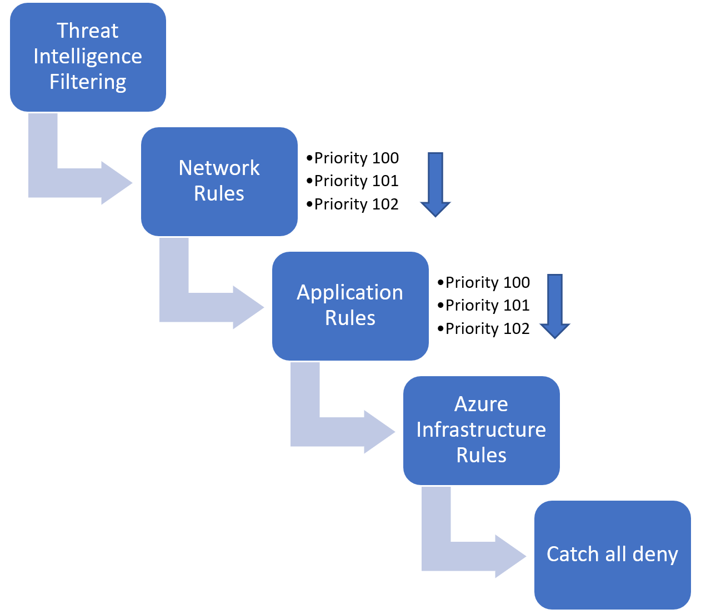
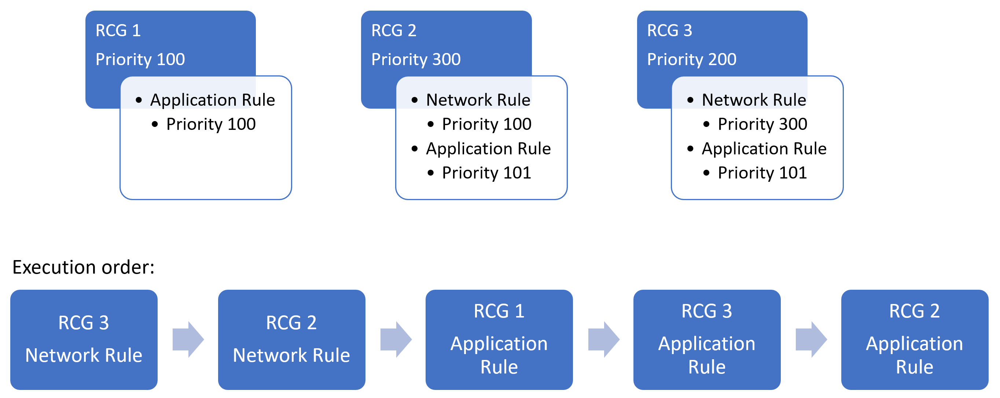

# Azure Firewall rule processing logic

Azure Firewall has NAT rules, network rules, and applications rules. The rules are processed according to the rule type.

## Network rules and applications rules

Network rules are applied first, then application rules. The rules are terminating. So if a match is found in network rules, then application rules aren't processed.  If no network rule matches, and if the packet protocol is HTTP/HTTPS, application rules then evaluate the packet. If still no match is found, then the packet is evaluated against the infrastructure rule collection. If there's still no match, then the packet is denied by default.

### Example of processing logic
Example scenario: three rule collection groups exist in an Azure Firewall Policy.  Each rule collection group has a series of application and network rules.

In the illustrated diagram, the network rules are executed first, followed by the application rules due to Azure Firewall's rule processing logic stating that network rules always having execution priority before application rules.

## NAT rules

Inbound Internet connectivity can be enabled by configuring Destination Network Address Translation (DNAT) as described in [Filter inbound traffic with Azure Firewall DNAT using the Azure portal](../firewall/tutorial-firewall-dnat.md). NAT rules are applied in priority before network rules. If a match is found, the traffic is translated according to the DNAT rule and allowed by the firewall. So the traffic isn't subject to any further processing by other network rules. For security reasons, the recommended approach is to add a specific Internet source to allow DNAT access to the network and avoid using wildcards.

Application rules aren't applied for inbound connections. So, if you want to filter inbound HTTP/S traffic, you should use Web Application Firewall (WAF). For more information, see [What is Azure Web Application Firewall](../web-application-firewall/overview.md)?

## Inherited rules

Network rule collections inherited from a parent policy are always prioritized before network rule collections that are defined as part of your new policy. The same logic also applies to application rule collections. However, network rule collections are always processed before application rule collections regardless of inheritance.

By default, your policy inherits its parent policy threat intelligence mode. You can override this behavior by setting your threat Intelligence mode to a different value in the policy settings page. It's only possible to override with a stricter value. For example, if your parent policy is set to *Alert only*, you can configure this local policy to *Alert and deny*, but you can't turn it off.

## Next steps

- [Learn more about Azure Firewall Manager](overview.md)
