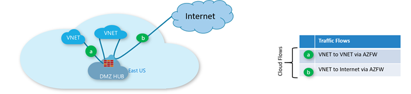

# Tutorial: Secure your virtual WAN using Azure Firewall Manager preview 

[!INCLUDE [Preview](../../includes/firewall-manager-preview-notice.md)]

Using Azure Firewall Manager Preview, you can create secured virtual hubs to secure your cloud network traffic destined to private IP addresses, Azure PaaS, and the Internet. Traffic routing to the firewall is automated, so there's no need to create user defined routes (UDRs).

Firewall Manager also supports a hub virtual network architecture. For a comparison of the secured virtual hub and hub virtual network architecture types, see [What are the Azure Firewall Manager architecture options?](vhubs-and-vnets.md)

In this tutorial, you learn how to:

> [!div class="checklist"]
> * Create the spoke virtual network
> * Create a secured virtual hub
> * Connect the hub and spoke VNets
> * Create a firewall policy and secure your hub
> * Route traffic to your hub
> * Test the firewall

## Create a hub and spoke architecture

First, create a spoke virtual network where you can place your servers.

### Create a spoke virtual network and subnets

1. From the Azure portal home page, select **Create a resource**.
2. Under **Networking**, select **Virtual network**.
2. For **Subscription**, select your subscription.
1. For **Resource group**, select **Create new**, and type **FW-Manager** for the name and select **OK**.
2. For **Name**, type **Spoke-01**.
3. For **Region**, select **(US) East US**.
4. Select **Next: IP Addresses**.
1. For **Address space**, accept the default **10.0.0.0/16**.
3. Under **Subnet name**, select **default**.
4. Change the subnet name to **Workload-SN**.
5. For **Subnet address range**, type **10.0.1.0/24**.
6. Select **Save**..

Next, create a subnet for a jump server.

1. Select **Add subnet**.
4. For **Subnet name**, type **Jump-SN**.
5. For **Subnet address range**, type **10.0.2.0/24**.
6. Select **Add**.

Now create the virtual network.

1. Select **Review + create**.
2. Select **Create**.

### Create the secured virtual hub

Create your secured virtual hub using Firewall Manager.

1. From the Azure portal home page, select **All services**.
2. In the search box, type **Firewall Manager** and select **Firewall Manager**.
3. On the **Firewall Manager** page, select **View secured virtual hubs**.
4. On the **Firewall Manager | Secured virtual hubs** page, select **Create new secured virtual hub**.
5. For **Resource group**, select **FW-Manager**.
7. For **Region**, select **East US**.
1. For the **Secured virtual hub name**, type **Hub-01**.
2. For **Hub address space**, type **10.1.0.0/16**.
3. For the new vWAN name, type **Vwan-01**.
4. Leave the **Include VPN gateway to enable Trusted Security Partners** check box cleared.
5. Select **Next:Azure Firewall**.
6. Accept the default **Azure Firewall** **Enabled** setting and then select **Next: Trusted Security Partner**.
7. Accept the default **Trusted Security Partner** **Disabled** setting, and select **Next: Review + create**.
8. Select **Create**. It will take about 30 minutes to deploy.

### Connect the hub and spoke VNets

Now you can peer the hub and spoke VNets.

1. Select the **FW-Manager** resource group, then select the **Vwan-01** virtual WAN.
2. Under **Connectivity**, select **Virtual network connections**.
3. Select **Add connection**.
4. For **Connection name**, type **hub-spoke**.
5. For **Hubs**, select **Hub-01**.
6. For **Resource group**, select **FW-Manager**.
7. For **Virtual network**, select **Spoke-01**.
8. Select **OK**.

## Create a firewall policy and secure your hub

A firewall policy defines collections of rules to direct traffic on one or more Secured virtual hubs. You'll create your firewall policy and then secure your hub.

1. From Firewall Manager, select **View Azure Firewall policies**.
2. Select **Create Azure Firewall Policy**.
3. Under **Policy details**, for the **Name** type **Policy-01** and for **Region** select **East US**.
4. Select **Next:Rules**.
5. On the **Rules** tab, select **Add a rule collection**.
6. On the **Add a rule collection** page, type **RC-01** for the **Name**.
7. For **Rule collection type**, select **Application**.
8. For **Priority**, type **100**.
9. Ensure **Rule collection action** is **Allow**.
10. For the rule **Name** type **Allow-msft**.
11. For **Source address**, type **\***.
12. For **Protocol**, type **http,https**.
13. Ensure **Destination type is **FQDN**.
14. For **Destination**, type **\*.microsoft.com**.
15. Select **Add**.
16. Select **Next: Hubs**.
17. On the **Hubs** tab, select **Associate virtual hubs**.
18. Select **Hub-01** and then select **Add**.
1. Select **Review + create**.
2. Select **Create**.

This can take about five minutes or more to complete.

## Route traffic to your hub

Now you must ensure that network traffic gets routed to through your firewall.

1. From Firewall Manager, select **Secured virtual hubs**.
2. Select **Hub-01**.
3. Under **Settings**, select **Route settings**.
4. Under **Internet traffic**, **Traffic from Virtual Networks**, select **Send via Azure Firewall**.
5. Under **Azure private traffic**, **Traffic to Virtual Networks**, select **Send via Azure Firewall**.
6. Select **Edit IP address prefix(es)**.
8. Type **10.0.1.0/24** as the address of the Workload subnet and select **Save**.
9. Under **Settings**, select **Connections**.
10. Verify that the **hub-spoke** connection shows **Internet Traffic** as **Secured**.

## Test your firewall

To test your firewall rules, you'll need to deploy a couple servers. You'll deploy Workload-Srv in the Workload-SN subnet to test the firewall rules, and Jump-Srv so you can use Remote Desktop to connect from the Internet and then connect to Workload-Srv.

### Deploy the servers

1. On the Azure portal, select **Create a resource**.
2. Select **Windows Server 2016 Datacenter** in the **Popular** list.
3. Enter these values for the virtual machine:

   |Setting  |Value  |
   |---------|---------|
   |Resource group     |**FW-Manager**|
   |Virtual machine name     |**Jump-Srv**|
   |Region     |**(US) East US)**|
   |Administrator user name     |type a user name|
   |Password     |type a password|

4. Under **Inbound port rules**, for **Public inbound ports**, select **Allow selected ports**.
5. For **Select inbound ports**, select **RDP (3389)**.
6. Accept the other defaults and select **Next: Disks**.
7. Accept the disk defaults and select **Next: Networking**.
8. Make sure that **Spoke-01** is selected for the virtual network and the subnet is **Jump-SN**.
9. For **Public IP**, accept the default new public ip address name (Jump-Srv-ip).
11. Accept the other defaults and select **Next: Management**.
12. Select **Off** to disable boot diagnostics. Accept the other defaults and select **Review + create**.
13. Review the settings on the summary page, and then select **Create**.

Use the information in the following table to configure another virtual machine named **Workload-Srv**. The rest of the configuration is the same as the Srv-Jump virtual machine.

|Setting  |Value  |
|---------|---------|
|Subnet|**Workload-SN**|
|Public IP|**None**|
|Public inbound ports|**None**|

### Add a route table and default route

To allow an Internet connection to Jump-Srv, you must create a route table and a default gateway route to the Internet from the **Jump-SN** subnet.

1. On the Azure portal, select **Create a resource**.
2. Type **route table** in the search box, and then select **Route table**.
3. Select **Create**.
4. Type **RT-01** for **Name**.
5. Select your subscription, **FW-Manager** for the resource group and **(US) East US** for the region.
6. Select **Create**.
7. When the deployment completes, select the **RT-01** route table.
8. Select **Routes** and then select **Add**.
9. Type **jump-to-inet** for the **Route name**.
10. Type **0.0.0.0/0** for the **Address prefix**.
11. Select **Internet** for the **Next hop type**.
12. Select **OK**.
13. When the deployment completes, select **Subnets**, then select **Associate**.
14. Select **Spoke-01** for **Virtual network**.
15. Select **Jump-SN** for **Subnet**.
16. Select **OK**.

### Test the rules

Now, test the firewall rules to confirm that it works as expected.

1. From the Azure portal, review the network settings for the **Workload-Srv** virtual machine and note the private IP address.
2. Connect a remote desktop to **Jump-Srv** virtual machine, and sign in. From there, open a remote desktop connection to the **Workload-Srv** private IP address.

3. Open Internet Explorer and browse to https://www.microsoft.com.
4. Select **OK** > **Close** on the Internet Explorer security alerts.

   You should see the Microsoft home page.

5. Browse to https://www.google.com.

   You should be blocked by the firewall.

So now you've verified that the firewall rules are working:

* You can browse to the one allowed FQDN, but not to any others.

## Next steps

> [!div class="nextstepaction"]
> [Learn about trusted security partners](trusted-security-partners.md)
