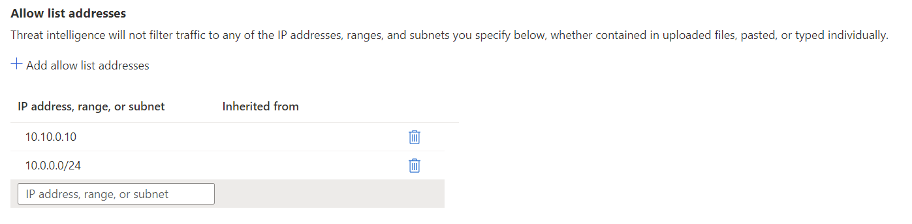

# Azure Firewall threat intelligence configuration

Threat intelligence-based filtering can be configured for your Azure Firewall policy to alert and deny traffic from and to known malicious IP addresses and domains. The IP addresses and domains are sourced from the Microsoft Threat Intelligence feed. [Intelligent Security Graph](https://www.microsoft.com/security/operations/intelligence) powers Microsoft threat intelligence and is used by multiple services including Microsoft Defender for Cloud.<br>

If you've configured threat intelligence-based filtering, the associated rules are processed before any of the NAT rules, network rules, or application rules.

:::image type="content" source="media/threat-intelligence-settings/threat-intelligence-policy.png" alt-text="Threat intelligence policy":::

## Threat intelligence mode

You can configure threat intelligence in one of the three modes that are described in the following table. By default, threat intelligence-based filtering is enabled in alert mode.

|Mode |Description  |
|---------|---------|
|`Off`     | The threat intelligence feature isn't enabled for your firewall. |
|`Alert only`     | You'll receive high-confidence alerts for traffic going through your firewall to or from known malicious IP addresses and domains. |
|`Alert and deny`     | Traffic is blocked and you'll receive high-confidence alerts when traffic is detected attempting to go through your firewall to or from known malicious IP addresses and domains. |

> [!NOTE]
> Threat intelligence mode is inherited from parent policies to child policies. A child policy must be configured with the same or a stricter mode than the parent policy.

## Allowlist addresses

Threat intelligence might trigger false positives and block traffic that actually is valid. You can configure a list of allowed IP addresses so that threat intelligence won't filter any of the addresses, ranges, or subnets that you specify.  



You can update the allowlist with multiple entries at once by uploading a CSV file. The CSV file can only contain IP addresses and ranges. The file can't contain headings.

> [!NOTE]
> Threat intelligence allowlist addresses are inherited from parent policies to child policies. Any IP address or range added to a parent policy will apply for all child policies as well.

## Logs

The following log excerpt shows a triggered rule for outbound traffic to a malicious site:

```json
{
    "category": "AzureFirewallNetworkRule",
    "time": "2018-04-16T23:45:04.8295030Z",
    "resourceId": "/SUBSCRIPTIONS/{subscriptionId}/RESOURCEGROUPS/{resourceGroupName}/PROVIDERS/MICROSOFT.NETWORK/AZUREFIREWALLS/{resourceName}",
    "operationName": "AzureFirewallThreatIntelLog",
    "properties": {
         "msg": "HTTP request from 10.0.0.5:54074 to somemaliciousdomain.com:80. Action: Alert. ThreatIntel: Bot Networks"
    }
}
```

## Testing

- **Outbound testing** - Outbound traffic alerts should be a rare occurrence, as it means that your environment has been compromised. To help test outbound alerts are working, a test FQDN has been created that triggers an alert. Use `testmaliciousdomain.eastus.cloudapp.azure.com` for your outbound tests.

- **Inbound testing** - You can expect to see alerts on incoming traffic if DNAT rules are configured on the firewall. This is true even if only specific sources are allowed on the DNAT rule and traffic is otherwise denied. Azure Firewall doesn't alert on all known port scanners; only on scanners that are known to also engage in malicious activity.

## Next steps

- Review the [Microsoft Security intelligence report](https://www.microsoft.com/en-us/security/operations/security-intelligence-report)
