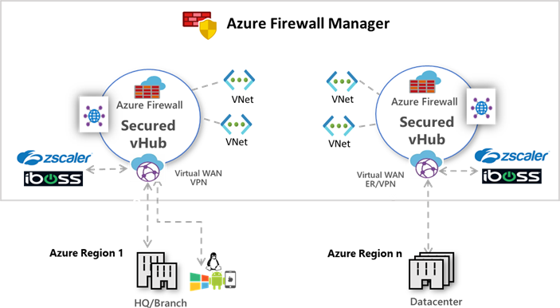
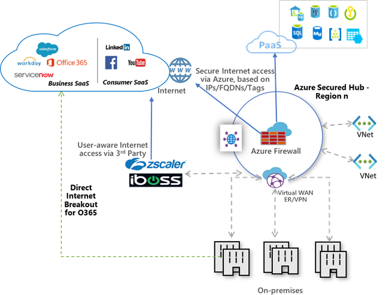

# What are security partner providers?

*Security partner providers* in Azure Firewall Manager allow you to use your familiar, best-in-breed, third-party security as a service (SECaaS) offerings to protect Internet access for your users.

With a quick configuration, you can secure a hub with a supported security partner, and route and filter Internet traffic from your Virtual Networks (VNets) or branch locations within a region. You can do this with automated route management, without setting up and managing User Defined Routes (UDRs).

You can deploy secured hubs configured with the security partner of your choice in multiple Azure regions to get connectivity and security for your users anywhere across the globe in those regions. With the ability to use the security partner’s offering for Internet/SaaS application traffic, and Azure Firewall for private traffic in the secured hubs, you can now start building your security edge on Azure that is close to your globally distributed users and applications.

The supported security partners are **Zscaler**, **[Check Point](check-point-overview.md)**, and **iboss**.

See the following video by Jack Tracey for a Zscaler overview:

 > [!VIDEO https://www.microsoft.com/videoplayer/embed/RWI4n8]

## Key scenarios

You can use the security partners to filter Internet traffic in following scenarios:

- Virtual Network (VNet)-to-Internet

   Use advanced user-aware Internet protection for your cloud workloads running on Azure.

- Branch-to-Internet

   Use your Azure connectivity and global distribution to easily add third-party NSaaS filtering for branch to Internet scenarios. You can build your global transit network and security edge using Azure Virtual WAN.

The following scenarios are supported:
- Two security providers in the hub

   VNet/Branch-to-Internet via a security partner provider and the other traffic (spoke-to-spoke, spoke-to-branch, branch-to-spoke) via Azure Firewall.
- Single provider in the hub

   - All traffic (spoke-to-spoke, spoke-to-branch, branch-to-spoke, VNet/Branch-to-Internet) secured by Azure Firewall 
      or
   - VNet/Branch-to-Internet via security partner provider

## Best practices for Internet traffic filtering in secured virtual hubs

Internet traffic typically includes web traffic. But it also includes traffic destined to SaaS applications like Microsoft 365 and Azure public PaaS services like Azure Storage, Azure Sql, and so on. The following are best practice recommendations for handling traffic to these services:

### Handling Azure PaaS traffic
 
- Use Azure Firewall for protection if your traffic consists mostly of Azure PaaS, and the resource access for your applications can be filtered using IP addresses, FQDNs, Service tags, or FQDN tags.

- Use a third-party partner solution in your hubs if your traffic consists of SaaS application access, or you need user-aware filtering (for example, for your virtual desktop infrastructure (VDI) workloads) or you need advanced Internet filtering capabilities.

## Handling Microsoft 365 traffic

In globally distributed branch location scenarios, you should redirect Microsoft 365 traffic directly at the branch before sending the remaining Internet traffic your Azure secured hub.

For Microsoft 365, network latency and performance are critical for successful user experience. To achieve these goals around optimal performance and user experience, customers must implement Microsoft 365 direct and local escape before considering routing the rest of Internet traffic through Azure.

[Microsoft 365 network connectivity principles](/microsoft-365/enterprise/microsoft-365-network-connectivity-principles) call for key Microsoft 365 network connections to be routed locally from the user branch or mobile device and directly over the Internet into nearest Microsoft network point of presence.

Furthermore, Microsoft 365 connections are encrypted for privacy and use efficient, proprietary protocols for performance reasons. This makes it impractical and impactful to subject those connections to traditional network level security solutions. For these reasons we strongly recommend that customers send Microsoft 365 traffic directly from branches, before sending rest of the traffic through Azure. Microsoft has partnered with several SD-WAN solution providers, who integrate with Azure and Microsoft 365 and make it easy for customers to enable Microsoft 365 direct and local Internet breakout. For details, see [What is Azure Virtual WAN?](../virtual-wan/virtual-wan-about.md)

## Next steps

[Deploy a security partner offering in a secured hub, using Azure Firewall Manager](deploy-trusted-security-partner.md).
