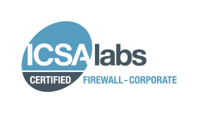

# Azure Firewall certifications

Azure Firewall is Payment Card Industry (PCI), Service Organization Controls (SOC), International Organization for Standardization (ISO), ICSA Labs, and HITRUST compliant.

The following certifications are for global Azure and Azure Government.

## Global Azure certifications

The following Azure Firewall certifications are for global Azure:

- 23 NYCRR 500
- AFM and DNB (Netherlands)
- AMF and ACPR (France)
- APRA(Australia)
- Argentina PDPA
- Australia IRAP
- CDSA
- CFTC 1.31
- CSA STAR Attestation
- CSA STAR Certification
- CSA STAR Self-Assessment
- Canadian Privacy Laws
- DPP(UK)
- EU ENISA IAF
- EU Model Clauses
- European Banking Authority
- FCA and PRA (UK)
- FERPA (US)
- FFIEC(US)
- FINMA (Switzerland)
- FSA (Denmark)
- GLBA (US)
- Germany C5
- GxP (FDA 21 CFR Part 11)
- HITRUST
- ISO 20000-1:2011
- ISO 22301:2012
- ISO 27001:2013
- ISO 27017:2015
- ISO 27018:2014
- ISO 9001:2015
- Japan My Number Act
- K-ISMS
- KNF(Poland)
- MAS and ABS (Singapore)
- MPAA(US)
- NBB and FSMA (Belgium)
- NEN 7510:2011 (Netherlands)
- NHS IG Toolkit (UK)
- Netherlands BIR 2012
- OSFI(Canada)
- PCI DSS Level 1
- RBI and IRDAI (India)
- SOC 1 Type 2
- SOC 2 Type 2
- SOC 3
- SOX (US)
- Spain DPA
- TISAX
- TruSight
- UK G-Cloud
- WCAG 2.0

## Azure Government certifications

The following Azure Firewall certifications are for Azure Government:

- CJIS
- CNSSI 1253
- CSA STAR Attestation
- DFARS
- DoD DISA SRG Level 2
- DoE 10 CFR Part 810
- EAR
- FIPS 140-2
- FedRAMP High
- HITRUST
- IRS 1075
- ITAR
- MARS-E (US)
- NERC
- NIST Cybersecurity Framework
- NIST SP 800-171
- SOC 1 Type 2
- SOC 2 Type 2
- SOC 3
- SOX (US)
- Section 508 VPATs

## ICSA Labs Corporate Firewall Certification

ICSA Labs is a leading vendor in third-party testing and certification of security and health IT products, as well as network-connected devices. They measure product compliance, reliability, and performance for most of the world’s top technology vendors.

Azure Firewall is the first cloud firewall service to attain the ICSA Labs Corporate Firewall Certification. For the Azure Firewall certification report, see the [ICSA Labs Certification Testing and Audit Report](https://aka.ms/ICSALabsCertification). For more information, see the [ICSA Labs Firewall Certification Program](https://www.icsalabs.com/technology-program/firewalls) page.

## Next steps

For more information about Microsoft compliance, see the following information.

- [Microsoft Compliance Guide](https://servicetrust.microsoft.com/ViewPage/MSComplianceGuide)
- [Overview of Microsoft Azure compliance](https://gallery.technet.microsoft.com/Overview-of-Azure-c1be3942)
