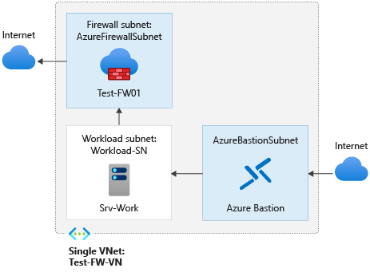

# Deploy and configure Azure Firewall policy using Azure PowerShell

Controlling outbound network access is an important part of an overall network security plan. For example, you may want to limit access to web sites. Or, you may want to limit the outbound IP addresses and ports that can be accessed.

One way you can control outbound network access from an Azure subnet is with Azure Firewall and Firewall Policy. With Azure Firewall, you can configure:

* Application rules that define fully qualified domain names (FQDNs) that can be accessed from a subnet.
* Network rules that define source address, protocol, destination port, and destination address.

Network traffic is subjected to the configured firewall rules when you route your network traffic to the firewall as the subnet default gateway.

For this article, you create a simplified single VNet with three subnets for easy deployment. For production deployments, a [hub and spoke model](/azure/architecture/reference-architectures/hybrid-networking/hub-spoke) is recommended, where the firewall is in its own VNet. The workload servers are in peered VNets in the same region with one or more subnets.

* **AzureFirewallSubnet** - the firewall is in this subnet.
* **Workload-SN** - the workload server is in this subnet. This subnet's network traffic goes through the firewall.
* **AzureBastionSubnet** - the subnet used for Azure Bastion, which is used to connect to the workload server. 

For more information about Azure Bastion, see [What is Azure Bastion?](../bastion/bastion-overview.md)

> [!IMPORTANT]
> [!INCLUDE [Pricing](../../includes/bastion-pricing.md)]



In this article, you learn how to:


* Set up a test network environment
* Deploy a firewall
* Create a default route
* Create a firewall policy
* Configure an application rule to allow access to www.google.com
* Configure a network rule to allow access to external DNS servers
* Test the firewall

If you prefer, you can complete this procedure using the [Azure portal](tutorial-firewall-deploy-portal-policy.md).

If you don't have an Azure subscription, create a [free account](https://azure.microsoft.com/free/?WT.mc_id=A261C142F) before you begin.

## Prerequisites

This procedure requires that you run PowerShell locally. You must have the Azure PowerShell module installed. Run `Get-Module -ListAvailable Az` to find the version. If you need to upgrade, see [Install Azure PowerShell module](/powershell/azure/install-azure-powershell). After you verify the PowerShell version, run `Connect-AzAccount` to create a connection with Azure.

## Set up the network

First, create a resource group to contain the resources needed to deploy the firewall. Then create a VNet, subnets, and test servers.

### Create a resource group

The resource group contains all the resources for the deployment.

```azurepowershell
New-AzResourceGroup -Name Test-FW-RG -Location "East US"
```

### Create a virtual network and Azure Bastion host

This virtual network has three subnets:

> [!NOTE]
> The size of the AzureFirewallSubnet subnet is /26. For more information about the subnet size, see [Azure Firewall FAQ](firewall-faq.yml#why-does-azure-firewall-need-a--26-subnet-size).

```azurepowershell
$Bastionsub = New-AzVirtualNetworkSubnetConfig -Name AzureBastionSubnet -AddressPrefix 10.0.0.0/27
$FWsub = New-AzVirtualNetworkSubnetConfig -Name AzureFirewallSubnet -AddressPrefix 10.0.1.0/26
$Worksub = New-AzVirtualNetworkSubnetConfig -Name Workload-SN -AddressPrefix 10.0.2.0/24
```
Now, create the virtual network:

```azurepowershell
$testVnet = New-AzVirtualNetwork -Name Test-FW-VN -ResourceGroupName Test-FW-RG `
-Location "East US" -AddressPrefix 10.0.0.0/16 -Subnet $Bastionsub, $FWsub, $Worksub
```
### Create public IP address for Azure Bastion host

```azurepowershell
$publicip = New-AzPublicIpAddress -ResourceGroupName Test-FW-RG -Location "East US" `
   -Name Bastion-pip -AllocationMethod static -Sku standard
```

### Create Azure Bastion host

```azurepowershell
New-AzBastion -ResourceGroupName Test-FW-RG -Name Bastion-01 -PublicIpAddress $publicip -VirtualNetwork $testVnet
```
### Create a virtual machine

Now create the workload virtual machine, and place it in the appropriate subnet.
When prompted, type a user name and password for the virtual machine.


Create a workload virtual machine.
When prompted, type a user name and password for the virtual machine.

```azurepowershell
#Create the NIC
$wsn = Get-AzVirtualNetworkSubnetConfig -Name  Workload-SN -VirtualNetwork $testvnet
$NIC01 = New-AzNetworkInterface -Name Srv-Work -ResourceGroupName Test-FW-RG -Location "East us" -Subnet $wsn

#Define the virtual machine
$VirtualMachine = New-AzVMConfig -VMName Srv-Work -VMSize "Standard_DS2"
$VirtualMachine = Set-AzVMOperatingSystem -VM $VirtualMachine -Windows -ComputerName Srv-Work -ProvisionVMAgent -EnableAutoUpdate
$VirtualMachine = Add-AzVMNetworkInterface -VM $VirtualMachine -Id $NIC01.Id
$VirtualMachine = Set-AzVMSourceImage -VM $VirtualMachine -PublisherName 'MicrosoftWindowsServer' -Offer 'WindowsServer' -Skus '2019-Datacenter' -Version latest

#Create the virtual machine
New-AzVM -ResourceGroupName Test-FW-RG -Location "East US" -VM $VirtualMachine -Verbose
```

## Create a Firewall Policy

```azurepowershell
$fwpol = New-AzFirewallPolicy -Name fw-pol -ResourceGroupName Test-FW-RG -Location eastus
```
## Configure a firewall policy application rule

The application rule allows outbound access to `www.google.com`.

```azurepowershell
$RCGroup = New-AzFirewallPolicyRuleCollectionGroup -Name AppRCGroup -Priority 100 -FirewallPolicyObject $fwpol
$apprule1 = New-AzFirewallPolicyApplicationRule -Name Allow-google -SourceAddress "10.0.2.0/24" -Protocol "http:80","https:443" -TargetFqdn www.google.com
$appcoll1 = New-AzFirewallPolicyFilterRuleCollection -Name App-coll01 -Priority 100 -Rule $appRule1 -ActionType "Allow"
Set-AzFirewallPolicyRuleCollectionGroup -Name $RCGroup.Name -Priority 100 -RuleCollection $appcoll1 -FirewallPolicyObject $fwPol
```

Azure Firewall includes a built-in rule collection for infrastructure FQDNs that are allowed by default. These FQDNs are specific for the platform and can't be used for other purposes. For more information, see [Infrastructure FQDNs](infrastructure-fqdns.md).

## Configure a firewall policy network rule

The network rule allows outbound access to two IP addresses at port 53 (DNS).

```azurepowershell
$RCGroup = New-AzFirewallPolicyRuleCollectionGroup -Name NetRCGroup -Priority 200 -FirewallPolicyObject $fwpol
$netrule1 = New-AzFirewallPolicyNetworkRule -name Allow-DNS -protocol UDP -sourceaddress 10.0.2.0/24 -destinationaddress 209.244.0.3,209.244.0.4 -destinationport 53
$netcoll1 = New-AzFirewallPolicyFilterRuleCollection -Name Net-coll01 -Priority 200 -Rule $netrule1 -ActionType "Allow"
Set-AzFirewallPolicyRuleCollectionGroup -Name $RCGroup.Name -Priority 200 -RuleCollection $netcoll1 -FirewallPolicyObject $fwPol
```

## Deploy the firewall

Now deploy the firewall into the virtual network.

```azurepowershell
# Get a Public IP for the firewall
$FWpip = New-AzPublicIpAddress -Name "fw-pip" -ResourceGroupName Test-FW-RG `
  -Location "East US" -AllocationMethod Static -Sku Standard
# Create the firewall
$Azfw = New-AzFirewall -Name Test-FW01 -ResourceGroupName Test-FW-RG -Location "East US" -VirtualNetwork $testVnet -PublicIpAddress $FWpip -FirewallPolicyId $fwpol.Id


#Save the firewall private IP address for future use

$AzfwPrivateIP = $Azfw.IpConfigurations.privateipaddress
$AzfwPrivateIP
```

Note the private IP address. You'll use it later when you create the default route.

## Create a default route

Create a table, with BGP route propagation disabled

```azurepowershell
$routeTableDG = New-AzRouteTable `
  -Name Firewall-rt-table `
  -ResourceGroupName Test-FW-RG `
  -location "East US" `
  -DisableBgpRoutePropagation

#Create a route
 Add-AzRouteConfig `
  -Name "DG-Route" `
  -RouteTable $routeTableDG `
  -AddressPrefix 0.0.0.0/0 `
  -NextHopType "VirtualAppliance" `
  -NextHopIpAddress $AzfwPrivateIP `
 | Set-AzRouteTable

#Associate the route table to the subnet

Set-AzVirtualNetworkSubnetConfig `
  -VirtualNetwork $testVnet `
  -Name Workload-SN `
  -AddressPrefix 10.0.2.0/24 `
  -RouteTable $routeTableDG | Set-AzVirtualNetwork
```


## Change the primary and secondary DNS address for the **Srv-Work** network interface

For testing purposes in this procedure, configure the server's primary and secondary DNS addresses. This isn't a general Azure Firewall requirement.

```azurepowershell
$NIC01.DnsSettings.DnsServers.Add("209.244.0.3")
$NIC01.DnsSettings.DnsServers.Add("209.244.0.4")
$NIC01 | Set-AzNetworkInterface
```

## Test the firewall

Now, test the firewall to confirm that it works as expected.

1. Connect to **Srv-Work** virtual machine using Bastion, and sign in. 

   :::image type="content" source="media/deploy-ps/bastion.png" alt-text="Connect using Bastion.":::

3. On **Srv-Work**, open a PowerShell window and run the following commands:

   ```
   nslookup www.google.com
   nslookup www.microsoft.com
   ```

   Both commands should return answers, showing that your DNS queries are getting through the firewall.

1. Run the following commands:

   ```
   Invoke-WebRequest -Uri https://www.google.com
   Invoke-WebRequest -Uri https://www.google.com

   Invoke-WebRequest -Uri https://www.microsoft.com
   Invoke-WebRequest -Uri https://www.microsoft.com
   ```

   The `www.google.com` requests should succeed, and the `www.microsoft.com` requests should fail. This demonstrates that your firewall rules are operating as expected.

So now you've verified that the firewall policy rules are working:

* You can resolve DNS names using the configured external DNS server.
* You can browse to the one allowed FQDN, but not to any others.

## Clean up resources

You can keep your firewall resources for further testing, or if no longer needed, delete the **Test-FW-RG** resource group to delete all firewall-related resources:

```azurepowershell
Remove-AzResourceGroup -Name Test-FW-RG
```

## Next steps

* [Tutorial: Monitor Azure Firewall logs](./firewall-diagnostics.md)
