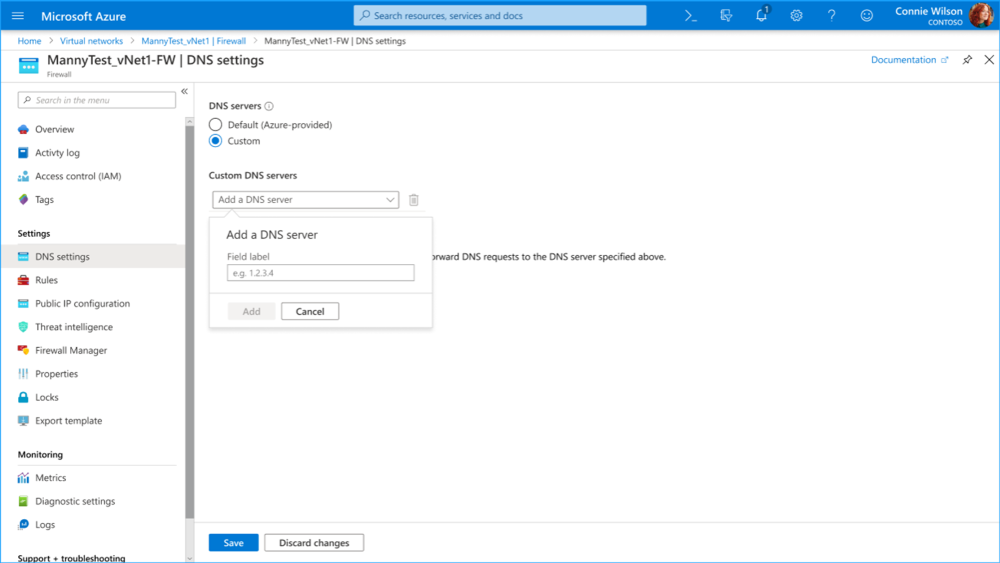

# Azure Firewall DNS settings

You can configure a custom DNS server and enable DNS proxy for Azure Firewall. You can configure these settings when you deploy the firewall or later from the **DNS Servers** tab.

## DNS servers

A DNS server maintains and resolves domain names to IP addresses. By default, Azure Firewall uses Azure DNS for name resolution. The **DNS server** setting lets you configure your own DNS servers for Azure Firewall name resolution. You can configure a single or multiple servers.

### Configure custom DNS servers

1. Under Azure Firewall **Settings**, select **DNS Settings**.
2. Under **DNS servers**, you can type or add existing DNS servers that have been previously specified in your Virtual Network.
3. Select **Save**.
4. The firewall now directs DNS traffic to the specified DNS server(s) for name resolution.

   

## DNS proxy (preview)

You can configure Azure Firewall to act as a DNS proxy. A DNS proxy acts as an intermediary for DNS requests from client virtual machines to a DNS server. If you configure a custom DNS server, you should enable DNS proxy to avoid DNS resolution mismatch, use the Threat Intelligence feature in DNS resolution, and enable FQDN filtering in network rules.

If you don't enable DNS proxy, DNS requests from the client may travel to a DNS server at a different time or return a different response compared to that of the firewall. DNS proxy puts Azure Firewall in the path of the client requests to avoid inconsistency.

### Enable DNS proxy

To enable DNS proxy, you must configure your virtual network DNS servers setting to use the firewall private IP address. Then, enable DNS Proxy in Azure Firewall **DNS settings**.

#### Configure virtual network DNS servers

1. Select the virtual network where the DNS traffic will be routed through the Azure Firewall.
2. Under **Settings**, select **DNS servers**.
3. Select **Custom** under **DNS servers**.
4. Enter the firewall’s private IP address.
5. Select **Save**.

#### Enable DNS proxy

1. Select your Azure Firewall
2. Under **Settings**, select **DNS settings**.
3. By default, **DNS Proxy** is disabled. Select **Enabled** to set Azure Firewall as the DNS proxy to direct DNS traffic from your virtual network to the firewall. When enabled, the firewall listens on port 53 and forwards DNS requests to the configured DNS servers.
4. Review the **DNS servers** configuration to make sure that the settings are appropriate for your environment.
5. Select **Save**.

## Next steps

FQDN filtering in network rules