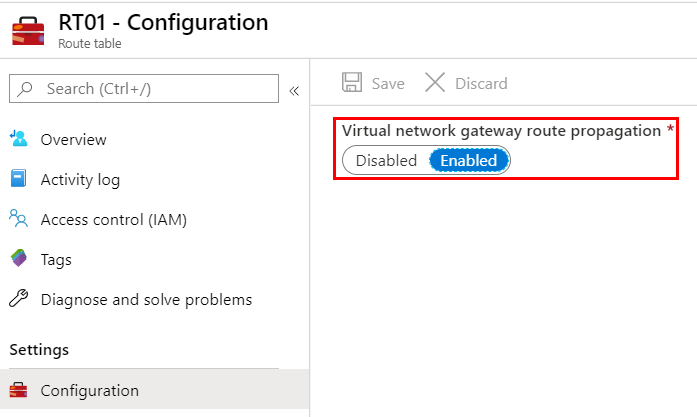

# Azure Firewall forced tunneling (preview)

You can configure Azure Firewall to route all Internet-bound traffic to a designated next hop instead of going directly to the Internet. For example, you may have an on-premises edge firewall or other network virtual appliance (NVA) to process network traffic before it's passed to the Internet.

> [!IMPORTANT]
> Azure Firewall forced tunneling is currently in public preview.
>
> This public preview is provided without a service-level agreement and shouldn't be used for production workloads. Certain features might not be supported, might have constrained capabilities, or might not be available in all Azure locations. For more information, see [Supplemental Terms of Use for Microsoft Azure Previews](https://azure.microsoft.com/support/legal/preview-supplemental-terms/).

By default, forced tunneling isn't allowed on Azure Firewall to ensure all its outbound Azure dependencies are met. User Defined Route (UDR) configurations on the *AzureFirewallSubnet* that 
have a default route not going directly to the Internet are disabled.

## Forced tunneling configuration

To support forced tunneling, service management traffic is separated from customer traffic. An additional dedicated subnet named *AzureFirewallManagementSubnet* (minimum subnet size /26) is required with its own associated public IP address. The only route allowed on this subnet is a default route to the Internet, and BGP route propagation must be disabled.

If you have a default route advertised via BGP to force traffic to on-premises, you must create the *AzureFirewallSubnet* and *AzureFirewallManagementSubnet* before deploying your firewall and have a UDR with a default route to the Internet, and **Virtual network gateway route propagation** disabled.

Within this configuration, the *AzureFirewallSubnet* can now include routes to any on-premise firewall or NVA to process traffic before it's passed to the Internet. You can also publish these routes via BGP to *AzureFirewallSubnet* if **Virtual network gateway route propagation** is enabled on this subnet.

For example, you can create a default route on the *AzureFirewallSubnet* with your VPN gateway as the next hop to get to your on-premise device. Or you can enable **Virtual network gateway route propagation** to get the appropriate routes to the on-premise network.

Once you configure Azure Firewall to support forced tunneling, you can't undo the configuration. If you remove all other IP configurations on your firewall, the management IP configuration is removed as well and the firewall is deallocated. The public IP address assigned to the management IP configuration can't be removed, but you can assign a different public IP address.

## Next steps

- [Tutorial: Deploy and configure Azure Firewall in a hybrid network using the Azure portal](tutorial-hybrid-portal.md)