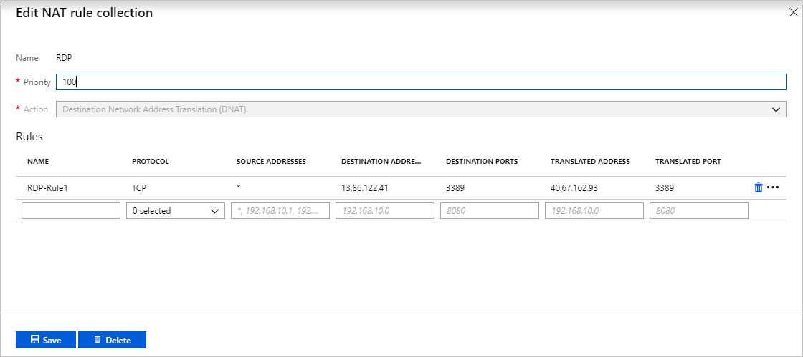

# Integrate Azure Firewall with Azure Standard Load Balancer

You can integrate an Azure Firewall into a network with an Azure Standard Load Balancer, but you need to be aware of some routing issues that can break functionality in this scenario.

## Asymmetric routing

Asymmetric routing is where a packet takes one path to the destination and takes another path when returning to the source. This is a common occurrence on most large networks. But in a NATed environment it can cause problems when a NATed packet doesn't return back through the same NAT device interface.

## Fix the problem

Recall that when you deploy an Azure Firewall into a subnet, one step is to create a default route for the subnet directing packets through the firewall private IP address located on the AzureFirewallSubnet. For more information, see [Tutorial: Deploy and configure Azure Firewall using the Azure portal](tutorial-firewall-deploy-portal.md#create-a-default-route).

When you introduce the firewall into your network, you'll want your Internet traffic to come in through your firewall public IP address. From there, the firewall applies your firewall rules and NATs the packets to your load balancer public IP address. This is where the problem occurs. Packets arrive on the firewall's public IP address, but return to the firewall via the private IP address (using the default route).

To avoid this problem, create an additional host route for the firewall's public IP address, directing packets to the firewall back out to its public IP address.

For example, the following routes are for a firewall at public IP address 13.86.122.41, and private IP address 10.3.1.4.

## NAT rule

To complete the scenario, a load balancer was deployed to direct traffic to a back-end pool of servers offering remote desktops via RDP at TCP port 3389.

A NAT rule was created to direct RDP traffic to the firewall's public IP address (13.86.122.41) to the load balancer public IP address at 40.67.162.93.

## Next steps

- Learn how to [deploy and configure an Azure Firewall](tutorial-firewall-deploy-portal.md).