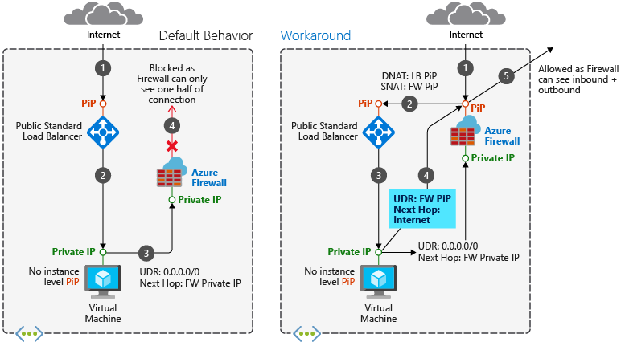
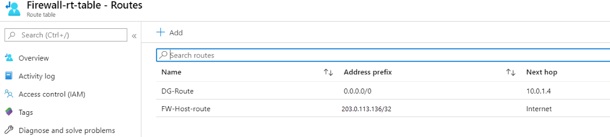
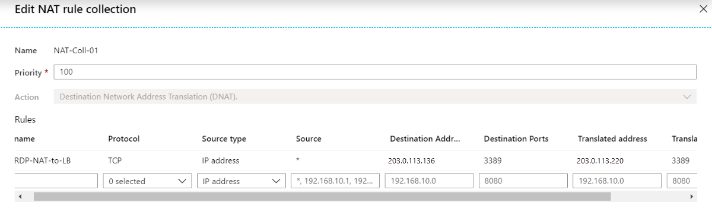
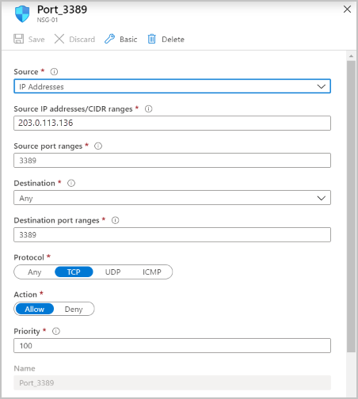

# Integrate Azure Firewall with Azure Standard Load Balancer

You can integrate an Azure Firewall into a virtual network with an Azure Standard Load Balancer (either public or internal). 

The preferred design is to integrate an internal load balancer with your Azure firewall, as this is a much simpler design. You can use a public load balancer if you already have one deployed and you want to keep it in place. However, you need to be aware of an asymmetric routing issue that can break functionality with the public load balancer scenario.

For more information about Azure Load Balancer, see [What is Azure Load Balancer?](../load-balancer/load-balancer-overview.md)

## Public load balancer

With a public load balancer, the load balancer is deployed with a public frontend IP address.

### Asymmetric routing

Asymmetric routing is where a packet takes one path to the destination and takes another path when returning to the source. This issue occurs when a subnet has a default route going to the firewall's private IP address and you're using a public load balancer. In this case, the incoming load balancer traffic is received via its public IP address, but the return path goes through the firewall's private IP address. Since the firewall is stateful, it drops the returning packet because the firewall isn't aware of such an established session.

### Fix the routing issue

When you deploy an Azure Firewall into a subnet, one step is to create a default route for the subnet directing packets through the firewall's private IP address located on the AzureFirewallSubnet. For more information, see [Tutorial: Deploy and configure Azure Firewall using the Azure portal](tutorial-firewall-deploy-portal.md#create-a-default-route).

When you introduce the firewall into your load balancer scenario, you want your Internet traffic to come in through your firewall's public IP address. From there, the firewall applies its firewall rules and NATs the packets to your load balancer's public IP address. This is where the problem occurs. Packets arrive on the firewall's public IP address, but return to the firewall via the private IP address (using the default route).
To avoid this problem, create an additional host route for the firewall's public IP address. Packets going to the firewall's public IP address are routed via the Internet. This avoids taking the default route to the firewall's private IP address.

### Route table example

For example, the following routes are for a firewall at public IP address 20.185.97.136, and private IP address 10.0.1.4.

> [!div class="mx-imgBorder"]
> 

### NAT rule example

In the following example, a NAT rule translates RDP traffic to the firewall at 20.185.97.136 over to the load balancer at 20.42.98.220:

> [!div class="mx-imgBorder"]
> 

### Health probes

Remember, you need to have a web service running on the hosts in the load balancer pool if you use TCP health probes to port 80, or HTTP/HTTPS probes.

## Internal load balancer

With an internal load balancer, the load balancer is deployed with a private frontend IP address.

There's no asymmetric routing issue with this scenario. The incoming packets arrive at the firewall's public IP address, get translated to the load balancer's private IP address, and then returns to the firewall's private IP address using the same return path.

So, you can deploy this scenario similar to the public load balancer scenario, but without the need for the firewall public IP address host route.

## Additional security

To further enhance the security of your load-balanced scenario, you can use network security groups (NSGs).

For example, you can create an NSG on the backend subnet where the load-balanced virtual machines are located. Allow incoming traffic originating from the firewall IP address/port.

For more information about NSGs, see [Security groups](../virtual-network/security-overview.md).

## Next steps

- Learn how to [deploy and configure an Azure Firewall](tutorial-firewall-deploy-portal.md).