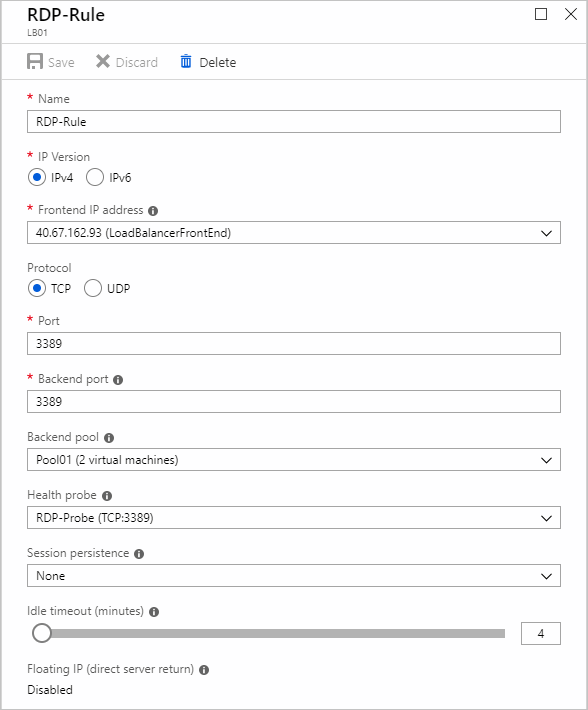

# Integrate Azure Firewall with Azure Standard Load Balancer

You can integrate an Azure Firewall into a network with an Azure Standard Load Balancer (either public or internal), but you need to be aware of some routing issues that can break functionality with the public load balancer scenario.

## Public load balancer

In this case, the load balancer is deployed with a public IP address for the frontend IP address.

### Asymmetric routing

Asymmetric routing is where a packet takes one path to the destination and takes another path when returning to the source. An issue can occur when a subnet has a default route going to the firewall's private IP address and a public load balancer that accepts traffic directly from the Internet. In that case, the incoming load balancer traffic is received via its public IP, but the return path goes through the firewall's private IP address. Since the firewall is stateful, it will drop the returning packet because the firewall is not aware of such an established session.

### Fix the problem

Recall that when you deploy an Azure Firewall into a subnet, one step is to create a default route for the subnet directing packets through the firewall's private IP address located on the AzureFirewallSubnet. For more information, see [Tutorial: Deploy and configure Azure Firewall using the Azure portal](tutorial-firewall-deploy-portal.md#create-a-default-route).

When you introduce the firewall into your load balancer scenario, you'll want your Internet traffic to come in through your firewall's public IP address. From there, the firewall applies its firewall rules and NATs the packets to your load balancer's public IP address. This is where the problem occurs. Packets arrive on the firewall's public IP address, but return to the firewall via the private IP address (using the default route).

To avoid this problem, create an additional host route for the firewall's public IP address, directing packets to the firewall's public IP address via the Internet to avoid taking the default route to the firewall's private IP address.

For example, the following routes are for a firewall at public IP address 13.86.122.41, and private IP address 10.3.1.4.

### NAT rule

As an example, you can set up a load balancer for remote desktops.

A load balancer is deployed to direct traffic to a back-end pool of servers offering remote desktops via RDP at TCP port 3389.

A firewall NAT rule is created to direct RDP traffic coming into the firewall's public IP address (13.86.122.41) to the load balancer's public IP address at 40.67.162.93.

### Load balancing rule

On the load balancer, a load balancing rule is created to direct traffic going to TCP 3389 to a backend pool of virtual machines offering remote desktop.

## Internal load balancer

In this case, the load balancer is deployed with a private IP address as the frontend IP address.

There's no asymmetric routing issue here, because the incoming packets arrive at the firewall's public IP address, gets translated to the load balancer's private IP address, and then returns to the firewall's the private IP address using the same path back.

So, you can deploy this scenario similar to the public load balancer scenario, but without the need for the firewall public IP address host route.

## Next steps

- Learn how to [deploy and configure an Azure Firewall](tutorial-firewall-deploy-portal.md).