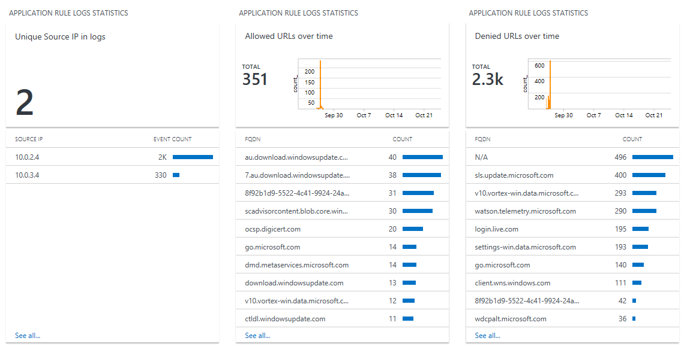
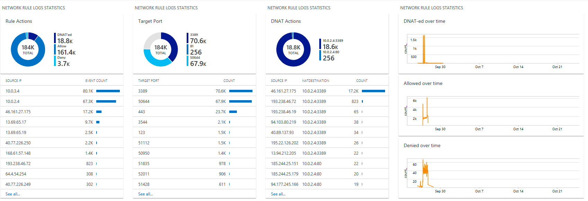

# Azure Firewall log analytics samples

The following Azure Monitor logs samples can be used to analyze your Azure Firewall logs. The sample file is built in View Designer in Azure Monitor, the [View Designer in Azure Monitor](https://docs.microsoft.com/azure/log-analytics/log-analytics-view-designer) article has more information about the View Design concept.

[!INCLUDE [azure-monitor-log-analytics-rebrand](../../includes/azure-monitor-log-analytics-rebrand.md)]

## Azure Monitor logs view

Here's how you can configure an example Azure Monitor logs visualization. You can download the example visualization from the [azure-docs-json-samples](https://raw.githubusercontent.com/Azure/azure-docs-json-samples/master/azure-firewall/AzureFirewall.omsview) repository. The easiest way is to right-click the hyperlink on this page and choose *save as* and provide a name like **AzureFirewall.omsview**. 

Execute the following steps to add the view to your Log Analytics workspace:

1. Open the Log Analytics workspace in the Azure Portal.
2. Open **View Designer** below **General**.
3. Click **Import**.
4. Browse and select the **AzureFirewall.omsview** file you downloaded before.
5. Click **Save**.

Here's how the view looks for the application rule log data:



And for the network rule log data:



Azure Firewall logs data below AzureDiagnostics with Category as either **AzureFirewallApplicationRule** or **AzureFirewallNetworkRule**. The data containing the details is stored in the msg_s field. Using the [parse](https://docs.microsoft.com/azure/kusto/query/parseoperator) operator we can extract the various interesting properties from the msg_s field. The queries below extract the information for both categories.

## Application rules log data query

The query below parses the application rule log data. In the various comment lines there's some guidance as to how the query was built:

```Kusto
AzureDiagnostics
| where Category == "AzureFirewallApplicationRule"
//using :int makes it easier to pars but later we'll convert to string as we're not interested to do mathematical functions on these fields
//this first parse statement is valid for all entries as they all start with this format
| parse msg_s with Protocol " request from " SourceIP ":" SourcePortInt:int " " TempDetails
//case 1: for records that end with: "was denied. Reason: SNI TLS extension was missing."
| parse TempDetails with "was " Action1 ". Reason: " Rule1
//case 2: for records that end with
//"to ocsp.digicert.com:80. Action: Allow. Rule Collection: RC1. Rule: Rule1"
//"to v10.vortex-win.data.microsoft.com:443. Action: Deny. No rule matched. Proceeding with default action"
| parse TempDetails with "to " FQDN ":" TargetPortInt:int ". Action: " Action2 "." *
//case 2a: for records that end with:
//"to ocsp.digicert.com:80. Action: Allow. Rule Collection: RC1. Rule: Rule1"
| parse TempDetails with * ". Rule Collection: " RuleCollection2a ". Rule:" Rule2a
//case 2b: for records that end with:
//for records that end with: "to v10.vortex-win.data.microsoft.com:443. Action: Deny. No rule matched. Proceeding with default action"
| parse TempDetails with * "Deny." RuleCollection2b ". Proceeding with" Rule2b
| extend 
SourcePort = tostring(SourcePortInt)
|extend
TargetPort = tostring(TargetPortInt)
| extend
//make sure we only have Allowed / Deny in the Action Field
Action1 = case(Action1 == "denied","Deny","Unknown Action")
| extend
    Action = case(Action2 == "",Action1,Action2),
    Rule = case(Rule2a == "",case(Rule1 == "",case(Rule2b == "","N/A", Rule2b),Rule1),Rule2a), 
    RuleCollection = case(RuleCollection2b == "",case(RuleCollection2a == "","No rule matched",RuleCollection2a),RuleCollection2b),
    FQDN = case(FQDN == "", "N/A", FQDN),
    TargetPort = case(TargetPort == "", "N/A", TargetPort)
| project TimeGenerated, msg_s, Protocol, SourceIP, SourcePort, FQDN, TargetPort, Action ,RuleCollection, Rule
```

The same query in a more condensed format:

```Kusto
AzureDiagnostics
| where Category == "AzureFirewallApplicationRule"
| parse msg_s with Protocol " request from " SourceIP ":" SourcePortInt:int " " TempDetails
| parse TempDetails with "was " Action1 ". Reason: " Rule1
| parse TempDetails with "to " FQDN ":" TargetPortInt:int ". Action: " Action2 "." *
| parse TempDetails with * ". Rule Collection: " RuleCollection2a ". Rule:" Rule2a
| parse TempDetails with * "Deny." RuleCollection2b ". Proceeding with" Rule2b
| extend SourcePort = tostring(SourcePortInt)
| extend TargetPort = tostring(TargetPortInt)
| extend Action1 = case(Action1 == "denied","Deny","Unknown Action")
| extend Action = case(Action2 == "",Action1,Action2),Rule = case(Rule2a == "", case(Rule1 == "",case(Rule2b == "","N/A", Rule2b),Rule1),Rule2a), 
RuleCollection = case(RuleCollection2b == "",case(RuleCollection2a == "","No rule matched",RuleCollection2a), RuleCollection2b),FQDN = case(FQDN == "", "N/A", FQDN),TargetPort = case(TargetPort == "", "N/A", TargetPort)
| project TimeGenerated, msg_s, Protocol, SourceIP, SourcePort, FQDN, TargetPort, Action ,RuleCollection, Rule
```

## Network rules log data query

The following query parses the network rule log data. In the various comment lines there's some guidance as to how the query was built:

```Kusto
AzureDiagnostics
| where Category == "AzureFirewallNetworkRule"
//using :int makes it easier to pars but later we'll convert to string as we're not interested to do mathematical functions on these fields
//case 1: for records that look like this:
//TCP request from 10.0.2.4:51990 to 13.69.65.17:443. Action: Deny//Allow
//UDP request from 10.0.3.4:123 to 51.141.32.51:123. Action: Deny/Allow
//TCP request from 193.238.46.72:50522 to 40.119.154.83:3389 was DNAT'ed to 10.0.2.4:3389
| parse msg_s with Protocol " request from " SourceIP ":" SourcePortInt:int " to " TargetIP ":" TargetPortInt:int *
//case 1a: for regular network rules
//TCP request from 10.0.2.4:51990 to 13.69.65.17:443. Action: Deny//Allow
//UDP request from 10.0.3.4:123 to 51.141.32.51:123. Action: Deny/Allow
| parse msg_s with * ". Action: " Action1a
//case 1b: for NAT rules
//TCP request from 193.238.46.72:50522 to 40.119.154.83:3389 was DNAT'ed to 10.0.2.4:3389
| parse msg_s with * " was " Action1b " to " NatDestination
//case 2: for ICMP records
//ICMP request from 10.0.2.4 to 10.0.3.4. Action: Allow
| parse msg_s with Protocol2 " request from " SourceIP2 " to " TargetIP2 ". Action: " Action2
| extend
SourcePort = tostring(SourcePortInt),
TargetPort = tostring(TargetPortInt)
| extend 
    Action = case(Action1a == "", case(Action1b == "",Action2,Action1b), Action1a),
    Protocol = case(Protocol == "", Protocol2, Protocol),
    SourceIP = case(SourceIP == "", SourceIP2, SourceIP),
    TargetIP = case(TargetIP == "", TargetIP2, TargetIP),
    //ICMP records don't have port information
    SourcePort = case(SourcePort == "", "N/A", SourcePort),
    TargetPort = case(TargetPort == "", "N/A", TargetPort),
    //Regular network rules don't have a DNAT destination
    NatDestination = case(NatDestination == "", "N/A", NatDestination)
| project TimeGenerated, msg_s, Protocol, SourceIP,SourcePort,TargetIP,TargetPort,Action, NatDestination
```

The same query in a more condensed format:

```Kusto
AzureDiagnostics
| where Category == "AzureFirewallNetworkRule"
| parse msg_s with Protocol " request from " SourceIP ":" SourcePortInt:int " to " TargetIP ":" TargetPortInt:int *
| parse msg_s with * ". Action: " Action1a
| parse msg_s with * " was " Action1b " to " NatDestination
| parse msg_s with Protocol2 " request from " SourceIP2 " to " TargetIP2 ". Action: " Action2
| extend SourcePort = tostring(SourcePortInt),TargetPort = tostring(TargetPortInt)
| extend Action = case(Action1a == "", case(Action1b == "",Action2,Action1b), Action1a),Protocol = case(Protocol == "", Protocol2, Protocol),SourceIP = case(SourceIP == "", SourceIP2, SourceIP),TargetIP = case(TargetIP == "", TargetIP2, TargetIP),SourcePort = case(SourcePort == "", "N/A", SourcePort),TargetPort = case(TargetPort == "", "N/A", TargetPort),NatDestination = case(NatDestination == "", "N/A", NatDestination)
| project TimeGenerated, msg_s, Protocol, SourceIP,SourcePort,TargetIP,TargetPort,Action, NatDestination
```

## Threat Intelligence log data query

The following query parses the Threat Intelligence rule log data:

```Kusto
AzureDiagnostics
| where OperationName  == "AzureFirewallThreatIntelLog"
| parse msg_s with Protocol " request from " SourceIP ":" SourcePortInt:int " to " TargetIP ":" TargetPortInt:int *
| parse msg_s with * ". Action: " Action "." Message
| parse msg_s with Protocol2 " request from " SourceIP2 " to " TargetIP2 ". Action: " Action2
| extend SourcePort = tostring(SourcePortInt),TargetPort = tostring(TargetPortInt)
| extend Protocol = case(Protocol == "", Protocol2, Protocol),SourceIP = case(SourceIP == "", SourceIP2, SourceIP),TargetIP = case(TargetIP == "", TargetIP2, TargetIP),SourcePort = case(SourcePort == "", "N/A", SourcePort),TargetPort = case(TargetPort == "", "N/A", TargetPort)
| sort by TimeGenerated desc | project TimeGenerated, msg_s, Protocol, SourceIP,SourcePort,TargetIP,TargetPort,Action,Message
```

## Next steps

To learn about Azure Firewall monitoring and diagnostics, see [Tutorial: Monitor Azure Firewall logs and metrics](tutorial-diagnostics.md).
