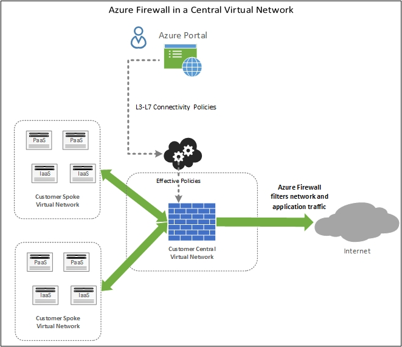

# What is Azure Firewall?

Azure Firewall is a managed, cloud-based network security service that protects your Azure Virtual Network resources. It is a fully stateful firewall as a service with built-in high availability and unrestricted cloud scalability. 

[!INCLUDE [firewall-preview-notice](../../includes/firewall-preview-notice.md)]

You can centrally create, enforce, and log application and network connectivity policies across subscriptions and virtual networks. Azure Firewall uses a static public IP address for your virtual network resources allowing outside firewalls to identify traffic originating from your virtual network.  The service is fully integrated with Azure Monitor for logging and analytics.

## Features

The Azure Firewall public preview offers the following features:

### Built-in high availability
High availability is built in, so no additional load balancers are required and there is nothing you need to configure.

### Unrestricted cloud scalability 
Azure Firewall can scale up as much as you need  to accommodate changing network traffic flows, so you don't need to budget for your peak traffic.

### FQDN filtering 
You can limit outbound HTTP/S traffic to a specified list of fully qualified domain names (FQDN) including wild cards. This feature does not require SSL termination.

### Network traffic filtering rules

You can centrally create *allow* or *deny* network filtering rules by source and destination IP address, port, and protocol. Azure Firewall is fully stateful, so it can distinguish legitimate packets for different types of connections. Rules are enforced and logged across multiple subscriptions and virtual networks.

### Outbound SNAT support

All outbound virtual network traffic IP addresses are translated to the Azure Firewall public IP (Source Network Address Translation). You can identify and allow traffic originating from your virtual network to remote Internet destinations.

### Azure Monitor logging

All events are integrated with Azure Monitor, allowing you to archive logs to a storage account, stream events to your Event Hub, or send them to Log Analytics.

## Known issues

The Azure Firewall public preview has the following known issues:

|Issue  |Description  |Mitigation  |
|---------|---------|---------|
|Interoperability with NSGs     |If a network security group (NSG) is applied on the firewall subnet, it may block outbound Internet connectivity even if the NSG is configured to allow outbound internet access. Outbound Internet connections are marked as coming from a VirtualNetwork and the destination is Internet. An NSG has VirtualNetwork to VirtualNetwork *allow* by default, but not when destination is Internet.|To mitigate, add the following inbound rule to the NSG that is applied on the firewall subnet:  Source: VirtualNetwork Source ports: Any   Destination: Any Destination Ports: Any   Protocol: All Access: Allow|
|Conflict with Azure Security Center (ASC) Just-in-Time (JIT) feature|If a virtual machine is accessed using JIT, and is in a subnet with a user-defined route that points to Azure Firewall as a default gateway, ASC JIT doesn’t work. This is a result of asymmetric routing – a packet comes in via the virtual machine public IP (JIT opened the access), but the return path is via the firewall, which drops the packet because no session is established on the firewall.|To work around this issue, place the JIT virtual machines on a separate subnet that doesn’t have a user-defined route to the firewall.|
|Hub and spoke with global peering doesn’t work|The hub and spoke model, where the hub and firewall are deployed in one Azure region, with the spokes in another Azure region, connected to the hub via Global VNet Peering is not supported.|For more information, see [Create, change, or delete a virtual network peering](https://docs.microsoft.com/en-us/azure/virtual-network/virtual-network-manage-peering#requirements-and-constraints)|
Network filtering rules for non-TCP/UDP protocols (for example ICMP) don't work for Internet bound traffic|Network filtering rules for non-TCP/UDP protocols don’t work with SNAT to your public IP address. Non-TCP/UDP protocols are supported between spoke subnets and VNets.|Azure Firewall uses the Standard Load Balancer, [which doesn't support SNAT for IP protocols today](https://docs.microsoft.com/en-us/azure/load-balancer/load-balancer-standard-overview#limitations). We are exploring options to support this scenario in a future release.

## Next steps

- [Tutorial: Deploy and configure Azure Firewall using the Azure portal](tutorial-firewall-deploy-portal.md)
- [Deploy Azure Firewall using a template](deploy-template.md)
- [Create an Azure Firewall test environment](scripts/sample-create-firewall-test.md)

