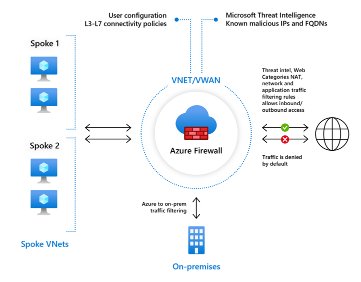
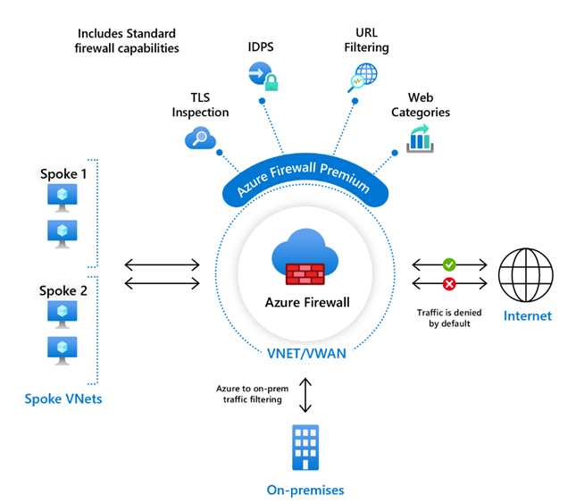

# What is Azure Firewall?

Azure Firewall is a cloud-native and intelligent network firewall security service that provides the best of breed threat protection for your cloud workloads running in Azure. It's a fully stateful firewall as a service with built-in high availability and unrestricted cloud scalability. It provides both east-west and north-south traffic inspection. To learn what's east-west and north-south traffic, see [East-west and north-south traffic](/azure/architecture/framework/security/design-network-flow#east-west-and-north-south-traffic).

Azure Firewall is offered in three SKUs: Standard, Premium, and Basic.

## Azure Firewall Standard

   Azure Firewall Standard provides L3-L7 filtering and threat intelligence feeds directly from Microsoft Cyber Security. Threat intelligence-based filtering can alert and deny traffic from/to known malicious IP addresses and domains that are updated in real time to protect against new and emerging attacks.

   

To learn about Firewall Standard features, see [Azure Firewall Standard features](features.md).

## Azure Firewall Premium

   Azure Firewall Premium provides advanced capabilities include signature based IDPS to allow rapid detection of attacks by looking for specific patterns. These patterns can include byte sequences in network traffic or known malicious instruction sequences used by malware. There are more than 67,000 signatures in over 50 categories that are updated in real time to protect against new and emerging exploits. The exploit categories include malware, phishing, coin mining, and Trojan attacks.

   

To learn about Firewall Premium features, see [Azure Firewall Premium features](premium-features.md).

## Azure Firewall Basic

Azure Firewall Basic is intended for small and medium size (SMB) customers to secure their Azure cloud. 
environments. It provides the essential protection SMB customers need at an affordable price point.

:::image type="content" source="media/overview/firewall-basic-diagram.png" alt-text="Diagram showing Firewall Basic.":::

Azure Firewall Basic is like Firewall Standard, but has the following main limitations:

- Supports Threat Intel *alert mode* only
- Fixed scale unit to run the service on two virtual machine backend instances
- Recommended for environments with an estimated throughput of 250 Mbps

To learn more about Azure Firewall Basic, see [Azure Firewall Basic features](basic-features.md).

## Feature comparison

To compare the all Firewall SKU features, see [Choose the right Azure Firewall SKU to meet your needs](choose-firewall-sku.md).

## Azure Firewall Manager

You can use Azure Firewall Manager to centrally manage Azure Firewalls across multiple subscriptions. Firewall Manager uses firewall policy to apply a common set of network/application rules and configuration to the firewalls in your tenant.
 
Firewall Manager supports firewalls in both VNet and Virtual WANs (Secure Virtual Hub) environments. Secure Virtual Hubs use the Virtual WAN route automation solution to simplify routing traffic to the firewall with just a few steps.

To learn more about Azure Firewall Manager, see [Azure Firewall Manager](../firewall-manager/overview.md).

## Pricing and SLA

For Azure Firewall pricing information, see [Azure Firewall pricing](https://azure.microsoft.com/pricing/details/azure-firewall/).

For Azure Firewall SLA information, see [Azure Firewall SLA](https://azure.microsoft.com/support/legal/sla/azure-firewall/).

## Supported regions

For the supported regions for Azure Firewall, see [Azure products available by region](https://azure.microsoft.com/global-infrastructure/services/?products=azure-firewall).

## What's new

To learn what's new with Azure Firewall, see [Azure updates](https://azure.microsoft.com/updates/?category=networking&query=Azure%20Firewall).

## Known issues

For Azure Firewall known issues, see [Azure Firewall known issues](firewall-known-issues.md)

## Next steps

- [Quickstart: Create an Azure Firewall and a firewall policy - ARM template](../firewall-manager/quick-firewall-policy.md)
- [Quickstart: Deploy Azure Firewall with Availability Zones - ARM template](deploy-template.md)
- [Tutorial: Deploy and configure Azure Firewall using the Azure portal](tutorial-firewall-deploy-portal.md)
- [Learn module: Introduction to Azure Firewall](/training/modules/introduction-azure-firewall/)
- [Learn more about Azure network security](../networking/security/index.yml)
