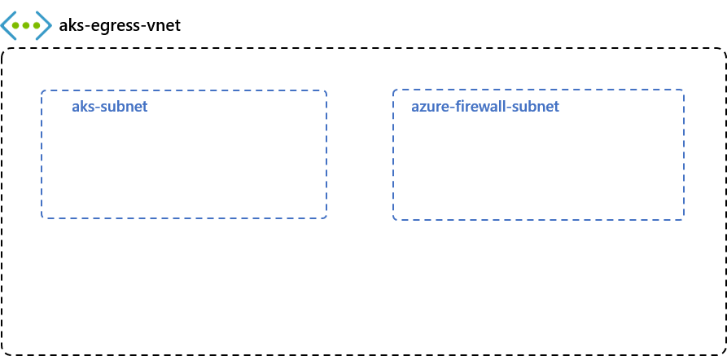
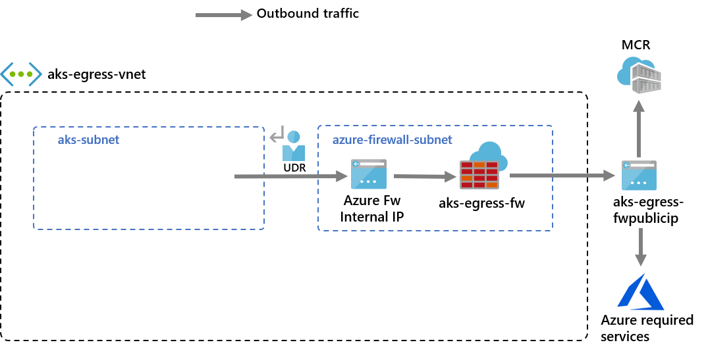
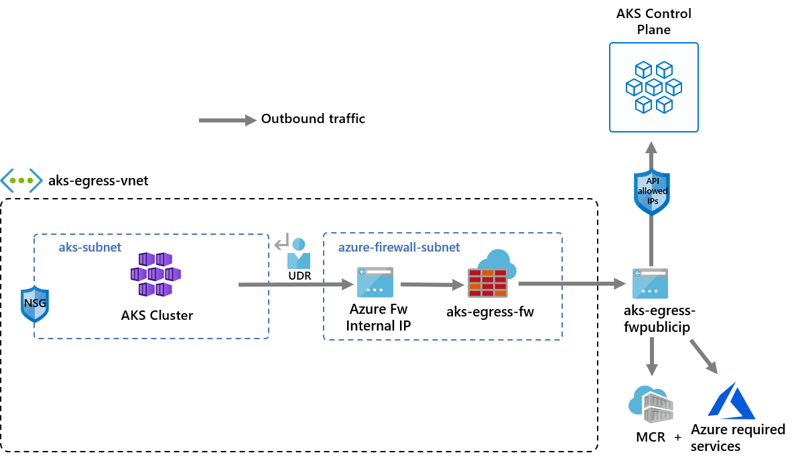
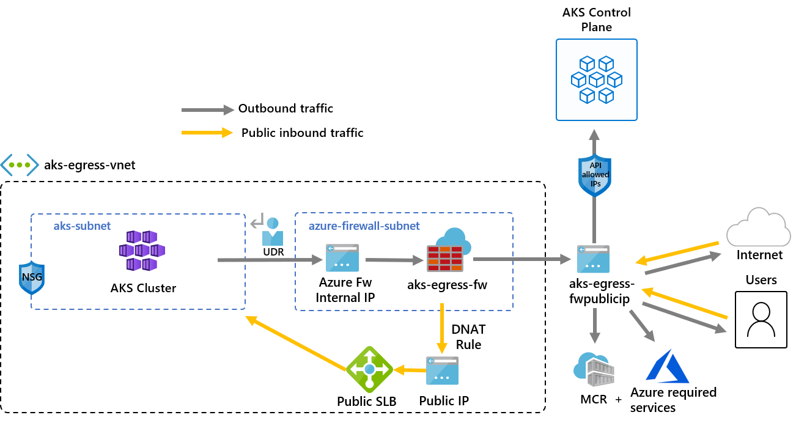
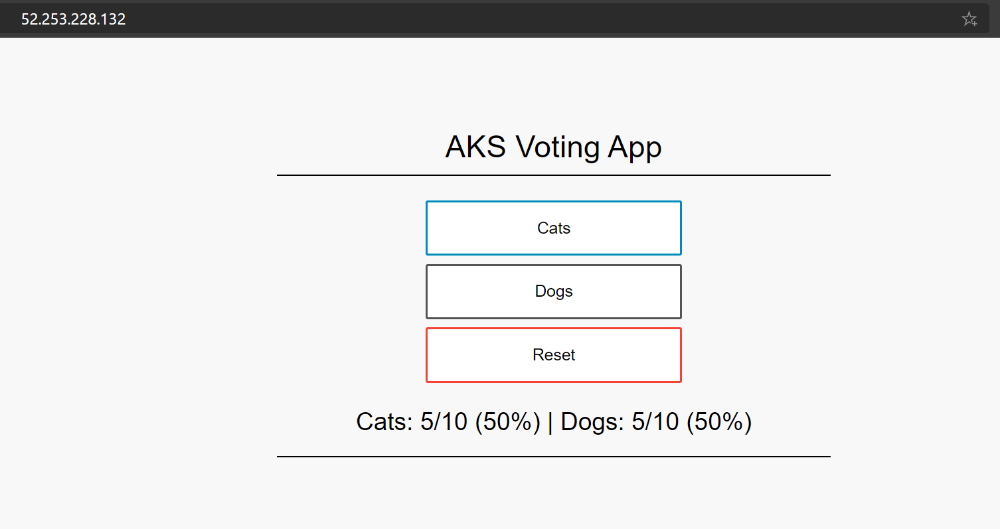

# Use Azure Firewall to protect Azure Kubernetes Service (AKS) clusters

This article shows you how you can protect Azure Kubernetes Service (AKS) clusters by using Azure Firewall to secure outbound and inbound traffic.

## Background

Azure Kubernetes Service (AKS) offers a managed Kubernetes cluster on Azure. For more information, see [Azure Kubernetes Service](../aks/intro-kubernetes.md).

Despite AKS being a fully managed solution, it doesn't offer a built-in solution to secure ingress and egress traffic between the cluster and external networks. Azure Firewall offers a solution to this.

AKS clusters are deployed on a virtual network. This network can be managed (created by AKS) or custom (preconfigured by the user beforehand). In either case, the cluster has outbound dependencies on services outside of that virtual network (the service has no inbound dependencies). For management and operational purposes, nodes in an AKS cluster need to access [certain ports and fully qualified domain names (FQDNs)](../aks/outbound-rules-control-egress.md) describing these outbound dependencies. This is required for various functions including, but not limited to, the nodes that communicate with the Kubernetes API server.  They download and install core Kubernetes cluster components and node security updates, or pull base system container images from Microsoft Container Registry (MCR), and so on. These outbound dependencies are almost entirely defined with FQDNs, which don't have static addresses behind them. The lack of static addresses means that Network Security Groups can't be used to lock down outbound traffic from an AKS cluster. For this reason, by default, AKS clusters have unrestricted outbound (egress) Internet access. This level of network access allows nodes and services you run to access external resources as needed.
 
However, in a production environment, communications with a Kubernetes cluster should be protected to prevent against data exfiltration along with other vulnerabilities. All incoming and outgoing network traffic must be monitored and controlled based on a set of security rules. If you want to do this, you have to restrict egress traffic, but a limited number of ports and addresses must remain accessible to maintain healthy cluster maintenance tasks and satisfy those outbound dependencies previously mentioned.
 
The simplest solution uses a firewall device that can control outbound traffic based on domain names. A firewall typically establishes a barrier between a trusted network and an untrusted network, such as the Internet. Azure Firewall, for example, can restrict outbound HTTP and HTTPS traffic based on the FQDN of the destination, giving you fine-grained egress traffic control, but at the same time allows you to provide access to the FQDNs encompassing an AKS cluster’s outbound dependencies (something that NSGs can't do). Likewise, you can control ingress traffic and improve security by enabling threat intelligence-based filtering on an Azure Firewall deployed to a shared perimeter network. This filtering can provide alerts, and deny traffic to and from known malicious IP addresses and domains.

See the following video by Abhinav Sriram for a quick overview on how this works in practice on a sample environment:

> [!VIDEO https://www.microsoft.com/en-us/videoplayer/embed/RE529Qc]

You can download a zip file from the [Microsoft Download Center](https://download.microsoft.com/download/0/1/3/0131e87a-c862-45f8-8ee6-31fa103a03ff/aks-azfw-protection-setup.zip) that contains a bash script file and a yaml file to automatically configure the sample environment used in the video. It configures Azure Firewall to protect both ingress and egress traffic. The following guides  walk through each step of the script in more detail so you can set up a custom configuration. 

The following diagram shows the sample environment from the video that the script and guide configure:

:::image type="content" source="media/protect-azure-kubernetes-service/aks-firewall.png" alt-text="Diagram showing A K S cluster with Azure Firewall for ingress egress filtering.":::

There's one difference between the script and the following guide. The script uses managed identities, but the guide uses a service principal. This shows you two different ways to create an identity to manage and create cluster resources.

## Restrict egress traffic using Azure Firewall

### Set configuration via environment variables

Define a set of environment variables to be used in resource creations.

```bash
PREFIX="aks-egress"
RG="${PREFIX}-rg"
LOC="eastus"
PLUGIN=azure
AKSNAME="${PREFIX}"
VNET_NAME="${PREFIX}-vnet"
AKSSUBNET_NAME="aks-subnet"
# DO NOT CHANGE FWSUBNET_NAME - This is currently a requirement for Azure Firewall.
FWSUBNET_NAME="AzureFirewallSubnet"
FWNAME="${PREFIX}-fw"
FWPUBLICIP_NAME="${PREFIX}-fwpublicip"
FWIPCONFIG_NAME="${PREFIX}-fwconfig"
FWROUTE_TABLE_NAME="${PREFIX}-fwrt"
FWROUTE_NAME="${PREFIX}-fwrn"
FWROUTE_NAME_INTERNET="${PREFIX}-fwinternet"
```

### Create a virtual network with multiple subnets

Create a virtual network with two separate subnets, one for the cluster, one for the firewall. Optionally you could also create one for internal service ingress.



Create a resource group to hold all of the resources.

```azurecli
# Create Resource Group

az group create --name $RG --location $LOC
```

Create a virtual network with two subnets to host the AKS cluster and the Azure Firewall. Each has their own subnet. Let's start with the AKS network.

```
# Dedicated virtual network with AKS subnet

az network vnet create \
    --resource-group $RG \
    --name $VNET_NAME \
    --location $LOC \
    --address-prefixes 10.42.0.0/16 \
    --subnet-name $AKSSUBNET_NAME \
    --subnet-prefix 10.42.1.0/24

# Dedicated subnet for Azure Firewall (Firewall name cannot be changed)

az network vnet subnet create \
    --resource-group $RG \
    --vnet-name $VNET_NAME \
    --name $FWSUBNET_NAME \
    --address-prefix 10.42.2.0/24
```

### Create and set up an Azure Firewall with a UDR

Azure Firewall inbound and outbound rules must be configured. The main purpose of the firewall is to enable organizations to configure granular ingress and egress traffic rules into and out of the AKS Cluster.



> [!IMPORTANT]
> If your cluster or application creates a large number of outbound connections directed to the same or small subset of destinations, you might require more firewall frontend IPs to avoid maxing out the ports per frontend IP.
> For more information on how to create an Azure firewall with multiple IPs, see [**here**](../firewall/quick-create-multiple-ip-template.md)

Create a standard SKU public IP resource that is used as the Azure Firewall frontend address.

```azurecli
az network public-ip create -g $RG -n $FWPUBLICIP_NAME -l $LOC --sku "Standard"
```

Register the preview cli-extension to create an Azure Firewall.

```azurecli
# Install Azure Firewall preview CLI extension

az extension add --name azure-firewall

# Deploy Azure Firewall

az network firewall create -g $RG -n $FWNAME -l $LOC --enable-dns-proxy true
```

The IP address created earlier can now be assigned to the firewall frontend.

> [!NOTE]
> Set up of the public IP address to the Azure Firewall may take a few minutes.
> To leverage FQDN on network rules we need DNS proxy enabled, when enabled the firewall will listen on port 53 and will forward DNS requests to the DNS server specified previously. This will allow the firewall to translate that FQDN automatically.

```azurecli
# Configure Firewall IP Config

az network firewall ip-config create -g $RG -f $FWNAME -n $FWIPCONFIG_NAME --public-ip-address $FWPUBLICIP_NAME --vnet-name $VNET_NAME
```

When the previous command has succeeded, save the firewall frontend IP address for configuration later.

```azurecli
# Capture Firewall IP Address for Later Use

FWPUBLIC_IP=$(az network public-ip show -g $RG -n $FWPUBLICIP_NAME --query "ipAddress" -o tsv)
FWPRIVATE_IP=$(az network firewall show -g $RG -n $FWNAME --query "ipConfigurations[0].privateIPAddress" -o tsv)
```

> [!NOTE]
> If you use secure access to the AKS API server with [authorized IP address ranges](../aks/api-server-authorized-ip-ranges.md), you need to add the firewall public IP into the authorized IP range.

### Create a UDR with a hop to Azure Firewall

Azure automatically routes traffic between Azure subnets, virtual networks, and on-premises networks. If you want to change any of Azure's default routing, you do so by creating a route table.

Create an empty route table to be associated with a given subnet. The route table will define the next hop as the Azure Firewall created previously. Each subnet can have zero or one route table associated to it.

```azurecli
# Create UDR and add a route for Azure Firewall

az network route-table create -g $RG -l $LOC --name $FWROUTE_TABLE_NAME
az network route-table route create -g $RG --name $FWROUTE_NAME --route-table-name $FWROUTE_TABLE_NAME --address-prefix 0.0.0.0/0 --next-hop-type VirtualAppliance --next-hop-ip-address $FWPRIVATE_IP
az network route-table route create -g $RG --name $FWROUTE_NAME_INTERNET --route-table-name $FWROUTE_TABLE_NAME --address-prefix $FWPUBLIC_IP/32 --next-hop-type Internet
```

See [virtual network route table documentation](../virtual-network/virtual-networks-udr-overview.md#user-defined) about how you can override Azure's default system routes or add more routes to a subnet's route table.

### Adding firewall rules

> [!NOTE]
> For applications outside of the kube-system or gatekeeper-system namespaces that needs to talk to the API server, an additional network rule to allow TCP communication to port 443 for the API server IP in addition to adding application rule for fqdn-tag AzureKubernetesService is required.


 You can use the following three network rules to configure your firewall.  You might need to adapt these rules based on your deployment. The first rule allows access to port 9000 via TCP. The second rule allows access to port 1194 and 123 via UDP. Both these rules only allows traffic destined to the Azure Region CIDR that we're using, in this case East US. 

Finally, we add a third network rule opening port 123 to an Internet time server FQDN (for example:`ntp.ubuntu.com`)  via UDP. Adding an FQDN as a network rule is one of the specific features of Azure Firewall, and you need to adapt it when using your own options.

After setting the network rules, we'll also add an application rule using the `AzureKubernetesService` that covers the needed FQDNs accessible through TCP port 443 and port 80. In addition, you might need to configure more network and application rules based on your deployment. For more information, see [Outbound network and FQDN rules for Azure Kubernetes Service (AKS) clusters](../aks/outbound-rules-control-egress.md#required-outbound-network-rules-and-fqdns-for-aks-clusters).

#### Add FW Network Rules

```azurecli
az network firewall network-rule create -g $RG -f $FWNAME --collection-name 'aksfwnr' -n 'apiudp' --protocols 'UDP' --source-addresses '*' --destination-addresses "AzureCloud.$LOC" --destination-ports 1194 --action allow --priority 100
az network firewall network-rule create -g $RG -f $FWNAME --collection-name 'aksfwnr' -n 'apitcp' --protocols 'TCP' --source-addresses '*' --destination-addresses "AzureCloud.$LOC" --destination-ports 9000
az network firewall network-rule create -g $RG -f $FWNAME --collection-name 'aksfwnr' -n 'time' --protocols 'UDP' --source-addresses '*' --destination-fqdns 'ntp.ubuntu.com' --destination-ports 123
```

#### Add FW Application Rules

```azurecli
az network firewall application-rule create -g $RG -f $FWNAME --collection-name 'aksfwar' -n 'fqdn' --source-addresses '*' --protocols 'http=80' 'https=443' --fqdn-tags "AzureKubernetesService" --action allow --priority 100
```

See [Azure Firewall documentation](overview.md) to learn more about the Azure Firewall service.

### Associate the route table to AKS

To associate the cluster with the firewall, the dedicated subnet for the cluster's subnet must reference the route table created previously. Association can be done by issuing a command to the virtual network holding both the cluster and firewall to update the route table of the cluster's subnet.

```azurecli
# Associate route table with next hop to Firewall to the AKS subnet

az network vnet subnet update -g $RG --vnet-name $VNET_NAME --name $AKSSUBNET_NAME --route-table $FWROUTE_TABLE_NAME
```

### Deploy AKS with outbound type of UDR to the existing network

Now an AKS cluster can be deployed into the existing virtual network. You also use [outbound type `userDefinedRouting`](../aks/egress-outboundtype.md), this feature ensures any outbound traffic is forced through the firewall and no other egress paths exist (by default the Load Balancer outbound type could be used).



The target subnet to be deployed into is defined with the environment variable, `$SUBNETID`. We didn't define the `$SUBNETID` variable in the previous steps. To set the value for the subnet ID, you can use the following command:

```azurecli
SUBNETID=$(az network vnet subnet show -g $RG --vnet-name $VNET_NAME --name $AKSSUBNET_NAME --query id -o tsv)
```

You define the outbound type to use the UDR that already exists on the subnet. This configuration enables AKS to skip the setup and IP provisioning for the load balancer.

> [!IMPORTANT]
> For more information on outbound type UDR including limitations, see [**egress outbound type UDR**](../aks/egress-outboundtype.md#limitations).

> [!TIP]
> Additional features can be added to the cluster deployment such as [**Private Cluster**](../aks/private-clusters.md) or changing the [**OS SKU**](../aks/cluster-configuration.md#azure-linux-container-host-for-aks).
>
> The AKS feature for [**API server authorized IP ranges**](../aks/api-server-authorized-ip-ranges.md) can be added to limit API server access to only the firewall's public endpoint. The authorized IP ranges feature is denoted in the diagram as optional. When enabling the authorized IP range feature to limit API server access, your developer tools must use a jumpbox from the firewall's virtual network or you must add all developer endpoints to the authorized IP range.

```azurecli
az aks create -g $RG -n $AKSNAME -l $LOC \
  --node-count 3 \
  --network-plugin azure \
  --outbound-type userDefinedRouting \
  --vnet-subnet-id $SUBNETID \
  --api-server-authorized-ip-ranges $FWPUBLIC_IP
```

> [!NOTE]
> To create and use your own VNet and route table with `kubenet` network plugin, you need to use a [user-assigned managed identity][bring-your-own-managed-identity]. For system-assigned managed identity, we cannot get the identity ID before creating cluster, which causes delay for role assignment to take effect.
>
> To create and use your own VNet and route table with `azure` network plugin, both system-assigned and user-assigned managed identities are supported.

### Enable developer access to the API server

If you used authorized IP ranges for the cluster on the previous step, you must add your developer tooling IP addresses to the AKS cluster list of approved IP ranges in order to access the API server from there. Another option is to configure a jumpbox with the needed tooling inside a separate subnet in the Firewall's virtual network.

Add another IP address to the approved ranges with the following command

```bash
# Retrieve your IP address
CURRENT_IP=$(dig @resolver1.opendns.com ANY myip.opendns.com +short)

# Add to AKS approved list
az aks update -g $RG -n $AKSNAME --api-server-authorized-ip-ranges $CURRENT_IP/32
```

Use the [az aks get-credentials](/cli/azure/aks#az-aks-get-credentials) command to configure `kubectl` to connect to your newly created Kubernetes cluster.

```azurecli
az aks get-credentials -g $RG -n $AKSNAME
```

## Restrict ingress traffic using Azure Firewall

You can now start exposing services and deploying applications to this cluster. In this example, we expose a public service, but you can also choose to expose an internal service via [internal load balancer](../aks/internal-lb.md).



Deploy the Azure voting app application by copying the following yaml to a file named `example.yaml`.

```yaml
# voting-storage-deployment.yaml
apiVersion: apps/v1
kind: Deployment
metadata:
  name: voting-storage
spec:
  replicas: 1
  selector:
    matchLabels:
      app: voting-storage
  template:
    metadata:
      labels:
        app: voting-storage
    spec:
      containers:
      - name: voting-storage
        image: mcr.microsoft.com/azuredocs/azure-vote-front:v1
        args: ["--ignore-db-dir=lost+found"]
        resources:
          requests:
            cpu: 100m
            memory: 128Mi
          limits:
            cpu: 250m
            memory: 256Mi
        ports:
        - containerPort: 3306
          name: mysql
        volumeMounts:
        - name: mysql-persistent-storage
          mountPath: /var/lib/mysql
        env:
        - name: MYSQL_ROOT_PASSWORD
          valueFrom:
            secretKeyRef:
              name: voting-storage-secret
              key: MYSQL_ROOT_PASSWORD
        - name: MYSQL_USER
          valueFrom:
            secretKeyRef:
              name: voting-storage-secret
              key: MYSQL_USER
        - name: MYSQL_PASSWORD
          valueFrom:
            secretKeyRef:
              name: voting-storage-secret
              key: MYSQL_PASSWORD
        - name: MYSQL_DATABASE
          valueFrom:
            secretKeyRef:
              name: voting-storage-secret
              key: MYSQL_DATABASE
      volumes:
      - name: mysql-persistent-storage
        persistentVolumeClaim:
          claimName: mysql-pv-claim
---
# voting-storage-secret.yaml
apiVersion: v1
kind: Secret
metadata:
  name: voting-storage-secret
type: Opaque
data:
  MYSQL_USER: ZGJ1c2Vy
  MYSQL_PASSWORD: UGFzc3dvcmQxMg==
  MYSQL_DATABASE: YXp1cmV2b3Rl
  MYSQL_ROOT_PASSWORD: UGFzc3dvcmQxMg==
---
# voting-storage-pv-claim.yaml
apiVersion: v1
kind: PersistentVolumeClaim
metadata:
  name: mysql-pv-claim
spec:
  accessModes:
  - ReadWriteOnce
  resources:
    requests:
      storage: 1Gi
---
# voting-storage-service.yaml
apiVersion: v1
kind: Service
metadata:
  name: voting-storage
  labels: 
    app: voting-storage
spec:
  ports:
  - port: 3306
    name: mysql
  selector:
    app: voting-storage
---
# voting-app-deployment.yaml
apiVersion: apps/v1
kind: Deployment
metadata:
  name: voting-app
spec:
  replicas: 1
  selector:
    matchLabels:
      app: voting-app
  template:
    metadata:
      labels:
        app: voting-app
    spec:
      containers:
      - name: voting-app
        image: mcr.microsoft.com/azuredocs/azure-vote-front:v1
        imagePullPolicy: Always
        ports:
        - containerPort: 8080
          name: http
        env:
        - name: MYSQL_HOST
          value: "voting-storage"
        - name: MYSQL_USER
          valueFrom:
            secretKeyRef:
              name: voting-storage-secret
              key: MYSQL_USER
        - name: MYSQL_PASSWORD
          valueFrom:
            secretKeyRef:
              name: voting-storage-secret
              key: MYSQL_PASSWORD
        - name: MYSQL_DATABASE
          valueFrom:
            secretKeyRef:
              name: voting-storage-secret
              key: MYSQL_DATABASE
        - name: ANALYTICS_HOST
          value: "voting-analytics"
---
# voting-app-service.yaml
apiVersion: v1
kind: Service
metadata:
  name: voting-app
  labels: 
    app: voting-app
spec:
  type: LoadBalancer
  ports:
  - port: 80
    targetPort: 8080
    name: http
  selector:
    app: voting-app
---
# voting-analytics-deployment.yaml
apiVersion: apps/v1
kind: Deployment
metadata:
  name: voting-analytics
spec:
  replicas: 1
  selector:
    matchLabels:
      app: voting-analytics
      version: "2.0"
  template:
    metadata:
      labels:
        app: voting-analytics
        version: "2.0"
    spec:
      containers:
      - name: voting-analytics
        image: mcr.microsoft.com/azuredocs/azure-vote-front:v1
        imagePullPolicy: Always
        ports:
        - containerPort: 8080
          name: http
        env:
        - name: MYSQL_HOST
          value: "voting-storage"
        - name: MYSQL_USER
          valueFrom:
            secretKeyRef:
              name: voting-storage-secret
              key: MYSQL_USER
        - name: MYSQL_PASSWORD
          valueFrom:
            secretKeyRef:
              name: voting-storage-secret
              key: MYSQL_PASSWORD
        - name: MYSQL_DATABASE
          valueFrom:
            secretKeyRef:
              name: voting-storage-secret
              key: MYSQL_DATABASE
---
# voting-analytics-service.yaml
apiVersion: v1
kind: Service
metadata:
  name: voting-analytics
  labels: 
    app: voting-analytics
spec:
  ports:
  - port: 8080
    name: http
  selector:
    app: voting-analytics
```

Deploy the service by running:

```bash
kubectl apply -f example.yaml
```

### Add a DNAT rule to Azure Firewall

> [!IMPORTANT]
> When you use Azure Firewall to restrict egress traffic and create a user-defined route (UDR) to force all egress traffic, make sure you create an appropriate DNAT rule in Firewall to correctly allow ingress traffic. Using Azure Firewall with a UDR breaks the ingress setup due to asymmetric routing. (The issue occurs if the AKS subnet has a default route that goes to the firewall's private IP address, but you're using a public load balancer - ingress or Kubernetes service of type: LoadBalancer). In this case, the incoming load balancer traffic is received via its public IP address, but the return path goes through the firewall's private IP address. Because the firewall is stateful, it drops the returning packet because the firewall isn't aware of an established session. To learn how to integrate Azure Firewall with your ingress or service load balancer, see [Integrate Azure Firewall with Azure Standard Load Balancer](../firewall/integrate-lb.md).

To configure inbound connectivity, a DNAT rule must be written to the Azure Firewall. To test connectivity to your cluster, a rule is defined for the firewall frontend public IP address to route to the internal IP exposed by the internal service.

The destination address can be customized as it's the port on the firewall to be accessed. The translated address must be the IP address of the internal load balancer. The translated port must be the exposed port for your Kubernetes service.

You need to specify the internal IP address assigned to the load balancer created by the Kubernetes service. Retrieve the address by running:

```bash
kubectl get services
```

The IP address needed is listed in the EXTERNAL-IP column, similar to the following.

```bash
NAME               TYPE           CLUSTER-IP      EXTERNAL-IP   PORT(S)        AGE
kubernetes         ClusterIP      10.41.0.1       <none>        443/TCP        10h
voting-analytics   ClusterIP      10.41.88.129    <none>        8080/TCP       9m
voting-app         LoadBalancer   10.41.185.82    20.39.18.6    80:32718/TCP   9m
voting-storage     ClusterIP      10.41.221.201   <none>        3306/TCP       9m
```

Get the service IP by running:

```bash
SERVICE_IP=$(kubectl get svc voting-app -o jsonpath='{.status.loadBalancer.ingress[*].ip}')
```

Add the NAT rule by running:

```azurecli
az network firewall nat-rule create --collection-name exampleset --destination-addresses $FWPUBLIC_IP --destination-ports 80 --firewall-name $FWNAME --name inboundrule --protocols Any --resource-group $RG --source-addresses '*' --translated-port 80 --action Dnat --priority 100 --translated-address $SERVICE_IP
```

### Validate connectivity

Navigate to the Azure Firewall frontend IP address in a browser to validate connectivity.

You should see the AKS voting app. In this example, the Firewall public IP was `52.253.228.132`.



## Clean up resources

To clean up Azure resources, delete the AKS resource group.

```azurecli
az group delete -g $RG
```

## Next steps

- Learn more about Azure Kubernetes Service, see [Kubernetes core concepts for Azure Kubernetes Service (AKS)](../aks/concepts-clusters-workloads.md).

<!-- LINKS - Internal -->
[bring-your-own-managed-identity]: ../aks/use-managed-identity.md#bring-your-own-managed-identity
