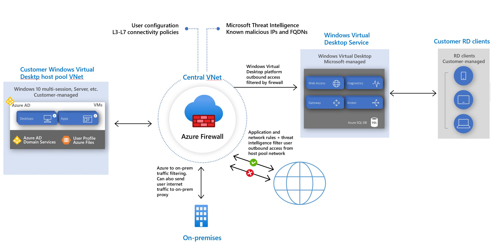

# Use Azure Firewall to protect Window Virtual Desktop deployments

Windows Virtual Desktop is a desktop and app virtualization service that runs on Azure. When an end user connects to a Windows Virtual Desktop environment, their session is run by a host pool. A host pool is a collection of Azure virtual machines that register to Windows Virtual Desktop as session hosts. These virtual machines run in your virtual network and are subject to the virtual network security controls. They need outbound Internet access to the Windows Virtual Desktop service to operate properly and might also need outbound Internet access for end users. Azure Firewall can help you lock down your environment and filter outbound traffic.

[  ](media/protect-windows-virtual-desktop/windows-virtual-desktop-architecture-diagram.png#lightbox)

Follow the guidelines in this article to provide additional protection for your Windows Virtual Desktop host pool using Azure Firewall.

## Prerequisites


 - A deployed Windows Virtual Desktop environment and host pool.

   For more information, see [Tutorial: Create a host pool by using the Azure Marketplace](../virtual-desktop/create-host-pools-azure-marketplace.md) and [Create a host pool with an Azure Resource Manager template](../virtual-desktop/virtual-desktop-fall-2019/create-host-pools-arm-template.md).

To learn more about Windows Virtual Desktop environments see [Windows Virtual Desktop environment](../virtual-desktop/environment-setup.md).

## Host pool outbound access to Windows Virtual Desktop

The Azure virtual machines you create for Windows Virtual Desktop must have access to several Fully Qualified Domain Names (FQDNs) to function properly. Azure Firewall provides a Windows Virtual Desktop FQDN Tag to simplify this configuration. Use the following steps to allow outbound Windows Virtual Desktop platform traffic:

- Deploy Azure Firewall and configure your Windows Virtual Desktop host pool subnet User Defined Route (UDR) to route all traffic via the Azure Firewall. Your default route now points to the firewall.
- Create an application rule collection and add a rule to enable the *WindowsVirtualDesktop* FQDN tag. The source IP address range is the host pool virtual network, the protocol is **https**, and the destination is **WindowsVirtualDesktop**.

- The set of required storage and service bus accounts for your Windows Virtual Desktop host pool is deployment specific, so it isn't yet captured in the WindowsVirtualDesktop FQDN tag. You can address this in one of the following ways:

   - Allow https access from your host pool subnet to *xt.blob.core.windows.net, *eh.servicebus.windows.net and *xt.table.core.windows.net. These wildcard FQDNs enable the required access, but are less restrictive.
   - Use the following log analytics query to list the exact required FQDNs, and then allow them explicitly in your firewall application rules:
   ```
   AzureDiagnostics
   | where Category == "AzureFirewallApplicationRule"
   | search "Deny"
   | search "gsm*eh.servicebus.windows.net" or "gsm*xt.blob.core.windows.net" or "gsm*xt.table.core.windows.net"
   | parse msg_s with Protocol " request from " SourceIP ":" SourcePort:int " to " FQDN ":" *
   | project TimeGenerated,Protocol,FQDN
   ```

- Create a network rule collection add the following rules:

   - Allow DNS – allow traffic from your ADDS private IP address to * for TCP and UDP ports 53.
   - Allow KMS – allow traffic from your Windows Virtual Desktop virtual machines to Windows Activation Service TCP port 1688. For more information about the destination IP addresses, see [Windows activation fails in forced tunneling scenario](../virtual-machines/troubleshooting/custom-routes-enable-kms-activation.md#solution).

> [!NOTE]
> Some deployments may not need DNS rules, for example Azure Active Directory Domain controllers forward DNS queries to Azure DNS at 168.63.129.16.

## Host pool outbound access to the Internet

Depending on your organization needs, you may want to enable secure outbound Internet access for your end users. In cases where the list of allowed destinations is well-defined (for example [Office 365 access](https://docs.microsoft.com/Office365/Enterprise/office-365-ip-web-service)) you can use Azure Firewall application and network rules to configure the required access. This routes end-user traffic directly to the Internet for best performance.

If you want to filter outbound user Internet traffic using an existing on-premises secure web gateway, you can configure web browsers or other applications running on the Windows Virtual Desktop host pool with an explicit proxy configuration. For example, see [How to use Microsoft Edge command-line options to configure proxy settings](https://docs.microsoft.com/deployedge/edge-learnmore-cmdline-options-proxy-settings). These proxy settings only influence your end-user Internet access, allowing the Windows Virtual Desktop platform outbound traffic directly via Azure Firewall.

## Additional considerations

You may need to configure additional firewall rules, depending on your requirements:

- NTP server access

   By default, virtual machines running Windows connect to time.windows.com over UDP port 123 for time synchronization. Create a network rule to allow this access, or for a time server that you use in your environment.


## Next steps

- Learn more about Windows Virtual Desktop: [What is Windows Virtual Desktop?](../virtual-desktop/overview.md)