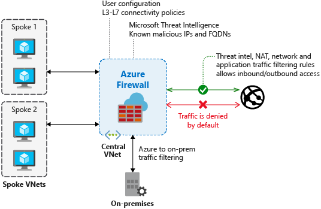
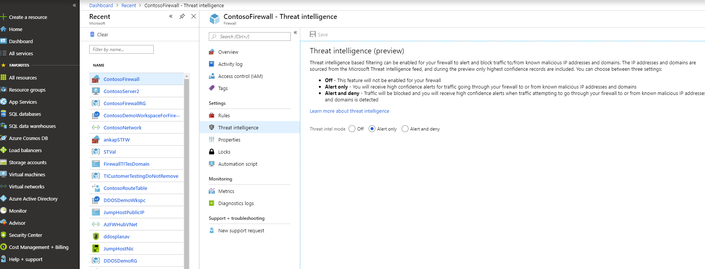

# Azure Firewall threat intelligence-based filtering - Public Preview

Threat intelligence-based filtering can be enabled for your firewall to alert and deny traffic from/to known malicious IP addresses and domains. The IP addresses and domains are sourced from the Microsoft Threat Intelligence feed. [Intelligent Security Graph](https://www.microsoft.com/en-us/security/operations/intelligence) powers Microsoft threat intelligence and is used by multiple services including Azure Security Center.



> [!IMPORTANT]
> Threat intelligence based filtering is currently in public preview and is provided with a preview service level agreement. Certain features may not be supported or may have constrained capabilities.  See the [Supplemental Terms of Use for Microsoft Azure Previews](https://azure.microsoft.com/support/legal/preview-supplemental-terms/) for details.

If threat intelligence-based filtering is enabled, the associated rules are processed before any of the NAT rules, network rules, or application rules. During the preview, only highest confidence records are included.

You can choose to just log an alert when a rule is triggered, or you can choose alert and deny mode.

By default, threat intelligence-based filtering is enabled in alert mode. You can’t turn off this feature or change the mode until the portal interface becomes available in your region.



## Logs

The following log excerpt shows a triggered rule:

```
{
    "category": "AzureFirewallNetworkRule",
    "time": "2018-04-16T23:45:04.8295030Z",
    "resourceId": "/SUBSCRIPTIONS/{subscriptionId}/RESOURCEGROUPS/{resourceGroupName}/PROVIDERS/MICROSOFT.NETWORK/AZUREFIREWALLS/{resourceName}",
    "operationName": "AzureFirewallThreatIntelLog",
    "properties": {
         "msg": "HTTP request from 10.0.0.5:54074 to somemaliciousdomain.com:80. Action: Alert. ThreatIntel: Bot Networks"
    }
}
```

## Testing

- **Outbound testing** - Outbound traffic alerts should be a rare occurrence, as it means that your environment has been compromised. To help test outbound alerts are working, a test FQDN has been created that triggers an alert. Use **testmaliciousdomain.eastus.cloudapp.azure.com** for your outbound tests.

- **Inbound testing** - You can expect to see alerts on incoming traffic if DNAT rules are configured on the firewall. This is true even if only specific sources are allowed on the DNAT rule and traffic is otherwise denied. Azure Firewall does not alert on all known port scanners; only on scanners that are known to also engage in malicious activity.

## Next steps

- See [Azure Firewall Log Analytics samples](log-analytics-samples.md)
- Learn how to [deploy and configure an Azure Firewall](tutorial-firewall-deploy-portal.md)
- Review the [Microsoft Security intelligence report](https://www.microsoft.com/en-us/security/operations/security-intelligence-report)