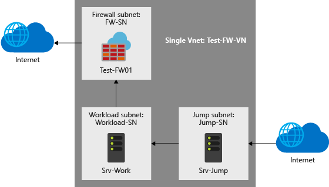

# Tutorial: Deploy and configure Azure Firewall using the Azure portal

Controlling outbound network access is an important part of an overall network security plan. For example, you may want to limit access to web sites. Or, you may want to limit the outbound IP addresses and ports that can be accessed.

One way you can control outbound network access from an Azure subnet is with Azure Firewall. With Azure Firewall, you can configure:

* Application rules that define fully qualified domain names (FQDNs) that can be accessed from a subnet.
* Network rules that define source address, protocol, destination port, and destination address.

Network traffic is subjected to the configured firewall rules when you route your network traffic to the firewall as the subnet default gateway.

For this tutorial, you create a simplified single VNet with three subnets for easy deployment.

For production deployments, a [hub and spoke model](https://docs.microsoft.com/azure/architecture/reference-architectures/hybrid-networking/hub-spoke) is recommended, where the firewall is in its own VNet. The workload servers are in peered VNets in the same region with one or more subnets.

* **AzureFirewallSubnet** - the firewall is in this subnet.
* **Workload-SN** - the workload server is in this subnet. This subnet's network traffic goes through the firewall.
* **Jump-SN** - The "jump" server is in this subnet. The jump server has a public IP address that you can connect to using Remote Desktop. From there, you can then connect to (using another Remote Desktop) the workload server.

In this tutorial, you learn how to:

> [!div class="checklist"]
> * Set up a test network environment
> * Deploy a firewall
> * Create a default route
> * Configure an application rule to allow access to www.google.com
> * Configure a network rule to allow access to external DNS servers
> * Test the firewall

If you prefer, you can complete this tutorial using [Azure PowerShell](deploy-ps.md).

If you don't have an Azure subscription, create a [free account](https://azure.microsoft.com/free/?WT.mc_id=A261C142F) before you begin.

## Set up the network

First, create a resource group to contain the resources needed to deploy the firewall. Then create a VNet, subnets, and test servers.

### Create a resource group

The resource group contains all the resources for the tutorial.

1. Sign in to the Azure portal at [https://portal.azure.com](https://portal.azure.com).
2. On the Azure portal menu, select **Resource groups** or search for and select *Resource groups* from any page. Then select **Add**.
3. For **Resource group name**, enter *Test-FW-RG*.
4. For **Subscription**, select your subscription.
5. For **Resource group location**, select a location. All other resources that you create must be in the same location.
6. Select **Create**.

### Create a VNet

This VNet will contain three subnets.

> [!NOTE]
> The size of the AzureFirewallSubnet subnet is /26. For more information about the subnet size, see [Azure Firewall FAQ](firewall-faq.md#why-does-azure-firewall-need-a-26-subnet-size).

1. On the Azure portal menu or from the **Home** page, select **Create a resource**.
1. Select **Networking** > **Virtual network**.
1. For **Name**, type **Test-FW-VN**.
1. For **Address space**, type **10.0.0.0/16**.
1. For **Subscription**, select your subscription.
1. For **Resource group**, select **Test-FW-RG**.
1. For **Location**, select the same location that you used previously.
1. Under **Subnet**, for **Name** type **AzureFirewallSubnet**. The firewall will be in this subnet, and the subnet name **must** be AzureFirewallSubnet.
1. For **Address range**, type **10.0.1.0/26**.
1. Accept the other default settings, and then select **Create**.

### Create additional subnets

Next, create subnets for the jump server, and a subnet for the workload servers.

1. On the Azure portal menu, select **Resource groups** or search for and select *Resource groups* from any page. Then select **Test-FW-RG**.
2. Select the **Test-FW-VN** virtual network.
3. Select **Subnets** > **+Subnet**.
4. For **Name**, type **Workload-SN**.
5. For **Address range**, type **10.0.2.0/24**.
6. Select **OK**.

Create another subnet named **Jump-SN**, address range **10.0.3.0/24**.

### Create virtual machines

Now create the jump and workload virtual machines, and place them in the appropriate subnets.

1. On the Azure portal menu or from the **Home** page, select **Create a resource**.
2. Select **Compute** and then select **Windows Server 2016 Datacenter** in the Featured list.
3. Enter these values for the virtual machine:

   |Setting  |Value  |
   |---------|---------|
   |Resource group     |**Test-FW-RG**|
   |Virtual machine name     |**Srv-Jump**|
   |Region     |Same as previous|
   |Administrator user name     |**azureuser**|
   |Password     |**Azure123456!**|

4. Under **Inbound port rules**, for **Public inbound ports**, select **Allow selected ports**.
5. For **Select inbound ports**, select **RDP (3389)**.

6. Accept the other defaults and select **Next: Disks**.
7. Accept the disk defaults and select **Next: Networking**.
8. Make sure that **Test-FW-VN** is selected for the virtual network and the subnet is **Jump-SN**.
9. For **Public IP**, accept the default new public ip address name (Srv-Jump-ip).
11. Accept the other defaults and select **Next: Management**.
12. Select **Off** to disable boot diagnostics. Accept the other defaults and select **Review + create**.
13. Review the settings on the summary page, and then select **Create**.

Use the information in the following table to configure another virtual machine named **Srv-Work**. The rest of the configuration is the same as the Srv-Jump virtual machine.

|Setting  |Value  |
|---------|---------|
|Subnet|**Workload-SN**|
|Public IP|**None**|
|Public inbound ports|**None**|

## Deploy the firewall

Deploy the firewall into the VNet.

1. On the Azure portal menu or from the **Home** page, select **Create a resource**.
2. Type **firewall** in the search box and press **Enter**.
3. Select **Firewall** and then select **Create**.
4. On the **Create a Firewall** page, use the following table to configure the firewall:

   |Setting  |Value  |
   |---------|---------|
   |Subscription     |\<your subscription\>|
   |Resource group     |**Test-FW-RG** |
   |Name     |**Test-FW01**|
   |Location     |Select the same location that you used previously|
   |Choose a virtual network     |**Use existing**: **Test-FW-VN**|
   |Public IP address     |**Add new**. The Public IP address must be the Standard SKU type.|

5. Select **Review + create**.
6. Review the summary, and then select **Create** to create the firewall.

   This will take a few minutes to deploy.
7. After deployment completes, go to the **Test-FW-RG** resource group, and select the **Test-FW01** firewall.
8. Note the private IP address. You'll use it later when you create the default route.

## Create a default route

For the **Workload-SN** subnet, configure the outbound default route to go through the firewall.

1. On the Azure portal menu, select **All services** or search for and select *All services* from any page.
2. Under **Networking**, select **Route tables**.
3. Select **Add**.
4. For **Name**, type **Firewall-route**.
5. For **Subscription**, select your subscription.
6. For **Resource group**, select **Test-FW-RG**.
7. For **Location**, select the same location that you used previously.
8. Select **Create**.
9. Select **Refresh**, and then select the **Firewall-route** route table.
10. Select **Subnets** and then select **Associate**.
11. Select **Virtual network** > **Test-FW-VN**.
12. For **Subnet**, select **Workload-SN**. Make sure that you select only the **Workload-SN** subnet for this route, otherwise your firewall won't work correctly.

13. Select **OK**.
14. Select **Routes** and then select **Add**.
15. For **Route name**, type **fw-dg**.
16. For **Address prefix**, type **0.0.0.0/0**.
17. For **Next hop type**, select **Virtual appliance**.

    Azure Firewall is actually a managed service, but virtual appliance works in this situation.
18. For **Next hop address**, type the private IP address for the firewall that you noted previously.
19. Select **OK**.

## Configure an application rule

This is the application rule that allows outbound access to www.google.com.

1. Open the **Test-FW-RG**, and select the **Test-FW01** firewall.
2. On the **Test-FW01** page, under **Settings**, select **Rules**.
3. Select the **Application rule collection** tab.
4. Select **Add application rule collection**.
5. For **Name**, type **App-Coll01**.
6. For **Priority**, type **200**.
7. For **Action**, select **Allow**.
8. Under **Rules**, **Target FQDNs**, for **Name**, type **Allow-Google**.
9. For **Source type**, select **IP address**.
10. For **Source**, type **10.0.2.0/24**.
11. For **Protocol:port**, type **http, https**.
12. For **Target FQDNS**, type **www.google.com**
13. Select **Add**.

Azure Firewall includes a built-in rule collection for infrastructure FQDNs that are allowed by default. These FQDNs are specific for the platform and can't be used for other purposes. For more information, see [Infrastructure FQDNs](infrastructure-fqdns.md).

## Configure a network rule

This is the network rule that allows outbound access to two IP addresses at port 53 (DNS).

1. Select the **Network rule collection** tab.
2. Select **Add network rule collection**.
3. For **Name**, type **Net-Coll01**.
4. For **Priority**, type **200**.
5. For **Action**, select **Allow**.
6. Under **Rules**, **IP addresses**, for **Name**, type **Allow-DNS**.
7. For **Protocol**, select **UDP**.
9. For **Source type**, select **IP address**.
1. For **Source**, type **10.0.2.0/24**.
2. For **Destination address**, type **209.244.0.3,209.244.0.4**

   These are public DNS servers operated by CenturyLink.
1. For **Destination Ports**, type **53**.
2. Select **Add**.

### Change the primary and secondary DNS address for the **Srv-Work** network interface

For testing purposes in this tutorial, configure the server's primary and secondary DNS addresses. This isn't a general Azure Firewall requirement.

1. On the Azure portal menu, select **Resource groups** or search for and select *Resource groups* from any page. Select the **Test-FW-RG** resource group.
2. Select the network interface for the **Srv-Work** virtual machine.
3. Under **Settings**, select **DNS servers**.
4. Under **DNS servers**, select **Custom**.
5. Type **209.244.0.3** in the **Add DNS server** text box, and **209.244.0.4** in the next text box.
6. Select **Save**.
7. Restart the **Srv-Work** virtual machine.

## Test the firewall

Now, test the firewall to confirm that it works as expected.

1. From the Azure portal, review the network settings for the **Srv-Work** virtual machine and note the private IP address.
2. Connect a remote desktop to **Srv-Jump** virtual machine, and sign in. From there, open a remote desktop connection to the **Srv-Work** private IP address.
3. Open Internet Explorer and browse to https://www.google.com.
4. Select **OK** > **Close** on the Internet Explorer security alerts.

   You should see the Google home page.

5. Browse to https://www.microsoft.com.

   You should be blocked by the firewall.

So now you've verified that the firewall rules are working:

* You can browse to the one allowed FQDN, but not to any others.
* You can resolve DNS names using the configured external DNS server.

## Clean up resources

You can keep your firewall resources for the next tutorial, or if no longer needed, delete the **Test-FW-RG** resource group to delete all firewall-related resources.

## Next steps

> [!div class="nextstepaction"]
> [Tutorial: Monitor Azure Firewall logs](./tutorial-diagnostics.md)
