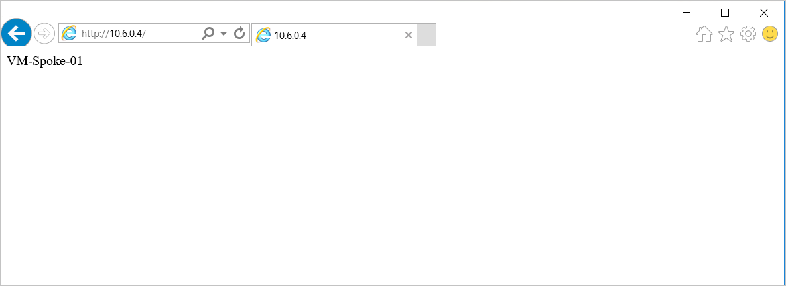

# Tutorial: Deploy and configure Azure Firewall in a hybrid network using the Azure portal

When you connect your on-premises network to an Azure virtual network to create a hybrid network, the ability to control access to your Azure network resources is an important part of an overall security plan.

You can use Azure Firewall to control network access in a hybrid network using rules that define allowed and denied network traffic.

For this tutorial, you create three virtual networks:

- **VNet-Hub** - the firewall is in this virtual network.
- **VNet-Spoke** - the spoke virtual network represents the workload located on Azure.
- **VNet-Onprem** - The on-premises virtual network represents an on-premises network. In an actual deployment, it can be connected by either a VPN or ExpressRoute connection. For simplicity, this tutorial uses a VPN gateway connection, and an Azure-located virtual network is used to represent an on-premises network.


In this tutorial, you learn how to:

> [!div class="checklist"]
> * Declare the variables
> * Create the firewall hub virtual network
> * Create the spoke virtual network
> * Create the on-premises virtual network
> * Configure and deploy the firewall
> * Create and connect the VPN gateways
> * Peer the hub and spoke virtual networks
> * Create the routes
> * Create the virtual machines
> * Test the firewall

If you want to use Azure PowerShell instead to complete this procedure, see [Deploy and configure Azure Firewall in a hybrid network using Azure PowerShell](tutorial-hybrid-ps.md).

## Prerequisites

A hybrid network uses the hub-and-spoke architecture model to route traffic between Azure VNets and on-premise networks. The hub-and-spoke architecture has the following requirements:

- Set **AllowGatewayTransit** when peering VNet-Hub to VNet-Spoke. In a hub-and-spoke network architecture, a gateway transit allows the spoke virtual networks to share the VPN gateway in the hub, instead of deploying VPN gateways in every spoke virtual network. 

   Additionally, routes to the gateway-connected virtual networks or on-premises networks will automatically propagate to the routing tables for the peered virtual networks using the gateway transit. For more information, see [Configure VPN gateway transit for virtual network peering](../vpn-gateway/vpn-gateway-peering-gateway-transit.md).

- Set **UseRemoteGateways** when you peer VNet-Spoke to VNet-Hub. If **UseRemoteGateways** is set and **AllowGatewayTransit** on remote peering is also set, the spoke virtual network uses gateways of the remote virtual network for transit.
- To route the spoke subnet traffic through the hub firewall, you can use a User Defined route (UDR) that points to the firewall with the **Virtual network gateway route propagation** option disabled. The **Virtual network gateway route propagation** disabled option prevents route distribution to the spoke subnets. This prevents learned routes from conflicting with your UDR. If you want to keep **Virtual network gateway route propagation** enabled, make sure to define specific routes to the firewall to override those that are published from on-premises over BGP.
- Configure a UDR on the hub gateway subnet that points to the firewall IP address as the next hop to the spoke networks. No UDR is required on the Azure Firewall subnet, as it learns routes from BGP.

See the [Create Routes](#create-the-routes) section in this tutorial to see how these routes are created.

>[!NOTE]
>Azure Firewall must have direct Internet connectivity. If your AzureFirewallSubnet learns a default route to your on-premises network via BGP, you must override this with a 0.0.0.0/0 UDR with the **NextHopType** value set as **Internet** to maintain direct Internet connectivity.
>
>Azure Firewall can be configured to support forced tunneling. For more information, see [Azure Firewall forced tunneling](forced-tunneling.md).

>[!NOTE]
>Traffic between directly peered VNets is routed directly even if a UDR points to Azure Firewall as the default gateway. To send subnet to subnet traffic to the firewall in this scenario, a UDR must contain the target subnet network prefix explicitly on both subnets.

If you don't have an Azure subscription, create a [free account](https://azure.microsoft.com/free/?WT.mc_id=A261C142F) before you begin.

## Create the firewall hub virtual network

First, create the resource group to contain the resources for this tutorial:

1. Sign in to the Azure portal at [https://portal.azure.com](https://portal.azure.com).
2. On the Azure portal home page, select **Resource groups** > **Add**.
3. For **Resource group name**, type **FW-Hybrid-Test**.
4. For **Subscription**, select your subscription.
5. For **Region**, select **East US**. All resources that you create later must be in the same location.
6. Select **Review + Create**.
7. Select **Create**.

Now, create the VNet:

> [!NOTE]
> The size of the AzureFirewallSubnet subnet is /26. For more information about the subnet size, see [Azure Firewall FAQ](firewall-faq.md#why-does-azure-firewall-need-a-26-subnet-size).

1. From the Azure portal home page, select **Create a resource**.
2. Under **Networking**, select **Virtual network**.
4. For **Name**, type **VNet-hub**.
5. For **Address space**, type **10.5.0.0/16**.
6. For **Subscription**, select your subscription.
7. For **Resource group**, select **FW-Hybrid-Test**.
8. For **Location**, select **East US**.
9. Under **Subnet**, for **Name** type **AzureFirewallSubnet**. The firewall will be in this subnet, and the subnet name **must** be AzureFirewallSubnet.
10. For **Address range**, type **10.5.0.0/26**. 
11. Accept the other default settings, and then select **Create**.

## Create the spoke virtual network

1. From the Azure portal home page, select **Create a resource**.
2. Under **Networking**, select **Virtual network**.
4. For **Name**, type **VNet-Spoke**.
5. For **Address space**, type **10.6.0.0/16**.
6. For **Subscription**, select your subscription.
7. For **Resource group**, select **FW-Hybrid-Test**.
8. For **Location**, select the same location that you used previously.
9. Under **Subnet**, for **Name** type **SN-Workload**.
10. For **Address range**, type **10.6.0.0/24**.
11. Accept the other default settings, and then select **Create**.

## Create the on-premises virtual network

1. From the Azure portal home page, select **Create a resource**.
2. Under **Networking**, select **Virtual network**.
4. For **Name**, type **VNet-OnPrem**.
5. For **Address space**, type **192.168.0.0/16**.
6. For **Subscription**, select your subscription.
7. For **Resource group**, select **FW-Hybrid-Test**.
8. For **Location**, select the same location that you used previously.
9. Under **Subnet**, for **Name** type **SN-Corp**.
10. For **Address range**, type **192.168.1.0/24**.
11. Accept the other default settings, and then select **Create**.

Now create a second subnet for the gateway.

1. On the **VNet-Onprem** page, select **Subnets**.
2. Select **+Subnet**.
3. For **Name**, type **GatewaySubnet**.
4. For **Address range (CIDR block)** type **192.168.2.0/24**.
5. Select **OK**.

## Configure and deploy the firewall

Now deploy the firewall into the firewall hub virtual network.

1. From the Azure portal home page, select **Create a resource**.
2. In the left column, select **Networking**, and then select **Firewall**.
4. On the **Create a Firewall** page, use the following table to configure the firewall:

   |Setting  |Value  |
   |---------|---------|
   |Subscription     |\<your subscription\>|
   |Resource group     |**FW-Hybrid-Test** |
   |Name     |**AzFW01**|
   |Location     |Select the same location that you used previously|
   |Choose a virtual network     |**Use existing**:<br> **VNet-hub**|
   |Public IP address     |Create new: <br>**Name** - **fw-pip**. |

5. Select **Review + create**.
6. Review the summary, and then select **Create** to create the firewall.

   This takes a few minutes to deploy.
7. After deployment completes, go to the **FW-Hybrid-Test** resource group, and select the **AzFW01** firewall.
8. Note the private IP address. You'll use it later when you create the default route.

### Configure network rules

First, add a network rule to allow web traffic.

1. On the **AzFW01** page, Select **Rules**.
2. Select the **Network rule collection** tab.
3. Select **Add network rule collection**.
4. For **Name**, type **RCNet01**.
5. For **Priority**, type **100**.
6. For **Action**, select **Allow**.
6. Under **Rules**, for **Name**, type **AllowWeb**.
7. For **Protocol**, select **TCP**.
8. For **Source type**, select **IP address**.
9. For **Source**, type **192.168.1.0/24**.
10. For **Destination address**, type **10.6.0.0/16**
11. For **Destination Ports**, type **80**.

Now add a rule to allow RDP traffic.

On the second rule row, type the following information:

1. **Name**, type **AllowRDP**.
2. For **Protocol**, select **TCP**.
3. For **Source type**, select **IP address**.
4. For **Source**, type **192.168.1.0/24**.
5. For **Destination address**, type **10.6.0.0/16**
6. For **Destination Ports**, type **3389**.
7. Select **Add**.

## Create and connect the VPN gateways

The hub and on-premises virtual networks are connected via VPN gateways.

### Create a VPN gateway for the hub virtual network

Now create the VPN gateway for the hub virtual network. Network-to-network configurations require a RouteBased VpnType. Creating a VPN gateway can often take 45 minutes or more, depending on the selected VPN gateway SKU.

1. From the Azure portal home page, select **Create a resource**.
2. In the search text box, type **virtual network gateway** and press **Enter**.
3. Select **Virtual network gateway**, and select **Create**.
4. For **Name**, type **GW-hub**.
5. For **Region**, select the same region that you used previously.
6. For **Gateway type**, select **VPN**.
7. For **VPN type**, select **Route-based**.
8. For **SKU**, select **Basic**.
9. For **Virtual network**, select **VNet-hub**.
10. For **Public IP address**, select **Create new**, and type **VNet-hub-GW-pip** for the name.
11. Accept the remaining defaults and then select **Review + create**.
12. Review the configuration, then select **Create**.

### Create a VPN gateway for the on-premises virtual network

Now create the VPN gateway for the on-premises virtual network. Network-to-network configurations require a RouteBased VpnType. Creating a VPN gateway can often take 45 minutes or more, depending on the selected VPN gateway SKU.

1. From the Azure portal home page, select **Create a resource**.
2. In the search text box, type **virtual network gateway** and press **Enter**.
3. Select **Virtual network gateway**, and select **Create**.
4. For **Name**, type **GW-Onprem**.
5. For **Region**, select the same region that you used previously.
6. For **Gateway type**, select **VPN**.
7. For **VPN type**, select **Route-based**.
8. For **SKU**, select **Basic**.
9. For **Virtual network**, select **VNet-Onprem**.
10. For **Public IP address**, select **Create new**, and type **VNet-Onprem-GW-pip** for the name.
11. Accept the remaining defaults and then select **Review + create**.
12. Review the configuration, then select **Create**.

### Create the VPN connections

Now you can create the VPN connections between the hub and on-premises gateways.

In this step, you create the connection from the hub virtual network to the on-premises virtual network. You'll see a shared key referenced in the examples. You can use your own values for the shared key. The important thing is that the shared key must match for both connections. Creating a connection can take a short while to complete.

1. Open the **FW-Hybrid-Test** resource group and select the **GW-hub** gateway.
2. Select **Connections** in the left column.
3. Select **Add**.
4. The the connection name, type **Hub-to-Onprem**.
5. Select **VNet-to-VNet** for **Connection type**.
6. For the **Second virtual network gateway**, select **GW-Onprem**.
7. For **Shared key (PSK)**, type **AzureA1b2C3**.
8. Select **OK**.

Create the on-premises to hub virtual network connection. This step is similar to the previous one, except you create the connection from VNet-Onprem to VNet-hub. Make sure the shared keys match. The connection will be established after a few minutes.

1. Open the **FW-Hybrid-Test** resource group and select the **GW-Onprem** gateway.
2. Select **Connections** in the left column.
3. Select **Add**.
4. The the connection name, type **Onprem-to-Hub**.
5. Select **VNet-to-VNet** for **Connection type**.
6. For the **Second virtual network gateway**, select **GW-hub**.
7. For **Shared key (PSK)**, type **AzureA1b2C3**.
8. Select **OK**.


#### Verify the connection

After about five minutes or so, the status of both connections should be **Connected**.


## Peer the hub and spoke virtual networks

Now peer the hub and spoke virtual networks.

1. Open the **FW-Hybrid-Test** resource group and select the **VNet-hub** virtual network.
2. In the left column, select **Peerings**.
3. Select **Add**.
4. For **Name**, type **HubtoSpoke**.
5. For the **Virtual network**, select **VNet-spoke**
6. For the name of the peering from VNetSpoke to VNet-hub, type **SpoketoHub**.
7. Select **Allow gateway transit**.
8. Select **OK**.

### Configure additional settings for the SpoketoHub peering

You'll need to enable the **Allow forwarded traffic** on the SpoketoHub peering.

1. Open the **FW-Hybrid-Test** resource group and select the **VNet-Spoke** virtual network.
2. In the left column, select **Peerings**.
3. Select the **SpoketoHub** peering.
4. Under **Allow forwarded traffic from VNet-hub to VNet-Spoke**, select **Enabled**.
5. Select **Save**.

## Create the routes

Next, create a couple routes:

- A route from the hub gateway subnet to the spoke subnet through the firewall IP address
- A default route from the spoke subnet through the firewall IP address

1. From the Azure portal home page, select **Create a resource**.
2. In the search text box, type **route table** and press **Enter**.
3. Select **Route table**.
4. Select **Create**.
5. For the name, type **UDR-Hub-Spoke**.
6. Select the **FW-Hybrid-Test** for the resource group.
8. For **Location**, select the same location that you used previously.
9. Select **Create**.
10. After the route table is created, select it to open the route table page.
11. Select **Routes** in the left column.
12. Select **Add**.
13. For the route name, type **ToSpoke**.
14. For the address prefix, type **10.6.0.0/16**.
15. For next hop type, select **Virtual appliance**.
16. For next hop address, type the firewall's private IP address that you noted earlier.
17. Select **OK**.

Now associate the route to the subnet.

1. On the **UDR-Hub-Spoke - Routes** page, select **Subnets**.
2. Select **Associate**.
3. Select **Choose a virtual network**.
4. Select **VNet-hub**.
5. Select **GatewaySubnet**.
6. Select **OK**.

Now create the default route from the spoke subnet.

1. From the Azure portal home page, select **Create a resource**.
2. In the search text box, type **route table** and press **Enter**.
3. Select **Route table**.
5. Select **Create**.
6. For the name, type **UDR-DG**.
7. Select the **FW-Hybrid-Test** for the resource group.
8. For **Location**, select the same location that you used previously.
4. For **Virtual network gateway route propagation**, select **Disabled**.
1. Select **Create**.
2. After the route table is created, select it to open the route table page.
3. Select **Routes** in the left column.
4. Select **Add**.
5. For the route name, type **ToHub**.
6. For the address prefix, type **0.0.0.0/0**.
7. For next hop type, select **Virtual appliance**.
8. For next hop address, type the firewall's private IP address that you noted earlier.
9. Select **OK**.

Now associate the route to the subnet.

1. On the **UDR-DG - Routes** page, select **Subnets**.
2. Select **Associate**.
3. Select **Choose a virtual network**.
4. Select **VNet-spoke**.
5. Select **SN-Workload**.
6. Select **OK**.

## Create virtual machines

Now create the spoke workload and on-premises virtual machines, and place them in the appropriate subnets.

### Create the workload virtual machine

Create a virtual machine in the spoke virtual network, running IIS, with no public IP address.

1. From the Azure portal home page, select **Create a resource**.
2. Under **Popular**, select **Windows Server 2016 Datacenter**.
3. Enter these values for the virtual machine:
    - **Resource group** - Select **FW-Hybrid-Test**.
    - **Virtual machine name**: *VM-Spoke-01*.
    - **Region** - Same region that you're used previously.
    - **User name**: *azureuser*.
    - **Password**: *Azure123456!*
4. Select **Next:Disks**.
5. Accept the defaults and select **Next: Networking**.
6. Select **VNet-Spoke** for the virtual network and the subnet is **SN-Workload**.
7. For **Public IP**, select **None**.
8. For **Public inbound ports**, select **Allow selected ports**, and then select **HTTP (80)**, and **RDP (3389)**
9. Select **Next:Management**.
10. For **Boot diagnostics**, Select **Off**.
11. Select **Review+Create**, review the settings on the summary page, and then select **Create**.

### Install IIS

1. From the Azure portal, open the Cloud Shell and make sure that it's set to **PowerShell**.
2. Run the following command to install IIS on the virtual machine and change the location if necessary:

   ```azurepowershell-interactive
   Set-AzVMExtension `
           -ResourceGroupName FW-Hybrid-Test `
           -ExtensionName IIS `
           -VMName VM-Spoke-01 `
           -Publisher Microsoft.Compute `
           -ExtensionType CustomScriptExtension `
           -TypeHandlerVersion 1.4 `
           -SettingString '{"commandToExecute":"powershell Add-WindowsFeature Web-Server; powershell      Add-Content -Path \"C:\\inetpub\\wwwroot\\Default.htm\" -Value $($env:computername)"}' `
           -Location EastUS
   ```

### Create the on-premises virtual machine

This is a virtual machine that you use to connect using Remote Desktop to the public IP address. From there, you then connect to the on-premises server through the firewall.

1. From the Azure portal home page, select **Create a resource**.
2. Under **Popular**, select **Windows Server 2016 Datacenter**.
3. Enter these values for the virtual machine:
    - **Resource group** - Select existing, and then select **FW-Hybrid-Test**.
    - **Virtual machine name** - *VM-Onprem*.
    - **Region** - Same region that you're used previously.
    - **User name**: *azureuser*.
    - **Password**: *Azure123456!*.
4. Select **Next:Disks**.
5. Accept the defaults and select **Next:Networking**.
6. Select **VNet-Onprem** for virtual network and the subnet is **SN-Corp**.
7. For **Public inbound ports**, select **Allow selected ports**, and then select **RDP (3389)**
8. Select **Next:Management**.
9. For **Boot diagnostics**, Select **Off**.
10. Select **Review+Create**, review the settings on the summary page, and then select **Create**.

## Test the firewall

1. First, note the private IP address for **VM-spoke-01** virtual machine.

2. From the Azure portal, connect to the **VM-Onprem** virtual machine.
<!---2. Open a Windows PowerShell command prompt on **VM-Onprem**, and ping the private IP for **VM-spoke-01**.

   You should get a reply.--->
3. Open a web browser on **VM-Onprem**, and browse to http://\<VM-spoke-01 private IP\>.

   You should see the **VM-spoke-01** web page:
   

4. From the **VM-Onprem** virtual machine, open a remote desktop to **VM-spoke-01** at the private IP address.

   Your connection should succeed, and you should be able to sign in.

So now you've verified that the firewall rules are working:

<!---- You can ping the server on the spoke VNet.--->
- You can browse web server on the spoke virtual network.
- You can connect to the server on the spoke virtual network using RDP.

Next, change the firewall network rule collection action to **Deny** to verify that the firewall rules work as expected.

1. Select the **AzFW01** firewall.
2. Select **Rules**.
3. Select the **Network rule collection** tab and select the **RCNet01** rule collection.
4. For **Action**, select **Deny**.
5. Select **Save**.

Close any existing remote desktops before testing the changed rules. Now run the tests again. They should all fail this time.

## Clean up resources

You can keep your firewall resources for the next tutorial, or if no longer needed, delete the **FW-Hybrid-Test** resource group to delete all firewall-related resources.

## Next steps

Next, you can monitor the Azure Firewall logs.

> [!div class="nextstepaction"]
> [Tutorial: Monitor Azure Firewall logs](./tutorial-diagnostics.md)
