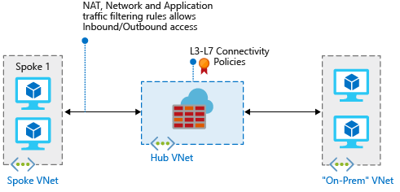

# Deploy and configure Azure Firewall in a hybrid network using Azure PowerShell

When you connect your on-premises network to an Azure virtual network to create a hybrid network, the ability to control access to your Azure network resources is an important part of an overall security plan.

You can use Azure Firewall to control network access in a hybrid network using rules that define allowed and denied network traffic.

For this article, you create three virtual networks:

- **VNet-Hub** - the firewall is in this virtual network.
- **VNet-Spoke** - the spoke virtual network represents the workload located on Azure.
- **VNet-Onprem** - The on-premises virtual network represents an on-premises network. In an actual deployment, it can be connected by either a VPN or ExpressRoute connection. For simplicity, this article uses a VPN gateway connection, and an Azure-located virtual network is used to represent an on-premises network.



In this article, you learn how to:

> [!div class="checklist"]
> * Declare the variables
> * Create the firewall hub virtual network
> * Create the spoke virtual network
> * Create the on-premises virtual network
> * Configure and deploy the firewall
> * Create and connect the VPN gateways
> * Peer the hub and spoke virtual networks
> * Create the routes
> * Create the virtual machines
> * Test the firewall

If you want to use Azure portal instead to complete this tutorial, see [Tutorial: Deploy and configure Azure Firewall in a hybrid network using the Azure portal](tutorial-hybrid-portal.md).

[!INCLUDE [updated-for-az](../../includes/updated-for-az.md)]

## Prerequisites

This article requires that you run PowerShell locally. You must have the Azure PowerShell module installed. Run `Get-Module -ListAvailable Az` to find the version. If you need to upgrade, see [Install Azure PowerShell module](https://docs.microsoft.com/powershell/azure/install-Az-ps). After you verify the PowerShell version, run `Login-AzAccount` to create a connection with Azure.

There are three key requirements for this scenario to work correctly:

- A User Defined Route (UDR) on the spoke subnet that points to the Azure Firewall IP address as the default gateway. Virtual network gateway route propagation must be **Disabled** on this route table.
- A UDR on the hub gateway subnet must point to the firewall IP address as the next hop to the spoke networks.

   No UDR is required on the Azure Firewall subnet, as it learns routes from BGP.
- Make sure to set **AllowGatewayTransit** when peering VNet-Hub to VNet-Spoke and **UseRemoteGateways** when peering VNet-Spoke to VNet-Hub.

See the [Create Routes](#create-the-routes) section in this article to see how these routes are created.

>[!NOTE]
>Azure Firewall must have direct Internet connectivity. If your AzureFirewallSubnet learns a default route to your on-premises network via BGP, you must override this with a 0.0.0.0/0 UDR with the **NextHopType** value set as **Internet** to maintain direct Internet connectivity.
>
>Azure Firewall can be configured to support forced tunneling. For more information, see [Azure Firewall forced tunneling](forced-tunneling.md).

>[!NOTE]
>Traffic between directly peered VNets is routed directly even if a UDR points to Azure Firewall as the default gateway. To send subnet to subnet traffic to the firewall in this scenario, a UDR must contain the target subnet network prefix explicitly on both subnets.

To review the related Azure PowerShell reference documentation, see [Azure PowerShell Reference](https://docs.microsoft.com/powershell/module/az.network/new-azfirewall).

If you don't have an Azure subscription, create a [free account](https://azure.microsoft.com/free/?WT.mc_id=A261C142F) before you begin.

## Declare the variables

The following example declares the variables using the values for this article. In some cases, you might need to replace some values with your own to work in your subscription. Modify the variables if needed, then copy and paste them into your PowerShell console.

```azurepowershell
$RG1 = "FW-Hybrid-Test"
$Location1 = "East US"

# Variables for the firewall hub VNet

$VNetnameHub = "VNet-hub"
$SNnameHub = "AzureFirewallSubnet"
$VNetHubPrefix = "10.5.0.0/16"
$SNHubPrefix = "10.5.0.0/24"
$SNGWHubPrefix = "10.5.1.0/24"
$GWHubName = "GW-hub"
$GWHubpipName = "VNet-hub-GW-pip"
$GWIPconfNameHub = "GW-ipconf-hub"
$ConnectionNameHub = "hub-to-Onprem"

# Variables for the spoke virtual network

$VnetNameSpoke = "VNet-Spoke"
$SNnameSpoke = "SN-Workload"
$VNetSpokePrefix = "10.6.0.0/16"
$SNSpokePrefix = "10.6.0.0/24"
$SNSpokeGWPrefix = "10.6.1.0/24"

# Variables for the on-premises virtual network

$VNetnameOnprem = "Vnet-Onprem"
$SNNameOnprem = "SN-Corp"
$VNetOnpremPrefix = "192.168.0.0/16"
$SNOnpremPrefix = "192.168.1.0/24"
$SNGWOnpremPrefix = "192.168.2.0/24"
$GWOnpremName = "GW-Onprem"
$GWIPconfNameOnprem = "GW-ipconf-Onprem"
$ConnectionNameOnprem = "Onprem-to-hub"
$GWOnprempipName = "VNet-Onprem-GW-pip"

$SNnameGW = "GatewaySubnet"
```


## Create the firewall hub virtual network

First, create the resource group to contain the resources for this article:

```azurepowershell
  New-AzResourceGroup -Name $RG1 -Location $Location1
  ```

Define the subnets to be included in the virtual network:

```azurepowershell
$FWsub = New-AzVirtualNetworkSubnetConfig -Name $SNnameHub -AddressPrefix $SNHubPrefix
$GWsub = New-AzVirtualNetworkSubnetConfig -Name $SNnameGW -AddressPrefix $SNGWHubPrefix
```

Now, create the firewall hub virtual network:

```azurepowershell
$VNetHub = New-AzVirtualNetwork -Name $VNetnameHub -ResourceGroupName $RG1 `
-Location $Location1 -AddressPrefix $VNetHubPrefix -Subnet $FWsub,$GWsub
```

Request a public IP address to be allocated to the VPN gateway you'll create for your virtual network. Notice that the *AllocationMethod* is **Dynamic**. You can't specify the IP address that you want to use. It's dynamically allocated to your VPN gateway.

  ```azurepowershell
  $gwpip1 = New-AzPublicIpAddress -Name $GWHubpipName -ResourceGroupName $RG1 `
  -Location $Location1 -AllocationMethod Dynamic
```

## Create the spoke virtual network

Define the subnets to be included in the spoke virtual network:

```azurepowershell
$Spokesub = New-AzVirtualNetworkSubnetConfig -Name $SNnameSpoke -AddressPrefix $SNSpokePrefix
$GWsubSpoke = New-AzVirtualNetworkSubnetConfig -Name $SNnameGW -AddressPrefix $SNSpokeGWPrefix
```

Create the spoke virtual network:

```azurepowershell
$VNetSpoke = New-AzVirtualNetwork -Name $VnetNameSpoke -ResourceGroupName $RG1 `
-Location $Location1 -AddressPrefix $VNetSpokePrefix -Subnet $Spokesub,$GWsubSpoke
```

## Create the on-premises virtual network

Define the subnets to be included in the virtual network:

```azurepowershell
$Onpremsub = New-AzVirtualNetworkSubnetConfig -Name $SNNameOnprem -AddressPrefix $SNOnpremPrefix
$GWOnpremsub = New-AzVirtualNetworkSubnetConfig -Name $SNnameGW -AddressPrefix $SNGWOnpremPrefix
```

Now, create the on-premises virtual network:

```azurepowershell
$VNetOnprem = New-AzVirtualNetwork -Name $VNetnameOnprem -ResourceGroupName $RG1 `
-Location $Location1 -AddressPrefix $VNetOnpremPrefix -Subnet $Onpremsub,$GWOnpremsub
```

Request a public IP address to be allocated to the gateway you'll create for the virtual network. Notice that the *AllocationMethod* is **Dynamic**. You can't specify the IP address that you want to use. It's dynamically allocated to your gateway.

  ```azurepowershell
  $gwOnprempip = New-AzPublicIpAddress -Name $GWOnprempipName -ResourceGroupName $RG1 `
  -Location $Location1 -AllocationMethod Dynamic
```

## Configure and deploy the firewall

Now deploy the firewall into the hub virtual network.

```azurepowershell
# Get a Public IP for the firewall
$FWpip = New-AzPublicIpAddress -Name "fw-pip" -ResourceGroupName $RG1 `
  -Location $Location1 -AllocationMethod Static -Sku Standard
# Create the firewall
$Azfw = New-AzFirewall -Name AzFW01 -ResourceGroupName $RG1 -Location $Location1 -VirtualNetworkName $VNetnameHub -PublicIpName fw-pip

#Save the firewall private IP address for future use

$AzfwPrivateIP = $Azfw.IpConfigurations.privateipaddress
$AzfwPrivateIP

```

### Configure network rules

<!--- $Rule3 = New-AzFirewallNetworkRule -Name "AllowPing" -Protocol ICMP -SourceAddress $SNOnpremPrefix `
   -DestinationAddress $VNetSpokePrefix -DestinationPort *--->

```azurepowershell
$Rule1 = New-AzFirewallNetworkRule -Name "AllowWeb" -Protocol TCP -SourceAddress $SNOnpremPrefix `
   -DestinationAddress $VNetSpokePrefix -DestinationPort 80

$Rule2 = New-AzFirewallNetworkRule -Name "AllowRDP" -Protocol TCP -SourceAddress $SNOnpremPrefix `
   -DestinationAddress $VNetSpokePrefix -DestinationPort 3389

$NetRuleCollection = New-AzFirewallNetworkRuleCollection -Name RCNet01 -Priority 100 `
   -Rule $Rule1,$Rule2 -ActionType "Allow"
$Azfw.NetworkRuleCollections = $NetRuleCollection
Set-AzFirewall -AzureFirewall $Azfw
```

## Create and connect the VPN gateways

The hub and on-premises virtual networks are connected via VPN gateways.

### Create a VPN gateway for the hub virtual network

Create the VPN gateway configuration. The VPN gateway configuration defines the subnet and the public IP address to use.

  ```azurepowershell
  $vnet1 = Get-AzVirtualNetwork -Name $VNetnameHub -ResourceGroupName $RG1
  $subnet1 = Get-AzVirtualNetworkSubnetConfig -Name "GatewaySubnet" -VirtualNetwork $vnet1
  $gwipconf1 = New-AzVirtualNetworkGatewayIpConfig -Name $GWIPconfNameHub `
  -Subnet $subnet1 -PublicIpAddress $gwpip1
  ```

Now create the VPN gateway for the hub virtual network. Network-to-network configurations require a RouteBased VpnType. Creating a VPN gateway can often take 45 minutes or more, depending on the selected VPN gateway SKU.

```azurepowershell
New-AzVirtualNetworkGateway -Name $GWHubName -ResourceGroupName $RG1 `
-Location $Location1 -IpConfigurations $gwipconf1 -GatewayType Vpn `
-VpnType RouteBased -GatewaySku basic
```

### Create a VPN gateway for the on-premises virtual network

Create the VPN gateway configuration. The VPN gateway configuration defines the subnet and the public IP address to use.

  ```azurepowershell
$vnet2 = Get-AzVirtualNetwork -Name $VNetnameOnprem -ResourceGroupName $RG1
$subnet2 = Get-AzVirtualNetworkSubnetConfig -Name "GatewaySubnet" -VirtualNetwork $vnet2
$gwipconf2 = New-AzVirtualNetworkGatewayIpConfig -Name $GWIPconfNameOnprem `
  -Subnet $subnet2 -PublicIpAddress $gwOnprempip
  ```

Now create the VPN gateway for the on-premises virtual network. Network-to-network configurations require a RouteBased VpnType. Creating a VPN gateway can often take 45 minutes or more, depending on the selected VPN gateway SKU.

```azurepowershell
New-AzVirtualNetworkGateway -Name $GWOnpremName -ResourceGroupName $RG1 `
-Location $Location1 -IpConfigurations $gwipconf2 -GatewayType Vpn `
-VpnType RouteBased -GatewaySku basic
```

### Create the VPN connections

Now you can create the VPN connections between the hub and on-premises gateways

#### Get the VPN gateways

```azurepowershell
$vnetHubgw = Get-AzVirtualNetworkGateway -Name $GWHubName -ResourceGroupName $RG1
$vnetOnpremgw = Get-AzVirtualNetworkGateway -Name $GWOnpremName -ResourceGroupName $RG1
```

#### Create the connections

In this step, you create the connection from the hub virtual network to the on-premises virtual network. You'll see a shared key referenced in the examples. You can use your own values for the shared key. The important thing is that the shared key must match for both connections. Creating a connection can take a short while to complete.

```azurepowershell
New-AzVirtualNetworkGatewayConnection -Name $ConnectionNameHub -ResourceGroupName $RG1 `
-VirtualNetworkGateway1 $vnetHubgw -VirtualNetworkGateway2 $vnetOnpremgw -Location $Location1 `
-ConnectionType Vnet2Vnet -SharedKey 'AzureA1b2C3'
```
Create the on-premises to hub virtual network connection. This step is similar to the previous one, except you create the connection from VNet-Onprem to VNet-hub. Make sure the shared keys match. The connection will be established after a few minutes.

  ```azurepowershell
  New-AzVirtualNetworkGatewayConnection -Name $ConnectionNameOnprem -ResourceGroupName $RG1 `
  -VirtualNetworkGateway1 $vnetOnpremgw -VirtualNetworkGateway2 $vnetHubgw -Location $Location1 `
  -ConnectionType Vnet2Vnet -SharedKey 'AzureA1b2C3'
  ```

#### Verify the connection

You can verify a successful connection by using the *Get-AzVirtualNetworkGatewayConnection* cmdlet, with or without *-Debug*. 
Use the following cmdlet example, configuring the values to match your own. If prompted, select **A** to run **All**. In the example, *-Name* refers to the name of the connection that you want to test.

```azurepowershell
Get-AzVirtualNetworkGatewayConnection -Name $ConnectionNameHub -ResourceGroupName $RG1
```

After the cmdlet finishes, view the values. In the following example, the connection status shows as *Connected* and you can see ingress and egress bytes.

```
"connectionStatus": "Connected",
"ingressBytesTransferred": 33509044,
"egressBytesTransferred": 4142431
```

## Peer the hub and spoke virtual networks

Now peer the hub and spoke virtual networks.

```azurepowershell
# Peer hub to spoke
Add-AzVirtualNetworkPeering -Name HubtoSpoke -VirtualNetwork $VNetHub -RemoteVirtualNetworkId $VNetSpoke.Id -AllowGatewayTransit

# Peer spoke to hub
Add-AzVirtualNetworkPeering -Name SpoketoHub -VirtualNetwork $VNetSpoke -RemoteVirtualNetworkId $VNetHub.Id -AllowForwardedTraffic -UseRemoteGateways
```

## Create the routes

Next, create a couple routes:

- A route from the hub gateway subnet to the spoke subnet through the firewall IP address
- A default route from the spoke subnet through the firewall IP address

```azurepowershell
#Create a route table
$routeTableHubSpoke = New-AzRouteTable `
  -Name 'UDR-Hub-Spoke' `
  -ResourceGroupName $RG1 `
  -location $Location1

#Create a route
Get-AzRouteTable `
  -ResourceGroupName $RG1 `
  -Name UDR-Hub-Spoke `
  | Add-AzRouteConfig `
  -Name "ToSpoke" `
  -AddressPrefix $VNetSpokePrefix `
  -NextHopType "VirtualAppliance" `
  -NextHopIpAddress $AzfwPrivateIP `
 | Set-AzRouteTable

#Associate the route table to the subnet

Set-AzVirtualNetworkSubnetConfig `
  -VirtualNetwork $VNetHub `
  -Name $SNnameGW `
  -AddressPrefix $SNGWHubPrefix `
  -RouteTable $routeTableHubSpoke | `
Set-AzVirtualNetwork

#Now create the default route

#Create a table, with BGP route propagation disabled. The property is now called "Virtual network gateway route propagation," but the API still refers to the parameter as "DisableBgpRoutePropagation."
$routeTableSpokeDG = New-AzRouteTable `
  -Name 'UDR-DG' `
  -ResourceGroupName $RG1 `
  -location $Location1 `
  -DisableBgpRoutePropagation

#Create a route
Get-AzRouteTable `
  -ResourceGroupName $RG1 `
  -Name UDR-DG `
  | Add-AzRouteConfig `
  -Name "ToFirewall" `
  -AddressPrefix 0.0.0.0/0 `
  -NextHopType "VirtualAppliance" `
  -NextHopIpAddress $AzfwPrivateIP `
 | Set-AzRouteTable

#Associate the route table to the subnet

Set-AzVirtualNetworkSubnetConfig `
  -VirtualNetwork $VNetSpoke `
  -Name $SNnameSpoke `
  -AddressPrefix $SNSpokePrefix `
  -RouteTable $routeTableSpokeDG | `
Set-AzVirtualNetwork
```

## Create virtual machines

Now create the spoke workload and on-premises virtual machines, and place them in the appropriate subnets.

### Create the workload virtual machine

Create a virtual machine in the spoke virtual network, running IIS, with no public IP address, and allows pings in.
When prompted, type a user name and password for the virtual machine.

```azurepowershell
# Create an inbound network security group rule for ports 3389 and 80
$nsgRuleRDP = New-AzNetworkSecurityRuleConfig -Name Allow-RDP  -Protocol Tcp `
  -Direction Inbound -Priority 200 -SourceAddressPrefix * -SourcePortRange * -DestinationAddressPrefix $SNSpokePrefix -DestinationPortRange 3389 -Access Allow
$nsgRuleWeb = New-AzNetworkSecurityRuleConfig -Name Allow-web  -Protocol Tcp `
  -Direction Inbound -Priority 202 -SourceAddressPrefix * -SourcePortRange * -DestinationAddressPrefix $SNSpokePrefix -DestinationPortRange 80 -Access Allow

# Create a network security group
$nsg = New-AzNetworkSecurityGroup -ResourceGroupName $RG1 -Location $Location1 -Name NSG-Spoke02 -SecurityRules $nsgRuleRDP,$nsgRuleWeb

#Create the NIC
$NIC = New-AzNetworkInterface -Name spoke-01 -ResourceGroupName $RG1 -Location $Location1 -SubnetId $VnetSpoke.Subnets[0].Id -NetworkSecurityGroupId $nsg.Id

#Define the virtual machine
$VirtualMachine = New-AzVMConfig -VMName VM-Spoke-01 -VMSize "Standard_DS2"
$VirtualMachine = Set-AzVMOperatingSystem -VM $VirtualMachine -Windows -ComputerName Spoke-01 -ProvisionVMAgent -EnableAutoUpdate
$VirtualMachine = Add-AzVMNetworkInterface -VM $VirtualMachine -Id $NIC.Id
$VirtualMachine = Set-AzVMSourceImage -VM $VirtualMachine -PublisherName 'MicrosoftWindowsServer' -Offer 'WindowsServer' -Skus '2016-Datacenter' -Version latest

#Create the virtual machine
New-AzVM -ResourceGroupName $RG1 -Location $Location1 -VM $VirtualMachine -Verbose

#Install IIS on the VM
Set-AzVMExtension `
    -ResourceGroupName $RG1 `
    -ExtensionName IIS `
    -VMName VM-Spoke-01 `
    -Publisher Microsoft.Compute `
    -ExtensionType CustomScriptExtension `
    -TypeHandlerVersion 1.4 `
    -SettingString '{"commandToExecute":"powershell Add-WindowsFeature Web-Server"}' `
    -Location $Location1
```

<!---#Create a host firewall rule to allow ping in
Set-AzVMExtension `
    -ResourceGroupName $RG1 `
    -ExtensionName IIS `
    -VMName VM-Spoke-01 `
    -Publisher Microsoft.Compute `
    -ExtensionType CustomScriptExtension `
    -TypeHandlerVersion 1.4 `
    -SettingString '{"commandToExecute":"powershell New-NetFirewallRule –DisplayName "Allow ICMPv4-In" –Protocol ICMPv4"}' `
    -Location $Location1--->

### Create the on-premises virtual machine

This is a simple virtual machine that you use to connect using Remote Desktop to the public IP address. From there, you then connect to the on-premises server through the firewall. When prompted, type a user name and password for the virtual machine.

```azurepowershell
New-AzVm `
    -ResourceGroupName $RG1 `
    -Name "VM-Onprem" `
    -Location $Location1 `
    -VirtualNetworkName $VNetnameOnprem `
    -SubnetName $SNNameOnprem `
    -OpenPorts 3389 `
    -Size "Standard_DS2"
```

## Test the firewall

First, get and then note the private IP address for **VM-spoke-01** virtual machine.

```azurepowershell
$NIC.IpConfigurations.privateipaddress
```

From the Azure portal, connect to the **VM-Onprem** virtual machine.
<!---2. Open a Windows PowerShell command prompt on **VM-Onprem**, and ping the private IP for **VM-spoke-01**.

   You should get a reply.--->
Open a web browser on **VM-Onprem**, and browse to http://\<VM-spoke-01 private IP\>.

You should see the Internet Information Services default page.

From **VM-Onprem**, open a remote desktop to **VM-spoke-01** at the private IP address.

Your connection should succeed, and you should be able to sign in using your chosen username and password.

So now you've verified that the firewall rules are working:

<!---- You can ping the server on the spoke VNet.--->
- You can browse web server on the spoke virtual network.
- You can connect to the server on the spoke virtual network using RDP.

Next, change the firewall network rule collection action to **Deny** to verify that the firewall rules work as expected. Run the following script to change the rule collection action to **Deny**.

```azurepowershell
$rcNet = $azfw.GetNetworkRuleCollectionByName("RCNet01")
$rcNet.action.type = "Deny"

Set-AzFirewall -AzureFirewall $azfw
```

Now run the tests again. They should all fail this time. Close any existing remote desktops before testing the changed rules.

## Clean up resources

You can keep your firewall resources for the next tutorial, or if no longer needed, delete the **FW-Hybrid-Test** resource group to delete all firewall-related resources.

## Next steps

Next, you can monitor the Azure Firewall logs.

[Tutorial: Monitor Azure Firewall logs](./tutorial-diagnostics.md)
