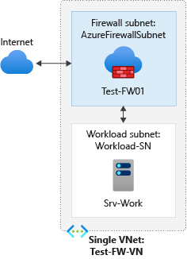

# Tutorial: Deploy a firewall with Azure DDoS Protection

This article helps you create an Azure Firewall with a DDoS protected virtual network. Azure DDoS Protection enables enhanced DDoS mitigation capabilities such as adaptive tuning, attack alert notifications, and monitoring to protect your firewall from large scale DDoS attacks.

> [!IMPORTANT]
> Azure DDoS Protection incurs a cost when you use the Network Protection SKU. Overages charges only apply if more than 100 public IPs are protected in the tenant. Ensure you delete the resources in this tutorial if you aren't using the resources in the future. For information about pricing, see [Azure DDoS Protection Pricing]( https://azure.microsoft.com/pricing/details/ddos-protection/). For more information about Azure DDoS protection, see [What is Azure DDoS Protection?](../ddos-protection/ddos-protection-overview.md).

For this tutorial, you create a simplified single VNet with two subnets for easy deployment. Azure DDoS Network Protection is enabled for the virtual network.

* **AzureFirewallSubnet** - the firewall is in this subnet.
* **Workload-SN** - the workload server is in this subnet. This subnet's network traffic goes through the firewall.

For production deployments, a [hub and spoke model](/azure/architecture/reference-architectures/hybrid-networking/hub-spoke) is recommended, where the firewall is in its own VNet. The workload servers are in peered VNets in the same region with one or more subnets.

In this tutorial, you learn how to:

> [!div class="checklist"]
> * Set up a test network environment
> * Deploy a firewall and firewall policy
> * Create a default route
> * Configure an application rule to allow access to www.google.com
> * Configure a network rule to allow access to external DNS servers
> * Configure a NAT rule to allow a remote desktop to the test server
> * Test the firewall

If you prefer, you can complete this procedure using [Azure PowerShell](deploy-ps-policy.md).

## Prerequisites

If you don't have an Azure subscription, create a [free account](https://azure.microsoft.com/free/?WT.mc_id=A261C142F) before you begin.

## Set up the network

First, create a resource group to contain the resources needed to deploy the firewall. Then create a VNet, subnets, and a test server.

### Create a resource group

The resource group contains all the resources for the tutorial.

1. Sign in to the [Azure portal](https://portal.azure.com).
1. On the Azure portal menu, select **Resource groups** or search for and select *Resource groups* from any page, then select **Add**. Enter or select the following values:

    | Setting  | Value  |
    | -------- | ------ |
    | Subscription  | Select your Azure subscription. |
    | Resource group | Enter *Test-FW-RG*. |
    | Region | Select a region. All other resources that you create must be in the same region. |
 
1. Select **Review + create**.
1. Select **Create**.

### Create a DDoS protection plan

1. In the search box at the top of the portal, enter **DDoS protection**. Select **DDoS protection plans** in the search results and then select **+ Create**.

1. In the **Basics** tab of **Create a DDoS protection plan** page, enter or select the following information:

    | Setting | Value |
    |--|--|
    | **Project details** |   |
    | Subscription | Select your Azure subscription. |
    | Resource group | Select **Test-FW-RG**. |
    | **Instance details** |   |
    | Name | Enter **myDDoSProtectionPlan**. |
    | Region | Select the region. |

1. Select **Review + create** and then select **Create** to deploy the DDoS protection plan.

### Create a VNet

This VNet will have two subnets.

> [!NOTE]
> The size of the AzureFirewallSubnet subnet is /26. For more information about the subnet size, see [Azure Firewall FAQ](firewall-faq.yml#why-does-azure-firewall-need-a--26-subnet-size).

1. On the Azure portal menu or from the **Home** page, select **Create a resource**.
1. Select **Networking**.
1. Search for **Virtual network** and select it.
1. Select **Create**, then enter or select the following values:

    | Setting  | Value  |
    | -------- | ------ |
    | Subscription  | Select your Azure subscription. |
    | Resource group | Select **Test-FW-RG**. |
    | Name | Enter *Test-FW-VN*. |
    | Region | Select the same location that you used previously. |

1. Select **Next: IP addresses**.
1. For **IPv4 Address space**, accept the default **10.1.0.0/16**.
1. Under **Subnet**, select **default**.
1. For **Subnet name** change the name to **AzureFirewallSubnet**. The firewall will be in this subnet, and the subnet name **must** be AzureFirewallSubnet.
1. For **Address range**, type **10.1.1.0/26**.
1. Select **Save**.

   Next, create a subnet for the workload server.

1. Select **Add subnet**.
1. For **Subnet name**, type **Workload-SN**.
1. For **Subnet address range**, type **10.1.2.0/24**.
1. Select **Add**.
1. Select **Next: Security**.
1. In **DDoS Network Protection** select **Enable**.
1. Select **myDDoSProtectionPlan** in **DDoS protection plan**.
1. Select **Review + create**.
1. Select **Create**.

### Create a virtual machine

Now create the workload virtual machine, and place it in the **Workload-SN** subnet.

1. On the Azure portal menu or from the **Home** page, select **Create a resource**.
1. Select **Windows Server 2019 Datacenter**.
1. Enter or select these values for the virtual machine:

   | Setting | Value |
   | ------- | ----- |
   | Subscription  | Select your Azure subscription. |
   | Resource group     | Select **Test-FW-RG**. |
   | Virtual machine name     | Enter *Srv-Work*.|
   | Region     | Select the same location that you used previously. |
   | Username     | Enter a username. |
   | Password     | Enter a password. |

1. Under **Inbound port rules**, **Public inbound ports**, select **None**.
1. Accept the other defaults and select **Next: Disks**.
1. Accept the disk defaults and select **Next: Networking**.
1. Make sure that **Test-FW-VN** is selected for the virtual network and the subnet is **Workload-SN**.
1. For **Public IP**, select **None**.
1. Accept the other defaults and select **Next: Management**.
1. Select **Disable** to disable boot diagnostics. Accept the other defaults and select **Review + create**.
1. Review the settings on the summary page, and then select **Create**.
1. After the deployment completes, select the **Srv-Work** resource and note the private IP address for later use.

## Deploy the firewall and policy

Deploy the firewall into the VNet.

1. On the Azure portal menu or from the **Home** page, select **Create a resource**.
2. Type **firewall** in the search box and press **Enter**.
3. Select **Firewall** and then select **Create**.
4. On the **Create a Firewall** page, use the following table to configure the firewall:

   | Setting | Value |
   | ------- | ----- |
   | Subscription  | Select your Azure subscription. |
   | Resource group     | Select **Test-FW-RG**. |
   | Name     | Enter *Test-FW01*. |
   | Region     | Select the same location that you used previously. |
   | Firewall management | Select **Use a Firewall Policy to manage this firewall**. |
   | Firewall policy | Select **Add new**, and enter *fw-test-pol*.   Select the same region that you used previously. 
   | Choose a virtual network | Select **Use existing**, and then select **Test-FW-VN**. |
   | Public IP address     | Select **Add new**, and enter *fw-pip* for the **Name**. |

5. Accept the other default values, then select **Review + create**.
6. Review the summary, and then select **Create** to create the firewall.

   This will take a few minutes to deploy.
7. After deployment completes, go to the **Test-FW-RG** resource group, and select the **Test-FW01** firewall.
8. Note the firewall private and public IP addresses. You'll use these addresses later.

## Create a default route

For the **Workload-SN** subnet, configure the outbound default route to go through the firewall.

1. On the Azure portal menu, select **All services** or search for and select *All services* from any page.
1. Under **Networking**, select **Route tables**.
1. Select **Create**, then enter or select the following values:

   | Setting | Value |
   | ------- | ----- |
   | Subscription | Select your Azure subscription. |
   | Resource group | Select **Test-FW-RG**. |
   | Region  | Select the same location that you used previously. |
   | Name  | Enter *Firewall-route*. |

1. Select **Review + create**.
1. Select **Create**.

After deployment completes, select **Go to resource**.

1. On the **Firewall-route** page, select **Subnets** and then select **Associate**.
1. Select **Virtual network** > **Test-FW-VN**.
1. For **Subnet**, select **Workload-SN**. Make sure that you select only the **Workload-SN** subnet for this route, otherwise your firewall won't work correctly.
1. Select **OK**.
1. Select **Routes** and then select **Add**.
1. For **Route name**, enter *fw-dg*.
1. For **Address prefix**, enter *0.0.0.0/0*.
1. For **Next hop type**, select **Virtual appliance**.
    Azure Firewall is actually a managed service, but virtual appliance works in this situation.
1. For **Next hop address**, enter the private IP address for the firewall that you noted previously.
1. Select **OK**.

## Configure an application rule

This is the application rule that allows outbound access to `www.google.com`.

1. Open the **Test-FW-RG** resource group, and select the **fw-test-pol** firewall policy.
1. Select **Application rules**.
1. Select **Add a rule collection**.
1. For **Name**, enter *App-Coll01*.
1. For **Priority**, enter *200*.
1. For **Rule collection action**, select **Allow**.
1. Under **Rules**, for **Name**, enter *Allow-Google*.
1. For **Source type**, select **IP address**.
1. For **Source**, enter *10.0.2.0/24*.
1. For **Protocol:port**, enter *http, https*.
1. For **Destination Type**, select **FQDN**.
1. For **Destination**, enter *`www.google.com`*
1. Select **Add**.

Azure Firewall includes a built-in rule collection for infrastructure FQDNs that are allowed by default. These FQDNs are specific for the platform and can't be used for other purposes. For more information, see [Infrastructure FQDNs](infrastructure-fqdns.md).

## Configure a network rule

This is the network rule that allows outbound access to two IP addresses at port 53 (DNS).

1. Select **Network rules**.
2. Select **Add a rule collection**.
3. For **Name**, enter *Net-Coll01*.
4. For **Priority**, enter *200*.
5. For **Rule collection action**, select **Allow**.
1. For **Rule collection group**, select **DefaultNetworkRuleCollectionGroup**.
1. Under **Rules**, for **Name**, enter *Allow-DNS*.
1. For **Source type**, select **IP Address**.
1. For **Source**, enter *10.0.2.0/24*.
1. For **Protocol**, select **UDP**.
1. For **Destination Ports**, enter *53*.
1. For **Destination type** select **IP address**.
1. For **Destination**, enter *209.244.0.3,209.244.0.4*. These are public DNS servers operated by CenturyLink.
2. Select **Add**.

## Configure a DNAT rule

This rule allows you to connect a remote desktop to the **Srv-Work** virtual machine through the firewall.

1. Select the **DNAT rules**.
2. Select **Add a rule collection**.
3. For **Name**, enter *rdp*.
1. For **Priority**, enter *200*.
1. For **Rule collection group**, select **DefaultDnatRuleCollectionGroup**.
1. Under **Rules**, for **Name**, enter *rdp-nat*.
1. For **Source type**, select **IP address**.
1. For **Source**, enter *\**.
1. For **Protocol**, select **TCP**.
1. For **Destination Ports**, enter *3389*.
1. For **Destination Type**, select **IP Address**.
1. For **Destination**, enter the firewall public IP address.
1. For **Translated address**, enter the **Srv-work** private IP address.
1. For **Translated port**, enter *3389*.
1. Select **Add**.

### Change the primary and secondary DNS address for the **Srv-Work** network interface

For testing purposes in this tutorial, configure the server's primary and secondary DNS addresses. This isn't a general Azure Firewall requirement.

1. On the Azure portal menu, select **Resource groups** or search for and select *Resource groups* from any page. Select the **Test-FW-RG** resource group.
2. Select the network interface for the **Srv-Work** virtual machine.
3. Under **Settings**, select **DNS servers**.
4. Under **DNS servers**, select **Custom**.
5. Enter *209.244.0.3* in the **Add DNS server** text box, and *209.244.0.4* in the next text box.
6. Select **Save**.
7. Restart the **Srv-Work** virtual machine.

## Test the firewall

Now, test the firewall to confirm that it works as expected.

1. Connect a remote desktop to firewall public IP address and sign in to the **Srv-Work** virtual machine. 
3. Open Internet Explorer and browse to `https://www.google.com`.
4. Select **OK** > **Close** on the Internet Explorer security alerts.

   You should see the Google home page.

5. Browse to `https://www.microsoft.com`.

   You should be blocked by the firewall.

So now you've verified that the firewall rules are working:

* You can browse to the one allowed FQDN, but not to any others.
* You can resolve DNS names using the configured external DNS server.

## Clean up resources

You can keep your firewall resources for the next tutorial, or if no longer needed, delete the **Test-FW-RG** resource group to delete all firewall-related resources.

## Next steps

> [!div class="nextstepaction"]
> [Deploy and configure Azure Firewall Premium](premium-deploy.md)
