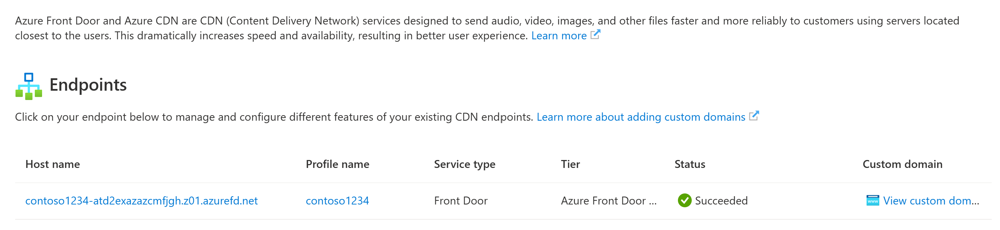

# Quickstart: Integrate an Azure Storage account with Azure Front Door

In this quickstart, you enable [Azure Front Door CDN](front-door-overview.md) to cache/accelerate content from Azure Storage. Azure Front Door is Microsoft’s modern cloud Content Delivery Network (CDN) that provides fast, reliable, and secure access between your users and your applications’ static and dynamic web content across the globe. Azure Front Door delivers your content using Microsoft’s global edge network with hundreds of global and local points of presence (PoPs) distributed around the world close to both your enterprise and consumer end users.

## Prerequisites

- An Azure account with an active subscription. [Create an account for free](https://azure.microsoft.com/free/?ref=microsoft.com&utm_source=microsoft.com&utm_medium=docs&utm_campaign=visualstudio).

## Sign in to the Azure portal

Sign in to the [Azure portal](https://portal.azure.com) with your Azure account.

## Create a storage account

A storage account gives access to Azure Storage services. The storage account represents the highest level of the namespace for accessing each of the Azure Storage service components: Azure Blob, Queue, and Table storage. For more information, see [Introduction to Microsoft Azure Storage](../storage/common/storage-introduction.md).

To create a storage account, you must be either the service administrator or a coadministrator for the associated subscription.

1. In the Azure portal, select **Create a resource** on the upper left. The **Create a resource** pane appears.

1. Search for **Storage account** and select **Storage account** from the  list. Then select **Create**:

    :::image type="content" source="./media/afd-create-a-storage-account-with-afd/cdn-select-new-storage-account.png" alt-text="Screenshot of create a storage account.":::

1. In the **Create storage account pane**, enter the following details:

    | Setting | Value |
    | --- | --- |
    | Resource group | Select **Create new** and use the name *AFDQuickstart-rg*. You can also use an existing resource group if you prefer. |
    | Storage account name | Enter a name for the account using 3-24 lowercase letters and numbers only. The name must be unique across Azure, and becomes the host name in the URL that's used to address blob, queue, or table resources for the subscription. To address a container resource in Blob storage, use a URI in the following format: http://*&lt;storageaccountname&gt;*.blob.core.windows.net/*&lt;container-name&gt;*.
    | Region | Select an Azure region near you from the drop-down list. |
    
    Leave all other details set to the defaults, then select **Review + create**.

1. Creating the storage account might take several minutes to complete. Once creation is complete, select **Go to resource** to open the storage account's page for the next step.

## Enable Azure Front Door CDN for the storage account

1. On the page for your storage account, select **Security + Networking** > **Front Door and CDN** from the left menu. The **Front Door and CDN** page appears.

    :::image type="content" source="./media/afd-create-a-storage-account-with-afd/afd-storage-endpoint-configuration.png" alt-text="Screenshot of create an AFD endpoint.":::
	
1. In the **New endpoint** section, enter the following information:

    | Setting  | Value |
    | -------- | ----- |
    | **Service type** | **Azure Front Door** |
    | **Create new/use existing profile** | **Create new** |
    | **Profile name** | Enter your profile name, for example, *contoso1234*. A profile is a collection of endpoints. |
    | **Endpoint name** | Enter your endpoint hostname, such as *contoso1234*. This name will be used to access your cached resources at the URL _&lt;endpoint-name + hash value&gt;_.z01.azurefd.net. |
    | **Origin hostname** | By default, a new CDN endpoint uses the hostname of your storage account as the origin server. |
    | **Pricing tier** | Select **Azure Front Door Standard** if you want to do just content delivery; Select **Azure Front Door Premium** if you want to do content delivery and use security features; |

3. **Optional**: Toggle on [Enable caching](front-door-caching.md) if you want to cache your static content.

4. **Optional**: Toggle on [Enable WAF](web-application-firewall.md) if you want to protect your endpoint from common vulnerabilities, malicious actor and bots. You can use an existing policy from the WAF policy dropdown or create a new one.  

> [!NOTE]
> With Standard SKU, you can only use custom rules with WAF.To deploy managed rules and bot protection, choose Premium SKU. For detailed comparison, view [Azure Front Door tier comparison](./standard-premium/tier-comparison.md).

5. **Optional**: Toggle on [Enable private link](private-link.md) if you want to keep your storage account private i.e. not exposed to public internet. Select the region that is the same region as your storage account or closest to your origin. Select target sub resource as **blob**
:::image type="content" source="./media/afd-create-a-storage-account-with-afd/security-settings.png" alt-text="WAF and private link settings":::
> [!NOTE]
> Private link feature is only available with Premium SKU.
6. Select **Create**. After the endpoint is created, it appears in the endpoint list.

	

## Enable additional features

From the storage account **Front Door and CDN** page, select the AFD endpoint from the list to open the AFD endpoint configuration page.

From this page, you can enable additional AFD features for your delivery, such as [rules engine](front-door-rules-engine.md) and [load balancing](routing-methods.md).

For best practices, refer to [Use Azure Front Door with Azure Storage blobs ](scenario-storage-blobs.md)
	
## Enable SAS

If you want to grant limited access to private storage containers, you can use the Shared Access Signature (SAS) feature of your Azure Storage account. A SAS is a URI that grants restricted access rights to your Azure Storage resources without exposing your account key. 

## Access CDN content

To access cached content on AFD, use the AFD URL provided in the portal. The address for a cached blob has the following format:

http://<*endpoint-name-with-hash-value*\>.z01.azurefd.net/<*myPublicContainer*\>/<*BlobName*\>

> [!NOTE]
> After you enable AFD access to a storage account, all publicly available objects are eligible for AFD POP caching. If you modify an object that's currently cached in AFD, the new content will not be available via AFD until AFD refreshes its content after the time-to-live period for the cached content expires.

## Add a custom domain
When you use Azure Front Door for content delivery, a custom domain is necessary if you would like your own domain name to be visible in your end-user requests. Having a visible domain name can be convenient for your customers and useful for branding purposes.

From the storage account **Front Door and CDN** page, select the **View custom domains** option on the required AFD endpoint in the list to open the AFD domain configuration page. For further steps, refer to [Configure a custom domain on Azure Front Door](./standard-premium/how-to-add-custom-domain.md)

## Purge cached content from AFD

If you no longer want to cache an object in AFD, you can purge the cached content. 

From the storage account **Front Door and CDN** page, select the AFD endpoint from the list to open the AFD endpoint configuration page. Click on the purge content option and select the endpoint/domain/path to purge.

> [!NOTE]
> An object that's already cached in AFD remains cached until the time-to-live period for the object expires or until the endpoint is purged.

## Clean up resources

In the preceding steps, you created an AFD profile and an endpoint in a resource group. However, if you don't expect to use these resources in the future, you can delete them by deleting the resource group, thus avoiding additional charges:

1. From the left-hand menu in the Azure portal, select **Resource groups** and then select *AFDQuickstart-rg**.

2. On the **Resource group** page, select **Delete resource group**, enter *AFDQuickstart-rg* in the text box, then select **Delete**.

    This action will delete the resource group, profile, and endpoint that you created in this quickstart.

3. To delete your storage account, select it from the dashboard, then select **Delete** from the top menu.

## Next steps

* [Learn how to use Azure Front Door with Azure Storage blobs](scenario-storage-blobs.md)
* [Learn how to how to enable AFD private link with Azure blob storage](how-to-enable-private-link-storage-account.md)
* [Learn how to how to enable AFD private link with storage static website](how-to-enable-private-link-storage-static-website.md)
