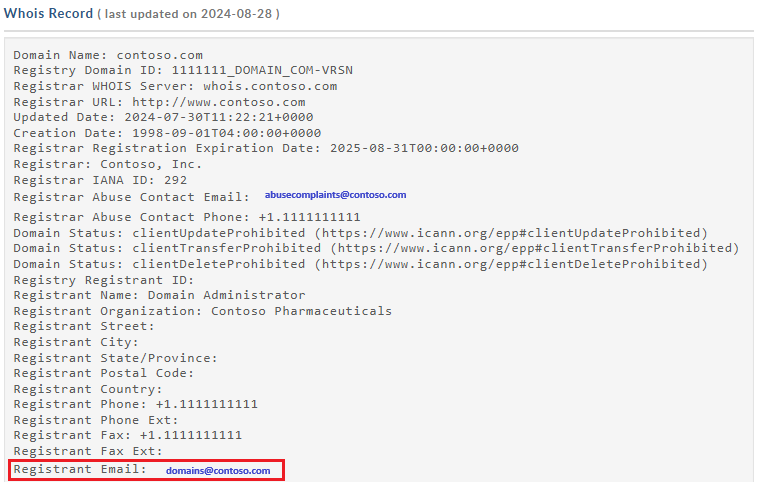

# Configure HTTPS on a Front Door (classic) custom domain

This article shows how to enable the HTTPS protocol for a custom domain that's associated with your Front Door (classic) under the frontend hosts section. By using the HTTPS protocol on your custom domain (for example, `https://www.contoso.com`), you ensure that your sensitive data is delivered securely via TLS/SSL encryption when it's sent across the internet. When your web browser is connected to a web site using HTTPS, it validates the web site's security certificate and verifies if issued by a legitimate certificate authority. This process provides security and protects your web applications from malicious attacks.

Azure Front Door supports HTTPS on a Front Door default hostname, by default. For example, if you create a Front Door (such as `https://contoso.azurefd.net`), HTTPS is automatically enabled for requests made to `https://contoso.azurefd.net`. However, once you onboard the custom domain 'www.contoso.com' you need to additionally enable HTTPS for this frontend host.

Some of the key attributes of the custom HTTPS feature are:

- No extra cost: There are no costs for certificate acquisition or renewal and no extra cost for HTTPS traffic.

- Simple enablement: One-click provisioning is available from the [Azure portal](https://portal.azure.com). You can also use REST API or other developer tools to enable the feature.

- Complete certificate management is available: All certificate procurement and management is handled for you. Certificates are automatically provisioned and renewed before expiration, which removes the risks of service interruption because of a certificate expiring.

In this tutorial, you learn how to:
> [!div class="checklist"]
> - Enable the HTTPS protocol on your custom domain.
> - Use an AFD-managed certificate
> - Use your own certificate, that is, a custom TLS/SSL certificate
> - Validate the domain
> - Disable the HTTPS protocol on your custom domain


[!INCLUDE [updated-for-az](../../includes/updated-for-az.md)]

## Prerequisites

Before you can complete the steps in this tutorial, you must first create a Front Door and with at least one custom domain onboarded. For more information, see [Tutorial: Add a custom domain to your Front Door](front-door-custom-domain.md).

## TLS/SSL certificates

To enable the HTTPS protocol for securely delivering content on a Front Door (classic) custom domain, you must use a TLS/SSL certificate. You can choose to use a certificate that gets managed by Azure Front Door or use your own certificate.

### Option 1 (default): Use a certificate managed by Front Door

When you use a certificate managed by Azure Front Door, the HTTPS feature can be turned on with a few setting changes. Azure Front Door completely handles certificate management tasks such as procurement and renewal. After you enable the feature, the process starts immediately. If the custom domain is already mapped to the Front Door's default frontend host (`{hostname}.azurefd.net`), no further action is required. Front Door processes the steps and completes your request automatically. However, if your custom domain is mapped elsewhere, you must use email to validate your domain ownership.

To enable HTTPS on a custom domain, follow these steps:

1. In the [Azure portal](https://portal.azure.com), browse to your **Front Door** profile.

2. In the list of frontend hosts, select the custom domain you want to enable HTTPS for containing your custom domain.

3. Under the section **Custom domain HTTPS**, select **Enabled**, and select **Front Door managed** as the certificate source.

4. Select Save.

5. Continue to [Validate the domain](#validate-the-domain).

> [!NOTE]
> * For Azure Front Door-managed certificates, DigiCert’s 64 character limit is enforced. Validation will fail if that limit is exceeded.
> * Enabling HTTPS via Front Door managed certificate is not supported for apex/root domains (example: contoso.com). You can use your own certificate for this scenario.  Please continue with Option 2 for further details.

### Option 2: Use your own certificate

You can use your own certificate to enable the HTTPS feature. This process is done through an integration with Azure Key Vault, which allows you to store your certificates securely. Azure Front Door uses this secure mechanism to get your certificate and it requires a few extra steps. When you create your TLS/SSL certificate, you must create a complete certificate chain with an allowed certificate authority (CA) that is part of the [Microsoft Trusted CA List](https://ccadb-public.secure.force.com/microsoft/IncludedCACertificateReportForMSFT). If you use a nonallowed CA, your request is rejected.  If a certificate without complete chain is presented, the requests that involve that certificate aren't guaranteed to work as expected.

#### Prepare your key vault and certificate

- You must have a key vault account in the same Azure subscription as your front door. Create a key vault account if you don't have one.

    > [!WARNING]
    > Azure Front Door currently only supports Key Vault accounts in the same subscription as the Front Door configuration. Choosing a Key Vault under a different subscription than your Front Door will result in a failure.

- If your key vault has network access restrictions enabled, you must configure your key vault to allow trusted Microsoft services to bypass the firewall.

- Your key vault must be configured to use the *Key Vault access policy* permission model.

- If you already have a certificate, you can upload it directly to your key vault. Otherwise, create a new certificate directly through Azure Key Vault from one of the partner certificate authorities (CAs) that Azure Key Vault integrates with. Upload your certificate as a **certificate** object, rather than a **secret**.

> [!NOTE]
> Front Door doesn't support certificates with elliptic curve (EC) cryptography algorithms. The certificate must have a complete certificate chain with leaf and intermediate certificates, and root CA must be part of the [Microsoft Trusted CA list](https://ccadb-public.secure.force.com/microsoft/IncludedCACertificateReportForMSFT).

#### Register Azure Front Door

Register the service principal for Azure Front Door as an app in your Azure Active Directory (Azure AD) by using Azure PowerShell or the Azure CLI.

> [!NOTE]
> * This action requires at least Application Administrator role permissions in Azure AD. The registration only needs to be performed **once per Azure AD tenant**.
> * The application ID is assigned by Azure specifically for Azure Front Door (classic).
> * Azure Front Door (classic) has a different *Application Id* than Azure Front Door Standard/Premium tier.
> * The role assigned is only for the subscription selected unless you define a different scope.

##### Azure PowerShell

1. If needed, install [Azure PowerShell](/powershell/azure/install-azure-powershell) in PowerShell on your local machine.

2. In PowerShell, run the following command:

     ```azurepowershell-interactive
     New-AzADServicePrincipal -ApplicationId "ad0e1c7e-6d38-4ba4-9efd-0bc77ba9f037"
     ```

##### Azure CLI

1. If need, install [Azure CLI](/cli/azure/install-azure-cli) on your local machine.

2. In CLI, run the following command:

     ```azurecli-interactive
     az ad sp create --id ad0e1c7e-6d38-4ba4-9efd-0bc77ba9f037
     ```     

#### Grant Azure Front Door access to your key vault

Grant Azure Front Door permission to access the certificates in your Azure Key Vault account.

1. In your key vault account, select **Access policies**.

1. Select **Create** to create a new access policy.

1. In **Secret permissions**, select **Get** to allow Front Door to retrieve the certificate.

1. In **Certificate permissions**, select **Get** to allow Front Door to retrieve the certificate.

1. In **Select principal**, search for **ad0e1c7e-6d38-4ba4-9efd-0bc77ba9f037**, and select **Microsoft.Azure.Frontdoor**. Select **Next**.

1. In **Application**, select **Next**.

1. In **Review + create**, select **Create**.

> [!NOTE]
> If your key vault is protected with network access restrictions, make sure to allow trusted Microsoft services to access your key vault.

Azure Front Door can now access this key vault and the certificates it contains.

#### Select the certificate for Azure Front Door to deploy

1. Return to your Front Door in the portal.

2. In the list of custom domains, select the custom domain for which you want to enable HTTPS.

    The **Custom domain** page appears.

3. Under Certificate management type, select **Use my own certificate**.

4. Azure Front Door requires that the subscription of the Key Vault account is the same as for your Front Door. Select a key vault, Secret, and Secret version.

    Azure Front Door lists the following information:
    - The key vault accounts for your subscription ID.
    - The secrets under the selected key vault.
    - The available secret versions.

    > [!NOTE]
    >  In order for the certificate to be automatically rotated to the latest version when a newer version of the certificate is available in your Key Vault, set the secret version to 'Latest'. If a specific version is selected, you have to re-select the new version manually for certificate rotation. It takes 72 - 96 hours for the new version of the certificate/secret to be deployed.
    >
    > :::image type="content" source="./media/front-door-custom-domain-https/certificate-version.png" alt-text="Screenshot of selecting secret version on update custom domain page.":::

    > [!WARNING]
    > This is an Azure portal only warning. You need to configure your service principal to have a GET permission on the Key Vault. In order for a user to see the certificate in the portal drop-down, the user account must have LIST and GET permissions on the Key Vault. If a user doesn't have these permissions, they'll see an inaccessible error message in portal. An inaccessible error message doesn't have any impact on certificate auto-rotation or any HTTPS function. No actions are required for this error message if you don't intend to make changes to the certificate or the version. If you want to change the information on this page, see [provide permission to Key Vault](../key-vault/general/rbac-guide.md?tabs=azure-cli) to add your account to the LIST and GET permission of the Key Vault.


5. When you use your own certificate, domain validation isn't required. Continue to [Wait for propagation](#wait-for-propagation).

## Validate the domain

If you already have a custom domain in use that gets mapped to your custom endpoint with a CNAME record or you're using your own certificate, continue to [Custom domain is mapped to your Front Door](#custom-domain-is-mapped-to-your-front-door-by-a-cname-record). Otherwise, if the CNAME record entry for your domain no longer exists or it contains the afdverify subdomain, continue to [Custom domain isn't mapped to your Front Door](#custom-domain-isnt-mapped-to-your-front-door).

### Custom domain is mapped to your Front Door by a CNAME record

When you added a custom domain to your Front Door's frontend hosts, you created a CNAME record in the DNS table of your domain registrar to map it to your Front Door's default .azurefd.net hostname. If that CNAME record still exists and doesn't contain the afdverify subdomain, the DigiCert Certificate Authority uses it to automatically validate ownership of your custom domain.

If you're using your own certificate, domain validation isn't required.

Your CNAME record should be in the following format, where *Name* is your custom domain name and *Value* is your Front Door's default .azurefd.net hostname:

| Name            | Type  | Value                 |
|-----------------|-------|-----------------------|
| <www.contoso.com> | CNAME | contoso.azurefd.net |

For more information about CNAME records, see [Create the CNAME DNS record](../cdn/cdn-map-content-to-custom-domain.md).

If your CNAME record is in the correct format, DigiCert automatically verifies your custom domain name and creates a dedicated certificate for your domain name. DigitCert doesn't send you a verification email and you don't need to approve your request. The certificate is valid for one year and autorenews before it expires. Continue to [Wait for propagation](#wait-for-propagation).

Automatic validation typically takes a few mins. If you don't see your domain validated within an hour, open a support ticket.

>[!NOTE]
>If you have a Certificate Authority Authorization (CAA) record with your DNS provider, it must include DigiCert as a valid CA. A CAA record allows domain owners to specify with their DNS providers which CAs are authorized to issue certificates for their domain. If a CA receives an order for a certificate for a domain that has a CAA record and that CA is not listed as an authorized issuer, it is prohibited from issuing the certificate to that domain or subdomain. For  information about managing CAA records, see [Manage CAA records](https://support.dnsimple.com/articles/manage-caa-record/). For a CAA record tool, see [CAA Record Helper](https://sslmate.com/caa/).

### Custom domain isn't mapped to your Front Door

If the CNAME record entry for your endpoint no longer exists or it contains the afdverify subdomain, follow the rest of the instructions in this step.

After you enable HTTPS on your custom domain, the DigiCert CA validates ownership of your domain by contacting its registrant, according to the domain's [WHOIS](http://whois.domaintools.com/) registrant information. Contact is made via the email address (by default) or the phone number listed in the WHOIS registration. You must complete domain validation before HTTPS is active on your custom domain. You have six business days to approve the domain. Requests that aren't approved within six business days are automatically canceled. DigiCert domain validation works at the subdomain level. You need to prove ownership of each subdomain separately.



DigiCert also sends a verification email to other email addresses. If the WHOIS registrant information is private, verify that you can approve directly from one of the following addresses:

admin@&lt;your-domain-name.com&gt;
administrator@&lt;your-domain-name.com&gt;
webmaster@&lt;your-domain-name.com&gt;
hostmaster@&lt;your-domain-name.com&gt;
postmaster@&lt;your-domain-name.com&gt;

You should receive an email in a few minutes, similar to the following example, asking you to approve the request. If you're using a spam filter, add no-reply@digitalcertvalidation.com to its allowlist. Under certain scenarios, DigiCert may be unable to fetch the domain contacts from the WHOIS registrant information to send you an email. If you don't receive an email within 24 hours, contact Microsoft support.

When you select the approval link, you're directed to an online approval form. Follow the instructions on the form; you have two verification options:

- You can approve all future orders placed through the same account for the same root domain; for example, contoso.com. This approach is recommended if you plan to add more custom domains for the same root domain.

- You can approve just the specific host name used in this request. Extra approval is required for subsequent requests.

After approval, DigiCert completes the certificate creation for your custom domain name. The certificate is valid for one year and gets autorenew before it expires.

## Wait for propagation

After the domain name is validated, it can take up to 6-8 hours for the custom domain HTTPS feature to be activated. When the process is complete, the custom HTTPS status in the Azure portal is set to **Enabled** and the four operation steps in the custom domain dialog are marked as complete. Your custom domain is now ready to use HTTPS.

### Operation progress

The following table shows the operation progress that occurs when you enable HTTPS. After you enable HTTPS, four operation steps appear in the custom domain dialog. As each step becomes active, more substep details appear under the step as it progresses. Not all of these substeps occur. After a step successfully completes, a green check mark appears next to it.

| Operation step | Operation substep details |
| --- | --- |
| 1. Submitting request | Submitting request |
| | Your HTTPS request is being submitted. |
| | Your HTTPS request has been submitted successfully. |
| 2. Domain validation | Domain is automatically validated if it's CNAME mapped to the default .azurefd.net frontend host of your Front Door. Otherwise, a verification request is sent to the email listed in your domain's registration record (WHOIS registrant). Verify the domain as soon as possible. |
| | Your domain ownership has been successfully validated. |
| | Domain ownership validation request expired (customer likely didn't respond within 6 days). HTTPS won't be enabled on your domain. * |
| | Domain ownership validation request rejected by the customer. HTTPS won't be enabled on your domain. * |
| 3. Certificate provisioning | The certificate authority is currently issuing the certificate needed to enable HTTPS on your domain. |
| | The certificate has been issued and is currently being deployed for your Front Door. This process could take from several minutes to an hour to complete. |
| | The certificate has been successfully deployed for your Front Door. |
| 4. Complete | HTTPS has been successfully enabled on your domain. |

\* This message doesn't appear unless an error has occurred.

If an error occurs before the request is submitted, the following error message is displayed:

<code>
We encountered an unexpected error while processing your HTTPS request. Please try again and contact support if the issue persists.
</code>

## Frequently asked questions

1. *Who is the certificate provider and what type of certificate is used?*

    A dedicated/single certificate, provided by Digicert, is used for your custom domain.

2. *Do you use IP-based or SNI TLS/SSL?*

    Azure Front Door uses SNI TLS/SSL.

3. *What if I don't receive the domain verification email from DigiCert?*

    If you have a CNAME entry for your custom domain that points directly to your endpoint hostname (and you aren't using the afdverify subdomain name), you won't receive a domain verification email. Validation occurs automatically. Otherwise, if you don't have a CNAME entry and you haven't received an email within 24 hours, contact Microsoft support.

4. *Is using a SAN certificate less secure than a dedicated certificate?*

    A SAN certificate follows the same encryption and security standards as a dedicated certificate. All issued TLS/SSL certificates use SHA-256 for enhanced server security.

5. *Do I need a Certificate Authority Authorization record with my DNS provider?*

    No, a Certificate Authority Authorization record isn't currently required. However, if you do have one, it must include DigiCert as a valid CA.

## Clean up resources

In the preceding steps, you enabled the HTTPS protocol on your custom domain. If you no longer want to use your custom domain with HTTPS, you can disable HTTPS by doing theses steps:

### Disable the HTTPS feature

1. In the [Azure portal](https://portal.azure.com), browse to your **Azure Front Door** configuration.

2. In the list of frontend hosts, select the custom domain for which you want to disable HTTPS.

3. Select **Disabled** to disable HTTPS, then select **Save**.

### Wait for propagation

After the custom domain HTTPS feature is disabled, it can take up to 6-8 hours for it to take effect. When the process is complete, the custom HTTPS status in the Azure portal gets set to **Disabled** and the three operation steps in the custom domain dialog are marked as complete. Your custom domain can no longer use HTTPS.

#### Operation progress

The following table shows the operation progress that occurs when you disable HTTPS. After you disable HTTPS, three operation steps appear in the Custom domain dialog. As each step becomes active, more details appear under the step. After a step successfully completes, a green check mark appears next to it.

| Operation progress | Operation details |
| --- | --- |
| 1. Submitting request | Submitting your request |
| 2. Certificate deprovisioning | Deleting certificate |
| 3. Complete | Certificate deleted |

## Next steps

To learn how to [set up a geo-filtering policy](front-door-geo-filtering.md) for your Front Door, continue to the next tutorial.