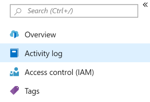
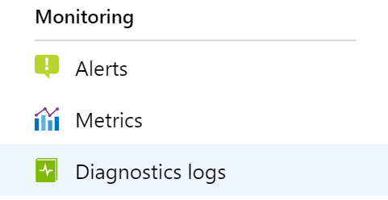

# Monitoring metrics and logs in Azure Front Door

By using Azure Front Door, you can monitor resources in the following ways:

- **Metrics**. Azure Front Door currently has seven metrics to view performance counters.
- **Logs**. Activity and diagnostic logs allow performance, access, and other data to be saved or consumed from a resource for monitoring purposes.

### Metrics

Metrics are a feature for certain Azure resources that allow you to view performance counters in the portal. The following are available Front Door metrics:

| Metric | Metric Display Name | Unit | Dimensions | Description |
| --- | --- | --- | --- | --- |
| RequestCount | Request Count | Count | HttpStatus HttpStatusGroup ClientRegion ClientCountry | The number of client requests served by Front Door.  |
| RequestSize | Request Size | Bytes | HttpStatus HttpStatusGroup ClientRegion ClientCountry | The number of bytes sent as requests from clients to Front Door. |
| ResponseSize | Response Size | Bytes | HttpStatus HttpStatusGroup ClientRegion ClientCountry | The number of bytes sent as responses from Front Door to clients. |
| TotalLatency | Total Latency | Milliseconds | HttpStatus HttpStatusGroup ClientRegion ClientCountry | The time calculated from the client request received by Front Door until the client acknowledged the last response byte from Front Door. |
| BackendRequestCount | Backend Request Count | Count | HttpStatus HttpStatusGroup Backend | The number of requests sent from Front Door to backends. |
| BackendRequestLatency | Backend Request Latency | Milliseconds | Backend | The time calculated from when the request was sent by Front Door to the backend until Front Door received the last response byte from the backend. |
| BackendHealthPercentage | Backend Health Percentage | Percent | Backend BackendPool | The percentage of successful health probes from Front Door to backends. |
| WebApplicationFirewallRequestCount | Web Application Firewall Request Count | Count | PolicyName RuleName Action | The number of client requests processed by the application layer security of Front Door. |

## Activity logs

Activity logs provide information about the operations done on Front Door. They also determine the what, who, and when for any write operations (put, post, or delete) taken on Front Door.

>[!NOTE]
>Activity logs don't include read (get) operations. They also don't include operations that you perform by using either the Azure portal or the original Management API.

Access activity logs in your Front Door or all the logs of your Azure resources in Azure Monitor. To view activity logs:

1. Select your Front Door instance.
2. Select **Activity log**.

    

3. Choose a filtering scope, and then select **Apply**.

## Diagnostic logs
Diagnostic logs provide rich information about operations and errors that are important for auditing and troubleshooting. Diagnostic logs differ from activity logs.

Activity logs provide insights into the operations done on Azure resources. Diagnostic logs provide insight into operations that your resource performed. For more information, see [Azure Monitor diagnostic logs](../azure-monitor/platform/platform-logs-overview.md).

To configure diagnostic logs for your Front Door:

1. Select your Azure Front Door.

2. Choose **Diagnostic settings**.

3. Select **Turn on diagnostics**. Archive diagnostic logs along with metrics to a storage account, stream them to an event hub, or send them to Azure Monitor logs.

Front Door currently provides diagnostic logs (batched hourly). Diagnostic logs provide individual API requests with each entry having the following schema:

| Property  | Description |
| ------------- | ------------- |
| BackendHostname | If request was being forwarded to a backend, this field represents the hostname of the backend. This field will be blank if the request was redirected or forwarded to a regional cache (when caching is enabled for the routing rule). |
| CacheStatus | For caching scenarios, this field defines the cache hit/miss at the POP |
| ClientIp | The IP address of the client that made the request. If there was an X-Forwarded-For header in the request, then the Client IP is picked from the same. |
| ClientPort | The IP port of the client that made the request. |
| HttpMethod | HTTP method used by the request. |
| HttpStatusCode | The HTTP status code returned from the proxy. |
| HttpStatusDetails | Resulting status on the request. Meaning of this string value can be found at a Status reference table. |
| HttpVersion | Type of the request or connection. |
| POP | Short name of the edge where the request landed. |
| RequestBytes | The size of the HTTP request message in bytes, including the request headers and the request body. |
| RequestUri | URI of the received request. |
| ResponseBytes | Bytes sent by the backend server as the response.  |
| RoutingRuleName | The name of the routing rule that the request matched. |
| RulesEngineMatchNames | The names of the rules that the request matched. |
| SecurityProtocol | The TLS/SSL protocol version used by the request or null if no encryption. |
| SentToOriginShield | Boolean field representing if there was a cache miss on the first environment and the request was sent to the regional cache. Ignore this field if the routing rule is a redirect or when doesn't have caching enabled. |
| TimeTaken | The length of time that the action took, in milliseconds. |
| TrackingReference | The unique reference string that identifies a request served by Front Door, also sent as X-Azure-Ref header to the client. Required for searching details in the access logs for a specific request. |
| UserAgent | The browser type that the client used. |

**Note:** For various routing configurations and traffic behaviors, some of the fields like backendHostname, cacheStatus, sentToOriginShield, and POP field may respond with different values. The below table explains the different values, these fields will have for various scenarios:

| Scenarios | Count of log entries | POP | BackendHostname | SentToOriginShield | CacheStatus |
| ------------- | ------------- | ------------- | ------------- | ------------- | ------------- |
| Routing rule without caching enabled | 1 | Edge POP code | Backend where request was forwarded | False | CONFIG_NOCACHE |
| Routing rule with caching enabled. Cache hit at the edge POP | 1 | Edge POP code | Empty | False | HIT |
| Routing rule with caching enabled. Cache miss at edge POP but cache hit at parent cache POP | 2 | 1. Edge POP code 2. Parent cache POP code | 1. Parent cache POP hostname 2. Empty | 1. True 2. False | 1. MISS 2. PARTIAL_HIT |
| Routing rule with caching enabled. Cache miss at both edge and parent cache POP | 2 | 1. Edge POP code 2. Parent cache POP code | 1. Parent cache POP hostname 2. Backend that helps populate cache | 1. True 2. False | 1. MISS 2. MISS |

## Next steps

- [Create a Front Door profile](quickstart-create-front-door.md)
- [How Front Door works](front-door-routing-architecture.md)
