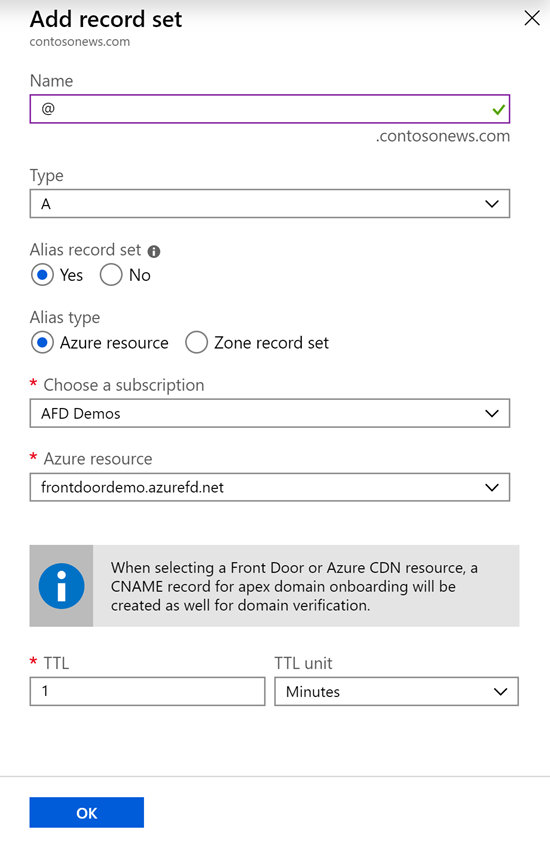
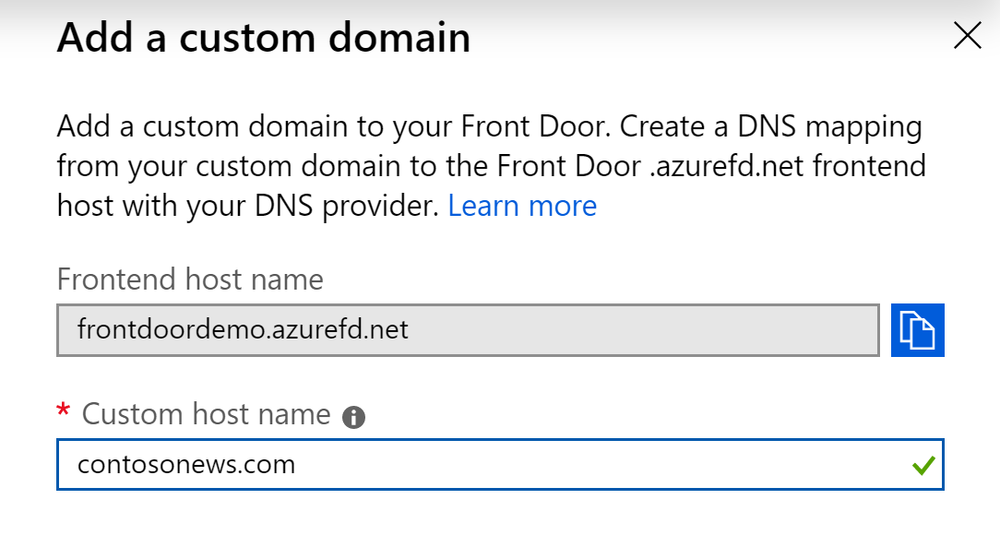

# Onboard a root or apex domain on your Front Door
Azure Front Door uses CNAME records to validate domain ownership for onboarding of custom domains. Also, Front Door doesn't expose the frontend IP address associated with your Front Door profile and so you can't map your apex domain to an IP address, if the intent is to onboard it to Azure Front Door.

The DNS protocol prevents the assignment of CNAME records at the zone apex. For example, if your domain is `contoso.com`; you can create CNAME records for `somelabel.contoso.com`; but you can't create CNAME for `contoso.com` itself. This restriction presents a problem for application owners who have load-balanced applications behind Azure Front Door. Since using a Front Door profile requires creation of a CNAME record, it isn't possible to point at the Front Door profile from the zone apex.

This problem is solved using alias records on Azure DNS. Unlike CNAME records, alias records are created at the zone apex and application owners can use it to point their zone apex record to a Front Door profile that has public endpoints. Application owners point to the same Front Door profile that's used for any other domain within their DNS zone. For example, `contoso.com` and `www.contoso.com` can point to the same Front Door profile. 

Mapping your apex or root domain to your Front Door profile basically requires CNAME flattening or DNS chasing, which is a mechanism where in the DNS provider recursively resolves the CNAME entry until it hits an IP address. This functionality is supported by Azure DNS for Front Door endpoints. 

> [!NOTE]
> There are other DNS providers as well that support CNAME flattening or DNS chasing, however, Azure Front Door recommends using Azure DNS for its customers for hosting their domains.

You can use the Azure portal to onboard an apex domain on your Front Door and enable HTTPS on it by associating it with a certificate for TLS termination. Apex domains are also referred as root or naked domains.

In this article, you learn how to:

> [!div class="checklist"]
> * Create an alias record that points to your Front Door profile
> * Add the root domain to the Front Door
> * Setup HTTPS on the root domain

> [!NOTE]
> This tutorial requires that you already have a Front Door profile created. Refer other tutorials like [Quickstart: Create a Front Door](./quickstart-create-front-door.md) or [Create a Front Door with HTTP to HTTPS redirection](./front-door-how-to-redirect-https.md) to get started.

## Create an alias record for zone apex

1. Open **Azure DNS** configuration for the domain to be onboarded.
2. Create or edit the record for zone apex.
3. Select the record **type** as _A_ record and then select _Yes_ for **Alias record set**. **Alias type** should be set to _Azure resource_.
4. Choose the Azure subscription where your Front Door profile is hosted and then select the Front Door resource from the **Azure resource** dropdown.
5. Click **OK** to submit your changes.

    

6. The above step will create a zone apex record pointing to your Front Door resource and also a CNAME record mapping 'afdverify' (example - `afdverify.contosonews.com`) to `afdverify.<name>.azurefd.net` which will be used for onboarding the domain on your Front Door profile.

## Onboard the custom domain on your Front Door

1. On the Front Door designer tab, click on '+' icon on the Frontend hosts section to add a new custom domain.
2. Enter the root or apex domain name in the custom host name field, example `contosonews.com`.
3. Once the CNAME mapping from the domain to your Front Door is validated, click on **Add** to add the custom domain.
4. Click **Save** to submit the changes.

## Enable HTTPS on your custom domain

1. Click on the custom domain that was added and under the section **Custom domain HTTPS**, change the status to **Enabled**.
2. Select the  **Certificate management type** to _'Use my own certificate'_.

> [!WARNING]
> Front Door managed certificate management type is not currently supported for apex or root domains. The only option available for enabling HTTPS on an apex or root domain for Front Door is using your own custom TLS/SSL certificate hosted on Azure Key Vault.

3. Ensure that you have setup the right permissions for Front Door to access your key Vault as noted in the UI, before proceeding to the next step.
4. Choose a **Key Vault account** from your current subscription and then select the appropriate **Secret** and **Secret version** to map to the right certificate.
5. Click on **Update** to save the selection and then click **Save**.
6. Click **Refresh** after a couple of minutes and then click on the custom domain again to see the progress of certificate provisioning. 

> [!WARNING]
> Ensure that you have created appropriate routing rules for your apex domain or added the domain to existing routing rules.

## Next steps

- Learn how to [create a Front Door](quickstart-create-front-door.md).
- Learn [how Front Door works](front-door-routing-architecture.md).