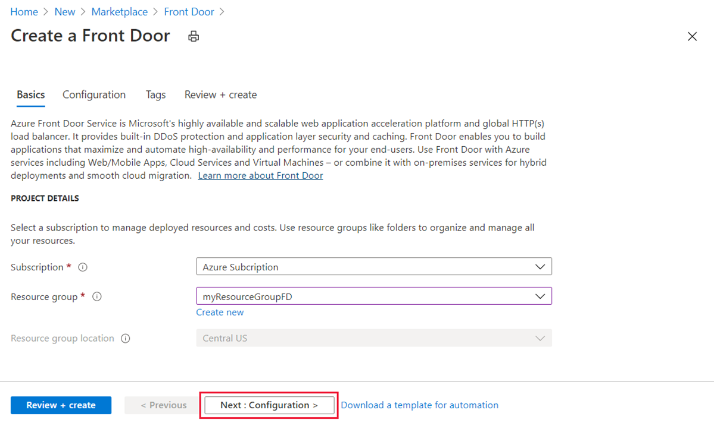
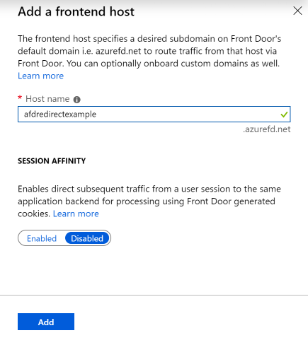
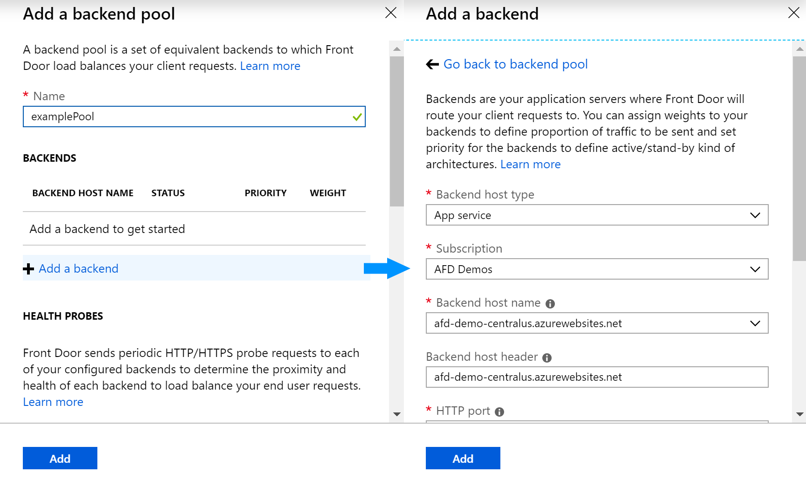
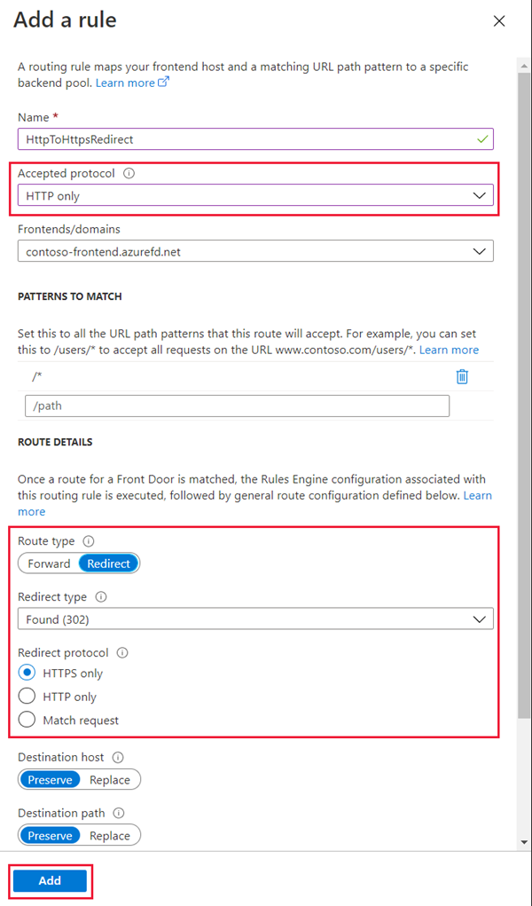
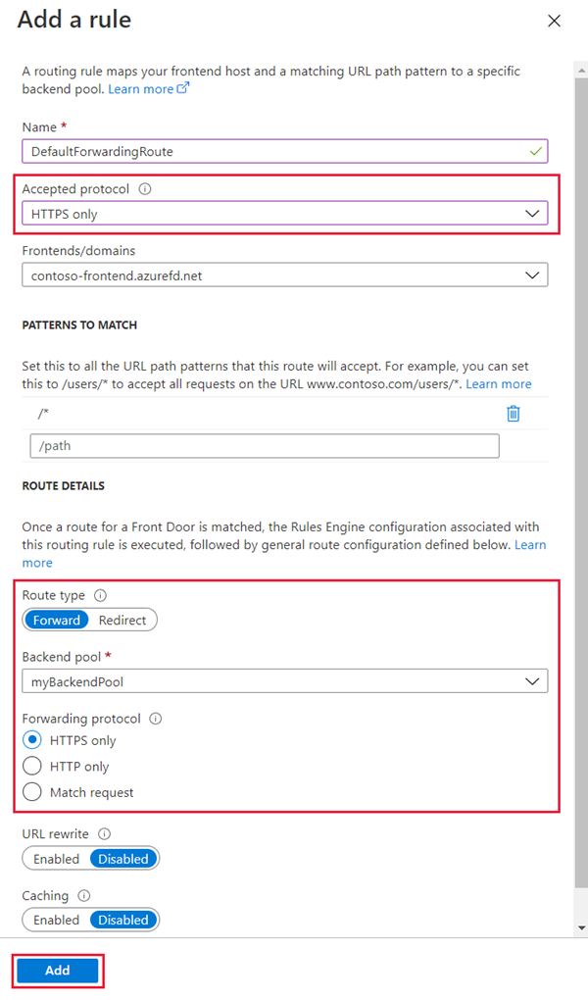
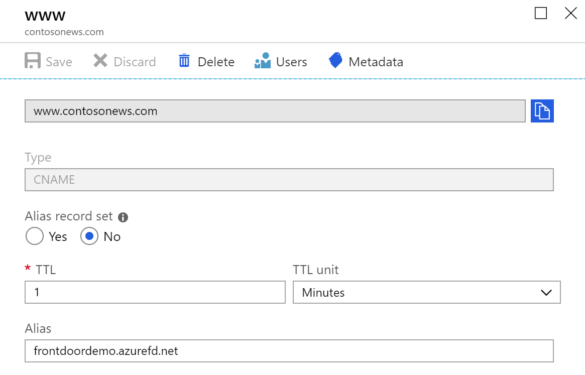
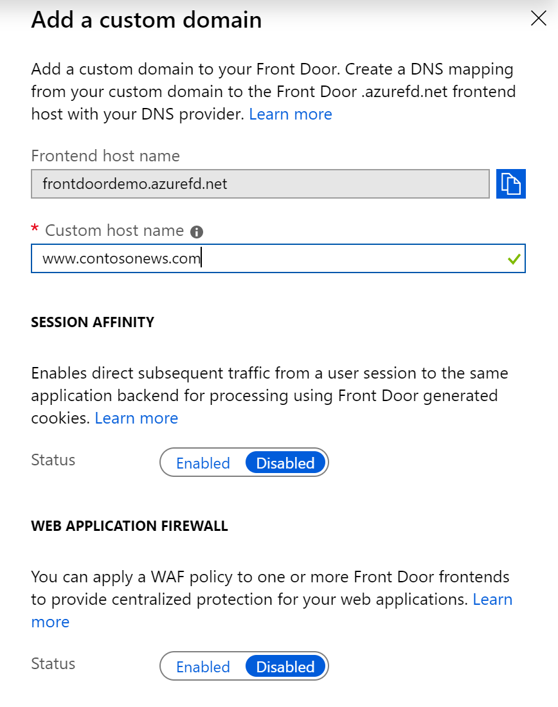
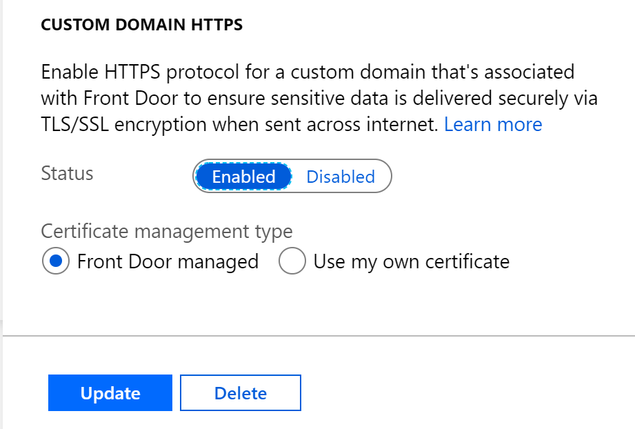

# Create a Front Door with HTTP to HTTPS redirection using the Azure portal

You can use the Azure portal to create a [Front Door](front-door-overview.md) with a certificate for SSL termination. A routing rule is used to redirect HTTP traffic to HTTPS.

In this article, you learn how to:

> [!div class="checklist"]
> * Create a Front Door with an existing Web App resource
> * Add a custom domain with SSL certificate 
> * Setup HTTPS redirect on the custom domain

If you don't have an Azure subscription, create a [free account](https://azure.microsoft.com/free/?WT.mc_id=A261C142F) before you begin.

## Create a Front Door with an existing Web App resource

1. Sign in to the Azure portal at [https://portal.azure.com](https://portal.azure.com).
2. Click **Create a resource** found on the upper left-hand corner of the Azure portal.
3. Search for **Front Door** using the search bar and once you find the resource type, click **Create**.
4. Choose a subscription and then either use an existing resource group or create a new one. Note, the location asked in the UI is for the resource group only. Your Front Door configuration will get deployed across all of [Azure Front Door's POP locations](https://docs.microsoft.com/azure/frontdoor/front-door-faq#what-are-the-pop-locations-for-azure-front-door-service).

    

5. Click **Next** to enter the configuration tab. The configuration for Front Door happens in three steps - adding a default frontend host, adding backends in a backend pool and then creating routing rules to map the routing behavior for frontend host. 

     

6. Click the '**+**' icon on the _Frontend hosts_ to create a frontend host, enter a globally unique name for your default frontend host for your Front Door (`\<**name**\>.azurefd.net`). Click **Add** to proceed to the next step.

     

7. Click the '**+**' icon on the _Backend pools_ to create a backend pool. Provide a name for the backend pool and then click '**Add a backend**'.
8. Select the Backend Host Type as _App service_. Select the subscription where your web app is hosted and then select the specific web app from the dropdown for **Backend host name**.
9. Click **Add** to save the backend and click **Add** again to save the backend pool config.
     

10. Click the '**+**' icon on the _Routing rules_ to create a route. Provide a name for the route, say 'HttpToHttpsRedirect', and then set the _Accepted Protocols_ field to **'HTTP only'**. Ensure that the appropriate _frontend host_ is selected.  
11. On the _Route Details_ section, set the _Route Type_ to **Redirect**, ensure that the _Redirect type_ is set to **Found (302)** and _Redirect protocol_ is set to **HTTPS only**. 
12. Click Add to save the routing rule for HTTP to HTTPS redirect.
     
13. Add another routing rule for handling the HTTPS traffic. Click the '**+**' sign on the _Routing rules_ and provide a name for the route, say 'DefaultForwardingRoute', and then set the _Accepted Protocols_ field to **'HTTPS only'**. Ensure that the appropriate _frontend host_ is selected.
14. On the Route Details section, set the _Route Type_ to **Forward**, ensure that the right backend pool is selected and the _Forwarding Protocol_ is set to **HTTPS only**. 
15. Click Add to save the routing rule for request forwarding.
     
16. Click **Review + create** and then **Create**, to create your Front Door profile. Go to the resource once created.

## Add a custom domain to your Front Door and enable HTTPS on it
The following steps showcase how you can add a custom domain on an existing Front Door resource and then enable HTTP to HTTPS redirection on it. 

### Add a custom domain

In this example, you add a CNAME record for the `www` subdomain (for example, `www.contosonews.com`).

#### Create the CNAME record

Add a CNAME record to map a subdomain to your Front Door's default frontend host (`<name>.azurefd.net`, where `<name>` is the name of your Front Door profile).

For the `www.contoso.com` domain, as an example, add a CNAME record that maps the name `www` to `<name>.azurefd.net`.

After you add the CNAME, the DNS records page looks like the following example:

#### Onboard the custom domain on your Front Door

1. On the Front Door designer tab, click on '+' icon on the Frontend hosts section to add a new custom domain. 
2. Enter the fully qualified custom DNS name in the custom host name field, example `www.contosonews.com`. 
3. Once the CNAME mapping from the domain to your Front Door is validated, click on **Add** to add the custom domain.
4. Click **Save** to submit the changes.

### Enable HTTPS on your custom domain

1. Click on the custom domain that was added and under the section **Custom domain HTTPS**, change the status to **Enabled**.
2. You can leave the **Certificate management type** set to _Front Door managed_ for the free certificate maintained, managed, and autorotated by Front Door. You can also choose to use your own custom SSL certificate stored with Azure Key Vault. This tutorial assumes that the use of Front Door managed certificate.

3. Click on **Update** to save the selection and then click **Save**.
4. Click **Refresh** after a couple of minutes and then click on the custom domain again to see the progress of certificate provisioning. 

> [!WARNING]
> Enabling HTTPS for a custom domain may take several minutes and also depends on domain ownership validation if the CNAME is not directly mapped to your Front Door host `<name>.azurefd.net`. Learn more about [how to enable HTTPS for a custom domain](./front-door-custom-domain-https.md).

## Configure the routing rules for the custom domain

1. Click on the redirect routing rule created earlier.
2. Click on the dropdown for Frontend hosts and select your custom domain to apply this route for your domain as well.
3. Click **Update**.
4. Do the same operation for the other routing rule as well that is, for your forwarding route to add the custom domain.
5. Click **Save** to submit your changes.

## Next steps

- Learn how to [create a Front Door](quickstart-create-front-door.md).
- Learn [how Front Door works](front-door-routing-architecture.md).
- Learn more about [URL redirect on Front Door](front-door-url-redirect.md).
