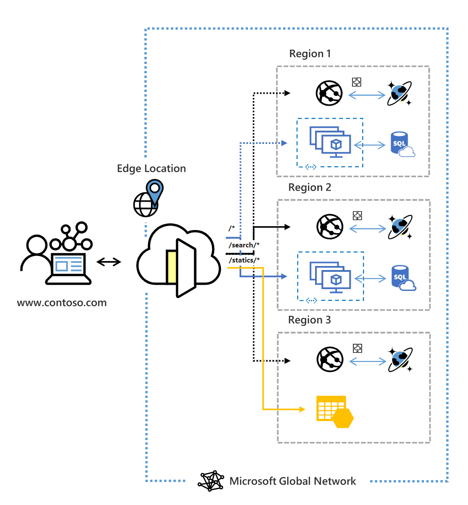

# What is Azure Front Door?

> [!IMPORTANT]
> This documentation is for Azure Front Door. Looking for information on Azure Front Door Standard/Premium (Preview)? View [here](/standard-premium/overview.md).

Azure Front Door is a global, scalable entry-point that uses the Microsoft global edge network to create fast, secure, and widely scalable web applications. With Front Door, you can transform your global consumer and enterprise applications into robust, high-performing personalized modern applications with contents that reach a global audience through Azure.

  

Front Door works at Layer 7 (HTTP/HTTPS layer) using anycast protocol with split TCP and Microsoft's global network to improve global connectivity. Based on your routing method you can ensure that Front Door will route your client requests to the fastest and most available application backend. An application backend is any Internet-facing service hosted inside or outside of Azure. Front Door provides a range of [traffic-routing methods](front-door-routing-methods.md) and [backend health monitoring options](front-door-health-probes.md) to suit different application needs and automatic failover scenarios. Similar to [Traffic Manager](../traffic-manager/traffic-manager-overview.md), Front Door is resilient to failures, including failures to an entire Azure region.

>[!NOTE]
> Azure provides a suite of fully managed load-balancing solutions for your scenarios. 
> * If you are looking to do DNS based global routing and do **not** have requirements for Transport Layer Security (TLS) protocol termination ("SSL offload"), per-HTTP/HTTPS request or application-layer processing, review [Traffic Manager](../traffic-manager/traffic-manager-overview.md). 
> * If you want to load balance between your servers in a region at the application layer, review [Application Gateway](../application-gateway/overview.md).
> * To do network layer load balancing, review [Load Balancer](../load-balancer/load-balancer-overview.md). 
> 
> Your end-to-end scenarios may benefit from combining these solutions as needed.
> For an Azure load-balancing options comparison, see [Overview of load-balancing options in Azure](/azure/architecture/guide/technology-choices/load-balancing-overview).

## Why use Azure Front Door?

With Front Door you can build, operate, and scale out your dynamic web application and static content. Front Door enables you to define, manage, and monitor the global routing for your web traffic by optimizing for top-tier end-user performance and reliability through quick global failover.

Key features included with Front Door:

* Accelerated application performance by using **[split TCP](front-door-routing-architecture.md#splittcp)**-based **[anycast protocol](front-door-routing-architecture.md#anycast)**.

* Intelligent **[health probe](front-door-health-probes.md)** monitoring for backend resources.

*  **[URL-path based](front-door-route-matching.md)** routing for requests.

* Enables hosting of multiple websites for efficient application infrastructure. 

* Cookie-based **[session affinity](front-door-routing-methods.md#affinity)**.

* **[SSL offloading](front-door-custom-domain-https.md)** and certificate management.

* Define your own **[custom domain](front-door-custom-domain.md)**. 

* Application security with integrated  **[Web Application Firewall (WAF)](../web-application-firewall/overview.md)**.

* Redirect HTTP traffic to HTTPS with **[URL redirect](front-door-url-redirect.md)**.

* Custom forwarding path with **[URL rewrite](front-door-url-rewrite.md)**.

* Native support of end-to-end IPv6 connectivity and **[HTTP/2 protocol](front-door-http2.md)**.

## Pricing

For pricing information, see [Front Door Pricing](https://azure.microsoft.com/pricing/details/frontdoor/). See [SLA for Azure Front Door](https://azure.microsoft.com/en-us/support/legal/sla/frontdoor/v1_0/).

## What's new?

Subscribe to the RSS feed and view the latest Azure Front Door feature updates on the [Azure Updates](https://azure.microsoft.com/updates/?category=networking&query=Azure%20Front%20Door) page.

## Next steps

- Learn how to [create a Front Door](quickstart-create-front-door.md).
- Learn [how Front Door works](front-door-routing-architecture.md).
