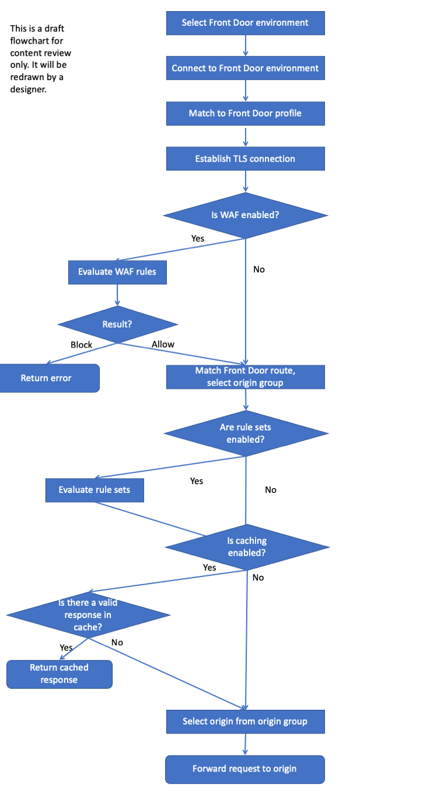
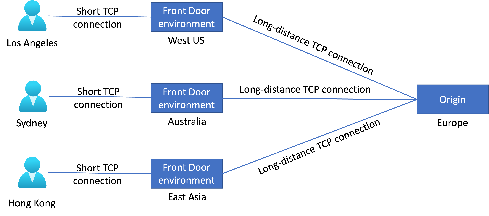

# Routing architecture overview

Front Door traffic routing takes place over multiple stages. First, traffic is routed from the client to Front Door. Then, Front Door uses your configuration to determine the origin to send the traffic to. The Front Door web application firewall, routing rules, rules engine, and caching configuration all affect the routing process.

## Routing process

The following diagram illustrates the routing architecture:

::: zone pivot="front-door-standard-premium"

::: zone-end

::: zone pivot="front-door-classic"

> [!IMPORTANT]
> Note to reviewers: I will create a version of the diagram with the AFD Classic terminology (e.g. backend instead of origin). Please review the AFDX version and after that's reviewed I'll work on the alternate. <!-- TODO -->

::: zone-end

The rest of this article describes these steps in detail.

## Select the Front Door edge location for the request (Anycast)

Globally, [Front Door has over 150 edge locations](edge-locations-by-region.md), or points of presence (PoPs), located in many countries and regions. Every Front Door PoP can serve traffic for any request.

Traffic routed to the Azure Front Door edge locations uses [Anycast](https://en.wikipedia.org/wiki/Anycast) for both DNS (Domain Name System) and HTTP (Hypertext Transfer Protocol) traffic. Anycast allows for user requests to reach the closest edge location in the fewest network hops. This architecture offers better round-trip times for end users by maximizing the benefits of [Split TCP](#splittcp).

Front Door organizes its edge locations into primary and fallback "rings". The outer ring has edge locations that are closer to users, offering lower latencies.  The inner ring has edge locations that can handle the failover for the outer ring edge location in case any issues happen. The outer ring is the preferred target for all traffic and the inner ring is to handle traffic overflow from the outer ring. Each frontend host or domain served by Front Door gets assigned a primary VIP (Virtual Internet Protocol addresses), which gets announced by edge locations in both the inner and outer ring. A fallback VIP is only announced by edge locations in the inner ring. 

Front Door's architecture ensures that requests from your end users always reach the closest Front Door edge locations. If the preferred Front Door edge location is unhealthy, all traffic automatically moves to the next closest edge location.

## Connect to the Front Door edge location (Split TCP)

[Split TCP](https://en.wikipedia.org/wiki/Performance-enhancing_proxy) is a technique to reduce latencies and TCP problems by breaking a connection that would incur a high round-trip time into smaller pieces.

::: zone pivot="front-door-standard-premium"

Split TCP enables the client's TCP connection to terminate inside a Front Door edge location close to the user. A separate TCP connection is established to the origin, and this separate connection might have a large round-trip time (RTT).

The diagram below illustrates how three users, in different geographical locations, connect to a Front Door edge location close to their location. Front Door then maintains the longer-lived connection to the origin in Europe:

> [!IMPORTANT]
> Note to reviewers: This diagram will be redrawn by a designer. Please review the content/layout but not the style.

Establishing a TCP connection requires 3-5 roundtrips from the client to the server. Front Door's architecture improves the performance of establishing the connection. The "short connection" between the end user and the Front Door edge location means the connection gets established over 3-5 short roundtrips instead of 3-5 long round trips, which results in saving latency. The "long connection" between the Front Door edge location and the origin can be pre-established and then reused across other end users requests save connectivity time. The effect of Split TCP is multiplied when establishing a SSL/TLS (Transport Layer Security) connection, because there are more round trips to secure a connection.

::: zone-end

::: zone pivot="front-door-classic"

Split TCP enables the client's TCP connection to terminate inside a Front Door edge location close to the user. A separate TCP connection is established to the backend, and this separate connection might have a large round-trip time (RTT).

The diagram below illustrates how three users, in different geographical locations, connect to a Front Door edge location close to their location. Front Door then maintains the longer-lived connection to the backend in Europe:

> [!IMPORTANT]
> Note to reviewers: I'll ask the designer to create an AFD Classic version of the diagram too. Please review the AFDX version. <!-- TODO -->

Establishing a TCP connection requires 3-5 roundtrips from the client to the server. Front Door's architecture improves the performance of establishing the connection. The "short connection" between the end user and the Front Door edge location means the connection gets established over 3-5 short roundtrips instead of 3-5 long round trips, which results in saving latency. The "long connection" between the Front Door edge location and the backend can be pre-established and then reused across other end users requests save connectivity time. The effect of Split TCP is multiplied when establishing a SSL/TLS (Transport Layer Security) connection, because there are more round trips to secure a connection.

::: zone-end

::: zone pivot="front-door-standard-premium"

## Match request to a Front Door endpoint

When Front Door receives an HTTP request, it uses the request's `Host` header to match the request to the correct customer's Front Door endpoint. If the request is using a [custom domain name](standard-premium/how-to-add-custom-domain.md), the domain name must be registered with Front Door to enable requests to be matched to your endpoint.

::: zone-end

::: zone pivot="front-door-classic"

## Match request to a front door

When Front Door receives an HTTP request, it uses the request's `Host` header to match the request to the correct customer's Front Door instance. If the request is using a [custom domain name](front-door-custom-domain.md), the domain name must be registered with Front Door to enable requests to be matched to your front door.

::: zone-end

The client and server perform a TLS handshake using the TLS certificate you've configured for your custom domain name, or by using the Front Door certificate when the `Host` header ends with `*.azurefd.net`.

## Evaluate WAF rules

If your domain has enabled the Web Application Firewall, the WAF rules are evaluated. If a rule has been violated, Front Door returns an error to the client and the request processing stops.

::: zone pivot="front-door-standard-premium"

## Match a route

Front Door matches the request to a route. Learn more about the [route matching process](front-door-route-matching.md).

The route specifies the [origin group](standard-premium/concept-origin.md) that the request should be sent to.

::: zone-end

::: zone pivot="front-door-classic"

## Match a routing rule

Front Door matches the request to a routing rule. Learn more about the [route matching process](front-door-route-matching.md).

The route specifies the [backend pool](front-door-backend-pool.md) that the request should be sent to.

::: zone-end

::: zone pivot="front-door-standard-premium"

## Evaluate rule sets

If you have defined [rule sets](standard-premium/concept-rule-set.md) for the route, they're executed in the order they're configured. [Rule sets can override the origin group](standard-premium/concept-rule-set-actions.md#OriginGroupOverride) specified in a route. Rule sets can also trigger a redirection response to the request instead of forwarding it to an origin.

::: zone-end

::: zone pivot="front-door-classic"

## Evaluate rules engines

If you have defined [rules engines](front-door-rules-engine.md) for the route, they're executed in the order they're configured. [Rules engines can override the backend pool](front-door-rules-engine-actions.md#route-configuration-overrides) specified in a routing rule. Rules engines can also trigger a redirection response to the request instead of forwarding it to a backend.

::: zone-end

## Return cached response

::: zone pivot="front-door-standard-premium"

If the Front Door routing rule has [caching](standard-premium/concept-caching.md) enabled, and the Front Door edge location's cache includes a valid response for the request, then Front Door returns the cached response. If caching is disabled or no response is available, the request is forwarded to the origin.

::: zone-end

::: zone pivot="front-door-classic"

If the Front Door routing rule has [caching](front-door-caching.md) enabled, and the Front Door edge location's cache includes a valid response for the request, then Front Door returns the cached response. If caching is disabled or no response is available, the request is forwarded to the backend.

::: zone-end

::: zone pivot="front-door-standard-premium"

## Select origin

Front Door selects an origin to use within the origin group. Origin selection is based on several factors, including:

- The health of each origin, which Front Door monitors by using [health probes](front-door-health-probes.md).
- The [routing method](front-door-routing-methods.md) for your origin group.
- Whether you have enabled [session affinity](front-door-routing-methods.md#affinity).

## Forward request to origin

Finally, the request is forwarded to the origin.

::: zone-end

::: zone pivot="front-door-classic"

## Select backend

Front Door selects a backend to use within the backend pool. Backend selection is based on several factors, including:

- The health of each backend, which Front Door monitors by using [health probes](front-door-health-probes.md).
- The [routing method](front-door-routing-methods.md) for your backend pool.
- Whether you have enabled [session affinity](front-door-routing-methods.md#affinity).

## Forward request to backend

Finally, the request is forwarded to the backend.

::: zone-end

## Next steps

::: zone pivot="front-door-standard-premium"

- Learn how to [create a Front Door profile](standard-premium/create-front-door-portal.md).

::: zone-end

::: zone pivot="front-door-classic"

- Learn how to [create a Front Door](quickstart-create-front-door.md).

::: zone-end