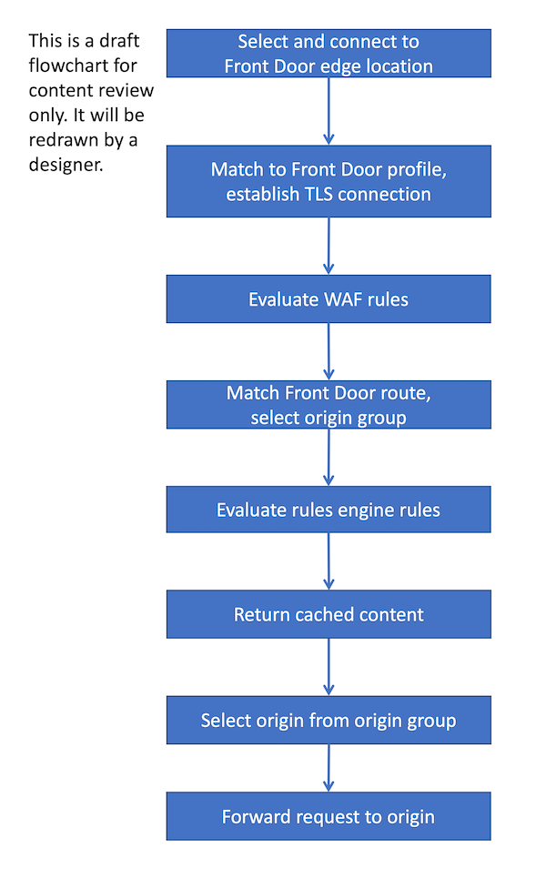
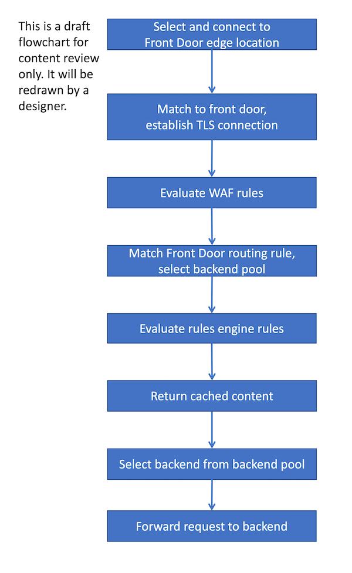

# Routing architecture overview

Azure Front Door traffic routing takes place over multiple stages. First, traffic is routed from the client to the Front Door. Then, Front Door uses your configuration to determine the origin to send the traffic to. The Front Door web application firewall, routing rules, rules engine, and caching configuration can all affect the routing process.

The following diagram illustrates the routing architecture:

::: zone pivot="front-door-standard-premium"

::: zone-end

::: zone pivot="front-door-classic"

::: zone-end

The rest of this article describes these steps in detail.

## Select and connect to the Front Door edge location

The user or client application initiates a connection to the Front Door. The connection terminates at an edge location closest to the end user. Front Door's edge location processes the request.

For more information about how requests are made to Front Door, see [Front Door traffic acceleration](front-door-traffic-acceleration.md).

::: zone pivot="front-door-standard-premium"

## Match request to a Front Door profile

When Front Door receives an HTTP request, it uses the request's `Host` header to match the request to the correct customer's Front Door profile. If the request is using a [custom domain name](standard-premium/how-to-add-custom-domain.md), the domain name must be registered with Front Door to enable requests to get matched to your profile.

::: zone-end

::: zone pivot="front-door-classic"

## Match request to a front door

When Front Door receives an HTTP request, it uses the request's `Host` header to match the request to the correct customer's Front Door instance. If the request is using a [custom domain name](front-door-custom-domain.md), the domain name must be registered with Front Door to enable requests to get matched to your Front door.

::: zone-end

The client and server perform a TLS handshake using the TLS certificate you've configured for your custom domain name, or by using the Front Door certificate when the `Host` header ends with `*.azurefd.net`.

## Evaluate WAF rules

::: zone pivot="front-door-standard-premium"

If your domain has enabled the Web Application Firewall, WAF rules are evaluated.

::: zone-end

::: zone pivot="front-door-classic"

If your frontend has enabled the Web Application Firewall, WAF rules are evaluated.

::: zone-end

If a rule has been violated, Front Door returns an error to the client and the request processing stops.

::: zone pivot="front-door-standard-premium"

## Match a route

Front Door matches the request to a route. Learn more about the [route matching process](front-door-route-matching.md).

The route specifies the [origin group](standard-premium/concept-origin.md) that the request should be sent to.

::: zone-end

::: zone pivot="front-door-classic"

## Match a routing rule

Front Door matches the request to a routing rule. Learn more about the [route matching process](front-door-route-matching.md).

The route specifies the [backend pool](front-door-backend-pool.md) that the request should be sent to.

::: zone-end

::: zone pivot="front-door-standard-premium"

## Evaluate rule sets

If you have defined [rule sets](front-door-rules-engine.md) for the route, they're executed in the order they're configured. [Rule sets can override the origin group](front-door-rules-engine-actions.md#RouteConfigurationOverride) specified in a route. Rule sets can also trigger a redirection response to the request instead of forwarding it to an origin.

::: zone-end

::: zone pivot="front-door-classic"

## Evaluate rules engines

If you have defined [rules engines](front-door-rules-engine.md) for the route, they're executed in the order they're configured. [Rules engines can override the backend pool](front-door-rules-engine-actions.md#route-configuration-overrides) specified in a routing rule. Rules engines can also trigger a redirection response to the request instead of forwarding it to a backend.

::: zone-end

## Return cached response

::: zone pivot="front-door-standard-premium"

If the Front Door routing rule has [caching](front-door-caching.md) enabled, and the Front Door edge location's cache includes a valid response for the request, then Front Door returns the cached response.

If caching is disabled or no response is available, the request is forwarded to the origin.

::: zone-end

::: zone pivot="front-door-classic"

If the Front Door routing rule has [caching](front-door-caching.md) enabled, and the Front Door edge location's cache includes a valid response for the request, then Front Door returns the cached response.

If caching is disabled or no response is available, the request is forwarded to the backend.

::: zone-end

::: zone pivot="front-door-standard-premium"

## Select origin

Front Door selects an origin to use within the origin group. Origin selection is based on several factors, including:

- The health of each origin, which Front Door monitors by using [health probes](front-door-health-probes.md).
- The [routing method](front-door-routing-methods.md) for your origin group.
- Whether you have enabled [session affinity](front-door-routing-methods.md#affinity)

## Forward request to origin

Finally, the request is forwarded to the origin.

::: zone-end

::: zone pivot="front-door-classic"

## Select backend

Front Door selects a backend to use within the backend pool. Backend selection is based on several factors, including:

- The health of each backend, which Front Door monitors by using [health probes](front-door-health-probes.md).
- The [routing method](front-door-routing-methods.md) for your backend pool.
- Whether you have enabled [session affinity](front-door-routing-methods.md#affinity)

## Forward request to backend

Finally, the request is forwarded to the backend.

::: zone-end

## Next steps

::: zone pivot="front-door-standard-premium"

- Learn how to [create a Front Door profile](standard-premium/create-front-door-portal.md).

::: zone-end

::: zone pivot="front-door-classic"

- Learn how to [create a Front Door profile](quickstart-create-front-door.md).

::: zone-end