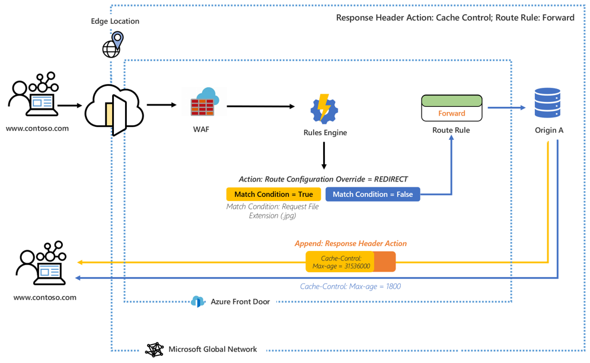
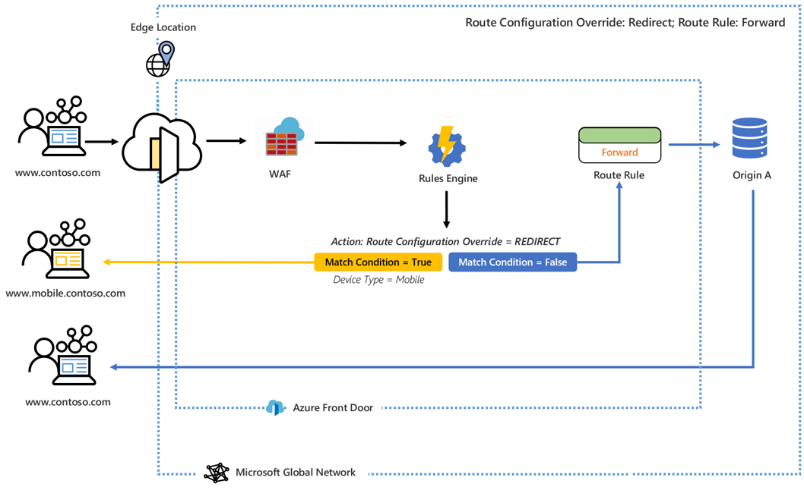

# What is Rules Engine for Azure Front Door? 

Rules Engine allows you to customize how HTTP requests are handled at the edge and provides more control of the behavior of your web application. Rules Engine for Azure Front Door comprises several key features, including:

- Enforce HTTPS, ensure all your end-users interact with your content over a secure connection.
- Implement security headers to prevent browser-based vulnerabilities like HTTP Strict-Transport-Security (HSTS), X-XSS-Protection, Content-Security-Policy, X-Frame-Options, as well as Access-Control-Allow-Origin headers for Cross-Origin Resource Sharing (CORS) scenarios. Security-based attributes can also be defined with cookies.
- Route requests to mobile or desktop versions of your application based on the patterns in the contents of request headers, cookies, or query strings.
- Use redirect capabilities to return 301, 302, 307, and 308 redirects to the client to redirect to new hostnames, paths, or protocols.
- Dynamically modify the caching configuration of your route based on the incoming requests.
- Rewrite the request URL path and forward the request to the appropriate backend in your configured backend pool.

## Architecture 

Rules engine handles requests at the edge. Once configuring Rules Engine, when a request hits your Front Door endpoint, WAF will be executed first, followed by the Rules Engine configuration associated with your Frontend/ Domain. When a Rules Engine configuration is executed, it means that the parent routing rule is already a match. Whether all of the actions in each of the rules within the Rules Engine configuration are executed is subject to all of the match conditions within that rule being satisfied. If a request matches none of the conditions in your Rule Engine configuration, then the default Routing Rule is executed. 

For example, in the configuration below, a Rules Engine is configured to append a response header which changes the max-age of the cache control if the match condition is met. 

In another example, we see that Rules Engine is configured to send a user to a mobile version of the site if the match condition, device type, is true. 

In both of these examples, when none of the match conditions are met, the specified Route Rule is what gets executed. 

## Terminology 

With AFD Rules Engine, you can create a series of Rules Engine configurations, each composed of a set of rules. The following outlines some helpful terminology you will come across when configuring your Rules Engine. 

- *Rules Engine Configuration*: A set of rules that are applied to single Route Rule. Each configuration is limited to 25 rules. You can create up to 10 configurations. 
- *Rules Engine Rule*: A rule composed of up to 10 match conditions and 5 actions.
- *Match Condition*: There are numerous match conditions that can be utilized to parse your incoming requests. A rule can contain up to 10 match conditions. Match conditions are evaluated with an **AND** operator. A full list of match conditions can  be found [here](front-door-rules-engine-match-conditions.md). 
- *Action*: Actions dictate what happens to your incoming requests - request/ response header actions, forwarding, redirects, and rewrites are all available today. A rule can contain up to 5 actions; however, a rule may only contain 1 route configuration override.  A full list of actions can be found [here](front-door-rules-engine-actions.md).

## Next steps

- Learn how to set up your first [Rules Engine configuration](front-door-tutorial-rules-engine.md). 
- Learn how to [create a Front Door](quickstart-create-front-door.md).
- Learn [how Front Door works](front-door-routing-architecture.md).
