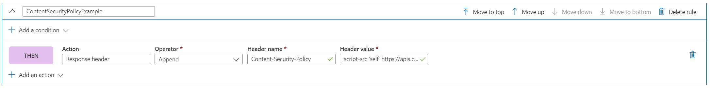

# Add Security headers with Rules Engine

Implement security headers to prevent browser-based vulnerabilities like HTTP Strict-Transport-Security (HSTS), X-XSS-Protection, Content-Security-Policy, or X-Frame-Options. Security-based attributes can also be defined with cookies.

The following example shows you how to add a Content-Security-Policy header to all incoming requests that match the path defined in the route your Rules Engine configuration is associated with. Here, we only allow scripts from our trusted site, **https://apis.contoso.com** to run on our application.

## Add a Content-Security-Policy header in Azure portal

1. Before creating this specific rule, learn how to [create a Front door](quickstart-create-front-door.md) or how to [create a Rules Engine](front-door-tutorial-rules-engine.md) if this is your first time using either AFD or the Rules Engine feature.

2. Click **Add** to add a new rule. Provide the rule a name and then click **Add an Action** > **Response Header**.

3. Set the Operator to be **Append** to add this header as a response to all of the incoming requests to this route.

4. Add the header name: **Content-Security-Policy** and define the values this header should accept. In this scenario, we choose *"script-src 'self' https://apis.contoso.com."*

5. Once you've added all of the rules you'd like to your configuration, don't forget to go to your preferred route and associate your Rules Engine configuration to your Route Rule. This step is required to enable the rule to work. 

> [!NOTE]
> In this scenario, we did not add [match conditions](front-door-rules-engine-match-conditions.md) to the rule. All incoming requests that match the path defined in the Route Rule will have this rule applied. If you would like it to only apply to a subset of those requests, be sure to add your specific match conditions to this rule.

## Next steps

- Learn more about [AFD Rules Engine](front-door-rules-engine.md). 
- Learn how to [create a Front Door](quickstart-create-front-door.md).
- Learn [how Front Door works](front-door-routing-architecture.md).
- Learn more about Rules Engine [match conditions](front-door-rules-engine-match-conditions.md)
- Check out more in AFD Rules Engine [CLI reference](https://docs.microsoft.com/cli/azure/ext/front-door/network/front-door/rules-engine?view=azure-cli-latest). 
- Check out more in AFD Rules Engine [PowerShell reference](https://docs.microsoft.com/powershell/module/az.frontdoor/?view=azps-3.8.0). 
