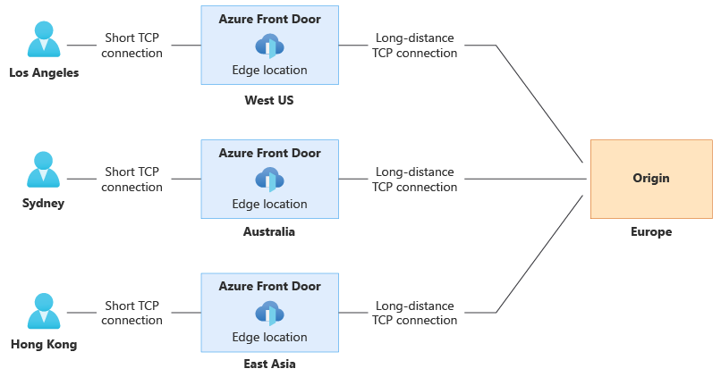
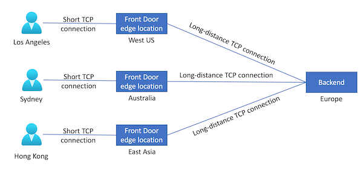

# Traffic acceleration

::: zone pivot="front-door-standard-premium"

Front Door optimizes the traffic path from the end user to the origin server. This article describes how traffic is routed from the user to Front Door and to the origin.

::: zone-end

::: zone pivot="front-door-classic"

Front Door optimizes the traffic path from the end user to the backend server. This article describes how traffic is routed from the user to Front Door and from Front Door to the backend.

::: zone-end

## Select the Front Door edge location for the request (Anycast)

Globally, [Front Door has over 150 edge locations](edge-locations-by-region.md), or points of presence (PoPs), located in many countries/regions. Every Front Door PoP can serve traffic for any request.

Traffic routed to the Azure Front Door edge locations uses [Anycast](https://en.wikipedia.org/wiki/Anycast) for both DNS (Domain Name System) and HTTP (Hypertext Transfer Protocol) traffic. Anycast allows for user requests to reach the closest edge location in the fewest network hops. This architecture offers better round-trip times for end users by maximizing the benefits of [Split TCP](#connect-to-the-front-door-edge-location-split-tcp).

Front Door organizes its edge locations into primary and fallback *rings*. The outer ring has edge locations that are closer to users, offering lower latencies.  The inner ring has edge locations that can handle the failover for the outer ring edge location in case any issues happen.

The outer ring is the preferred target for all traffic, and the inner ring is designed to handle traffic overflow from the outer ring. Each frontend host or domain served by Front Door gets assigned primary and fallback VIPs (Virtual Internet Protocol addresses), which gets announced by edge locations in both the inner and outer ring.

Front Door's architecture ensures that requests from your end users always reach the closest Front Door edge locations. If the preferred Front Door edge location is unhealthy, all traffic automatically moves to the next closest edge location.

## Connect to the Front Door edge location (Split TCP)

[Split TCP](https://en.wikipedia.org/wiki/Performance-enhancing_proxy) is a technique to reduce latencies and TCP problems by breaking a connection that would incur a high round-trip time into smaller pieces.

::: zone pivot="front-door-standard-premium"

Split TCP enables the client's TCP connection to terminate inside a Front Door edge location close to the user. A separate TCP connection is established to the origin, and this separate connection might have a large round-trip time (RTT).

The following diagram illustrates how three users, in different geographical locations, connect to a Front Door edge location close to their location. Front Door then maintains the longer-lived connection to the origin in Europe:

Establishing a TCP connection requires 3-5 roundtrips from the client to the server. Front Door's architecture improves the performance of establishing the connection. The "short connection" between the end user and the Front Door edge location means the connection gets established over 3-5 short roundtrips instead of 3-5 long round trips, which results in saving latency. The "long connection" between the Front Door edge location and the origin can be pre-established and then reused across other end users requests save connectivity time. The effect of Split TCP is multiplied when establishing a SSL/TLS (Transport Layer Security) connection, because there are more round trips to secure a connection.

::: zone-end

::: zone pivot="front-door-classic"

Split TCP enables the client's TCP connection to terminate inside a Front Door edge location close to the user. A separate TCP connection is established to the backend, and this separate connection might have a large round-trip time (RTT).

The following diagram illustrates how three users, in different geographical locations, connect to a Front Door edge location close to their location. Front Door then maintains the longer-lived connection to the backend in Europe:

Establishing a TCP connection requires 3-5 roundtrips from the client to the server. Front Door's architecture improves the performance of establishing the connection. The "short connection" between the end user and the Front Door edge location means the connection gets established over 3-5 short roundtrips instead of 3-5 long round trips, which results in saving latency. The "long connection" between the Front Door edge location and the backend can be pre-established and then reused across other end users requests save connectivity time. The effect of Split TCP is multiplied when establishing a SSL/TLS (Transport Layer Security) connection, because there are more round trips to secure a connection.

::: zone-end

## Next steps

- Learn about the [Front Door routing architecture](front-door-routing-architecture.md).
