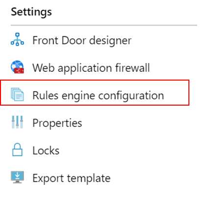
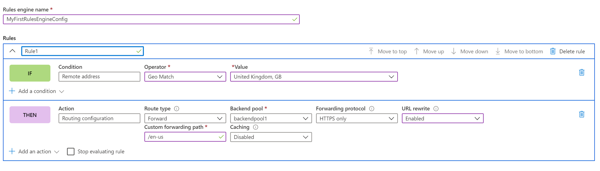
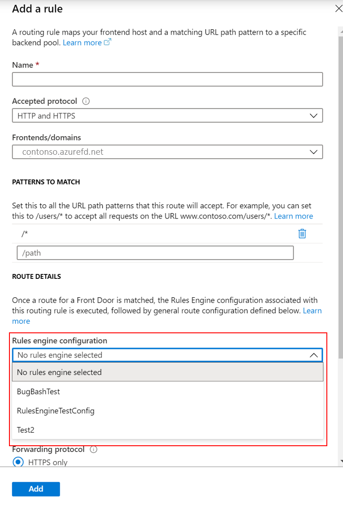

# Tutorial: Configure your Rules Engine

This tutorial shows how to create a Rules Engine configuration and your first rule in both Azure portal and CLI. 

In this tutorial, you learn how to:
> [!div class="checklist"]
> - Configure Rules Engine using the portal.
> - Configure Rules Engine using Azure CLI

## Prerequisites

* Before you can complete the steps in this tutorial, you must first create a Front Door. For more information, see [Quickstart: Create a Front Door](quickstart-create-front-door.md).

## Configure Rules Engine in Azure portal
1. Within your Front door resource, go to **Settings** and select **Rule Engine configuration**. Click **Add**, give your configuration a name, and start creating your first Rules Engine configuration.

    

1. Click **Add Rule** to create your first rule. Then, by clicking **Add condition** or **Add action** you can define your rule.
    
    > [!NOTE]
    >- To delete a condition or action from rule, use the trash can on the right-hand side of the specific condition or action.
    > - To create a rule that applies to all incoming traffic, do not specify any conditions.
    > - To stop evaluating rules once the first match condition is met, check **Stop evaluating remaining rule**. If this is checked and all of the match conditions of a particular rule are met, then the remaining rules in the configuration will not be executed.  

     

1. Determine the priority of the rules within your configuration by using the Move up, Move down, and Move to top buttons. The priority is in ascending order, meaning the rule first listed is the most important rule.

1. Once you have created one or more rules, press **Save**. This action creates your Rules Engine configuration.

1. Once you have created one or more configurations, associate a Rules Engine configuration with a Route Rule. While a single configuration can be applied to many route rules, a Route rule may only contain one Rules Engine configuration. To make the association, go to your **Front Door designer** > **Route rules**. Select the Route rule you'd like to add the Rules engine configuration to, go to **Route details** > **Rules engine configuration**, and select the configuration you'd like to associate.

    


## Configure Rules Engine in Azure CLI

1. If you haven't already, install [Azure CLI](/cli/azure/install-azure-cli). Add “front-door” extension:- az extension add --name front-door. Then, login and switch to your subscription az account set --subscription <name_or_Id>.

1. Start by creating a Rules Engine - this example shows one rule with one header-based action and one match condition. 

    ```azurecli-interactive
    az network front-door rules-engine rule create -f {front_door} -g {resource_group} --rules-engine-name {rules_engine} --name {rule1} --priority 1 --action-type RequestHeader --header-action Overwrite --header-name Rewrite --header-value True --match-variable RequestFilenameExtension --operator Contains --match-values jpg png --transforms Lowercase
    ```

1. List all the rules. 

    ```azurecli-interactive
    az network front-door rules-engine rule list -f {front_door} -g {rg} --name {rules_engine}
    ```

1. Add a forwarding route override action. 

    ```azurecli-interactive
    az network front-door rules-engine rule action add -f {front_door} -g {rg} --rules-engine-name {rules_engine} --name {rule1} --action-type ForwardRouteOverride --backend-pool {backend_pool_name} --caching Disabled
    ```

1. List all the actions in a rule. 

    ```azurecli-interactive
    az network front-door rules-engine rule action list -f {front_door} -g {rg} -r {rules_engine} --name {rule1}
    ```

1. Link a rules engine configuration to a routing rule.  

    ```azurecli-interactive
    az network front-door routing-rule update -g {rg} -f {front_door} -n {routing_rule_name} --rules-engine {rules_engine}
    ```

1. Unlink rules engine. 

    ```azurecli-interactive
    az network front-door routing-rule update -g {rg} -f {front_door} -n {routing_rule_name} --remove rulesEngine # case sensitive word ‘rulesEngine’
    ```

For more information, a full list of AFD Rules Engine commands can be found [here](/cli/azure/network/front-door/rules-engine).   

## Clean up resources

In the preceding steps, you configured and associated Rules Engine configuration to your routing rules. If you no longer want the Rules Engine configuration associated to your Front Door, you can remove the configuration by performing the following steps:

1. Disassociate any routing rules from the Rule Engine configuration by clicking the three dots next to Rule Engine name.

    :::image type="content" source="./media/front-door-rules-engine/front-door-rule-engine-routing-association.png" alt-text="Associate routing rules":::

1. Uncheck all routing rules this Rule Engine configuration is associated to and click save.

    :::image type="content" source="./media/front-door-rules-engine/front-door-routing-rule-association.png" alt-text="Routing rule association":::

1. Now you can delete the Rule Engine configuration from your Front Door.

    :::image type="content" source="./media/front-door-rules-engine/front-door-delete-rule-engine-configuration.png" alt-text="Delete Rule Engine configuration":::

## Next steps

In this tutorial, you learned how to:

* Create a Rule Engine configuration
* Associate configuration to your Front Door routing rules.

To learn how to add security headers with Rule Engine, continue to the next tutorial.

> [!div class="nextstepaction"]
> [Security headers with Rules Engine](front-door-security-headers.md)