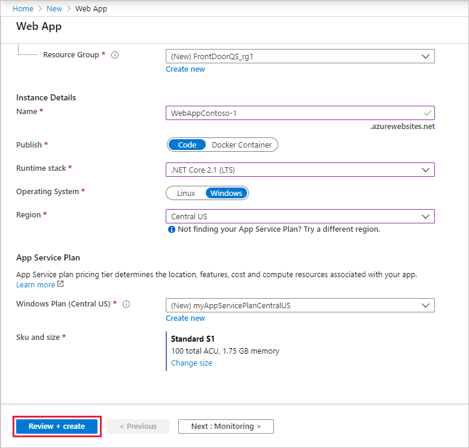
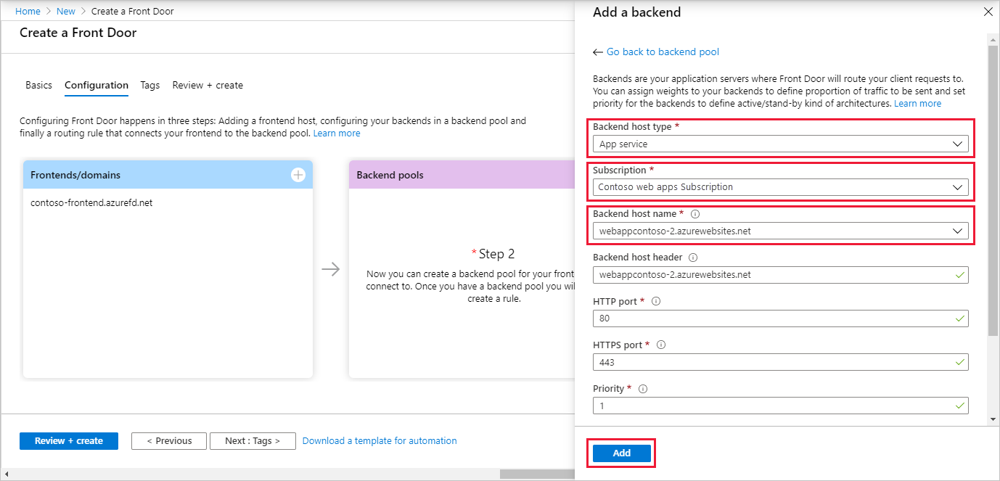
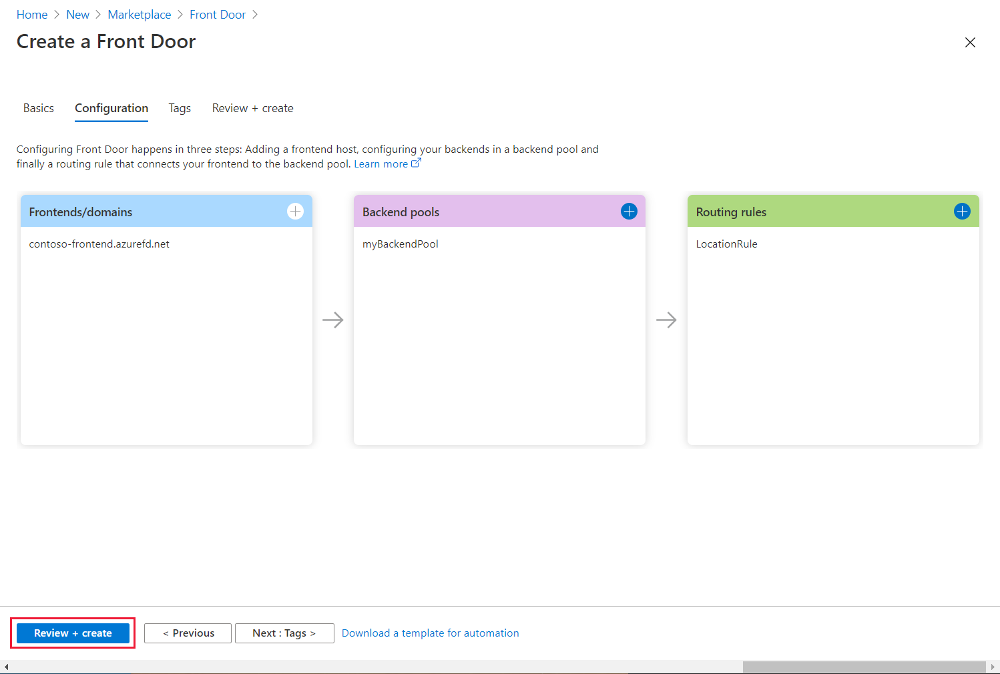
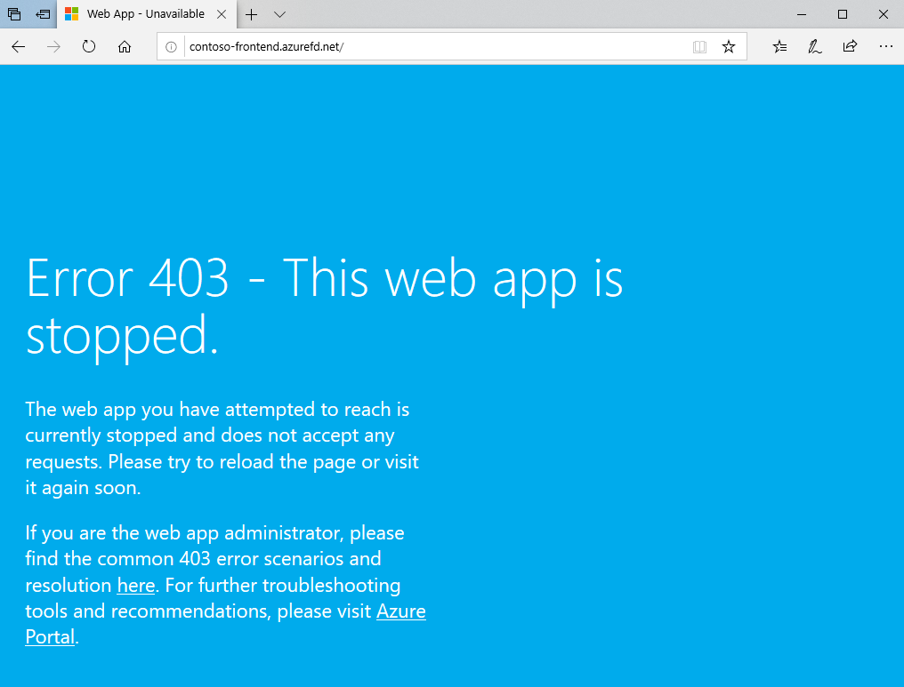

# Quickstart: Create a Front Door for a highly available global web application

Get started with Azure Front Door by using the Azure portal to set up high availability for a web application.

In this quickstart, Azure Front Door pools two instances of a web application that run in different Azure regions. You create a Front Door configuration based on equal weighted and same priority backends. This configuration directs traffic to the nearest site that runs the application. Azure Front Door continuously monitors the web application. The service provides automatic failover to the next available site when the nearest site is unavailable.

## Prerequisites

- An Azure account with an active subscription. [Create an account for free](https://azure.microsoft.com/free/?WT.mc_id=A261C142F).

## Create two instances of a web app

This quickstart requires two instances of a web application that run in different Azure regions. Both the web application instances run in *Active/Active* mode, so either one can take traffic. This configuration differs from an *Active/Stand-By* configuration, where one acts as a failover.

If you don't already have a web app, use the following steps to set up example web apps.

1. Sign in to the Azure portal at https://portal.azure.com.

1. From the home page or the Azure menu, select **Create a resource**.

1. Select **Web** > **Web App**.

   

1. In **Web App**, select the **Subscription** to use.

1. For **Resource Group**, select **Create new**. Enter *FrontDoorQS_rg1* for the **Name** and select **OK**.

1. Under **Instance Details**, enter a unique **Name** for your web app. This example uses *WebAppContoso-1*.

1. Select a **Runtime stack**, in this example, *.NET Core 2.1 (LTS)*.

1. Select a region, such as *Central US*.

1. For **Windows Plan**, select **Create new**. Enter *myAppServicePlanCentralUS* for **Name** and select **OK**.

1. Be sure that the **Sku and size** is **Standard S1 100 total ACU, 1.75 GB memory**.

1. Select **Review + create**, review the **Summary**, and then select **Create**. It might take several minutes for the deployment to complete.

   

After your deployment is complete, create a second web app. Use the same procedure with the same values, except for the following values:

| Setting          | Value     |
| ---              | ---  |
| **Resource group**   | Select **New** and enter *FrontDoorQS_rg2* |
| **Name**             | Enter a unique name for your Web App, in this example, *WebAppContoso-2*  |
| **Region**           | A different region, in this example, *South Central US* |
| **App Service plan** > **Windows Plan**         | Select **New** and enter *myAppServicePlanSouthCentralUS*, and then select **OK** |

## Create a Front Door for your application

Configure Azure Front Door to direct user traffic based on lowest latency between the two web apps servers. To begin, add a frontend host for Azure Front Door.

1. From the home page or the Azure menu, select **Create a resource**. Select **Networking** > **Front Door**.

1. In **Create a Front Door**, select a **Subscription**.

1. For **Resource group**, select **New**, then enter *FrontDoorQS_rg0* and select **OK**.  You can use an existing resource group instead.

1. If you created a resource group, select a **Resource group location**, and then select **Next: Configuration**.

1. In **Frontends/domains**, select **+** to open **Add a frontend host**.

1. For **Host name**, enter a globally unique hostname. This example uses *contoso-frontend*. Select **Add**.

   

Next, create a backend pool that contains your two web apps.

1. Still in **Create a Front Door**, in **Backend pools**, select **+** to open **Add a backend pool**.

1. For **Name**, enter *myBackendPool*.

1. Select **Add a backend**. For **Backend host type**, select *App Service*.

1. Select your subscription, and then choose the first web app you created from **Backend host name**. In this example, the web app was *WebAppContoso-1*. Select **Add**.

1. Select **Add a backend** again. For **Backend host type**, select *App Service*.

1. Select your subscription, again, and choose the second web app you created from **Backend host name**. Select **Add**.

   

Finally, add a routing rule. A routing rule maps your frontend host to the backend pool. The rule forwards a request for `contoso-frontend.azurefd.net` to **myBackendPool**.

1. Still in **Create a Front Door**, in **Routing rules**, select **+** to configure a routing rule.

1. In **Add a rule**, for **Name**, enter *LocationRule*. Accept all the default values, then select **Add** to add the routing rule.

   >[!WARNING]
   > You **must** ensure that each of the frontend hosts in your Front Door has a routing rule with a default path (`\*`) associated with it. That is, across all of your routing rules there must be at least one routing rule for each of your frontend hosts defined at the default path (`\*`). Failing to do so may result in your end-user traffic not getting routed correctly.

1. Select **Review + Create**, and then **Create**.

   

## View Azure Front Door in action

Once you create a Front Door, it takes a few minutes for the configuration to be deployed globally. Once complete, access the frontend host you created. In a browser, go to `contoso-frontend.azurefd.net`. Your request will automatically get routed to the nearest server to you from the specified servers in the backend pool.

If you created these apps in this quickstart, you'll see an information page.

To test instant global failover in action, try the following steps:

1. Open a browser, as described above, and go to the frontend address: `contoso-frontend.azurefd.net`.

1. In the Azure portal, search for and select *App services*. Scroll down to find one of your web apps, **WebAppContoso-1** in this example.

1. Select your web app, and then select **Stop**, and **Yes** to verify.

1. Refresh your browser. You should see the same information page.

   >[!TIP]
   >There is a little bit of delay for these actions. You might need to refresh again.

1. Find the other web app, and stop it as well.

1. Refresh your browser. This time, you should see an error message.

   

## Clean up resources

After you're done, you can remove all the items you created. Deleting a resource group also deletes its contents. If you don't intend to use this Front Door, you should remove resources to avoid unnecessary charges.

1. In the Azure portal, search for and select **Resource groups**, or select **Resource groups** from the Azure portal menu.

1. Filter or scroll down to find a resource group, such as **FrontDoorQS_rg0**.

1. Select the resource group, then select **Delete resource group**.

   >[!WARNING]
   >This action is irreversable.

1. Type the resource group name to verify, and then select **Delete**.

Repeat the procedure for the other two groups.

## Next steps

Advance to the next article to learn how to add a custom domain to your Front Door.
> [!div class="nextstepaction"]
> [Add a custom domain](front-door-custom-domain.md)

To learn more about routing traffic, see [Front Door routing methods](front-door-routing-methods.md).
