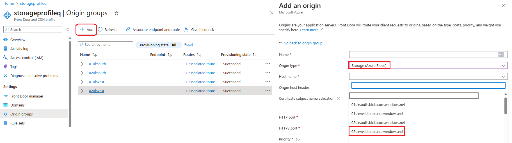
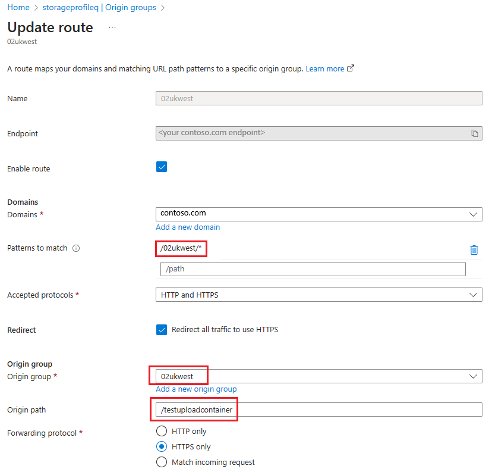
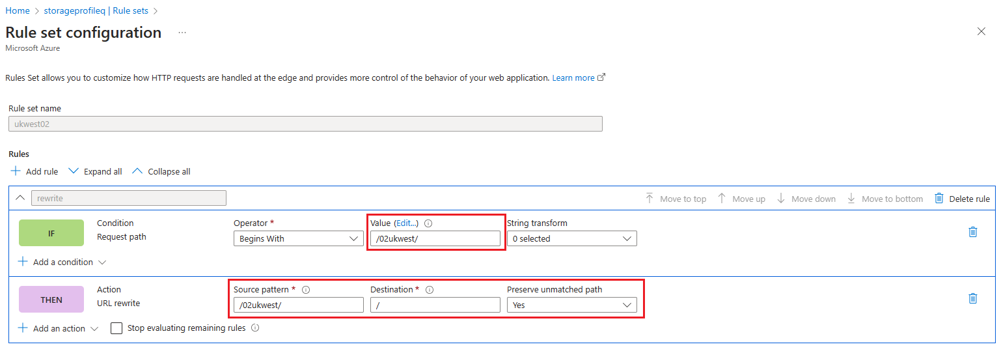

# Reliable file uploading to Azure Storage Blob through Azure Front Door

Uploading files to Azure Storage through Azure Front Door brings certain advantages, including higher resiliency, scalability and extra security, such as scanning of uploaded content with WAF and using custom TLS certificate for storage accounts.

In this reference architecture, you deploy multiple storage accounts and Front Door profile with multiple origins. By using multiple storage accounts for uploaded content, you improve performance, reliability and able to achieve load distribution/sharding by having different clients use storage accounts in different orders.

## Architecture

In this reference architecture, you deploy multiple storage accounts and Azure Front Door profile with multiple origins. You deploy as well Azure App Service to host API, and Azure Service Bus queue.

## Dataflow

Data flows through the scenario as follows:

1. The client app calls a web-based API and retrieves a list of multiple upload locations. For each file that the client uploads, the API generates a list of possible upload locations, with one in each of the existing storage accounts. Each URL contains a Shared Access Signature, ensuring that the URL can only be used to upload to the designated blob URL.
2. The client app attempts to upload a blob using first URL from the list returned by API. The client establishes a secure connection to Azure Front Door by using a custom domain name and custom TLS certificate. 
3. The Front Door web application firewall (WAF) scans the request. If the WAF determines the request's risk level is too high, it blocks the request and Front Door returns an HTTP 403 error response. Otherwise the request is routed to the desired storage account.
4. File is uploaded into Azure Storage account. If this request fails, the client app will have to try to upload to an alternative storage account using next URL from the list returned by API.
5. The client app notifies API that the file was uploaded
6. API puts an item on Service Bus queue for further processing of uploaded file.

## Components

- Azure App Service generates upload URLs and SAS for blobs.
- Azure Front Door receives  connections from clients, scans them with the WAF, routes the upload request to Azure storage account.
- Azure Storage stores uploaded files in blobs.
- Azure Service bus used as a queue to trigger further processing of uploaded content

## Scenario details

Often the responsibility of file upload is put on the API or backend systems. By having the client app directly upload JSON files into blob storage, we make sure that the compute resource (the API layer handling the uploads from the client) is not the bottleneck in terms of performance, and we bring down the costs of the overall solution since now API is not spending compute time on uploading the files.

It is the API's responsibility to make sure that the files are distributed evenly between storage accounts. That means that it's required to define logic to prioritize storage accounts which should be used by client applications by default.

Utilizing Azure Front Door with Azure Storage accounts enables customers to have a single point of entry (a single domain) for uploading content.

### Azure Front Door configuration with multiple origins as Azure Storage accounts

Azure Front Door configuration includes the following steps:

- Origin configuration (one per each storage account)

- Route configuration (one per each storage account)

- Rule set configuration (one per each storage account)

In the *origin configuration*, you need to specify the origin type as a blob storage account and select the appropriate storage account available within your subscription.

When configuring the *Origin group route*, you have to specify a path that will be processed for this origin group and make sure to select the newly created origin group and specify the path to the container inside the storage account.

Finally, you need to create a new Rule set configuration. It is important to configure *Preserve unmatched path* setting which allows to append the remaining path after the source pattern to the new path.

## Considerations

### Scalability and performance

Proposed architecture allows you to achieve horizontal scalability by using multiple storage accounts for uploaded content.

### Resiliency

Front Door is a highly available service, and because of its globally distributed architecture, it's resilient to failures of single Azure regions and PoPs.
By using multiple storage accounts in different regions this architecture increases resiliency and helps to achieve load distribution/sharding by having different clients use storage accounts in different orders.

### Cost optimization

The cost structure of Azure Storage allows you to create as many storage accounts, as required without increasing the costs of the solution. The costs are affected by the amount and size of the files stored.

### Security

By using Azure Front Door you are benefiting from security features, such as DDoS protection (the default Azure infrastructure DDoS protection, which monitors and mitigates network layer attacks in real-time by using the global scale and capacity of Front Door’s network), as well as Web Application Firewall (WAF) which defends your web services against common exploits and vulnerabilities. You can also use the Front Door WAF to perform rate limiting and geo-filtering if you require those capabilities.

It is also possible to secure Azure Storage accounts by using Private Link. The storage account can be configured to deny direct access from the internet, and to only allow requests through the private endpoint connection used by Azure Front Door. This configuration ensures that every request gets processed by Front Door, and avoids exposing the contents of your storage account directly to the internet. However, this configuration requires the premium tier of Azure Front Door. If you use the standard tier, your storage account must be publicly accessible.

### Custom domain names

Front Door supports custom domain names, and can issue and manage TLS certificates for those domains. By using custom domains, you can ensure that your clients receive files from a trusted and familiar domain name, and that TLS encrypts every connection to Front Door. When Front Door manages your TLS certificates, you avoid outages and security issues due to invalid or outdated TLS certificates.
Azure Storage also supports custom domain names, but doesn't support HTTPS when using a custom domain. Front Door is the best approach to use a custom domain name with a storage account.

## Deploy this scenario

To deploy this scenario by using Bicep, [see this quickstart](https://github.com/Azure/azure-quickstart-templates/tree/master/quickstarts/microsoft.cdn/front-door-premium-storage-blobs-private-link).

## Next steps

Learn how to [create a Front Door profile](create-front-door-portal.md).