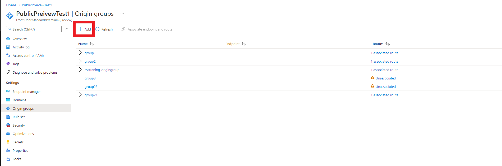
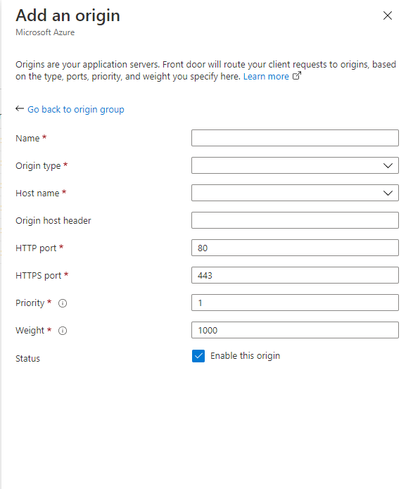
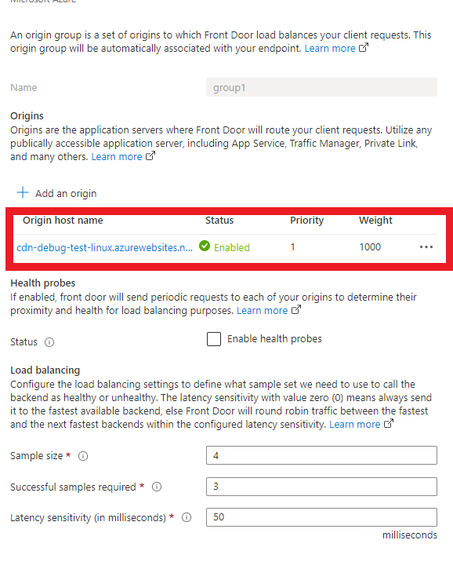
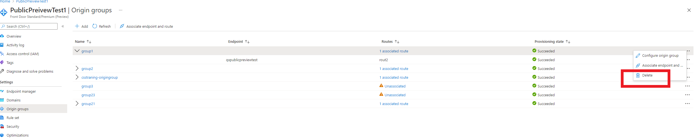
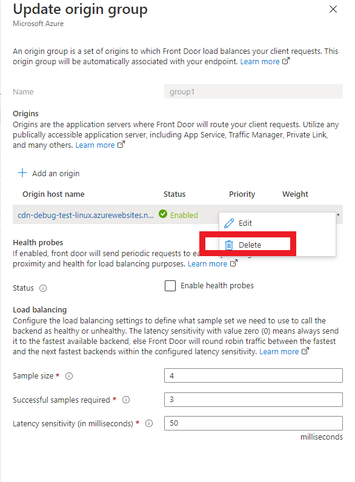

# Setup an Azure Front Door Origin

> [!Note]
> This documentation is for Azure Front Door Standard/Premium (Preview). Looking for information on Azure Front Door? View [here](../front-door-overview.md).

> [!IMPORTANT]
> Azure Front Door Standard/Premium (Preview) is currently in public preview.
> This preview version is provided without a service level agreement, and it's not recommended for production workloads. Certain features might not be supported or might have constrained capabilities.
> For more information, see [Supplemental Terms of Use for Microsoft Azure Previews](https://azure.microsoft.com/support/legal/preview-supplemental-terms/).

This article will show you how to create an Azure Front Door Standard/Premium (AFD) origin in an existing origin group. 

## Prerequisites

Before you can create an Azure Front Door Standard/Premium origin, you must have created at least one origin group.

## Create a new AFD Origin

1. Sign in to the [Azure portal](https://portal.azure.com) and navigate to your Azure Front Door Standard/Premium profile.

1. Select **Origin Group**. Then select **+ Add** to create a new origin group.
   
    

1. The **Add an origin group** page appears.
    
    

1. For **Name**,  enter a unique name for the new Azure Front Door origin group

1. Select **Add an Origin** to add a new origin to current group. 

    . 
  
    | Setting | Value |
    | --- | --- |
    | Name | Enter a unique name for the new Azure Front Door origin. |   
    | Origin Type | The type of resource you want to add. Azure Front Door Standard/Premium supports autodiscovery of your app origin from app service, cloud service, or storage. If you want a different resource in Azure or a non-Azure backend, select **Custom host**. |
    | Host Name  | If you didn't select **Custom host** for origin host type, select your backend by choosing the origin host name in the dropdown. |
    | Origin Host Header | Enter the host header value being sent to the backend for each request. For more information, see [Origin host header](concept-origin#hostheader). |
    | HTTP Port | Enter the value for the port that the origin supports for HTTP protocol. |
    | HTTPS Port | Enter the value for the port that the origin supports for HTTPS protocol. |
    | Priority | Assign priorities to your different origin when you want to use a primary service origin for all traffic. Also, provide backups if the primary or the backup origin is unavailable. For more information, see [Priority](#priority). |
    | Weight | Assign weights to your different origins to distribute traffic across a set of origins, either evenly or according to weight coefficients. For more information, see [Weights](#weighted). |
    | Status | Select this option to enable origin. |
    | Rule | Select Rule Sets that will be applied to this Route. For more information about how to configure Rules, see [Configure a Rule Set for Azure Front Door](how-to-configure-rule-set.md) | 

  > [!IMPORTANT]
  > During configuration, APIs don't validate if the origin is inaccessible from Front Door environments. Make sure that Front Door can reach your origin.

  Select **Add** to create the new origin. The created origin should appear in the origin list with the group
  
   . 

1. Select **Add** to add the origin group to current endpoint. The origin group should appear within the Origin group panel.

 

## Clean up resources
To delete an Origin group when you no longer needed it, click the **...** and then select **Delete** from the drop-down.

  . 

To delete an origin when you no longer need it, click the **...** and then select **Delete** from the drop-down. 

  . 

## Next steps
To learn about custom domains, continue to the tutorial for adding a custom domain to your AFD endpoint.

> [!div class="nextstepaction"]
> [Add a custom domain]()

