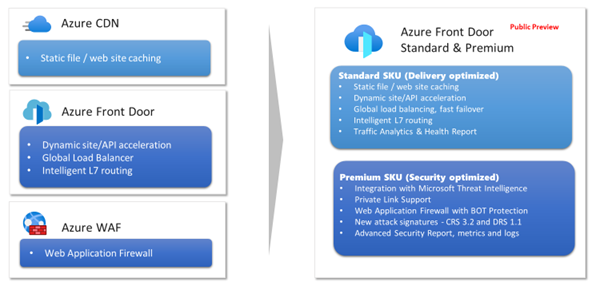

# Overview of Azure Front Door Standard/Premium SKU (Preview)

> [!Note]
> This documentation is for Azure Front Door Standard/Premium (Preview). Looking for information on Azure Front Door? View [here](../front-door-overview.md).

Azure Front Door is offered for 3 different SKUs, [Azure Front Door](../front-door-overview.md), Azure Front Door Standard (Preview), and Azure Front Door Premium (Preview). Azure Front Door Standard/Premium SKUs combines capabilities of Azure Front Door, Azure CDN Standard from Microsoft, Azure WAF into a single secure cloud CDN platform with intelligent threat protection.

> [!IMPORTANT]
> Azure Front Door Standard/Premium (Preview) is currently in public preview.
> This preview version is provided without a service level agreement, and it's not recommended for production workloads. Certain features might not be supported or might have constrained capabilities.
> For more information, see [**Supplemental Terms of Use for Microsoft Azure Previews**](https://azure.microsoft.com/support/legal/preview-supplemental-terms/).

* **Azure Front Door Standard SKU** is:

    * Content delivery optimized
    * Offering both static and dynamic content acceleration
    * Global load balancing
    * SSL offload
    * Domain and certificate management
    * Enhanced traffic analytics 
    * Basic security capabilities

* **Azure Front Door Premium SKU** builds on capabilities of Standard SKU, and adds:

    * Extensive security capabilities across WAF
    * BOT protection
    * Private Link support
    * Integration with Microsoft Threat Intelligence and security analytics. 

## Feature comparison

| Feature |      Standard      |  Premium |
|----------|:-------------:|------:|
| Custom domains | Yes | Yes |
| SSL Offload | Yes | Yes |
| Caching |  Yes  | Yes |
| Compression | Yes | Yes   |
| Global load balancing | Yes  | Yes |
| Layer 7 routing | Yes | Yes |
| URL rewrite | Yes | Yes |
| Rules Engine | Yes | Yes |
| Private Origin (Private Link) | No | Yes |
| WAF | Custom Rules only | Yes |
| Bot Protection | No | Yes |
| Enhanced Metrics and diagnostics | Yes | Yes |
| Traffic report | Yes | Yes |
| Security Report | No | Yes | 

## Next steps

Learn how to [create a Front Door](create-front-door-portal.md)
