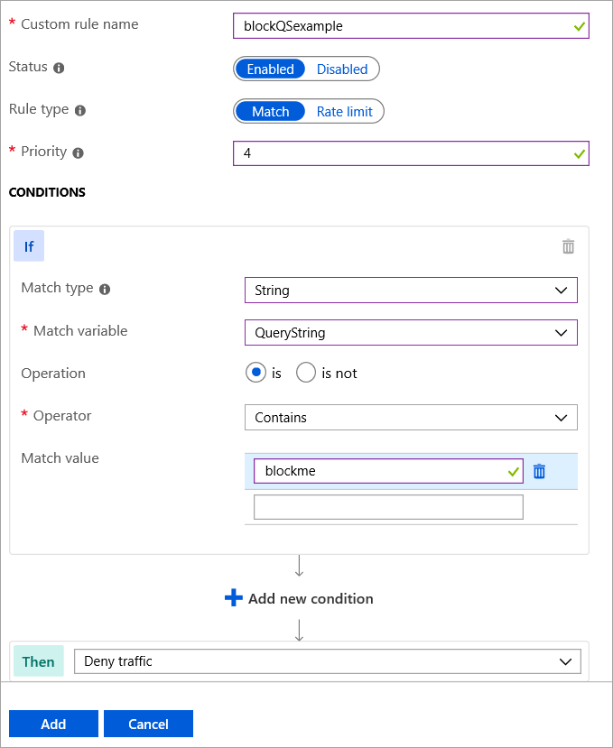

# Create a WAF policy for Azure Front Door by using the Azure portal

This article describes how to create a basic Azure web application firewall (WAF) policy and apply it to a front-end host at Azure Front Door.

## Prerequisites

Create a Front Door profile by following the instructions described in [Quickstart: Create a Front Door profile](quickstart-create-front-door.md). 

## Create a WAF policy

First, create a basic WAF policy with managed Default Rule Set (DRS) by using the portal. 

1. On the top left-hand side of the screen, select **Create a resource**>search for **WAF**>select **Web application firewall (Preview)** > select **Create**.
2. In the **Basics** tab of the **Create a WAF policy** page, enter or select the following information, accept the defaults for the remaining settings, and then select **Review + create**:

    | Setting                 | Value                                              |
    | ---                     | ---                                                |
    | Subscription            |Select your Front Door subscription name.|
    | Resource group          |Select your Front Door resource group name.|
    | Policy name             |Enter a unique name for your WAF policy.|

   

3. In the **Association** tab of the **Create a WAF policy** page, select **Add frontend host**, enter the following settings, and then select **Add**:

    | Setting                 | Value                                              |
    | ---                     | ---                                                |
    | Front door              | Select your Front Door profile name.|
    | Frontend host           | Select the name of your front door host, then select **Add**.|
    
    > [!NOTE]
    > If the frontend host is associated to a WAF policy, it is shown as grayed out. You must first remove the frontend host from the associated policy, and then re-associate the frontend host to a new WAF policy.
1. Select **Review + create**, then select **Create**.

## Configure WAF rules (optional)

### Change mode

When you create a WAF policy, by the default WAF policy is in **Detection** mode. In **Detection** mode, WAF does not block any requests, instead, requests matching the WAF rules are logged at WAF logs.
To see WAF in action, you can change the mode settings from **Detection** to **Prevention**. In **Prevention** mode, requests that match rules that are defined in Default Rule Set (DRS) are blocked and logged at WAF logs.

 

### Custom rules

You can create a custom rule by selecting **Add custom rule** under the **Custom rules** section. This launches the custom rule configuration page. Below is an example of configuring a custom rule to block a request if the query string contains **blockme**.

### Default Rule Set (DRS)

Azure-managed Default Rule Set is enabled by default. To disable an individual rule within a rule group, expand the rules within that rule group,  select the **check box** in front of the rule number, and select **Disable** on the tab above. To change actions types for individual rules within the rule set, select the check box in front of the rule number, and then select the **Change action** tab above.

 

## Next steps

- Learn about [Azure web application firewall](waf-overview.md).
- Learn more about [Azure Front Door](front-door-overview.md).
