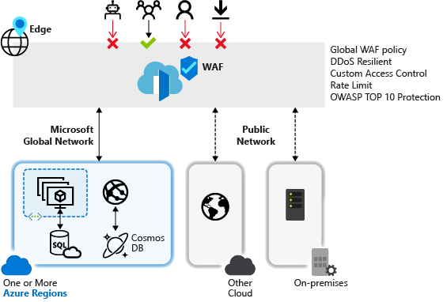

# What is Azure web application firewall for Azure Front Door?

Azure web application firewall (WAF) provides centralized protection for your web applications that are globally delivered using Azure Front Door. It is designed and operated to defend your web services against common exploits and vulnerabilities, and keep your service highly available for your users in addition to helping you meet compliance requirements.

Web applications are increasingly the targets of malicious attacks such as denial of service floods, SQL injection attacks, and cross-site scripting attacks. These malicious attacks may cause service outage and data loss, pose a significant threat to web application owners.

Preventing such attacks in application code can be challenging and may require rigorous maintenance, patching and monitoring at multiple layers of the application topology. A centralized web application firewall helps make security management much simpler and gives better assurance to application administrators against threats or intrusions. In addition, a WAF solution can react to a security threat faster by patching a known vulnerability at a central location, instead of securing each of individual web applications.

WAF for Front Door is a global and centralized solution. It is deployed on Azure network edge locations around the globe and every incoming request for a WAF enabled web application delivered by Front Door is inspected at the network edge. This allows WAF to prevent malicious attacks close to the attack sources, before they enter your virtual network and offers global protection at scale without sacrificing performance. A WAF policy can be easily linked to any Front Door profile in your subscription and new rules can be deployed within minutes, allowing you to respond quickly to changing threat patterns.

Azure WAF can also be enabled with Application Gateway. For more information, see [Web application firewall](../application-gateway/waf-overview.md).

## WAF policy and rules

You can configure a WAF policy and associate that policy to one or more Front Door front-ends for protection. A WAF policy consists of two types of security rules:

- custom rules that are authored by the customer.

- managed rule sets that are a collection of Azure-managed pre-configured set of rules.

When both are present, custom rules are processed before processing the rules in a managed rule set. A rule is made of a match condition, a priority, and an action. Action types supported are: ALLOW, BLOCK, LOG, and REDIRECT. You can create a fully customized policy that meets your specific application protection requirements by combining managed and custom rules.

Rules within a policy are processed in a prioritized order where priority is a unique integer that defines the order of rules being processed. Smaller integer value denotes a higher priority and those are evaluated before rules with a higher integer value. Once a rule is matched, the corresponding action that was defined in the rule is applied to the request. Once such a match is processed, rules with lower priorities are not processed further.

A web application delivered by Front Door can have only one WAF policy associated with it at a time. However, you can have a Front Door configuration without any WAF policies associated with it. If a WAF policy is present, it is replicated to all of our edge locations to ensure consistency in security policies across the world.

## WAF modes

WAF policy can be configured to run in the following two modes:

- **Detection mode:** When run in detection mode, WAF does not take any other actions other than monitors and logs the request and its matched WAF rule to WAF logs. You can turn on logging diagnostics for Front Door (when using portal, this can be achieved by going to the **Diagnostics** section in the Azure portal).

- **Prevention mode:** When configured to run in prevention mode, WAF takes the specified action if a request matches a rule and if a match is found, no further rules with lower priority are evaluated. Any matched requests are also logged in the WAF logs.

## WAF actions

WAF customers can choose to run from one of the actions when a request matches a rule’s conditions:

- **Allow:**  Request passes through the WAF and is forwarded to back-end. No further lower priority rules can block this request.
- **Block:** The request is blocked and WAF sends a response to the client without forwarding the request to the back-end.
- **Log:**  Request is logged in the WAF logs and WAF continues evaluating lower priority rules.
- **Redirect:** WAF redirects the request to the specified URI. The URI specified is a policy level setting. Once configured, all requests that match the **Redirect** action will be sent to that URI.

## WAF rules

A WAF policy can consist of two types of security rules - custom rules, authored by the customer and managed rulesets, Azure-managed pre-configured set of rules.

### Custom authored rules

You can configure custom rules WAF as follows:

- **IP allow list and block list:** You can configure custom rules to control access to your web applications based on a list of client IP addresses or IP address ranges. Both IPv4 and IPv6 address types are supported. This list can be configured to either block or allow those requests where the source IP matches an IP in the list.

- **Geographic based access control:** You can configure custom rules to control access to your web applications based on the country code associated with a client’s IP address.

- **HTTP parameters-based access control:** You can configure custom rules based on string matching HTTP/HTTPS request parameters such as query strings, POST args, Request URI, Request Header, and Request Body.

- **Request method-based access control:** You may configure custom rules based on the HTTP request method of the request such as GET, PUT, or HEAD.

- **Size constraint:** You can configure custom rules based on the lengths of specific parts of a request such as query string, Uri, or request body.

- **Rate limiting rules:** A rate control rule is to limit abnormal high traffic from any client IP. You may configure a threshold on the number of web requests allowed from a client IP during a one-minute duration. This is distinct from an IP list-based allow/block custom rule that either allows all or blocks all request from a client IP. Rate limiting can be combined with additional match conditions such as HTTP(S) parameters matching for granular rate control.

### Azure-managed rule sets

Azure-managed rule sets provide an easy way to deploy protection against a common set of security threats. Since such rulesets are managed by Azure, the rules are updated as needed to protect against new attack signatures. At public preview, the Azure-managed Default Rule Set includes rules against the following threat categories:

- Cross-site scripting
- Java attacks
- Local file inclusion
- PHP injection attacks
- Remote command execution
- Remote file inclusion
- Session fixation
- SQL injection protection
- Protocol attackers

The version number of the Default Rule Set will increment when new attack signatures are added to the rule set.
Default Rule Set is enabled by default in Detection mode in your WAF policies. You can disable or enable individual rules within the Default Rule Set to meet your application requirements. You can also set specific actions (ALLOW/BLOCK/REDIRECT/LOG) per rule. 
Default action is to BLOCK. In addition, custom rules can be configured in the same WAF policy if you wish to bypass any of the pre-configured rules in the Default Rule Set.
Custom rules are always applied before rules in the Default Rule Set are evaluated. If a request matches a custom rule, corresponding rule action is applied, and the request is either blocked or passed through to back-end, without invocation of any further custom rules or the rules in the Default Rule Set. Furthermore, you have the option to remove Default Rule Set from your WAF policies.

### Bot protection rule (preview)

A managed Bot protection rule set can be enabled for your WAF to take custom actions on requests from known malicious IP addresses. The IP addresses are sourced from the Microsoft Threat Intelligence feed. [Intelligent Security Graph](https://www.microsoft.com/security/operations/intelligence) powers Microsoft threat intelligence and is used by multiple services including Azure Security Center.

> [!IMPORTANT]
> Bot protection rule set is currently in public preview and is provided with a preview service level agreement. Certain features may not be supported or may have constrained capabilities.  See the [Supplemental Terms of Use for Microsoft Azure Previews](https://azure.microsoft.com/support/legal/preview-supplemental-terms/) for details.

If Bot Protection is enabled, incoming requests that match Malicious Bots client IPs are logged at FrontdoorWebApplicationFirewallLog log. You may access WAF logs from storage account, event hub or log analytics. 

## Configuration

Configuring and deploying all WAF rule types is fully supported using Azure portal, REST APIs, Azure Resource Manager templates, and Azure PowerShell.

## Monitoring

Monitoring for WAF at Front Door is integrated with Azure Monitor to track alerts and easily monitor traffic trends.

## Next steps

- Learn how to [configure a WAF policy for Front Door using the Azure portal](waf-front-door-create-portal.md)