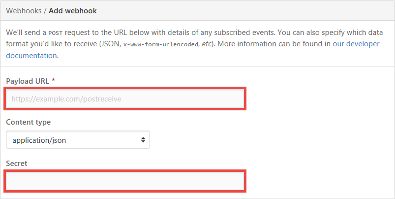

# Azure Functions HTTP and webhook bindings
[!INCLUDE [functions-selector-bindings](../../includes/functions-selector-bindings.md)]

This article explains how to configure and code HTTP and webhook triggers and bindings in Azure Functions.
Azure Functions supports trigger and output bindings for HTTP requests and webhooks.

An [HTTP trigger](#httptrigger) lets you invoke a function with an HTTP request. A
[webhook trigger](#hooktrigger) is an HTTP trigger that's tailored for
a specific [webhook](https://en.wikipedia.org/wiki/Webhook) provider (e.g. [GitHub](https://developer.github.com/webhooks/) and
[Slack](https://api.slack.com/outgoing-webhooks)).

[!INCLUDE [intro](../../includes/functions-bindings-intro.md)]

<a name="httptrigger"></a>

## HTTP trigger
Use the HTTP trigger to respond to an HTTP request.

The HTTP trigger to a function uses the following JSON object in the `bindings` array of function.json:

```json
{
    "name": "<Name of request object/body in function signature>",
    "type": "httpTrigger",
    "direction": "in",
    "authLevel": "<'function', 'anonymous', or 'admin' - see below>"
},
```

`authLevel` defines how the HTTP trigger validates the HTTP requests:

* `anonymous`: no the API key required
* `function`: function-specific API key required
* `admin`: master API key required

For more information, see [Validate requests with API keys](#keys).

[Additional settings](https://github.com/Azure/azure-webjobs-sdk-script/wiki/host.json) can be provided in a host.json file to further fine tune HTTP triggers.  

<a name="url"></a>

## URL to trigger the function
By default when you create a function for an HTTP trigger, or WebHook, the function is addressable with a route of the form:

    http://<yourapp>.azurewebsites.net/api/<funcname> 

You can customize this route using the optional `route` property on the HTTP trigger's input binding. As an example, the following *function.json* file defines a `route` property for an HTTP trigger:

    {
      "bindings": [
        {
          "type": "httpTrigger",
          "name": "req",
          "direction": "in",
          "methods": [ "get" ],
          "route": "products/{category:alpha}/{id:int?}"
        },
        {
          "type": "http",
          "name": "res",
          "direction": "out"
        }
      ]
    }

Using this configuration, the function is now addressable with the following route instead of the original route.

    http://<yourapp>.azurewebsites.net/api/products/electronics/357

This allows the function code to support two parameters in the address, `category` and `id`. You can use any [Web API Route Constraint](https://www.asp.net/web-api/overview/web-api-routing-and-actions/attribute-routing-in-web-api-2#constraints) with your parameters. The following C# function code makes use of both parameters.

    public static Task<HttpResponseMessage> Run(HttpRequestMessage request, string category, int? id, 
                                                    TraceWriter log)
    {
        if (id == null)
           return  req.CreateResponse(HttpStatusCode.OK, $"All {category} items were requested.");
        else
           return  req.CreateResponse(HttpStatusCode.OK, $"{category} item with id = {id} has been requested.");
    }

Here is Node.js function code to use the same route parameters.

    module.exports = function (context, req) {

        var category = context.bindingData.category;
        var id = context.bindingData.id;

        if (!id) {
            context.res = {
                // status: 200, /* Defaults to 200 */
                body: "All " + category + " items were requested."
            };
        }
        else {
            context.res = {
                // status: 200, /* Defaults to 200 */
                body: category + " item with id = " + id + " was requested."
            };
        }

        context.done();
    } 

By default, all function routes are prefixed with *api*. You can also customize or remove the prefix using the `http.routePrefix` property in your *host.json* file. The following example removes the *api* route prefix by using an empty string for the prefix in the *host.json* file.

    {
      "http": {
        "routePrefix": ""
      }
    }

For detailed information on how to update the *host.json* file for your function, See, [How to update function app files](functions-reference.md#fileupdate). 

For information on other properties you can configure in your *host.json* file, see [host.json reference](https://github.com/Azure/azure-webjobs-sdk-script/wiki/host.json).

<a name="httptriggerusage"></a>

## HTTP trigger usage
There is no special handling for C# functions, because you control what is provided by specifying the parameter type.
If you specify `HttpRequestMessage`, you get the request object. If you specify a POCO type, the Functions runtime tries
to parse a JSON object in the body of the request to populate the object properties.

For Node.js functions, the Functions runtime provides the request body instead of the request object.

<a name="httptriggersample"></a>

## HTTP trigger sample
Suppose you have the following HTTP trigger in the `bindings` array of function.json:

```json
{
    "name": "req",
    "type": "httpTrigger",
    "direction": "in",
    "authLevel": "function"
},
```

See the language-specific sample that looks for a `name` parameter either in the query string or the body of the HTTP request.

* [C#](#httptriggercsharp)
* [F#](#httptriggerfsharp)
* [Node.js](#httptriggernodejs)

<a name="httptriggercsharp"></a>

### HTTP trigger sample in C# #
```csharp
using System.Net;
using System.Threading.Tasks;

public static async Task<HttpResponseMessage> Run(HttpRequestMessage req, TraceWriter log)
{
    log.Info($"C# HTTP trigger function processed a request. RequestUri={req.RequestUri}");

    // parse query parameter
    string name = req.GetQueryNameValuePairs()
        .FirstOrDefault(q => string.Compare(q.Key, "name", true) == 0)
        .Value;

    // Get request body
    dynamic data = await req.Content.ReadAsAsync<object>();

    // Set name to query string or body data
    name = name ?? data?.name;

    return name == null
        ? req.CreateResponse(HttpStatusCode.BadRequest, "Please pass a name on the query string or in the request body")
        : req.CreateResponse(HttpStatusCode.OK, "Hello " + name);
}
```

<a name="httptriggerfsharp"></a>

### HTTP trigger sample in F# #
```fsharp
open System.Net
open System.Net.Http
open FSharp.Interop.Dynamic

let Run(req: HttpRequestMessage) =
    async {
        let q =
            req.GetQueryNameValuePairs()
                |> Seq.tryFind (fun kv -> kv.Key = "name")
        match q with
        | Some kv ->
            return req.CreateResponse(HttpStatusCode.OK, "Hello " + kv.Value)
        | None ->
            let! data = Async.AwaitTask(req.Content.ReadAsAsync<obj>())
            try
                return req.CreateResponse(HttpStatusCode.OK, "Hello " + data?name)
            with e ->
                return req.CreateErrorResponse(HttpStatusCode.BadRequest, "Please pass a name on the query string or in the request body")
    } |> Async.StartAsTask
```

You need a `project.json` file that uses NuGet to reference the `FSharp.Interop.Dynamic` and `Dynamitey` assemblies, like this:

```json
{
  "frameworks": {
    "net46": {
      "dependencies": {
        "Dynamitey": "1.0.2",
        "FSharp.Interop.Dynamic": "3.0.0"
      }
    }
  }
}
```

This will use NuGet to fetch your dependencies and will reference them in your script.

<a name="httptriggernodejs"></a>

### HTTP trigger sample in nodejs
```javascript
module.exports = function(context, req) {
    context.log('Node.js HTTP trigger function processed a request. RequestUri=%s', req.originalUrl);

    if (req.query.name || (req.body && req.body.name)) {
        context.res = {
            // status: 200, /* Defaults to 200 */
            body: "Hello " + (req.query.name || req.body.name)
        };
    }
    else {
        context.res = {
            status: 400,
            body: "Please pass a name on the query string or in the request body"
        };
    }
    context.done();
};
```

<a name="hooktrigger"></a>

## Webhook trigger
Use the webhook trigger to respond to a specific webhook provider. A webhook trigger is an HTTP trigger that has the
following features designed for webhooks:

* The request handlers are implemented using [Microsoft ASP.NET WebHooks](https://github.com/aspnet/WebHooks).
* For some webhook providers (e.g. [GitHub](http://go.microsoft.com/fwlink/?LinkID=761099&clcid=0x409)), the Functions runtime takes care of the
  [validation logic](https://developer.github.com/webhooks/securing/#validating-payloads-from-github) for you.

The webhook trigger to a function uses the following JSON object in the `bindings` array of function.json:

```json
{
    "webHookType": "<github|slack|genericJson>",
    "name": "<Name of request object/body in function signature>",
    "type": "httpTrigger",
    "direction": "in",
},
```

### Configure webhook providers
The GitHub webhook is simple to configure. You create GitHub webhook trigger in Functions, and copy its [URL](#url) and [API key](#keys)
into your GitHub repository's **Add webhook** page.



The [Slack webhook](https://api.slack.com/outgoing-webhooks) generates a token for you instead of letting you specify it, so you must configure
your function-specific `key` API key with the token from Slack (to see where to define the API key, see [Types of API keys](#keys)).

<a name="hooktriggerusage"></a>

## Webhook trigger usage
See [HTTP trigger usage](#httptriggerusage).

<a name="hooktriggersample"></a>

## Webhook trigger sample
Suppose you have the following webhook trigger in the `bindings` array of function.json:

```json
{
    "webHookType": "github",
    "name": "req",
    "type": "httpTrigger",
    "direction": "in",
},
```

See the language-specific sample that logs GitHub issue comments.

* [C#](#hooktriggercsharp)
* [F#](#hooktriggerfsharp)
* [Node.js](#hooktriggernodejs)

<a name="hooktriggercsharp"></a>

### Webhook sample in C# #
```csharp
#r "Newtonsoft.Json"

using System;
using System.Net;
using System.Threading.Tasks;
using Newtonsoft.Json;

public static async Task<object> Run(HttpRequestMessage req, TraceWriter log)
{
    string jsonContent = await req.Content.ReadAsStringAsync();
    dynamic data = JsonConvert.DeserializeObject(jsonContent);

    log.Info($"WebHook was triggered! Comment: {data.comment.body}");

    return req.CreateResponse(HttpStatusCode.OK, new {
        body = $"New GitHub comment: {data.comment.body}"
    });
}
```

<a name="hooktriggerfsharp"></a>

### Webhook sample in F# #
```fsharp
open System.Net
open System.Net.Http
open FSharp.Interop.Dynamic
open Newtonsoft.Json

type Response = {
    body: string
}

let Run(req: HttpRequestMessage, log: TraceWriter) =
    async {
        let! content = req.Content.ReadAsStringAsync() |> Async.AwaitTask
        let data = content |> JsonConvert.DeserializeObject
        log.Info(sprintf "GitHub WebHook triggered! %s" data?comment?body)
        return req.CreateResponse(
            HttpStatusCode.OK,
            { body = sprintf "New GitHub comment: %s" data?comment?body })
    } |> Async.StartAsTask
```

<a name="hooktriggernodejs"></a>

### Webhook sample in nodejs
```javascript
module.exports = function (context, data) {
    context.log('GitHub WebHook triggered!', data.comment.body);
    context.res = { body: 'New GitHub comment: ' + data.comment.body };
    context.done();
};
```

<a name="output"></a>

## HTTP output binding
Use the HTTP output binding to respond to the HTTP request sender.

```json
{
    "name": "res",
    "type": "http",
    "direction": "out"
}
```

<a name="outputusage"></a>

## Output usage
You can use the output parameter (e.g. `res`) to respond to the http or webhook caller. Alternatively, you can use the
standard `Request.CreateResponse()` (C#) or `context.res` pattern to return your response. For examples on how to use
the latter method, see [HTTP trigger sample](#httptriggersample) and [Webhook trigger sample](#hooktriggersample).

<a name="keys"></a>
## Working with keys
HttpTriggers can leverage keys for added security. A standard HttpTrigger can use these as an API key, requiring the key to be present on the request. Webhooks can use keys to authorize requests in a variety of ways, depending on what the provider supports.

Keys are stored as part of your function app in Azure and are encrypted at rest. To view your keys, create new ones, or roll keys to new values, navigate to one of your functions within the portal and select "Manage." 

There are two types of keys:
- **Admin keys**: These keys are shared by all functions within the function app. When used as an API key, these allow access to any function within the function app.
- **Function keys**: These keys apply only to the specific functions under which they are defined. When used as an API key, these only allow access to that function.

Each key is named for reference, and there is a default key (named "default") at the function and admin level. The **master key** is a default admin key named "_master" that is defined for each function app and cannot be revoked. It provides administrative access to the runtime APIs. Using `"authLevel": "admin"` in the binding JSON will require this key to be presented on the request; any other key will result in a authorization failure.

> [!NOTE]
> Due to the elevated permissions granted by the master key, you should not share this key with third parties or distribute it in native client applications. Exercise caution when choosing the admin authorization level.
> 
> 

### API key authorization
By default, an HttpTrigger requires an API key in the HTTP request. So your HTTP request normally looks like this:

    https://<yourapp>.azurewebsites.net/api/<function>?code=<ApiKey>

The key can be included in a query string variable named `code`, as above, or it can be included in an `x-functions-key` HTTP header. The value of the key can be any function key defined for the function, or any admin key.

You can choose to allow requests without keys or specify that the master key must be used by changing the `authLevel` property in the binding JSON
(see [HTTP trigger](#httptrigger)).

### Keys and webhooks
Webhook authorization is handled by the webhook reciever component, part of the HttpTrigger, and the mechanism varies based on the webhook type. Each mechanism does, however rely on a key. By default, the function key named "default" will be used. If you wish to use a different key, you will need to configure the webhook provider to send the key name with the request in one of the following ways:

- **Query string**: The provider passes the key name in the `clientid` query string parameter (e.g., `https://<yourapp>.azurewebsites.net/api/<funcname>?clientid=<keyname>`).
- **Request header**: The provider passes the key name in the `x-functions-clientid` header.

> [!NOTE]
> Function keys take precedence over admin keys. If two keys are defined with the same name, the function key will be used.
> 
> 


## Next steps
[!INCLUDE [next steps](../../includes/functions-bindings-next-steps.md)]

