<properties
	pageTitle="Intro to Azure | Microsoft Azure"
	description="New to Microsoft Azure? Get a basic overview of the services it offers with examples of how they are useful."
	services=" "
	documentationCenter=".net"
	authors="Rboucher"
	manager="jwhit"
	editor=""/>

<tags
	ms.service="multiple"
	ms.workload="multiple"
	ms.tgt_pltfrm="na"
	ms.devlang="na"
	ms.topic="article"
	ms.date="06/30/2015"  
	ms.author="robb"/>

# Introducing Microsoft Azure

Microsoft Azure is Microsoft's application platform for the public cloud.  The goal of this article is to give you a foundation for understanding the fundamentals of Azure, even if you don't know anything about [cloud computing](https://azure.microsoft.com/overview/what-is-cloud-computing/).

**How to read this article**

Azure is growing all the time so it's easy to get overloaded.  The basic services are listed earlier in the paper. Start with just those, then go through the additional services. That doesn't mean you can't use just the additional services by themselves, but the basic services make up the core of an application running in Azure.

**Give feedback**

Your feedback is important. This article should give you an effective overview of Azure. If it does not, tell us in the comments section at the bottom of the page. Give some detail on what you expected to see and how to improve the article.  

## The Components of Azure

Azure groups services into categories in the Management Portal and on various visual aids like the [What Is Azure Infographic](https://azure.microsoft.com/documentation/infographics/azure/) . The Management Portal is what you use to manage most (but not all) services in Azure.

This paper will use a **different organization** to talk about services based on similar function, and to call out important sub-services that are part of larger ones.  

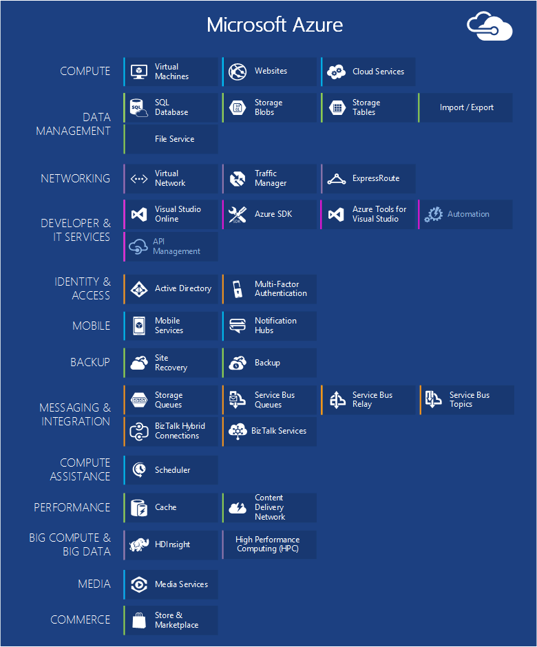   
 *Figure: Azure provides Internet-accessible application services running in Azure datacenters.*

## Management Portal
Azure has a web interface called the [Management Portal](http://manage.windowsazure.com) that allows administrators to access and administer most, but not all Azure features.  Microsoft typically releases the newer UI portal in beta before retiring an older one. The newer one is called the ["Azure Preview Portal"](https://portal.azure.com/).

There is typically a long overlap when both portals are active. While core services will appear in both portals, not all functionality may be available in both. Newer services may show up in the newer portal first and older services and functionality may only exist in the older one.  The message here is that if you don't find something in the older portal, check the newer one and vice-versa.

## Compute

One of the most basic things a cloud platform does is execute applications. Each of the Azure compute models has its own role to play.

You can use these technologies separately or combine them as needed to create the right foundation for your application. The approach you choose depends on what problems you're trying to solve.

### Azure Virtual Machines

   
*Figure: Azure Virtual Machines gives you full control over virtual machine instances in the cloud.*

The ability to create a virtual machine on demand, whether from a standard image or from one you supply, can be very useful. This approach, commonly known as Infrastructure as a Service ([IaaS](https://azure.microsoft.com/overview/what-is-iaas/)), is what Azure Virtual Machines provides. Figure 2 shows a combination of how an Virtual Machine (VM) runs and how to create one from a VHD.  

To create a VM, you specify which VHD to use and the VM's size.  You then pay for the time that the VM is running. You pay by the minute and only while it's running, though there is a minimal storage charge for keeping the VHD available. Azure offers a gallery of stock VHDs (called "images") that contain a bootable operating system to start from. These include Microsoft and partner options, such as Windows Server and Linux, SQL Server, Oracle and many more. You're free to create VHDs and images, and then upload them yourself. You can even upload VHDs that contain only data and then access them from your running VMs.

Wherever the VHD comes from, you can persistently store any changes made while a VM is running. The next time you create a VM from that VHD, things pick up where you left off. The VHDs that back the Virtual Machines are stored in Azure Storage blobs, which we talk about later.  That means you get redundancy to ensure your VMs won’t disappear due to hardware and disk failures. It's also possible to copy the changed VHD out of Azure, then run it locally.

Your application runs within one or more Virtual Machines, depending on how you created it before or decide to create it from scratch now.

This quite general approach to cloud computing can be used to address many different problems.

**Virtual Machine Scenarios**

1.	**Dev/Test** - You might use them to create an inexpensive development and test platform that you can shut down when you've finished using it. You might also create and run applications that use whatever languages and libraries you like. Those applications can use any of the data management options that Azure provides, and you can also choose to use SQL Server or another DBMS running in one or more virtual machines.
2.	**Move Applications to Azure (Lift-and-shift)** - "Lift-and-shift" refers to moving you application much like you'd use a forklift to move a large object.  You "lift" the VHD from your local datacenter, and "shift" it to Azure and run it there.  You will typically have to do some work to remove dependencies on other systems. If there are too many, you may choose option 3 instead.  
3.	**Extend your Datacenter** - Use Azure VMs as an extension of your on-premises datacenter, running SharePoint or other applications. To support this, it's possible to create Windows domains in the cloud by running Active Directory in Azure VMs. You can use Azure Virtual Network (mentioned later) to tie your local network and your network in Azure together.

### Web Apps

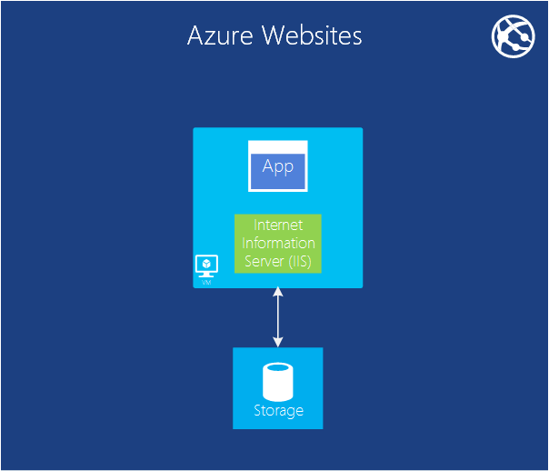   
 *Figure: Azure Web Apps runs a website application in the cloud without having to manage the underlying web server.*

One of the most common things that people do in the cloud is run websites and web applications. Azure Virtual Machines allows this, but it still leaves you with the responsibility of administering one or more VMs and the underlying operating systems. Cloud services web roles can do this, but deploying and maintaining them still takes administrative work.  What if you just want a website where somebody else takes care of the administrative work for you?

This is exactly what Web Apps provides. This compute model offers a managed web environment using the Azure Management portal as well as APIs. You can move an existing website application into Web Apps unchanged, or you can create a new one directly in the cloud. Once a website is running, you can add or remove instances dynamically, relying on Azure Web Apps to load balance requests across them. Azure Apps offers both a shared option, where your website runs in a virtual machine with other sites, and a standard option that allows a site to run in its own VM. The standard option also lets you increase the size (computing power) of your instances if needed.

For development, Web Apps supports .NET, PHP, Node.js, Java and Python along with SQL Database and MySQL (from ClearDB, a Microsoft partner) for relational storage. It also provides built-in support for several popular applications, including WordPress, Joomla, and Drupal. The goal is to provide a low-cost, scalable, and broadly useful platform for creating websites and web applications in the public cloud.

**Web Apps Scenarios**

Web Apps is intended to be useful for corporations, developers, and web design agencies. For corporations, it's an easy-to-manage, scalable, highly secure, and highly available solution for running presence websites. When you need to set up a Website, it’s best to start with Azure Web Apps and proceed to Cloud Services once you need a feature that’s not available. See the end of the "Compute" section for more links that can help you to choose between the options.

### Cloud Services
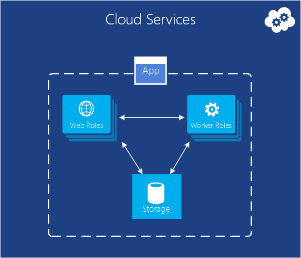   
*Figure: Azure Cloud Services provides a place to run highly scalable custom code on a Platform as a Service (PaaS) environment*

Suppose you want to build a cloud application that can support lots of simultaneous users, doesn't require much administration, and never goes down. You might be an established software vendor, for example, that's decided to embrace Software as a Service (SaaS) by building a version of one of your applications in the cloud. Or you might be a start-up creating a consumer application that you expect will grow fast. If you're building on Azure, which execution model should you use?

Azure Web Apps allows creating this kind of web application, but there are some constraints. You don't have administrative access, for example, which means that you can't install arbitrary software. Azure Virtual Machines gives you lots of flexibility, including administrative access, and you certainly can use it to build a very scalable application, but you'll have to handle many aspects of reliability and administration yourself. What you'd like is an option that gives you the control you need but also handles most of the work required for reliability and administration.

This is exactly what's provided by Azure Cloud Services. This technology is designed expressly to support scalable, reliable, and low-admin applications, and it's an example of what's commonly called Platform as a Service (PaaS). To use it, you create an application using the technology you choose, such as C#, Java, PHP, Python, Node.js, or something else. Your code then executes in virtual machines (referred to as instances) running a version of Windows Server.

But these VMs are distinct from the ones you create with Azure Virtual Machines. For one thing, Azure itself manages them, doing things like installing operating system patches and automatically rolling out new patched images. This implies that your application shouldn't maintain state in web or worker role instances; it should instead be kept in one of the Azure data management options described in the next section. Azure also monitors these VMs, restarting any that fail. You can set cloud services to automatically create more or fewer instances in response to demand. This allows you to handle increased usage, and then scale back so you aren’t paying as much when there is less usage.

You have two roles to choose from when you create an instance, both based on Windows Server. The main difference between the two is that an instance of a web role runs IIS, while an instance of a worker role does not. Both are managed in the same way, however, and it's common for an application to use both. For example, a web role instance might accept requests from users, then pass them to a worker role instance for processing. To scale your application up or down, you can request that Azure create more instances of either role or shut down existing instances. And similar to Azure Virtual Machines, you're charged only for the time that each web or worker role instance is running.

**Cloud Services Scenarios**

Cloud Services are ideal to support massive scale out when you need more control over the platform than provided by Azure Web Apps but don’t need control over the underlying operating system.

#### Choosing a Compute Model
The page [Azure Web Apps, Cloud Services and Virtual Machines comparison](./app-service-web/choose-web-site-cloud-service-vm.md) provides more detailed information on how to choose a Compute model.

## Data Management

Applications need data, and different kinds of applications need different kinds of data. Because of this, Azure provides several different ways to store and manage data. Azure provides many storage options, but all are designed for very durable storage.  With any of these options, there are always 3 copies of your data kept in sync across an Azure datacenter -- 6 if you allow Azure to use geo-redundancy to back up to another datacenter at least 300 miles away.     

### In Virtual Machines
The ability to run SQL Server or another DBMS in a VM created with Azure Virtual Machines has already been mentioned. Realize that this option isn't limited to relational systems; you're also free to run NoSQL technologies such as MongoDB and Cassandra. Running your own database system is straightforward-it replicates what we're used to in our own datacenters-but it also requires handling the administration of that DBMS.  In other options, Azure handles more or all of the administration for you.

Again, the state of the Virtual Machine and any additional data disk you create or upload are backed by blob storage (which we talk about later).  

### Azure SQL Database
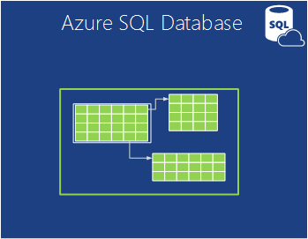   

*Figure: Azure SQL Database provides a managed relational database service in the cloud.*

For relational storage, Azure provides the feature SQL Database. Don't let the naming fool you. This is different than a typical SQL Database provided by SQL Server running on top of Windows Server.  

Formerly called SQL Azure, Azure SQL Database provides all of the key features of a relational database management system, including atomic transactions, concurrent data access by multiple users with data integrity, ANSI SQL queries, and a familiar programming model. Like SQL Server, SQL Database can be accessed using Entity Framework, ADO.NET, JDBC, and other familiar data access technologies. It also supports most of the T-SQL language, along with SQL Server tools such as SQL Server Management Studio. For anybody familiar with SQL Server (or another relational database), using SQL Database is straightforward.

But SQL Database isn't just a DBMS in the cloud-it's a PaaS service. You still control your data and who can access it, but SQL Database takes care of the administrative grunt work, such as managing the hardware infrastructure and automatically keeping the database and operating system software up to date. SQL Database also provides high availability, automatic backups, point-in-time restore capabilities, and can replicate copies across geographical regions.  

**Scenarios for SQL Database**

If you're creating an Azure application (using any of the compute models) that needs relational storage, SQL Database can be a good option. Applications running outside the cloud can also use this service, though, so there are plenty of other scenarios. For instance, data stored in SQL Database can be accessed from different client systems, including desktops, laptops, tablets, and phones. And because it provides built-in high availability through replication, using SQL Database can help minimize downtime.

### Tables
  

*Figure: Azure Tables provides a flat NoSQL way to store data.*

This feature is sometimes called different terms as it's part of a larger feature called "Azure Storage". If you see "tables", "Azure tables" or "storage tables", it's all the same thing.  

And don't be confused by the name: this technology doesn't provide relational storage. In fact, it's an example of a NoSQL approach called a key/value store. Azure Tables let an application store properties of various types, such as strings, integers, and dates. An application can then retrieve a group of properties by providing a unique key for that group. While complex operations like joins aren't supported, tables offer fast access to typed data. They're also very scalable, with a single table able to hold as much as a terabyte of data. And matching their simplicity, tables are usually less expensive to use than SQL Database's relational storage.

**Scenarios for Tables**

Suppose you want to create an Azure application that needs fast access to typed data, maybe lots of it, but doesn't need to perform complex SQL queries on this data. For example, imagine you're creating a consumer application that needs to store customer profile information for each user. Your app is going to be very popular, so you need to allow for lots of data, but you won't do much with this data beyond storing it, then retrieving it in simple ways. This is exactly the kind of scenario where Azure Tables makes sense.

### Blobs
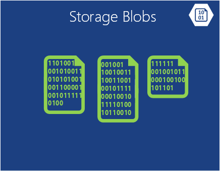    
*Figure: Azure Blobs provides unstructured binary data.*  

Azure Blobs (again "Blob Storage" and just "Storage Blobs" are the same thing) is designed to store unstructured binary data. Like Tables, Blobs provides inexpensive storage, and a single blob can be as large as 1TB (one terabyte). Azure applications can also use Azure drives, which let blobs provide persistent storage for a Windows file system mounted in an Azure instance. The application sees ordinary Windows files, but the contents are actually stored in a blob.

Blob storage is used by many other Azure features (including Virtual Machines), so it can certainly handle your workloads too.

**Scenarios for Blobs**

An application that stores video, massive files, or other binary information can use blobs for simple, cheap storage. Blobs are also commonly used in conjunction with other services like Content Delivery Network, which we will talk about later.  

### Import / Export
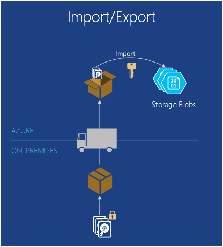  

*Figure: Azure Import / Export provides the ability to ship a physical hard drive to or from Azure for faster and cheaper bulk data import or export.*  

Sometimes you want to move a lot of data into Azure. That would take a long time, perhaps days, and use a lot of bandwidth. In these cases you can use Azure Import/Export, which allows you to ship Bitlocker-encrypted 3.5" SATA hard drives directly to Azure data centers, where Microsoft will transfer the data into blob storage for you.  After the upload is completed, Microsoft ships the drives back to you.  You can also request that large amounts of data from Blob Storage be exported onto hard drives and sent back to you via mail.

**Scenarios for Import / Export**

- **Large Data Migration** - Anytime you have large amounts of data (Terabytes) that you want to upload to Azure, the Import/Export service is often much faster and perhaps cheaper than transferring it over the internet. Once the data is in blobs, you can process it into other forms such as Table storage or an SQL Database.

- **Archived Data Recovery** - You can use Import/Export to have Microsoft transfer  large amounts of data stored in Azure Blob Storage to a storage device that you send and then have that device delivered back to a location you desire. Because this will take some time, it's not a good option for disaster recovery. It's best for archived data that you don't need quick access to.

### File Service
    
*Figure: Azure File Services provides SMB \\\\server\share paths for applications running in the cloud.*

On-premises, it’s common to have large amounts of file storage accessible through the Server Message Block (SMB) protocol using a \\\\Server\share format. Azure now has a service that allows you to use this protocol in the cloud. Applications running in Azure can use it to share files between VMs using familiar file system APIs like ReadFile and WriteFile. In addition, the files can also be accessed at the same time via a REST interface, which allows you to access the shares from on-premises when you also set up a virtual network. Azure Files is built on top of the blob service, so it inherits the same availability, durability, scalability, and geo-redundancy built into Azure Storage.

**Scenarios for Azure Files**

- **Migrating existing apps to the cloud** - Its easier to migrate on-premises applications to the cloud that use file shares to share data between parts of the application. Each VM connects to the file share and then it can read and write files just like it would against an on-premises file share.

- **Shared Application Settings** - A common pattern for distributed applications is to have configuration files in a centralized location where they can be accessed from many different virtual machines. These configuration files can be stored in an Azure File share, and read by all application instances. The settings can also be managed via the REST interface, which allows worldwide access to the configuration files.

- **Diagnostic Share** - You can save and share diagnostic files like logs, metrics, and crash dumps. Having these files available through both the SMB and REST interface allows applications to use a variety of analysis tools for processing and analyzing the diagnostic data.

- **Dev/Test/Debug** - When developers or administrators are working on virtual machines in the cloud, they often need a set of tools or utilities. Installing and distributing these utilities on each virtual machine is time consuming. With Azure Files, a developer or administrator can store their favorite tools on a file share and connect to them from any virtual machine.

## Networking

Azure runs today in many datacenters spread across the world. When you run an application or store data, you can select one or more of these datacenters to use. You can also connect to these datacenters in various ways using the services below.

### Virtual Network
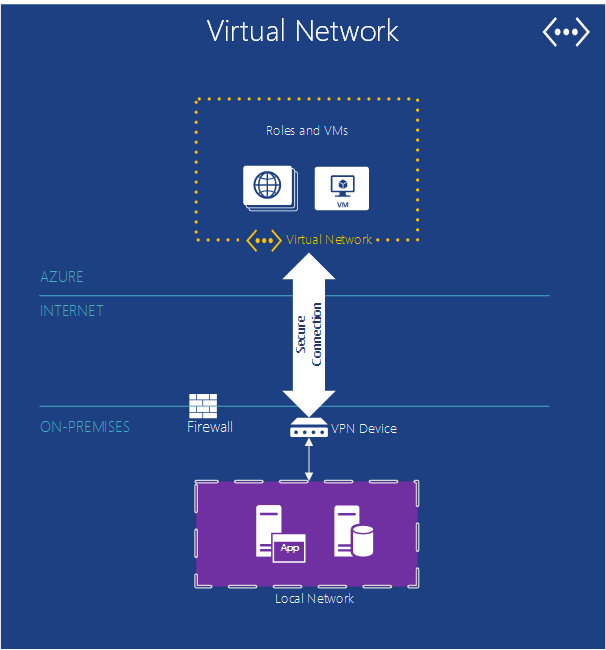   

*Figure: Virtual Networks provides a private network in the cloud so different services can talk to each other, or to on-premises resources if you set up a VPN connection.a cross-premises connection.*  

One useful way to use a public cloud is to treat it as an extension of your own datacenter.

Because you can create VMs on demand, then remove them (and stop paying) when they're no longer needed, you can have computing power only when you want it. And since Azure Virtual Machines lets you create VMs running SharePoint, Active Directory, and other familiar on-premises software, this approach can work with the applications you already have.

To make this really useful, though, your users ought to be able to treat these applications as if they were running in your own datacenter. This is exactly what Azure Virtual Network allows. Using a VPN gateway device, an administrator can set up a virtual private network (VPN) between your local network and your VMs that are deployed to a virtual network in Azure. Because you assign your own IP v4 addresses to the cloud VMs, they appear to be on your own network. Users in your organization can access the applications those VMs contain as if they were running locally.

For more information about planning and creating a virtual network that works for you, see [Virtual Network](./virtual-network/virtual-networks-overview.md).

### Express Route

   

*Figure: ExpressRoute uses an Azure Virtual Network, but routes connections through faster dedicated lines instead of the public Internet.*  

If you need more bandwidth or security than an Azure Virtual Network connection can provide, you can look into ExpressRoute. In some cases, ExpressRoute can also save you money. You’ll still need a virtual network in Azure, but the link between Azure and your site uses a dedicated connection that does not go over the public Internet. In order to use this service, you’ll need to have an agreement with either a network service provider, or an exchange provider.

Setting it up an ExpressRoute connection requires more time and planning, so you might want to start with a site-to-site VPN, then migrate to an ExpressRoute connection.

For more information about ExpressRoute, see [ExpressRoute Technical Overview](./expressroute/expressroute-introduction.md).

### Traffic Manager

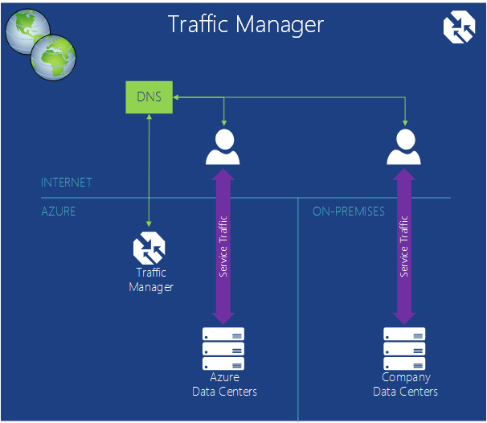   

*Figure : Azure Traffic Manager allows you to route global traffic to your service based on intelligent rules.*

If your Azure application is running in multiple datacenters, you can use Azure Traffic Manager to route requests from users intelligently across instances of the application. You can also route traffic to services not running in Azure as long as they are accessible from the internet.  

An Azure application with users in just a single part of the world might run in only one Azure datacenter. An application with users scattered around the world, however, is more likely to run in multiple datacenters, maybe even all of them. In this second situation, you face a problem: How do you intelligently direct users to application instances? Most of the time, you probably want each user to access the datacenter closest to her, since it will likely give her the best response time. But what if that instance of the application is overloaded or unavailable? In this case, it would be nice to direct her request automatically to another datacenter. This is exactly what's done by Azure Traffic Manager.

The owner of an application defines rules that specify how requests from users should be directed to datacenters, then relies on Traffic Manager to carry out these rules. For example, users might normally be directed to the closest Azure datacenter, but get sent to another one when the response time from their default datacenter exceeds the response time from other datacenters. For globally distributed applications with many users, having a built-in service to handle problems like these is useful.

Traffic manager uses Directory Name Service (DNS) to route users to service endpoints, but further traffic does not go through Traffic Manager once that connection is made. This keeps Traffic Manager from being a bottleneck that might slow down your service communications.

## Developer Services
Azure offers a number of tools to help developers and IT Professional create and maintain applications in the cloud.  

### Azure SDK
Back in 2008, the very first pre-release version of Azure supported only .NET development. Today, however, you can create Azure applications in pretty much any language. Microsoft currently provides language-specific SDKs for .NET, Java, PHP, Node.js, Ruby, and Python. There's also a general Azure SDK that provides basic support for any language, such as C++.  

These SDKs help you build, deploy, and manage Azure applications. They're available either from [www.microsoftazure.com](https://azure.microsoft.com/downloads/)  or GitHub, and they can be used with Visual Studio and Eclipse. Azure also offers command line tools that developers can use with any editor or development environment, including tools for deploying applications to Azure from Linux and Macintosh systems.

Along with helping you build Azure applications, these SDKs also provide client libraries that help you create software that uses Azure services. For example, you might build an application that reads and writes Azure blobs, or create a tool that deploys Azure applications through the Azure management interface.

### Visual Studio Team Services

Visual Studio Team Services is an marketing name covering a number services which help to develop applications in the Azure.

To avoid confusion - It does not provide a hosted or Web-based version of Visual Studio. You still need your local running copy of Visual Studio. But it provides many other tools which can be very helpful.

It does include a hosted source control system called Team Foundation Service, which offers version control and work item tracking.  You can even use Git for version control if you prefer that. And you can vary the source control system you use by project. You can create unlimited private team projects accessible from anywhere in the world.  

Visual Studio Team Services provides a load testing service. You can execute load tests created in Visual Studio on VMs in the cloud. You specify the total number of users you want to load test with, and Visual Studio Team Services will automatically determine how many agents are needed, spin up the required virtual machines and execute your load tests. If you're an MSDN subscriber, you get thousands of free user-minutes of load testing each month.

Visual Studio Team Services also offers support for agile development with features like continuous integration builds, Kanban boards and virtual team rooms.

**Visual Studio Team Services Scenarios**

Visual Studio Team Services is a good option for companies that need to collaborate worldwide and don't already have the infrastructure in place to do so. You can get setup in minutes, choose a source control system and start writing code and building that day.  The team tools provide a place for coordination and collaboration and the additional tools provide the analysis needed to test and tune your application quickly.

But organizations that already have an on-premises system can test new projects on Visual Studio Team Services to see if it's more efficient.   

### Application Insights

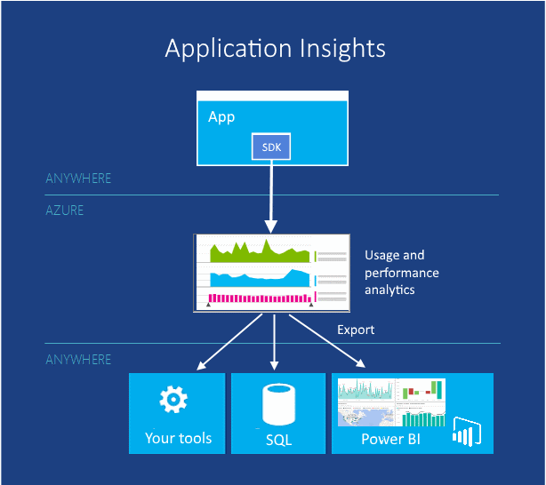  

*Figure: Application Insights monitors performance and usage of your live web or device app.*

When you have published your app - whether it runs on mobile devices, desktops, or web browsers - Application Insights tells you how it is performing and what users are doing with it. It will keep a count of crashes and slow response, alert you if the figures cross unacceptable thresholds, and help you diagnose any problems.

When you develop a new feature, plan to measure its success with users. By analysing usage patterns, you understand what works best for your customers and enhance your app in every development cycle.

Although it's hosted in Azure, Application Insights works for a wide and growing range of apps, both on an off Azure. Both J2EE and ASP.NET web apps are covered, as well as iOS, Android, OSX and Windows applications. Telemetry is sent from an SDK built with the app, to be analyzed and displayed in the Application Insights service in Azure.

If you want more specialized analytics, export the telemetry stream to a database, or to Power BI, or any other tools.

**Application Insights scenarios**

You are developing an app. It might be a web app or a device app, or a device app with a web back end.

* Tune the performance of your app after it is published, or while it is in load testing.  Application Insights aggregates telemetry from all the installed instances, and presents you with charts of response times, request and exception counts, dependency response times, and other performance indicators. These help you tune your app's performance. You can insert code to report more specific data if you need it.
* Detect and diagnose problems in your live app. You can get alerts by email if performance indicators cross acceptable thresholds. You can investigate specific user sessions, for example to see the request that caused an exception.
* Track usage to assess the success of each new feature. When you design a new user story, plan to measure how much it is used, and whether users achieve their expected goals. Application Insights gives you basic usage data such as web page views, and you can insert code to track the user experience in more detail.

### Automation
No one likes to waste time doing the same manual processes over and over. Azure Automation provides a way for you to create, monitor, manage, and deploy resources in your Azure environment.  

Automation uses "runbooks", which uses Windows PowerShell workflows (vs. just regular PowerShell) under the covers. Runbooks are meant to be executed without user interaction. PowerShell workflows allows the state of a script to be saved at checkpoints along the way. Then if a failure occurs, you don't have to start a script from the beginning. You can restart it at the last checkpoint. This saves you a lot of work trying to make the script handle every possible failure.

**Automation Scenarios**

Azure Automation is a good choice to automate the manual, long-running, error-prone, and frequently repeated tasks in Azure.

### API Management

Creating and publishing Application Programmer Interfaces (APIs) on the internet is a common way to provide services to applications. If those services are resellable (for example, weather data), an organization can allow other third parties to access those same services for a fee. As you scale to more partners, you'll usually need to optimize and control access.  Some partners may even need the data in a different format.

Azure API Management makes it easy for organizations to publish APIs to partners, employees and third-party developers securely and at scale. It provides a different API endpoint and acts as a proxy to call the actual endpoint while providing services like caching, transformation, throttling, access control, and analytics aggregation.

**API Management Scenarios**

Let's say your company has a set of devices that all need to call back to a central service to get data -- for example, a shipping company that has devices in every truck on the road.  Certainly the company will want to set up a system to track it's own trucks so it can reliably predict and update delivery times. It can know how many trucks it has and plan appropriately.  Each truck will need a device that calls back to a central location with it's positioning and speed data, and perhaps more.

A customer of the shipping company would probably also benefit from getting this positioning data.  The customer could use it to know how far products have to travel, where they get stuck, how much they paying along certain routes (if combined with what they paid to ship). If the shipping company aggregates this data already, many customers might pay for it.  But then the shipping company needs to provide a way to give customers the data. Once they provide access to customers, they may not have control over how often the data is queried. They will have to provide rules about who can access what data. All of these rules would have to be built into their external API. This is where API Management can help.  

## Identity and Access

Working with identity is part of most applications. Knowing who a user is lets an application decide how it should interact with that user. Azure provides services to help track identity as well as integrate it with identity stores you may already be using.

### Active Directory

Like most directory services, Azure Active Directory stores information about users and the organizations they belong to. It lets users log in, then supplies them with tokens they can present to applications to prove their identity. It also allows synchronizing user information with Windows Server Active Directory running on premises in your local network. While the mechanisms and data formats used by Azure Active Directory aren't identical with those used in Windows Server Active Directory, the functions it performs are quite similar.

It's important to understand that Azure Active Directory is designed primarily for use by cloud applications. It can be used by applications running on Azure, for example, or on other cloud platforms. It's also used by Microsoft's own cloud applications, such as those in Office 365. If you want to extend your datacenter into the cloud using Azure Virtual Machines and Azure Virtual Network, however, Azure Active Directory isn't the right choice. Instead, you'll want to run Windows Server Active Directory in Virtual Machines.

To let applications access the information it contains, Azure Active Directory provides a RESTful API called Azure Active Directory Graph. This API lets applications running on any platform access directory objects and the relationships among them.  For example, an authorized application might use this API to learn about a user, the groups he belongs to, and other information. Applications can also see relationships between users-their social graph-letting them work more intelligently with the connections among people.

Another capability of this service, Azure Active Directory Access Control, makes it easier for an application to accept identity information from Facebook, Google, Windows Live ID, and other popular identity providers. Rather than requiring the application to understand the diverse data formats and protocols used by each of these providers, Access Control translates all of them into a single common format. It also lets an application accept logins from one or more Active Directory domains. For example, a vendor providing a SaaS application might use Azure Active Directory Access Control to give users in each of its customers single sign-on to the application.

Directory services are a core underpinning of on-premises computing. It shouldn't be surprising that they're also important in the cloud.

### Multi-Factor Authentication
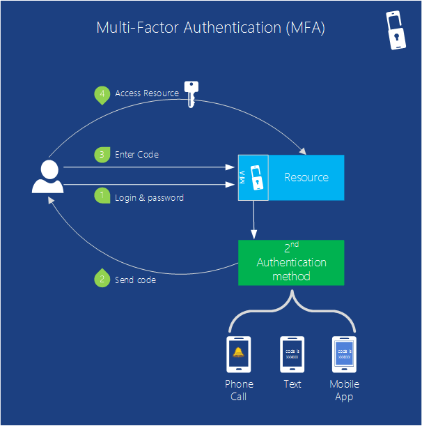   

*Figure: Multi-Factor Authentication provides the functionality for your application to verify more than one form of identification*

Security is always important. Multi-factor authentication (MFA) helps insure that only users themselves access their accounts. MFA (also known as two-factor authentication or "2FA") requires users provide two of these three methods of identity verification for user sign-ins and transactions.

- Something you know (typically a password)
- Something you have (a trusted device that is not easily duplicated, like a phone)
- Something you are (biometrics)

So when a user signs in, you can require them to also verify their identity with a mobile app, a phone call or a text message in combination with their password. By default, Azure Active Directory supports the use of passwords as its only authentication method for user sign-ins. You can use MFA together with Azure AD or with custom applications and directories by using the MFA SDK. You can also use it together with on-premises applications by using Multi-Factor Authentication Server.

**MFA Scenarios**

Login protection on sensitive accounts such as bank logins and source code access where unauthorized entry could have a high financial or intellectual property cost.   

## Mobile

If you are creating an app for a mobile device, Azure can help store data in the cloud, authenticate users, and send push notifications without you having to write a great deal of custom code.

While you can certainly build the backend for a mobile app using Virtual Machines, Cloud Services or Web Apps, you can spend much less time writing the underlying service components by using Azure's services.

### Mobile Apps

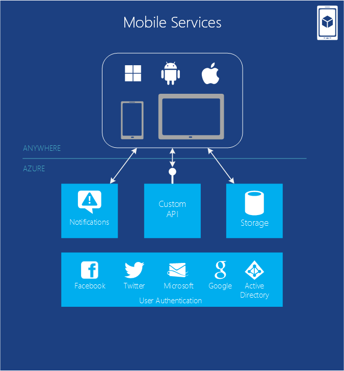

*Figure : Mobile Apps provides functionality commonly required by applications which interface with mobile devices.*

Azure Mobile Apps provides many useful functions that can save you time when building a backend for a Mobile application. It allows you to do simple provisioning and management of data stored in a SQL Database. With server-side code you can easily use additional data storage options like blob storage or MongoDB. Mobile Apps  provides support for notifications, though in certain cases you can instead use Notification Hubs as described next.  The service also has a REST API that your mobile application can call to get work done. Mobile Apps also provides the ability to authenticate users through Microsoft and Active Directory as well as other well-known identity providers like Facebook, Twitter, and Google.   

You can use other Azure Services like Service Bus and worker roles, and connect to on-premises systems. You can even consume 3rd party Add-Ons from the Azure Store (like SendGrid for email) to provide additional functionality.

Native client libraries for Android, iOS, HTML/JavaScript, Windows Phone, and Windows Store make it easier to develop for apps on all major mobile platforms. A REST API enables you to use Mobile Services data and authentication functionality with apps on different platforms. A single mobile service can back multiple client apps so you can provide a consistent user experience across devices.

Because Azure supports massive scale already, you can handle the traffic as your app becomes more popular.  Monitoring and logging are supported to help troubleshoot issues and manage performance.

### Notification Hubs

  

*Figure : Notification Hubs provides functionality commonly required by applications which interface with mobile devices.*

While you can write code to do notifications in Azure Mobile Apps, Notification Hubs is optimized to broadcast millions of highly personalized push notifications within minutes.  You don't have to worry about details like mobile carrier or device manufacturer. You can target individual or millions of users with a single API call.

Notification Hubs is designed to work with any backend. You can use Azure Mobile Apps, a custom backend in the cloud running on any provider or an on-premises backend.

**Notification Hub Scenarios**
If you were writing a mobile game where players took turns, you may need to notify player 2 that player 1 finished her turn. If that's all you need to do, you could just use Mobile Apps. But if you had 100,000 users play your game and you want to send a time sensitive free offer to everyone, Notification Hubs is the better choice.

You can send breaking news, sporting events, and product announcement notifications to millions of users with low latency. Enterprises can notify their employees about new time sensitive communications, such as sales leads, so employees don’t have to constantly check email or other applications to stay informed. You can also send one-time-passwords required for multi-factor authentication.

## Back-up
Every enterprise needs to backup and restore data. You can use Azure to backup and restore your application whether in the cloud or on-premises. Azure offers different options to help depending on the type of backup.

### Site Recovery

Azure Site Recovery (formerly Hyper-V Recovery Manager) can help you protect important applications by coordinating the replication and recovery across sites. Site Recovery  provides capability to protect applications based on Hyper-v, VMWare or SAN to your own secondary site, to a hoster’s site, or to Azure and avoid the expense and complexity of building and managing your own secondary location. Azure encrypts data and communications and you have the option enable encryption for data at-rest too.

It monitors the health of your services continuously and helps automate the orderly recovery of services in the event of a site outage at the primary datacenter. Virtual machines can be brought up in an orchestrated fashion to help restore service quickly, even for complex multi-tier workloads.

Site Recovery works with existing technologies such as Hyper-V Replica, System Center, and SQL Server AlwaysOn. Check out [Azure Site Recovery overview](site-recovery/site-recovery-overview.md) for more details.

### Azure Backup
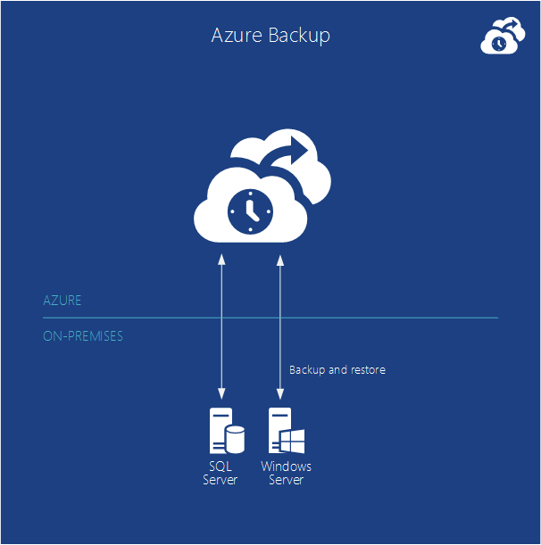  

*Figure: Azure Backup backs up data from on-premises Windows Servers into the cloud.*  

Azure Backup backs up data from on-premises servers running Windows Server into the cloud. You can manage your backups directly from the backup tools in Windows Server 2012, Windows Server 2012 Essentials, or System Center 2012 - Data Protection Manager. Alternatively, you can use a specialized backup agent.

Data is safer because backups are encrypted before transmission and stored encrypted in Azure and protected by a certificate that you upload. The service uses the same redundant and highly available data protection found in Azure Storage.  You can back up files and folders on a regular schedule or immediately, running either full or incremental backups. After data is backed up to the cloud, authorized users can easily recover backups to any server. It also offers configurable data retention policies, data compression, and data transfer throttling so you can manage the cost to store and transfer data.

**Scenarios for Azure Backup**

If you already using Windows Server or System Center, Azure backup is a natural solution for backing up your servers file system, virtual machines, and SQL Server databases.  It works with encrypted, sparse and compressed files. There are some limitations, so you should [check the Azure Backup pre-requisites](http://technet.microsoft.com/library/dn296608.aspx) first.

## Messaging and Integration

No matter what it's doing, code frequently needs to interact with other code.  In some situations, all that's needed is basic queued messaging. In other cases, more complex interactions are required. Azure provides a few different ways to solve these problems. Figure 5 illustrates the choices.

### Queues
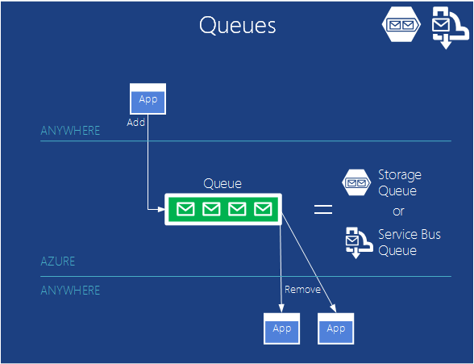

*Figure: Queues allow loose coupling between parts of an application and facilitate scaling.*  

Queuing is a simple idea: One application places a message in a queue, and that message is eventually read by another application. If your application needs just this straightforward service, Azure Queues might be the best choice.

Because of the way the Azure grew over time, Azure Storage Queues and Service Bus Queues provide similar queuing services. The reasons why you would want to use one over the other are covered in the fairly technical paper [<LINK>](http://msdn.microsoft.com/library/azure/hh767287.aspx "Azure Queues and Service Bus Queues - Compared and Contrasted").  In many scenarios, either will work.

**Queue Scenarios**

One common use of queues today is to let a web role instance communicate with a worker role instance within the same Cloud Services application.

For example, suppose you create an Azure application for video sharing. The application consists of PHP code running in a web role that lets users upload and watch videos, together with a worker role implemented in C# that translates uploaded video into various formats.

When a web role instance gets a new video from a user, it can store the video in a blob, then send a message to a worker role via a queue telling it where to find this new video. A worker role instance-it doesn't matter which one-will then read the message from the queue and carry out the required video translations in the background.

Structuring an application in this way allows asynchronous processing, and it also makes the application easier to scale, since the number of web role instances and worker role instances can be varied independently. You can also use the queue size as a trigger to scale the number of worker roles up and down. Too high, and you add more roles. When it gets lower, you can reduce the number of running roles to save money.  

You can use this same pattern between many different parts of your application even if they don't use web and worker roles.  It allows you to scale the parts on either side of the queue up and down as demand and processing time requires.

### Service Bus
Whether they run in the cloud, in your data center, on a mobile device, or somewhere else, applications need to interact. The goal of Azure Service Bus is to let applications running pretty much anywhere exchange data.

In addition to the queues (one-to-one) described earlier, Service Bus also provides to other communication methods.

#### Service Bus Relay
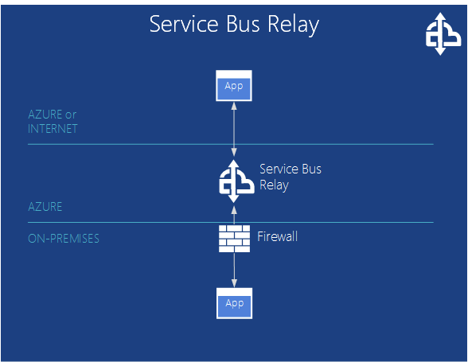

*Figure: Service Bus Relay allows communication between applications on different sides of a firewall.*

Service Bus allows direct communication through its relay service, providing a secure way to interact through firewalls. Service Bus relays enable applications to communicate by exchanging messages through an endpoint hosted in the cloud, rather than locally.

**Service Bus Relay Scenarios**

Applications that communicate through Service Bus might be Azure applications or software running on some other cloud platform. They can also be applications running outside the cloud, however. For example, think of an airline that implements reservation services in computers inside its own datacenter. The airline needs to expose these services to many clients, including check-in kiosks in airports, reservation agent terminals, and maybe even customers' phones. It might use Service Bus to do this, creating loosely coupled interactions among the various applications.

#### Service Bus Topics and Subscriptions
   
 *Figure: Service Bus Topics allows multiple apps to post messages and other applications to subscribe to receive messages that meet a specific criteria.*

Service Bus provides a Publish-and-subscribe mechanism called Topics and Subscriptions. With publish-subscribe, an application can send messages to a topic, while other applications can create subscriptions to this topic. This allows one-to-many communication among a set of applications, letting the same message be read by multiple recipients.

**Service Bus Topics and Subscriptions Scenarios**

Anytime your are setting up where there are many messages that are all important, but various downstream systems only need to listen to differing subsets of those communications, Service Bus Topic and Subscriptions are a good option.

### BizTalk Services
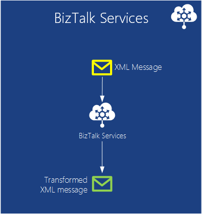   
 *Figure:BizTalk Services provides the ability to transform XML messages formats in the cloud.*

Sometimes you need connect systems which communicate using different messaging formats. It’s common for business to have different database schemas and XML messaging formats, even when a common standard is available. Rather than write a lot of custom code, you can use BizTalk Server on-premises to integrate various systems.  Azure BizTalk Services provides the same type of service, but in the cloud. You can pay for only what you use and not worry about scale like you would have to on-premises.

**BizTalk Services Scenarios**

Business-to-Business (B2B) interactions commonly require this type of translation.  For example, a company building airplanes needs to order parts from it's various parts suppliers. It will have many parts suppliers.  Those orders should be automated to go directly from the airplane builders systems into the suppliers systems.  Neither business wants to change their core systems and message formats, and it's very unlikely that those formats are the same. BizTalk Services can take messages and translate between the new formats both ways. Either the airplane supplier can do the work to translate or the various suppliers can, depending on who wants more control and the amount of translation needed.     

## Compute Assistance
Azure provides assistance for services that do not need to run all the time.  

### Scheduler

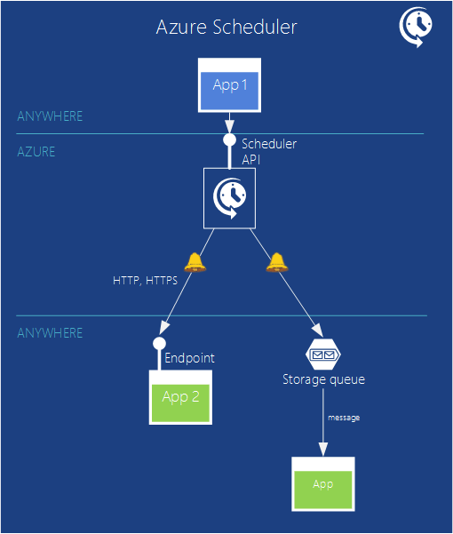   
*Figure: Azure Scheduler provides a way to schedule jobs at a specific time for a specific duration.*

Sometimes applications only need to run at a certain time. On Azure, you can save money with this type of app instead of letting an application just keep running 24x7 waiting for data to process. Azure Scheduler allows you to schedule when an application should run based on interval of time or a calendar. It’s reliable and will verify that a process runs even if there are network, machine, and data center failures. You use the Scheduler REST API to manage these actions.

When a scheduled alarm occurs, Scheduler sends HTTP or HTTPS messages to a specific endpoint or can put a message in a Storage Queue.  So you need to have your application either have an accessible endpoint or have it monitor a storage queue. Then once it gets the message, it can perform whatever action it's programmed to.

**Scheduler Scenarios**

- Recurring application actions: As an example, a service may periodically get data from twitter and gather the data into a regular feed.
- Daily maintenance: Log processing or pruning, performing backups and other intermittently schedule tasks.
- Tasks that run at night.
- Web applications tasks like daily pruning of logs, performing backups, and other maintenance tasks. An administrator may choose to backup her database at 1AM every day for the next 9 months, for example.

The Scheduler API allows you to create, update, delete, view, and manage job collections and scheduled jobs programmatically.

## Performance

Performance is always important for an application. Applications tend to access the same data over and over. One way to improve performance is to keep a copy of that data closer to the application, minimizing the time needed to retrieve it. Azure provides different services for doing this.

### Azure Caching

   
 **Figure: An Azure application can cache data in memory and even split it up across many worker roles**

Accessing data stored in any of Azure's data management services-SQL Database, Tables, or Blobs-is quite fast. Yet accessing data stored in memory is even faster. Because of this, keeping an in-memory copy of frequently accessed data can improve application performance. You can use Azure's in-memory Caching to do this.

A Cloud Services application can store data in this cache, then retrieve it directly without needing to access persistent storage. The cache can be maintained inside your application's VMs or be provided by VMs dedicated solely to caching. In either case, the cache can be distributed, with the data it contains spread across multiple VMs in an Azure datacenter.

Azure has a number of different cache technologies that have shifted over time. In the order they were introduced, there is a shared, in-role, managed and Redis cache. The shared caching is an older technology and you shouldn’t create new implementations with it. The Managed Cache has the same features of the In-Role cache, but as managed service outside of the Azure Management Portal. The Redis Cache is in preview. The Redis implementation has the largest number of features and is recommended when you write new caching code.

**Azure Cache Scenarios**

An application that repeatedly reads a product catalog might benefit from using this kind of caching, for example, since the data it needs will be available more quickly. The technology also supports locking, letting it be used with read/write as well as read-only data. And ASP.NET applications can use the service to store session data with just a configuration change.

### Content Delivery Network
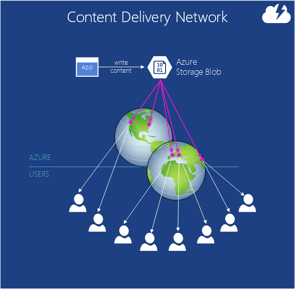   
 **Figure:Copies of a blob can be cached at sites around the world.**

Suppose you need to store blob data that will be accessed by users around the world. Maybe it's a video of the latest World Cup match, for instance, or driver updates, or a popular e-book. Storing a copy of the data in multiple Azure datacenters will help, but if there are lots of users, it's probably not enough. For even better performance, you can use the Azure CDN.

The CDN has dozens of sites around the world, each capable of storing copies of Azure blobs. The first time a user in some part of the world accesses a particular blob, the information it contains is copied from an Azure datacenter into local CDN storage in that geography. After this, accesses from that part of the world will use the blob copy cached in the CDN-they won't need to go all the way to the nearest Azure datacenter. The result is faster access to frequently accessed data by users anywhere in the world.

**CDN Scenarios**

It's common to use CDN with Media Services to deliver video worldwide. Video is usually large and requires a lot of bandwidth.  Media Services is talked about elsewhere on this page.

## Big Data and Big Compute

### HDInsight (Hadoop)
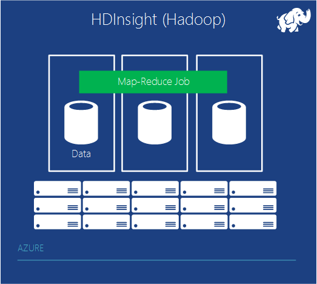   
 **Figure: HDInsight helps with the bulk processing of huge amounts of data**

For many years, the bulk of data analysis has been done on relational data stored in a data warehouse built with a relational DBMS. This kind of business analytics is still important, and it will be for a long time to come. But what if the data you want to analyze is so big that relational databases just can't handle it? And suppose the data isn't relational? It might be server logs in a datacenter, for example, or historical event data from sensors, or something else. In cases like this, you have what's known as a big data problem. You need another approach.

The dominant technology today for analyzing big data is Hadoop. An Apache open source project, this technology stores data using the Hadoop Distributed File System (HDFS), then lets developers create MapReduce jobs to analyze that data. HDFS spreads data across multiple servers, then runs chunks of the MapReduce job on each one, letting the big data be processed in parallel.

HDInsight is the name of the Azure's Apache Hadoop-based service. HDInsight lets HDFS store data on the cluster and distribute it across multiple VMs. It also spreads the logic of a MapReduce job across those VMs. Just as with on-premises Hadoop, data is processed locally-the logic and the data it works on are in the same VM-and in parallel for better performance. HDInsight can also store data in Azure Storage Vault (ASV), which uses blobs.  Using ASV allows you to save money because you can delete your HDInsight cluster when not in use, but still keep your data in the cloud.

HDinsight supports other components of the Hadoop ecosystem as well, including Hive and Pig. Microsoft has also created components that make it easier to work with data produced by HDInsight using traditional BI tools, such as the HiveODBC adapter and Data Explorer that work with Excel.

### High-Performance Computing (Big Compute)

One of the most attractive ways to use a cloud platform is to run high performance computing (HPC) and other "Big Compute" applications. Examples include specialized engineering applications built to use the industry-standard Message Passing Interface (MPI) as well as so-called embarrassingly parallel applications, such financial risk models.

The essence of Big Compute is executing code on many machines at the same time. On Azure, this means running many virtual machines simultaneously, all working in parallel to solve some problem. Doing this requires some way to resources and to schedule applications, i.e., to distribute their work across these instances. Microsoft’s free HPC Pack and other compute cluster solutions can perform well in Azure, taking advantage of Azure compute and infrastructure services to add capacity on-demand to an on-premises compute cluster or run Big Compute applications entirely in the cloud.

Azure provides a range of VM instance sizes with different configurations of CPU cores, memory, disk capacity, and other characteristics to meet the requirements of different applications. The recently introduced A8 and A9 instances work well for many compute intensive workloads, and parallel MPI applications in particular, because they have high speed, multicore CPUs and large amounts of memory. In certain configurations the instances take advantage of a low-latency and high-throughput application network in the cloud that includes remote direct memory access (RDMA) technology for maximum efficiency of parallel MPI applications.

Azure also offers Big Compute application developers and partners a full set of compute capabilities, services, architecture choices, and development tools. Azure supports custom Big Compute workflows involving specialized data workflows and job and task scheduling patterns that can scale to thousands of compute cores.

## Media

   
 **Figure: Media Services is a platform for applications that provide video and other media to clients around the world.**

Video makes up a large part of Internet traffic today, and that percentage will be even larger tomorrow. Yet providing video on the web isn't simple. There are lots of variables, such as the encoding algorithm and the display resolution of the user's screen. Video also tends to have bursts in demand, like a Saturday night spike when lots of people decide they'd like to watch an online movie.

Given its popularity, it's a safe bet that many new applications will be created that use video. Yet all of them will need to solve some of the same problems, and making each one solve those problems on its own makes no sense. A better approach is to create a platform that provides common solutions for many applications to use. And building this platform in the cloud has some clear advantages. It can be broadly available on a pay-as-you-go basis, and it can also handle the variability in demand that video applications often face.

Azure Media Services addresses this problem. It provides a set of cloud components that make life easier for people creating and running applications using video and other media.

As the figure shows, Media Services provides a set of components for applications that work with video and other media. For example, it includes a media ingest component to upload video into Media Services (where it's stored in Azure Blobs), an encoding component that supports various video and audio formats, a content protection component that provides digital rights management, a component for inserting ads into a video stream, components for streaming, and more. Microsoft partners can also provide components for the platform, then have Microsoft distribute those components and bill on their behalf.

Applications that use this platform can run on Azure or elsewhere. For example, a desktop application for a video production house might let its users upload video to Media Services, then process it in various ways. Alternatively, a cloud-based content management service running on Azure might rely on Media Services to process and distribute video. Wherever it runs and whatever it does, each application chooses which components it needs to use, accessing them through RESTful interfaces.

To distribute what it produces, an application can use the Azure CDN, another CDN, or just send bits directly to users. However it gets there, video created using Media Services can be consumed by various client systems, including Windows, Macintosh, HTML 5, iOS, Android, Windows Phone, Flash, and Silverlight. The goal is to make it easier to create modern media applications.

**References**

For a more visual view of how Media Services works, download the [Azure Media Services Poster][Azure Media Services Poster].

## Commerce

The rise of Software as a Service is transforming how we create applications. It's also transforming how we sell applications. Since a SaaS application lives in the cloud, it makes sense that its potential customers should look for solutions online. And this change applies to data as well as to applications. Why shouldn't people look to the cloud for commercially available datasets? Microsoft addresses both of these concerns with the [Azure Marketplace](https://azure.microsoft.com/marketplace/).

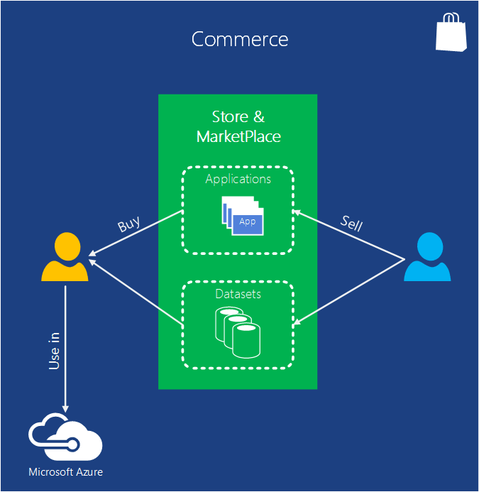   
 **Figure: Azure Marketplace and Azure Store let you find and buy Azure applications and commercial datasets and use them as part of your Azure applications.**

The difference between the two is that Marketplace is outside of the Azure Management Portal, but the Store can be accessed from inside the portal. Potential customers can search to find Azure applications that meet their needs.. Customers can search for commercial datasets as well, including demographic data, financial data, geographic data, and more. When they find something they like, they can access it either from the vendor, directly through the Marketplace or Store web locations or in some cases from the Management Portal. Applications can also use the Bing Search API through the Marketplace, giving them access to the results of web searches.

**Commerce Scenarios**

SendGrid is an application in the Azure Store that allows you to send email. It offers additional functionality like reliable delivery and statistics.  You can buy this application and related services rather then try to build such an infrastructure yourself.  

## Getting Started

Now that you have the big-picture, the next step is to write your first Azure application. Choose your language, [get the appropriate SDK](/downloads/), and go for it. Cloud computing is the new default--get started now.

[Azure Media Services Poster]: http://azure.microsoft.com/documentation/infographics/media-services/
