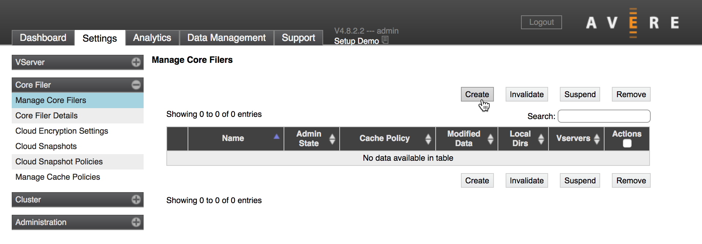
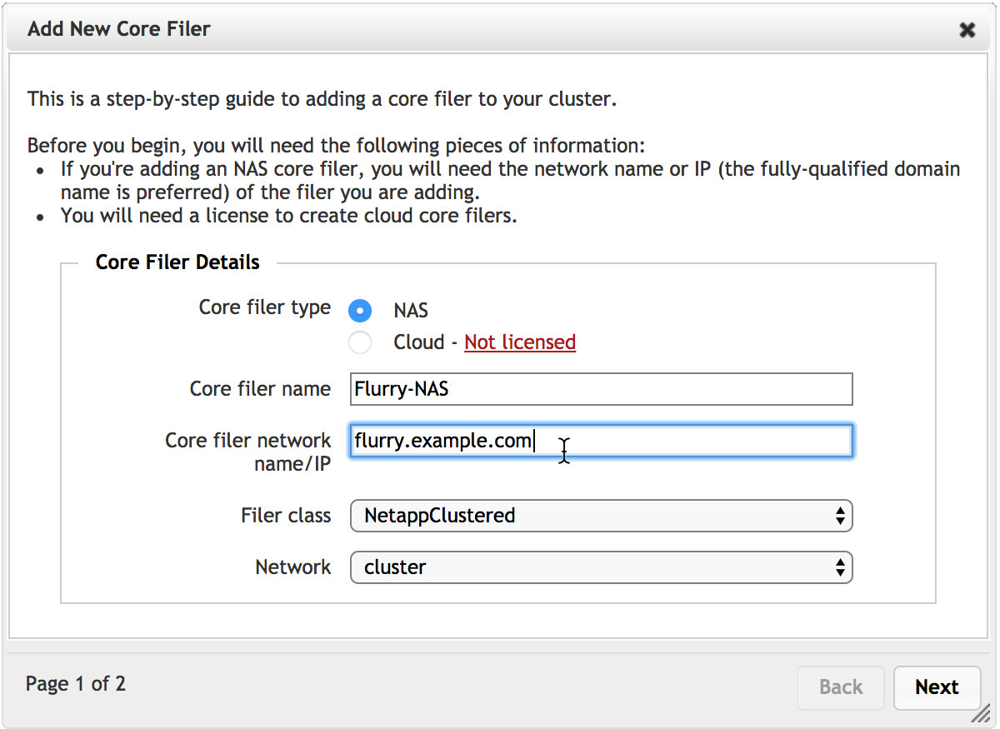
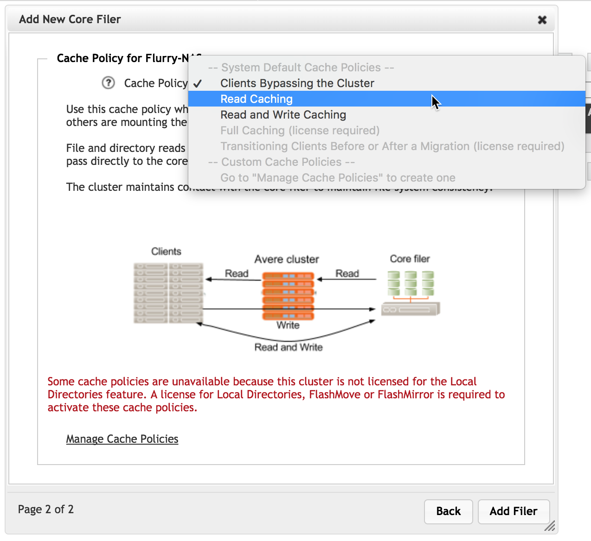
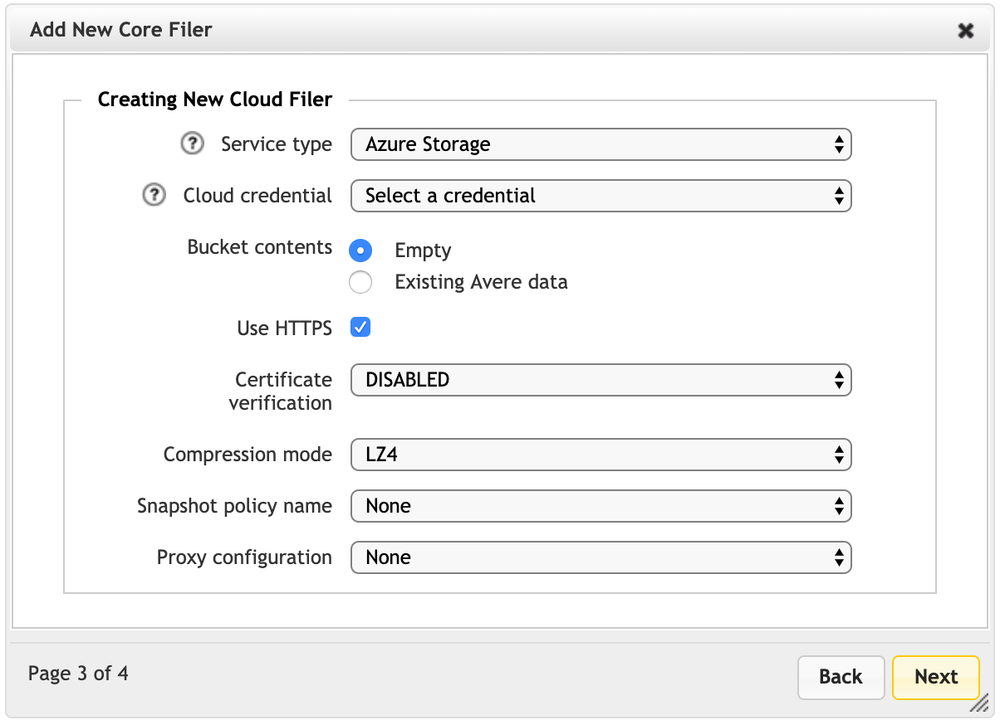
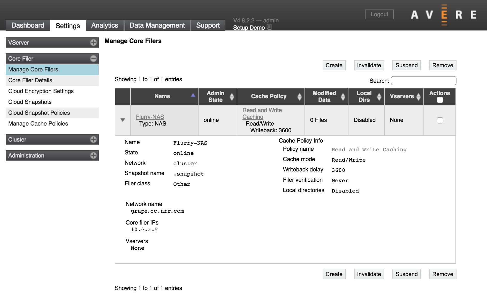
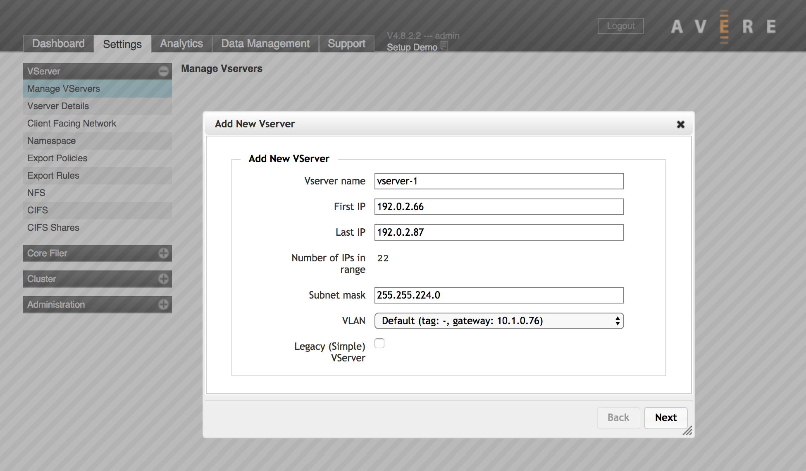
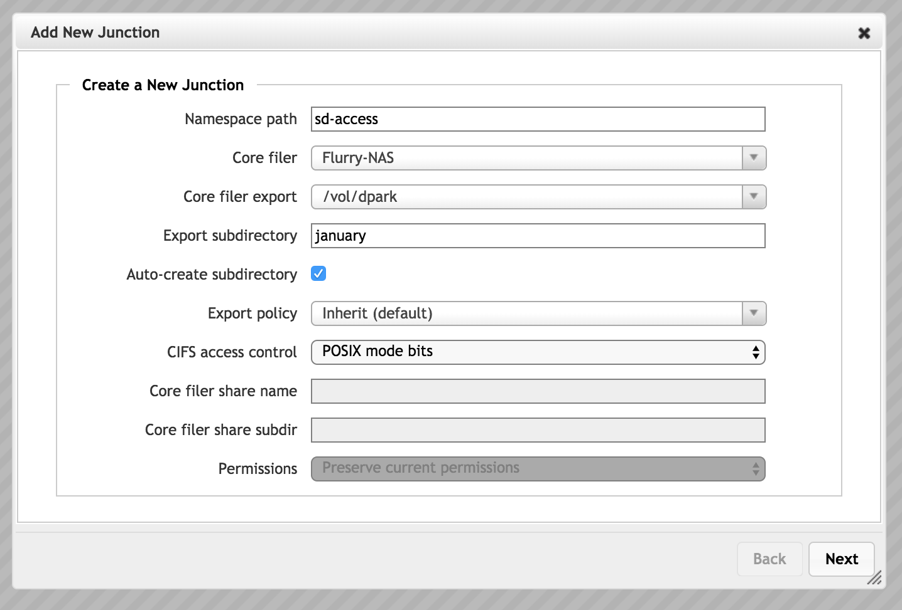
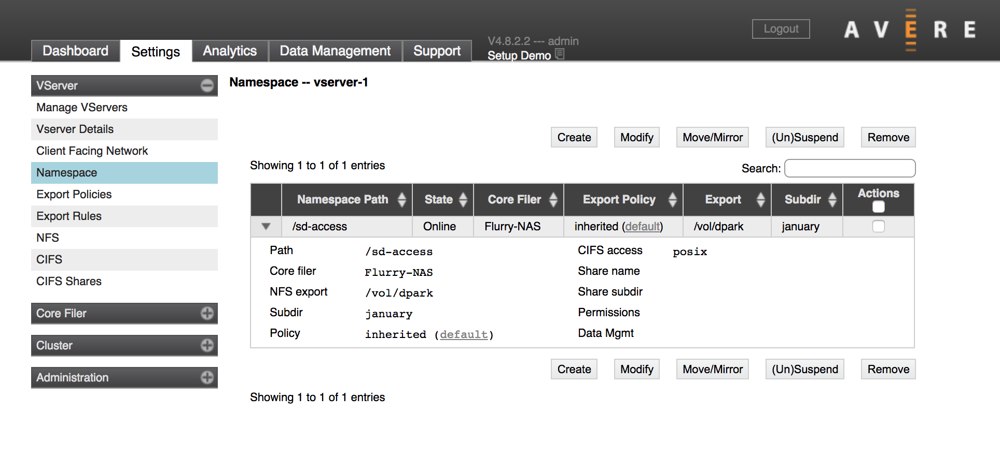

# Tutorial: Add back-end storage and configure the virtual namespace

This tutorial explains how to add back-edge storage for your cache and how to set up the client-facing virtual filesystem.

The cluster connects to back-end storage systems to access the data clients request, and to store changes more permanently than in the cache.

The namespace is the client-facing pseudo filesystem that allows you to swap out back-end storage without changing client-side workflows.

In this tutorial you will learn:

> [!div class="checklist"]
>
> * How to add back-end storage to the Azure FXT Edge Filer cluster
> * How to define the client-facing path for storage

## About back-end storage

The Azure FXT Edge Filer cluster uses a *core filer* definition to link a back-end storage system to the FXT cluster.

Azure FXT Edge Filer is compatible with several popular NAS hardware systems, and can use empty containers from Azure Blob or other cloud storage.

Cloud storage containers must be empty when added so that the FXT operating system can completely manage all of the data on the cloud storage volume. You can move your existing data to the cloud container after adding the container to the cluster as a core filer.

Use the Control Panel to add a core filer to your system.

> [!NOTE]
>
> If you want to use Amazon AWS or Google Cloud storage, you must install a FlashCloudTM feature license. Contact your Microsoft representative for a license key, and then follow the instructions in the legacy configuration guide for [Adding or removing feature licenses](https://azure.github.io/Avere/legacy/ops_guide/4_7/html/install_licenses.html#install-licenses).
>
> Support for Azure Blob storage is included in the Azure FXT Edge Filer software license.

For more detailed information about adding core filers, read these sections of the Cluster Configuration Guide:

* For more about choosing and preparing to add a core filer, read [Working With Core Filers](https://azure.github.io/Avere/legacy/ops_guide/4_7/html/core_filer_overview.html#core-filer-overview).
* For detailed prerequisites and step-by-step instructions, read these articles:

  * [Adding a New NAS Core Filer](https://azure.github.io/Avere/legacy/ops_guide/4_7/html/new_core_filer_nas.html#create-core-filer-nas)
  * [Adding a New Cloud Core Filer](https://azure.github.io/Avere/legacy/ops_guide/4_7/html/new_core_filer_cloud.html#create-core-filer-cloud)

After you add a core filer, you can update its settings on the Core Filer Details settings page.

## Add a core filer

Define a core filer by clicking the **Create** button on the **Core Filer** > **Manage Core Filers** settings page.

The **Add New Core Filer** wizard walks you through the process of creating a core filer that links to your back-end storage. The Cluster Configuration Guide has step-by-step descriptions of the process, which is different for NFS/NAS storage and for cloud storage (links are above).

Subtasks include:

* Specify the type of core filer (NAS or cloud)

  

* Set the core filer's name. Choose a name that helps the cluster administrators understand which storage system it represents.

* For NAS core filers, provide the fully qualified domain name (FQDN) or IP address. FQDN is recommended for all core filers, and required for SMB access.

* Select a cache policy - The second page of the wizard lists the available cache policies for the new core filer. For details, read the [cache policies section of the Cluster Configuration Guide](https://azure.github.io/Avere/legacy/ops_guide/4_7/html/gui_manage_cache_policies.html).

  

* For cloud storage, you must specify the cloud service and access credentials, among other parameters. For details, read [Cloud service and protocol](https://azure.github.io/Avere/legacy/ops_guide/4_7/html/new_core_filer_cloud.html#cloud-service-and-protocol) in the Cluster Configuration Guide.

  
  
  If you already have added cloud access credentials for this cluster, they appear in the list. Update and add credentials in the **Cluster** > **Cloud Credentials** settings page.

After filling in all of the required settings in the wizard, click the **Add Filer** button to submit the change.

After a few moments, the storage system appears on the **Dashboard** core filers list and can be accessed through core filer settings pages.

The core filer in this screenshot is missing a vserver. You must link the core filer to a vserver and create a junction so that clients can access the storage. These steps are described below in [Configure the namespace](#configure-the-namespace).

## Configure the namespace

The Azure FXT Edge Filer cluster creates a virtual filesystem called the *cluster namespace* that simplifies client access to data stored on diverse back-end systems. Because clients request files using a virtual path, storage systems can be added or replaced without having to change the client workflow.

The cluster namespace also lets you present cloud and NAS storage systems in a similar file structure.

The cluster's vservers maintain the namespace and serving content to clients. There are two steps to create the cluster namespace:

1. Create a vserver
1. Set up junctions between the back-end storage systems and the client-facing filesystem paths

### Create a vserver

VServers are virtual file servers that control how data flows between the client and the cluster’s core filers:

* VServers host client-facing IP addresses
* VServers create the namespace and define junctions that map the client-facing virtual directory structure to exports on back-end storage
* VServers enforce file access controls, including core filer export policies and user authentication systems
* VServers provide SMB infrastructure

Before starting to configure a cluster vserver, read the linked documentation and consult your Microsoft representative for help understanding namespace and vservers. If using VLANs, [create them](configure-network.md#adjust-network-settings) before creating the vserver.

These sections of the Cluster Configuration Guide will help you familiarize yourself with the FXT vserver and global namespace features:

* [Creating and Working with VServers](https://azure.github.io/Avere/legacy/ops_guide/4_7/html/settings_overview.html#creating-and-working-with-vservers)
* [Using a Global Namespace](https://azure.github.io/Avere/legacy/ops_guide/4_7/html/gns_overview.html)
* [Creating a VServer](https://azure.github.io/Avere/legacy/ops_guide/4_7/html/gui_vserver_manage.html#creating-a-vserver)

You need at least one vserver for your cluster.

To create a new vserver, you need the following information:

* The name to set for the vserver

* The range of client-facing IP addresses the vserver will handle

  You must supply a single range of contiguous IP addresses when you create the vserver. You can add more addresses later by using the **Client Facing Network** settings page.

* If your network has VLANs, which VLAN to use for this vserver

Use the **VServer** > **Manage VServers** settings page to create a new vserver. For details read [Creating a VServer](https://azure.github.io/Avere/legacy/ops_guide/4_7/html/gui_vserver_manage.html#creating-a-vserver) in the Cluster Configuration Guide.

### Create a junction

A *junction* maps a back-end storage path to the client-visible namespace.

You can use this system to simplify the path used in client mount points, and to scale capacity seamlessly because one virtual path can accommodate storage from multiple core filers.

Refer to [**VServer** > **Namespace**](https://azure.github.io/Avere/legacy/ops_guide/4_7/html/gui_namespace.html) in the Cluster Configuration Guide for complete details about creating a namespace junction.

## Configure export rules

After you have both a vserver and a core filer, you should customize the export rules and export policies that control how clients can access files on the core filer exports.

First, use the **VServer** > **Export Rules** page to add new rules, to modify the default policy, or to create your own custom export policy.

Second, use the **VServer** > **Export Policies** page to apply the customized policy to your core filer’s exports when accessed through that vserver.

Read the Cluster Configuration Guide article [Controlling Access to Core Filer Exports](https://azure.github.io/Avere/legacy/ops_guide/4_7/html/export_rules_overview.html) for details.

## Next steps

After adding storage and configuring the client-facing namespace, complete your cluster's initial setup:

> [!div class="nextstepaction"]
> [Configure the cluster's network settings](configure-network.md)
