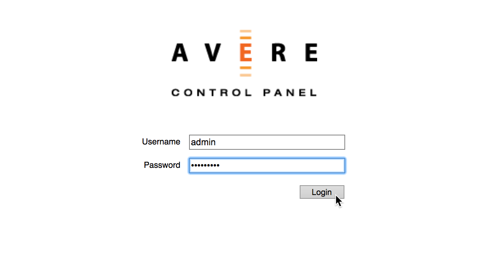
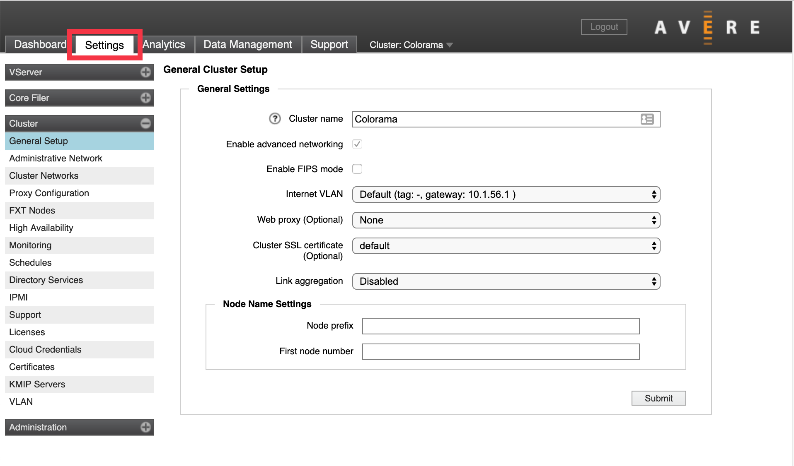

# Tutorial: Configure the new cluster (Overview)

After following the steps in [Create the Azure FXT Edge Filer cluster](fxt-cluster-create.md), your FXT Edge Filer cluster exists, but it has only one node, no client-facing IP addresses, and no back-end storage. 

This tutorial explains the configuration needed to go from a newly created cluster to a cache system that is ready to handle your workflow. 

In this tutorial, you will learn: 

> [!div class="checklist"]
> * The steps needed to configure the new cluster 
> * Which configuration steps are required and which steps are optional 
> * How to sign in to the cluster Control Panel
> * How to accept the cluster software terms of service

The steps in this tutorial take 30 to 45 minutes to complete. 

## Understand setup tasks

This section gives an overview of the tasks needed to configure a newly created Azure FXT Edge Filer cluster. Tutorials for these tasks are separated out into additional setup articles to make them easier to navigate. This overview section includes links to the tutorials for each task. 

> [!TIP]
> Some documentation for this product is not yet available on the Microsoft Azure documentation site. Links to the [Cluster Configuration Guide](https://azure.github.io/Avere/legacy/ops_guide/4_7/html/ops_conf_index.html) and the legacy version of the [Cluster Creation Guide](https://azure.github.io/Avere/legacy/create_cluster/4_8/html/create_index.html) will take you to a separate GitHub-hosted website. 

### Required configuration

You must take these steps to create a fully functional cluster. 

* Add nodes to the cluster 

  Three nodes is standard, but many production clusters have more - up to a maximum of 24 nodes.

  Read [Add cluster nodes](fxt-add-nodes.md) to learn how to add other Azure FXT Edge Filer units to your cluster, and to enable High Availability.

* Specify back-end storage

  Add *core filer* definitions for each back-end storage system that the cluster will use. Read [Configure the cluster - back-end storage and virtual namespace](fxt-add-storage.md#about-back-end-storage) to learn more.

* Set up client access and the virtual namespace 

  Create at least one virtual server (vserver) and assign it an IP address range for client machines to use. You also must configure the cluster namespace (sometimes called the Global Namespace or GNS), a virtual filesystem feature that lets you map back-end storage exports to virtual paths. The cluster namespace gives clients a consistent and accessible filesystem structure even if you switch back-end storage media. The namespace also can provide a user-friendly virtual storage hierarchy for Azure Blob containers or other supported cloud object storage.

  Read [Configure the namespace](fxt-add-storage.md#configure-the-namespace) for details. This step includes:
  * Creating vservers
  * Setting up junctions between the client network view and backend storage 
  * Defining which client IP addresses are served by each vserver

  > [!Note] 
  > Significant planning is recommended before starting to set up the cluster’s GNS. Read the [Using a Global Namespace](https://azure.github.io/Avere/legacy/ops_guide/4_7/html/gns_overview.html) and [Creating and Working with VServers](https://azure.github.io/Avere/legacy/ops_guide/4_7/html/settings_overview.html#creating-and-working-with-vservers) sections in the Cluster Configuration Guide for help.

* [Adjust network settings](fxt-configure-network.md)

  There are several network-related settings that should be verified or customized for a new cluster. Read [Adjust network settings](fxt-configure-network.md) for details about these items:

  * Verifying DNS and NTP configuration 
  * Configuring directory services, if needed 
  * Setting up VLANs
  * Configuring proxy servers
  * Adding IP addresses to the cluster network
  * Storing encryption certificates

* [Set up support monitoring](#enable-support)

  Customize the upload settings in case a system memory file needs to be sent to Microsoft Customer Service and Support for debugging. You also can configure what statistics are monitored, and enable a proactive support and remote troubleshooting.

### Optional configuration

These steps are not required for all clusters. They are needed for some types of workflows or for certain cluster management styles. 

* Customize node settings

  You can set node names and configure node IPMI ports on a cluster-wide level, or individually. If you configure this before adding nodes to the cluster, the new nodes can pick up the settings automatically when they join. The options are described in the legacy cluster creation document section [Customizing Node Settings](https://azure.github.io/Avere/legacy/create_cluster/4_8/html/config_node.html).

* Configure SMB

  If you want to allow SMB access to your cluster as well as NFS, you must configure SMB and turn it on. SMB (sometimes called CIFS) is typically used to support Microsoft Windows clients.

  Planning for and configuring SMB involves more than clicking a few buttons in the Control Panel. Depending on your system’s requirements, SMB can influence how you define core filers, how many vservers you create, how you configure your junctions and namespace, access permissions, and other settings.

  For more information, read the Cluster Configuration Guide [Configuring SMB Access](https://azure.github.io/Avere/legacy/ops_guide/4_7/html/smb_overview.html) section.

* Install additional licenses

  If you want to use cloud storage other than Azure Blob, you must install an additional feature license. Contact your Microsoft representative for details about purchasing a FlashCloudTM license. Details are explained in [Configure the cluster - Back-end storage and virtual namespace](fxt-add-storage.md#about-back-end-storage).

## Open the Settings pages

Use the Control Panel web interface to set up your cluster. Follow the link from your cluster creation status screen, or browse to the management IP address that you set on the cluster.

Sign in to the web interface with the username `admin` and the password that you set when creating the cluster.

The Control Panel opens and shows the **Dashboard** page. As the cluster creation finishes, any warning messages should clear from the display.

Click the **Settings** tab to configure the cluster.

On the **Settings** tab, the left sidebar shows a menu of configuration pages. The pages are organized by category. Click the + or - control at the top of the category name to expand or hide the individual pages.

## Enable support

The FXT Edge Filer cluster can automatically upload support data about your cluster. These uploads let staff provide the best possible customer service.

Follow these steps to set up support uploads.

1. Navigate to the **Cluster** > **Support** settings page. Accept the privacy policy. <!--  xxx update screenshot? xxx  -->

   

1. Click the triangle to the left of **Customer Info** to expand the section.
1. Click the **Revalidate upload information** button.
1. Set the cluster's support name in **Unique Cluster Name** - make sure it uniquely identifies your cluster to support staff.
1. Check the boxes for **Statistics Monitoring**, **General Information Upload**, and **Crash Information Upload**.
1. Click **Submit**.  <!-- xxx update screenshots? xxx  -->

   

1. Click the triangle to the left of **Secure Proactive Support (SPS)** to expand the section.
1. Check the box for **Enable SPS Link**.
1. Click **Submit**.

   

## Next steps

After signing in to the control panel and activating support, continue configuring your cluster with these tasks: 

* [Add cluster nodes](fxt-add-nodes.md)
* [Add back-end storage and set up the virtual namespace](fxt-add-storage.md)
* [Configure the cluster's network settings](fxt-configure-network.md)