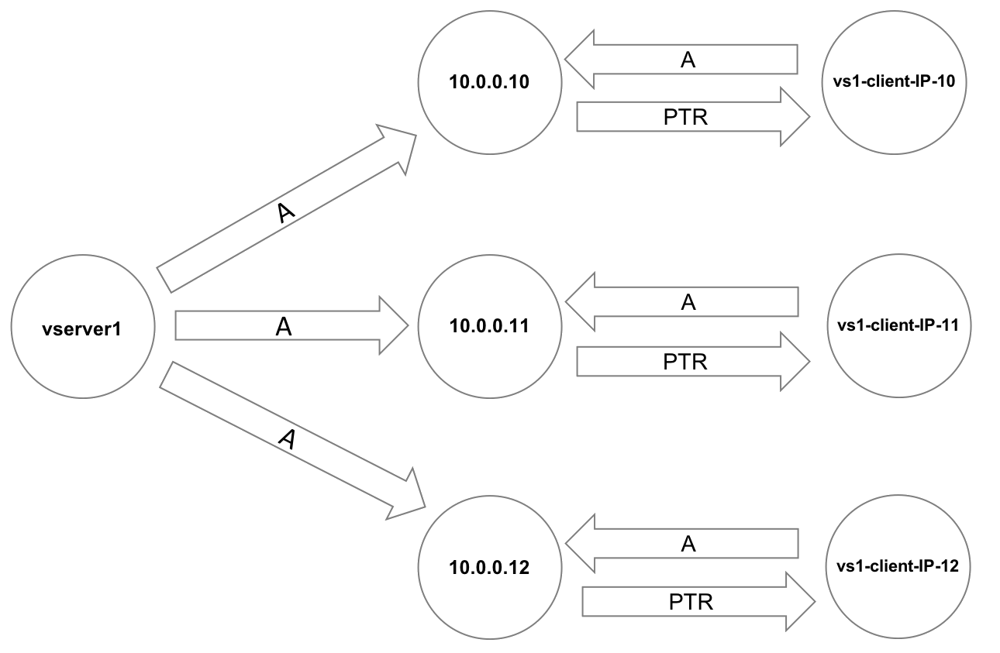

# Tutorial: Configure the cluster's network settings 

Before you use a newly created Azure FXT Edge Filer cluster, you should check and customize several network settings for your workflow. 

This tutorial explains the network settings that you might need to adjust for a new cluster. 

You will learn: 

> [!div class="checklist"]
> * Which network settings might need to be updated after creating a cluster
> * Which Azure FXT Edge Filer use cases require an AD server or a DNS server 
> * How to configure round-robin DNS (RRDNS) to automatically load balance client requests to the FXT cluster

The amount of time it takes to complete these steps depends on how many configuration changes are needed in your system:

* If you only need to read through the tutorial and check a few settings, it should take 10 to 15 minutes. 
* If you need to configure round-robin DNS, that task can take an hour or more.

## Adjust network settings

Several network-related tasks are part of setting up a new Azure FXT Edge Filer cluster. Check this list and decide which ones apply to your system.

To learn more about network settings for the cluster, read [Configuring network services](https://azure.github.io/Avere/legacy/ops_guide/4_7/html/network_overview.html) in the Cluster Configuration Guide.

* Configure round-robin DNS for the client-facing network (optional)

  Load balance cluster traffic by configuring the DNS system as described in [Configure DNS for the FXT Edge Filer cluster](#configure-dns-for-load-balancing).

* Verify NTP settings

* Configure Active Directory and username/group name downloads (if needed)

  If your network hosts use Active Directory or another kind of external directory service, you must modify the cluster’s directory services configuration to set up how the cluster downloads username and group information. Read **Cluster** > **Directory Services**  in the Cluster Configuration Guide for details.

  An AD server is required if you want SMB support. Configure AD before starting to set up SMB.

* Define VLANs (optional)
  
  Configure any additional VLANs needed before defining your cluster’s vservers and global namespace. Read [Working with VLANs](https://azure.github.io/Avere/legacy/ops_guide/4_7/html/network_overview.html#vlan-overview) in the Cluster Configuration Guide to learn more.

* Configure proxy servers (if needed)

  If your cluster uses a proxy server to reach external addresses, follow these steps to set it up:

  1. Define the proxy server in the **Proxy Configuration** settings page
  1. Apply the proxy server configuration with the **Cluster** > **General Setup** page or the **Core Filer Details** page.
  
  For more information, read [Using web proxies](https://azure.github.io/Avere/legacy/ops_guide/4_7/html/proxy_overview.html) in the Cluster Configuration Guide.

* Upload [encryption certificates](#encryption-certificates) for the cluster to use (optional)

### Encryption certificates

The FXT Edge Filer cluster uses X.509 certificates for these functions:

* To encrypt cluster administration traffic

* To authenticate on behalf of a client to third-party KMIP servers

* For verifying cloud providers’ server certificates

If you need to upload certificates to the cluster, use the **Cluster** > **Certificates** settings page. Details are in the [Cluster > Certificates](https://azure.github.io/Avere/legacy/ops_guide/4_7/html/gui_certificates.html) page of the Cluster Configuration Guide.

To encrypt cluster management communication, use the **Cluster** > **General Setup** settings page to select which certificate to use for administrative SSL.

> [!Note] 
> Cloud service access keys are stored by using the **Cloud Credentials** configuration page. The [Add a core filer](fxt-add-storage.md#add-a-core-filer) section above shows an example; read the Cluster Configuration Guide [Cloud Credentials](https://azure.github.io/Avere/legacy/ops_guide/4_7/html/gui_cloud_credentials.html) section for details. 

## Configure DNS for load balancing

This section explains the basics of configuring a round-robin DNS (RRDNS) system to distribute client load among all client-facing IP addresses in your FXT Edge Filer cluster. 

### Decide whether or not to use DNS

Load balancing is always recommended, but you don't have to always use DNS. For example, with some types of client workflows it might make more sense to use a script to assign cluster IP addresses evenly among clients when they mount the cluster. Some methods are described in [Mount the cluster](fxt-mount-clients.md). 

Keep these things in mind when deciding whether or not to use a DNS server: 

* If your system is accessed by NFS clients only, DNS is not required. It is possible to specify all network addresses by using numeric IP addresses. 

* If your system supports SMB (CIFS) access, DNS is required, because you must specify a DNS domain for the Active Directory server.

* DNS is required if you want to use Kerberos authentication.

### Round-robin DNS configuration details

When clients access the cluster, RRDNS automatically balances their requests among all available interfaces.

For optimal performance, configure your DNS server to handle client-facing cluster addresses as shown in the following diagram.

A cluster vserver is shown on the left, and IP addresses appear in the center and on the right. Configure each client access point with A records and pointers as illustrated.

 
[detailed text description](https://azure.github.io/Avere/legacy/Azure-FXT-EdgeFilerDNSconfiguration-alt-text.html)

Each client-facing IP address must have a unique name for internal use by the cluster. (In this diagram, the client IPs are named vs1-client-IP-* for clarity, but in production you should probably use something more concise, like client*.)

Clients mount the cluster using the vserver name as the server argument. 

Modify your DNS server’s ``named.conf`` file to set cyclic order for queries to your vserver. This option ensures that all of the available values are cycled through. Add a statement like the following:

```
options {
    rrset-order {
        class IN A name "vserver1.example.com" order cyclic;
    };
};
```

The following ``nsupdate`` commands provide an example of configuring DNS correctly:

```
update add vserver1.example.com. 86400 A 10.0.0.10
update add vserver1.example.com. 86400 A 10.0.0.11
update add vserver1.example.com. 86400 A 10.0.0.12
update add vs1-client-IP-10.example.com. 86400 A 10.0.0.10
update add vs1-client-IP-11.example.com. 86400 A 10.0.0.11
update add vs1-client-IP-12.example.com. 86400 A 10.0.0.12
update add 10.0.0.10.in-addr.arpa. 86400 PTR vs1-client-IP-10.example.com
update add 11.0.0.10.in-addr.arpa. 86400 PTR vs1-client-IP-11.example.com
update add 12.0.0.10.in-addr.arpa. 86400 PTR vs1-client-IP-12.example.com
```

### Enable DNS in the cluster 

Specify the DNS server that the cluster uses in the **Cluster** > **Administrative Network** settings page. Settings on that page include:

* DNS server address
* DNS domain name
* DNS search domains

For more details, read [DNS Settings](<https://azure.github.io/Avere/legacy/ops_guide/4_7/html/gui_admin_network.html#gui-dns>) in the Cluster Configuration Guide.

## Next steps

This is the last basic configuration step for the Azure FXT Edge Filer cluster. 

* Learn about the system's LEDs and other indicators in [Monitor hardware status](fxt-monitor.md).
* Learn more about how clients should mount the FXT Edge Filer cluster in [Mount the cluster](fxt-mount-clients.md). 
* For more information about operating and managing an FXT Edge Filer cluster, see the [Cluster Configuration Guide](https://azure.github.io/Avere/legacy/ops_guide/4_7/html/ops_conf_index.html). 