# Tutorial: Install Azure FXT Edge Filer 

This tutorial describes how to install a hardware node for the Azure FXT Edge Filer hybrid storage cache. You need to install at least three hardware nodes to create an Azure FXT Edge Filer cluster.

The installation procedure involves unpacking and rack mounting the device, and attaching the cable management arm (CMA) and front bezel. A separate tutorial explains attaching network cables and connecting power. 

It takes approximately one hour to install an Azure FXT Edge Filer node. 

This tutorial includes these setup steps: 

> [!div class="checklist"]
> * Unpack the device
> * Mount the device in a rack
> * Install the front bezel (optional)

## Installation prerequisites 

Before you begin, make sure that the data center and rack you will use has these features:

* An available 1U slot on the rack where you intend to mount the device.
* AC power supply and cooling systems that meet the needs of the Azure FXT Edge Filer. (Read [Power and thermal specifications](fxt-specs.md#power-and-thermal-specifications) for help planning and sizing the installation.)  

  > [!NOTE] 
  > To take full advantage of the two redundant power supply units (PSUs), use power distribution units on two different branch circuits when attaching AC power. Read [Connect power cables](fxt-network-power.md#connect-power-cables) for details.  

## Unpack the hardware node 

Each Azure FXT Edge Filer node is shipped in a single box. Complete these steps to unpack a device.

1. Place the box on a flat, level surface.

2. Inspect the box and the packaging foam for crushes, cuts, water damage, or any other obvious damage. If the box or packaging is severely damaged, don't open it. Contact Microsoft Support to help you assess whether the device is in good working order.

3. Unpack the box. Make sure that it includes the following items:
   * One single enclosure FXT device
   * Two power cords
   * One front bezel and key
   * One rail kit assembly
   * One cable management arm (CMA)
   * CMA installation instructions booklet
   * Rack installation instructions booklet
   * Safety, Environmental, and Regulatory Information booklet

If you didn't receive all of the items listed, contact the device vendor for support. 

Make sure the device has had enough time to reach the same temperature as the room before installing it or powering it on. If you notice condensation on any part of the device, wait at least 24 hours before installing.

The next step is to rack mount your device.

## Rack the device

The Azure FXT Edge Filer device must be installed in a standard 19-inch rack. 

The Azure FXT Edge Filer hybrid storage cache is made up of three or more Azure FXT Edge Filer devices. Repeat the rack installation steps for each device that is part of your system. 

### Rack install prerequisites

* Before you begin, read the safety instructions in the Safety, Environmental, and Regulatory Information booklet that was shipped with your device.

  > [!NOTE]
  > Always use two people when lifting the node, including when you install it in a rack or remove it from the rack. 

* Identify the type of rail installation used with your equipment rack. 
  * For square or round hole snap-in racks, follow the tool-less rail instructions.
  * For threaded hole racks, follow the tooled rail instructions. 
  
    For the tooled rail mounting configuration, you need to supply eight screws, type 10-32, 12-24, M5, or M6. The head diameter of the screws must be less than 10 mm (0.4").

### Identify the rail kit contents

Locate the components for installing the rail kit assembly:

1. Two A7 Dell ReadyRails II sliding rail assemblies (1)
1. Two hook and loop straps (2)

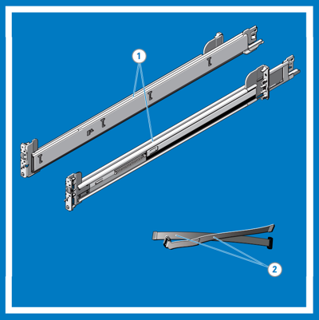

### Rail assembly - tool-less rails (Square hole or round hole racks)

For racks with snap-in square or round holes, follow this procedure to assemble and install the rails. 

1. Position the left and right rail end pieces labeled **FRONT** facing inward. Position each end piece so that it seats in the holes on the front side of the vertical rack flanges. (1)

2. Align each end piece in the bottom and top holes of rack in the space you want to mount it. (2)

3. Engage the back end of the rail until it fully seats on the vertical rack flange and the latch clicks into place. Repeat these steps to position and seat the front end piece on the vertical rack flange. (3)

> [!TIP]
> To remove the rails, pull the latch release button on the end piece midpoint (4) and unseat each rail.

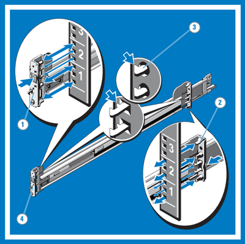

### Rail assembly - tooled rails (Threaded hole racks)

For racks with threaded holes, follow this procedure to assemble and install the rails.

1. Remove the pins from the front and rear mounting brackets with a flat-tipped screwdriver. (1)
1. Pull and rotate the rail latch subassemblies to remove them from the mounting brackets. (2)
1. Attach the left and right mounting rails to the front vertical rack flanges using two pairs of screws. (3)
1. Slide the left and right back brackets forward against the rear vertical rack flanges and attach them using two pairs of screws. (4)

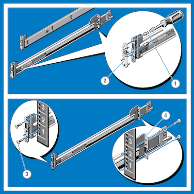

### Install the system in the rack

Follow these steps to mount the Azure FXT Edge Filer device in the rack.

1. Pull the inner slide rails out of the rack until they lock into place. (1)
1. Locate the rear rail standoff on each side of the device and lower them into the rear J-slots on the slide assemblies. (2) 
1. Rotate the device downward until all the rail standoffs are seated in the J-slots. (3)
1. Push the device inward until the lock levers click into place.
1. Press the slide-release lock buttons on both rails (4) and slide the device into the rack.

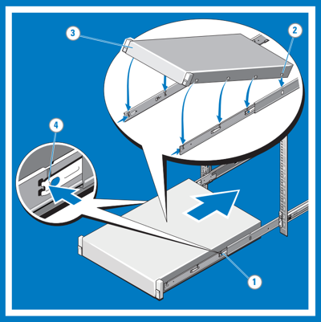

### Remove the system from the rack

To remove the device from the rack, follow this procedure. 

1. Locate the lock levers on the sides of the inner rails (1).
2. Unlock each lever by rotating it up to its release position (2).
3. Grasp the sides of the system firmly and pull it forward until the rail standoffs are at the front of the J-slots. Lift the system up and away from the rack and place it on a level surface (3).

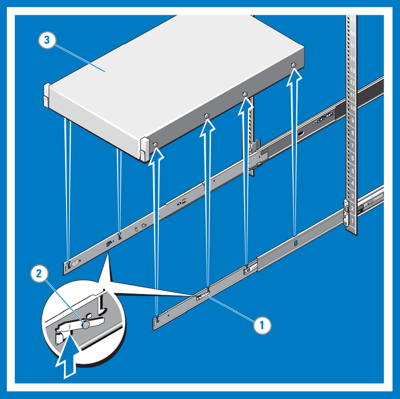

### Engage the slam latch

1. Facing the front, locate the slam latch (1) on either side of the system.
2. The latches engage automatically as the system is pushed into the rack. 

To release the latches when removing the system, pull them up (2).

Optional hard-mount screws are provided to secure the system to the rack for shipment or in other unstable environments. Find the screw under each latch and tighten them with a #2 Phillips screwdriver (3).

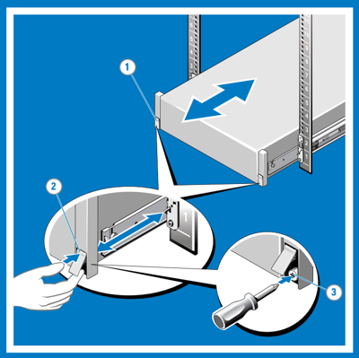

### Install the cable management arm 

An optional cable management arm (CMA) is provided with the FXT Edge Filer. Printed instructions for installing it are provided in the package. 

1. Unpack and identify the components of the cable management arm kit:
   * CMA tray (1)
   * CMA (2)
   * Nylon cable tie wraps (3)
   * CMA attachment brackets (4)
   * Status indicator cable (5) 

   > [!TIP] 
   > To secure the CMA for shipment in the rack, loop the tie wraps around both baskets and tray and cinch them firmly. Securing the CMA in this manner will also secure your system in unstable environments.

   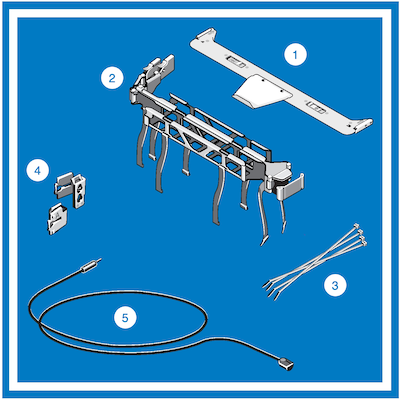

2. Install the CMA tray.

   The CMA tray provides support and acts as a retainer for the CMA. 

   1. Align and engage each side of the tray with the receiver brackets on the inner edges of the rails. 
   1. Push the tray forward until it clicks into place. (1)
   1. To remove the tray, squeeze the latch-release buttons toward the center and pull the tray out of the receiver brackets (2).

   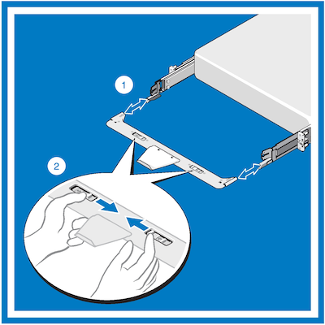

3. Install the CMA attachment brackets. 

   > [!NOTE]
   >
   > * You can attach the CMA to either the right or left mounting rail, depending on how you intend to route cables from the system. 
   > * For convenience, mount the CMA on the side opposite the power supplies (side A). If it is mounted on side B, the CMA must be disconnected in order to remove the outer power supply. 
   > * Always remove the tray before removing the power supplies. 

   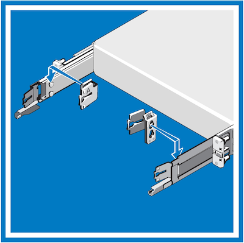

   1. Select the appropriate CMA attachment bracket for the side where you want to mount the CMA (side B or side A).
   1. Install the CMA attachment bracket with the corresponding side A or side B marking at the back of the slide rail.
   1. Align the holes on the bracket with the pins on the slide rail. Push the bracket down until it locks into place. 

4. Install the CMA.

   1. At the back of the system, fit the latch on the front end of the CMA on the innermost bracket of the slide assembly until the latch engages (1). 
   1. Fit the other latch on the end of the outermost bracket until the latch engages (2). 
   1. To remove the CMA, disengage both latches by pressing the CMA release buttons at the top of the inner and outer latch housings (3).

   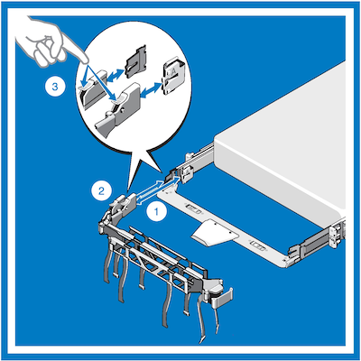

   The CMA can be rotated away from the system for access and service. At the hinged end, lift the CMA away from the tray to unseat it (1). After it is unseated from the tray, swing the CMA away from the system (2).

   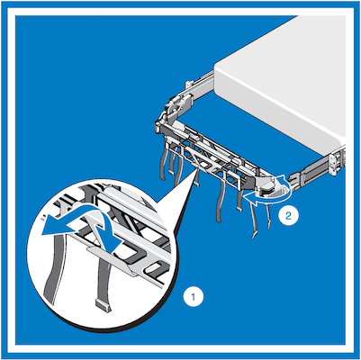

## Install the front bezel (optional)

This section explains how to install and remove the front bezel (faceplate) for the Azure FXT Edge Filer hardware. 

To install the front bezel: 

1. Locate and remove the bezel key, which is provided in the bezel package. 
1. Align the bezel with the front of the chassis and insert the pins on the right side of the bezel into the holes on the node's right side rack mount flange. 
1. Fit the left end of the bezel onto the chassis. Press the bezel until the button on the left side clicks into place.
1. Lock the bezel with the key.

To remove the front bezel: 
1. Unlock the bezel by using the bezel key.
1. Press the release button at the left side and pull the left end of the bezel away from the chassis.
1. Unhook the right end and remove the bezel.
   
   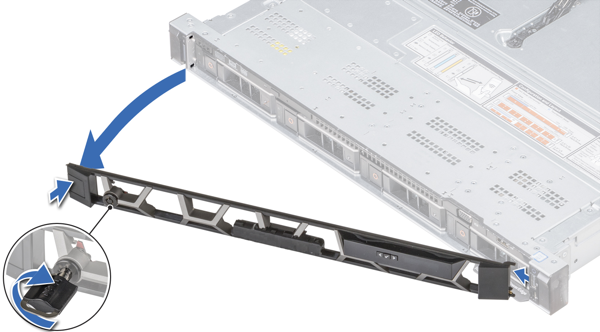

## Next steps

After you have unpacked and racked the device, continue setup by attaching network cables and connecting AC power to the Azure FXT Edge Filer.

> [!div class="nextstepaction"]
> [Cable the network ports and supply power](fxt-network-power.md)