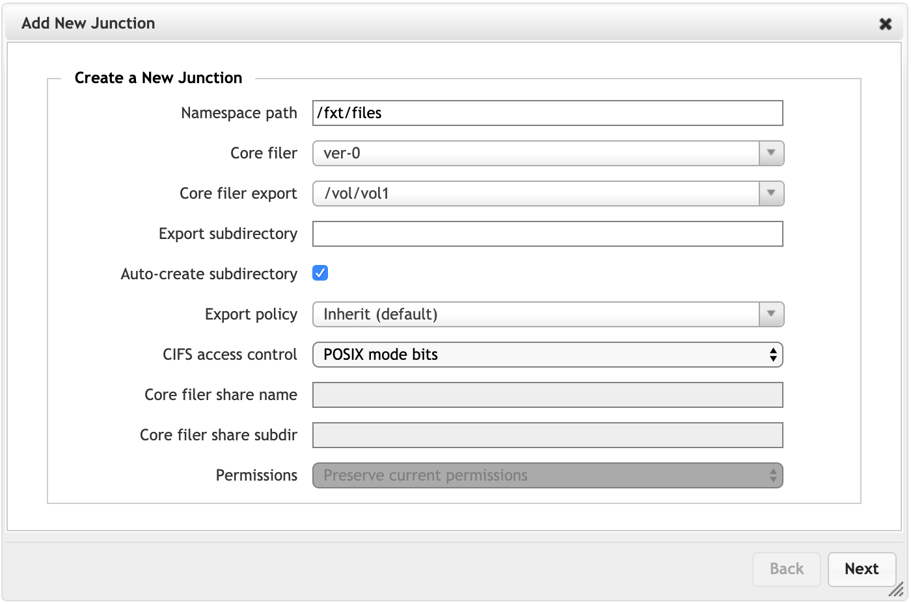
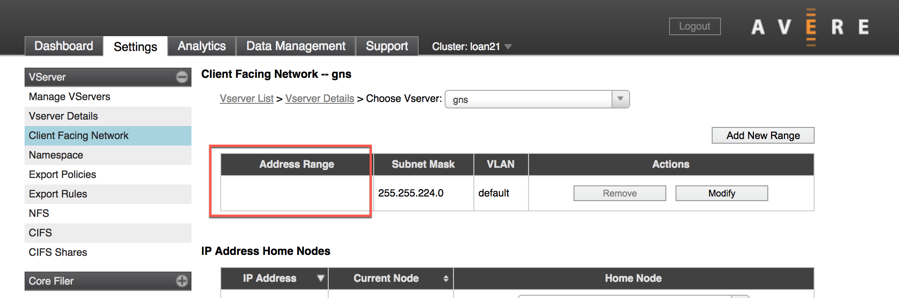

# Tutorial: Mount the cluster

This tutorial teaches you how to mount NFS clients to the Azure FXT Edge Filer cluster. Clients mount the virtual namespace paths that you assigned when you added back-end storage. 

This tutorial teaches: 

> [!div class="checklist"]
> * Strategies for load balancing clients across the range of client-facing IP addresses
> * How to construct a mount path from a client-facing IP address and namespace junction
> * Which arguments to use in a mount command

This tutorial takes approximately 45 minutes to complete.

## Steps to mount the cluster

Follow these steps to connect client machines to your Azure FXT Edge Filer cluster.

1. Decide how to load-balance client traffic among your cluster nodes. Read [Balance client load](#balance-client-load), below, for details. 
1. Identify the cluster IP address and junction path to mount.
1. Determine the client-facing path for the mount.
1. Issue the [mount command](#use-recommended-mount-command-options), with appropriate arguments.

## Balance client load

To help balance client requests among all the nodes in the cluster, you should mount clients to the full range of client-facing IP addresses. There are several ways to automate this task.

To learn about round-robin DNS load balancing for the cluster, read [Configure DNS for the Azure FXT Edge Filer cluster](fxt-configure-network.md#configure-dns-for-load-balancing). To use this method you must maintain a DNS server, which is not explained in these articles.

A simpler method for small installations is to use a script to assign IP addresses throughout the range at client mount time. 

Other load-balancing methods might be appropriate for large or complicated systems. Consult your Microsoft representative or open a [support request](fxt-support-ticket.md) for help. (Azure Load Balancer is currently *not supported* with Azure FXT Edge Filer.)

## Create the mount command 

From your client, the ``mount`` command maps the virtual server (vserver) on the Azure FXT Edge Filer cluster to a path on the local filesystem. 

The format is ``mount <FXT cluster path> <local path> {options}``

There are three elements to the mount command: 

* cluster path - a combination of IP address and namespace junction path described below
* local path - the path on the client 
* mount command options - (listed in [Use recommended mount command options](#use-recommended-mount-command-options))

### Create the cluster path

The cluster path is a combination of the vserver *IP address* plus the path to a *namespace junction*. The namespace junction is a virtual path that you defined when you [added the storage system](fxt-add-storage.md#create-a-junction).

For example, if you used ``/fxt/files`` as your namespace path, your clients would mount *IP_address*:/fxt/files to their local mount point. 

The IP address is one of the client-facing IP addresses defined for the vserver. You can find the range of client-facing IPs in two places in the cluster Control Panel:

* **VServers** table (Dashboard tab) - 

  

* **Client Facing Network** settings page - 

  

Combine the IP address and the namespace path to form the cluster path for the mount command. 

Example client mount command: ``mount 10.0.0.12:/sd-access /mnt/fxt {options}``

### Create the local path

The local path for the mount command is up to you. You can set any path structure you want as part of the virtual namespace. Design a namespace and local path that is convenient for your client workflow. 

For more information about the client-facing namespace, read the Cluster Configuration Guide's [namespace overview](https://azure.github.io/Avere/legacy/ops_guide/4_7/html/gns_overview.html).

In addition to the paths, include the [mount command options](#use-recommended-mount-command-options) described below when mounting each client.

### Use recommended mount command options

To ensure a seamless client mount, pass these settings and arguments in your mount command: 

``mount -o hard,nointr,proto=tcp,mountproto=tcp,retry=30 ${VSERVER_IP_ADDRESS}:/${NAMESPACE_PATH} ${LOCAL_FILESYSTEM_MOUNT_POINT}``

| Required settings | |
--- | --- 
``hard`` | Soft mounts to the Azure FXT Edge Filer cluster are associated with application failures and possible data loss. 
``proto=netid`` | This option supports appropriate handling of NFS network errors.
``mountproto=netid`` | This option supports appropriate handling of network errors for mount operations.
``retry=n`` | Set ``retry=30`` to avoid transient mount failures. (A different value is recommended in foreground mounts.)

| Preferred settings  | |
--- | --- 
``nointr``            | If your clients use older OS kernels (before April 2008) that support this option, use it. The option "intr" is the default.

## Next steps

After you have mounted clients, you can test your workflow and get started with your cluster.

If you need to move data to a new cloud core filer, take advantage of the cache structure by using parallel data ingest. Some strategies are described in [Moving data to a vFXT cluster](https://docs.microsoft.com/azure/avere-vfxt/avere-vfxt-data-ingest). (Avere vFXT for Azure is a cloud-based product that uses caching technology very similar to the Azure FXT Edge Filer.)

Read [Monitor Azure FXT Edge Filer hardware status](fxt-monitor.md) if you need to troubleshoot any hardware issues. 
