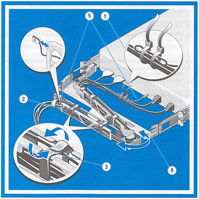

# Tutorial: Make network connections to the Azure FXT Edge Filer node

This tutorial teaches you how to cable the network connections for an Azure FXT Edge Filer hardware node.

In this tutorial, you will learn: 

> [!div class="checklist"]
> * How to choose the type of network cable for your environment
> * How to connect an FXT Edge Filer node to your datacenter network
> * How to route cables through the Cable Management Arm (CMA)

## Prerequisites

Before starting this tutorial, the Edge Filer should be installed in a standard equipment rack. The CMA should be installed on the filer node. 

## Identify ports

Identify the various ports on the back of your FXT Edge Filer. 
 

## Cable the device

* Connect the RJ-45 ports to your data center's network source as described in [Network ports](#network-ports).  
* Securely connect the [iDRAC/IPMI port](#ipmi-port) to a separate network with a secure DHCP server. 
* Use the USB ports and the VGA port to connect a keyboard and monitor to the node for initial setup. You must boot the node and [set an initial password](fxt-node-password.md) to activate the node's other ports. Read [Set initial passwords](fxt-node-password.md) for details. 

Before booting the node you also must connect AC power, described in [Connect power to the Azure FXT Edge Filer](fxt-power.md).

This article also explains how to connect to the node's [serial port](#serial-port-only-when-necessary), but the serial port is only used for advanced troubleshooting. 

### Network ports 

Each Azure FXT Edge Filer node includes the following network ports: 

* Six high-speed 25GbE/10GbE dual rate data ports: 

  * Four ports provided by two dual-port plug-in network adapters
  * Two ports provided by the motherboard mezzanine network adapter 

* Two 1GbE ports provided by the motherboard mezzanine network adapter 

The high-speed data ports have standard RJ-45 connectors. To use optical cables, you must install SFP28 optical cable adapters (not provided).

For a full list of supported cables, switches, and transceivers, consult the [Cavium FastlinQ 41000 Series Interoperability Matrix](https://www.marvell.com/documents/xalflardzafh32cfvi0z/). 

The type of connections to use for your system depends on your data center environment. 

* If connecting to a 25GbE network, cable each of the high-speed data ports with one of the following cable types:

  * Optical cable with SFP28 optical cable adapters
  * 25GbE copper twinaxial cable 

* If connecting to a 10GbE network, cable each of the high-speed data ports with one of the following: 

  * Optical cable with SFP28 optical cable adapters
  * 25GbE copper twinaxial cable 
  * 10GbE copper twinaxial cable

* The 1GbE network ports are used for cluster management traffic. Check the **Use 1Gb mgmt network** option when creating the cluster (described in [Configure the management network](fxt-cluster-create.md#configure-the-management-network)). Cable the ports with Cat3 or Cat5 cable as described in the supported cables list. 

  You can leave the 1GbE ports uncabled if you plan to use the high-speed ports for all traffic. By default, the 1GbE network ports are not used if a higher speed data port is available.  

### IPMI port  

The port labeled iDRAC is a 1Gb connection used for emergency hardware management. FXT software uses the Intelligent Platform Management Interface (IPMI) through this port for hardware troubleshooting and recovery. 

> [!Note]
> The IPMI port can bypass the operating system and interact directly with hardware on the node. 

Use these security strategies when connecting and configuring the iDRAC/IPMI port:

* Only connect iDRAC/IPMI ports to a network that is physically separated from the data network used to access the cluster.
* Change the default IPMI administrator password on each node when you install it. Use a web browser to navigate to the node’s IPMI port IP address and use the provided interface to modify the user configuration.
* The default IPMI port configuration uses DHCP for IP address assignment. Make sure your DHCP environment is well protected and that connections are restricted between DHCP clients and the DHCP server. (You can change the nodes’ IPMI address configuration method from the Control Panel after creating the cluster.)

The IPMI port does not require a high-speed network. A 100 Mbps or 1GbE connection is sufficient.  
  
### Serial port (only when necessary)

In some situations, Microsoft Service and Support might tell you to connect a terminal to a node's serial port to diagnose a problem.  

To attach the console:

1. Locate the serial (COM1) port on the rear of the FXT Edge Filer node.
1. Use a null modem cable to connect the serial port to a terminal configured for ANSI-115200-8N1.
1. Sign in to the console and take other steps as directed by support staff.

## Route cables in the cable management arm (CMA)

Each Azure FXT Edge Filer node comes with an optional cable management arm. The CMA simplifies cable routing and provides easier access to the back of the chassis without needing to disconnect cables. 

Follow these instructions to route the cables through the CMA: 

1. Using the tie wraps provided, bundle the cables together as they enter and exit the baskets so that they do not interfere with adjacent systems (1).
1. With the CMA in the service position, route the cable bundle through the inner and outer baskets (2).
1. Use the preinstalled hook and loop straps at either end of the baskets to secure the cables (3).
1. Swing the CMA back into place on the tray (4).
1. Use the preinstalled status indicator cable at the back of the system and secure the cable by routing it through the CMA. Attach the other end of the cable to the corner of the outer CMA basket (5). 

   > [!CAUTION]
   > To avoid potential damage from protruding cables, secure any slack in the status indicator cable after routing this cable through the CMA. 

> [!NOTE]
>  If you did not install the CMA, use the two hook and loop straps provided in the rail kit to route the cables at the back of your system.
> 
>  1. Locate the outer CMA brackets on the interior sides of both rack flanges.
>  2. Bundle the cables gently, pulling them clear of the system connectors to the left and right sides.
>  3. Thread the hook and loop straps through the tooled slots on the outer CMA brackets on each side of the system to secure the cable bundles.
> 
>     

## About IP address requirements

For hardware nodes in an Azure FXT Edge Filer hybrid storage cache, IP addresses are managed by the cluster software.

Each node requires at least one IP address, but node addresses are assigned when nodes are added to or removed from the cluster. 

The total number of IP addresses required depends on the number of nodes in that make up your cache. 

Configure the IP address range by using the Control Panel software after the nodes have been installed. To learn more, read [Gather information for the cluster](fxt-cluster-create.md#gather-information-for-the-cluster). 
 
## Next steps

After you finish installing network cables, continue with one of these articles: 

* Read [Connect power to the Azure FXT Edge Filer](fxt-power.md) if you have not already attached power cables and learned how to power on the nodes.
* [Set initial passwords](fxt-node-password.md) to activate the node.
* If you have installed and activated at least three nodes in the data center, read [Create the FXT Edge Filer cluster](fxt-cluster-create.md) to learn how to configure them as a clustered cache system. 
