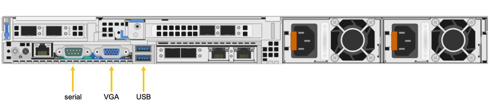

# Tutorial: Set hardware passwords

The first time you power up an Azure FXT Edge Filer node, you must set a root password. The hardware nodes are not shipped with a default password. 

The network ports are disabled until the password is set and the root user logs in. Do this step after installing and cabling the node, but before attempting to create the cluster. 

This tutorial explains how to connect to the hardware node and set the password. 

In this tutorial, you will learn how to: 

> [!div class="checklist"]
> * Connect a keyboard and monitor to the node and power it on
> * Set passwords for the iDRAC port and root user on this node
> * Sign in as root 

Repeat these steps for each node that you will use in your cluster. 

This tutorial takes approximately 15 minutes to complete. 

## Prerequisites

Before starting this tutorial, complete these steps: 

* [Install](fxt-install.md) each FXT Edge Filer node in an equipment rack, and attach [power cables](fxt-power.md) and [network](fxt-network.md) access as described in the earlier tutorials. 
* Find a USB-connected keyboard and a VGA-connected monitor that you can attach to the hardware nodes. (The node's serial port is not active until after the password is set.)

## Connect a keyboard and monitor to the node

Physically connect a monitor and keyboard to the Azure FXT Edge Filer node. 

* Connect the monitor to the VGA port.
* Connect the keyboard to one of the USB ports. 

Use this reference diagram to locate the ports on the back of the chassis. 

> [!NOTE]
> The serial port is inactive until after the password is set. 



You can use a KVM switch if you want to connect more than one node to the same peripherals. 

Power on the node by pressing the power button on the front. 


## Set initial passwords 

The FXT Edge Filer node will print various messages to the monitor while booting. When it finishes, it shows an initial setup screen like this: 

```
------------------------------------------------------
        Microsoft FXT node initial setup
------------------------------------------------------
Password Setup
---------------
Enter a password to set iDRAC and temporary root password.
Minimum password length is 8.
Enter new password:
```

The password you enter is used for two things: 

* It is the temporary root password for this FXT Edge Filer node. 

  This password will change when you create a cluster using this node, or when you add this node to the cluster. The cluster management password (associated with the user ``admin``) is also the root password for all nodes in a cluster.

* It is the permanent password for the iDRAC/IPMI hardware management port. 

  You must remember the password in case you need to sign in on the IPMI port to troubleshoot a hardware problem. 

Enter and confirm the password: 

```
Enter new password:**********
Re-enter password:**********
Loading AvereOS......
```

The system automatically reboots [ xxx is this a reboot or just a refresh of some sort? xxx ] and then gives a ``login:`` prompt. 

## Sign in as root

Sign in as ``root`` with the password that you just set. 

```
login: root
Password:**********
```

After you sign in as root, the network ports are active and will contact the DHCP server for IP addresses. 

## Next steps

The node is ready to be part of a cluster. 

* You can use it to [Create the FXT Edge Filer cluster](fxt-cluster-create.md)
* You can add it to an existing cluster: [Add cluster nodes](fxt-add-nodes.md)