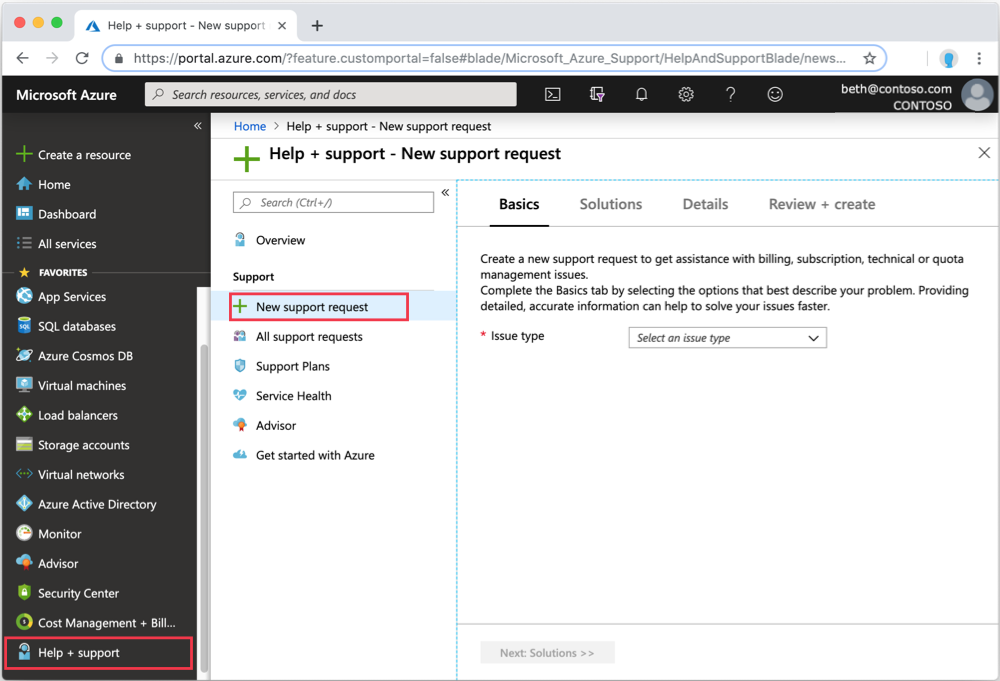
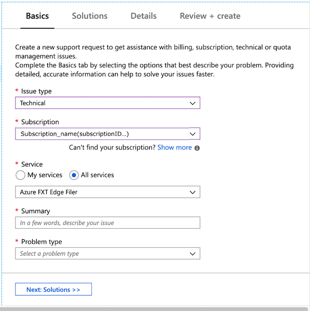

# Open a support ticket for the Azure FXT Edge Filer

This article explains how to get help with your Azure FXT Edge Filer system.

Use the Azure portal to open a support ticket with Microsoft Customer Service and Support.

1. Open the [Azure portal](https://portal.azure.com/) and sign in.
1. In the left panel, scroll to the bottom and click **Help + support**.
1. Click **New support request**. 

   

1. Fill out the request form.  
    1. In the **Basics** tab, choose the **Issue type** ``Technical``. 
    1. Select your subscription. 
    1. Under **Service**, select **Azure FXT Edge Filer**. You might need to click the **All services** filter control to find it. 
    1. Enter a **Summary** and choose the **Problem type**. 
     
    1. Click **Next** to continue. 
1. In the **Details** tab, add more information about the problem and how to contact you. You can upload a file related to the problem. 
1. In **Review + create**, check the information and click the **Create** button to submit your request.

After you submit the request, you will receive a confirmation email with a ticket number. A support staff member will contact you about the request.
