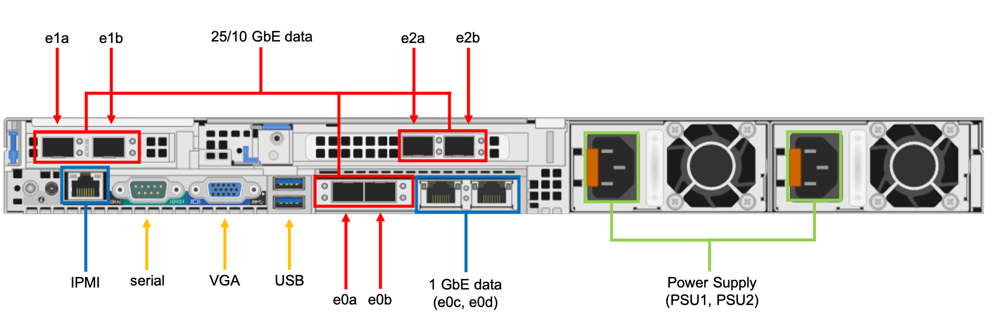
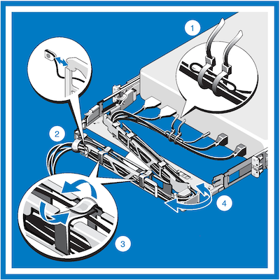
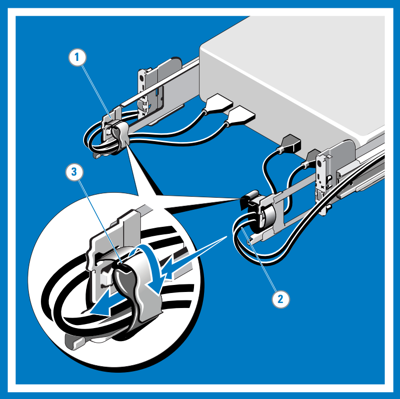

# Tutorial: Make network connections and supply power to the Azure FXT Edge Filer node

This tutorial teaches you how to cable the network connections for an Azure FXT Edge Filer hardware node.

In this tutorial, you will learn:

> [!div class="checklist"]
>
> * How to choose the type of network cable for your environment
> * How to connect an Azure FXT Edge Filer node to your datacenter network
> * How to route cables through the cable management arm (CMA)
> * How to connect power to the racked device and power it on

## Prerequisites

Before starting this tutorial, the Azure FXT Edge Filer should be installed in a standard equipment rack. The CMA should be installed on the filer node.

## Identify ports

Identify the various ports on the back of your Azure FXT Edge Filer.

## Cable the device

* Connect the RJ-45 ports to your data center's network source as described in [Network ports](#network-ports).  
* Securely connect the [iDRAC port](#idrac-port) to a separate network with a secure DHCP server.
* Use the USB ports and the VGA port to connect a keyboard and monitor to the node for initial setup. You must boot the node and [set an initial password](node-password.md) to activate the node's other ports. Read [Set initial passwords](node-password.md) for details.

This article also describes how to [connect AC power](#connect-power-cables) for the node.

This article also explains how to connect to the node's [serial port](#serial-port-only-when-necessary), if necessary for specialized troubleshooting.

### Network ports

Each Azure FXT Edge Filer node includes the following network ports:

* Six high-speed 25GbE/10GbE dual rate data ports:

  * Four ports provided by two dual-port plug-in network adapters
  * Two ports provided by the motherboard mezzanine network adapter

* Two 1GbE ports provided by the motherboard mezzanine network adapter

The high-speed 25GbE/10GbE data ports have standard SFP28-compatible cages. To use optical cables, you must install SFP28 optical transceiver modules (not provided).

The 1GbE ports have standard RJ-45 connectors.

For a full list of supported cables, switches, and transceivers, consult the [Cavium FastlinQ 41000 Series Interoperability Matrix](https://www.marvell.com/documents/xalflardzafh32cfvi0z/).

The type of connections to use for your system depends on your data center environment.

* If connecting to a 25GbE network, cable each of the high-speed data ports with one of the following cable types:

  * Optical cable and SFP28 optical transceiver with 25GbE or dual rate 25GbE/10GbE capability
  * SFP28 type 25GbE-capable direct attach twinaxial cable

* If connecting to a 10GbE network, cable each of the high-speed data ports with one of the following:

  * Optical cable and SFP28 optical transceiver with 10GbE or dual rate 25GbE/10GbE capability.
  * SFP28 type 25GbE-capable direct attach twinaxial cable
  * SFP28 type 10GbE-capable direct attach twinaxial cable

* The 1GbE network ports are used for cluster management traffic. Check the **Use 1Gb mgmt network** option when creating the cluster if you want to create a physically separate network for cluster configuration (described in [Configure the management network](cluster-create.md#configure-the-management-network)). Cable the ports with standard Cat5 or better cable as described in the supported cables list.

  You can leave the 1GbE ports uncabled if you plan to use the high-speed ports for all traffic. By default, the 1GbE network ports are not used if a higher speed data port is available.  

### iDRAC port  

The port labeled iDRAC is a 1Gb connection that allows communication with a remote access controller used for hardware management and monitoring. FXT software uses the Intelligent Platform Management Interface (IPMI) with this controller for troubleshooting and recovery. You can use the built-in [iDRAC interface](https://www.dell.com/support/manuals/idrac9-lifecycle-controller-v3.30.30.30/idrac_3.30.30.30_ug/) to monitor hardware through this port. iDRAC and IPMI access are enabled by default.

> [!Note]
> The iDRAC port can bypass the operating system and interact directly with hardware on the node.

Use these security strategies when connecting and configuring the iDRAC port:

* Only connect iDRAC ports to a network that is physically separated from the data network used to access the cluster.
* Set a secure iDRAC administrator password on each node. You must set this password to activate the hardware - follow instructions in [Set hardware passwords](node-password.md).
* The default iDRAC port configuration uses DHCP and IPv4 for IP address assignment. Make sure your DHCP environment is well protected and that connections are restricted between DHCP clients and the DHCP server. (The cluster control panel includes settings to change the nodes’ address configuration method after you create the cluster.)
* Leave the iDRAC port set to "dedicated mode" (the default), which restricts iDRAC/IPMI network traffic to the dedicated RJ-45 port.

The iDRAC port does not require a high-speed network connection.
  
### Serial port (only when necessary)

In some situations, Microsoft Service and Support might tell you to connect a terminal to a node's serial port to diagnose a problem.

To attach the console:

1. Locate the serial (COM1) port on the rear of the FXT Edge Filer node.
1. Use a null modem cable to connect the serial port to a terminal configured for ANSI-115200-8N1.
1. Sign in to the console and take other steps as directed by support staff.

## Route cables in the cable management arm (CMA)

Each Azure FXT Edge Filer node comes with an optional cable management arm. The CMA simplifies cable routing and provides easier access to the back of the chassis without needing to disconnect cables.

Follow these instructions to route the cables through the CMA:

1. Using the tie wraps provided, bundle the cables together as they enter and exit the baskets so that they do not interfere with adjacent systems (1).
1. With the CMA in the service position, route the cable bundle through the inner and outer baskets (2).
1. Use the preinstalled hook and loop straps at either end of the baskets to secure the cables (3).
1. Swing the CMA back into place on the tray (4).
1. Install the status indicator cable at the back of the system and secure the cable by routing it through the CMA. Attach the other end of the cable to the corner of the outer CMA basket (5).

   > [!CAUTION]
   > To avoid potential damage from protruding cables, secure any slack in the status indicator cable after routing this cable through the CMA.

> [!NOTE]
> If you did not install the CMA, use the two hook and loop straps provided in the rail kit to route the cables at the back of your system.
>
>  1. Locate the outer CMA brackets on the interior sides of both rack flanges.
>  2. Bundle the cables gently, pulling them clear of the system connectors to the left and right sides.
>  3. Thread the hook and loop straps through the tooled slots on the outer CMA brackets on each side of the system to secure the cable bundles.
>
>     

## About IP address requirements

For hardware nodes in an Azure FXT Edge Filer hybrid storage cache, IP addresses are managed by the cluster software.

Each node requires at least one IP address, but node addresses are assigned when nodes are added to or removed from the cluster.

The total number of IP addresses required depends on the number of nodes in that make up your cache.

Configure the IP address range by using the Control Panel software after the nodes have been installed. To learn more, read [Gather information for the cluster](cluster-create.md#gather-information-for-the-cluster).  

## Connect power cables

Each Azure FXT Edge Filer node uses two power supply units (PSUs).

> [!TIP]
> To take advantage of the two redundant PSUs, attach each AC power cable to a power distribution unit (PDU) on an independent branch circuit.
>
> You can use a UPS to power the PDUs for extra protection.

1. Connect the included power cords to the PSUs in the chassis. Make sure that the cords and PSUs are fully seated.
1. Attach the power cords to the power distribution units on the equipment rack. If possible, use two separate power sources for the two cords.

### Power on an Azure FXT Edge Filer node

To power up the node, press the power button on the front of the system. The button is on the right side control panel.

### Power off an Azure FXT Edge Filer node

The power button can be used to shut down the system during testing and before adding it to a cluster. However, after an Azure FXT Edge Filer node is in use as part of a cluster, you should use the cluster control panel software to shut down the hardware. Read [How to safely power off Azure FXT Edge Filer hardware](power-off.md) for details.

## Next steps

After you finish cabling the hardware, power on each of the nodes and initialize them by setting their root passwords.
> [!div class="nextstepaction"]
> [Set initial passwords](node-password.md)
